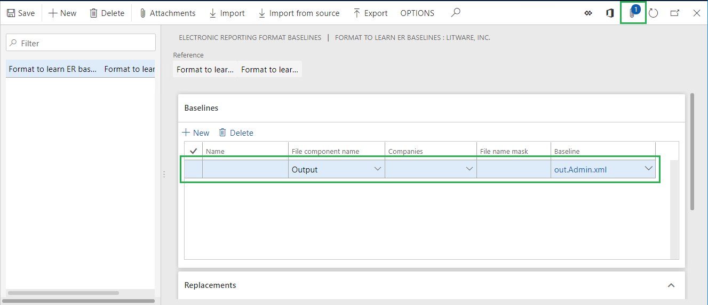
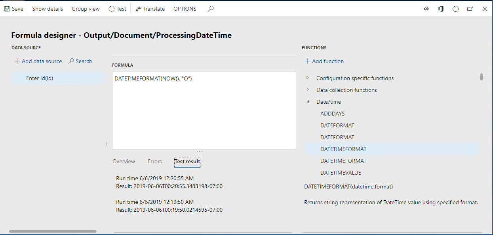
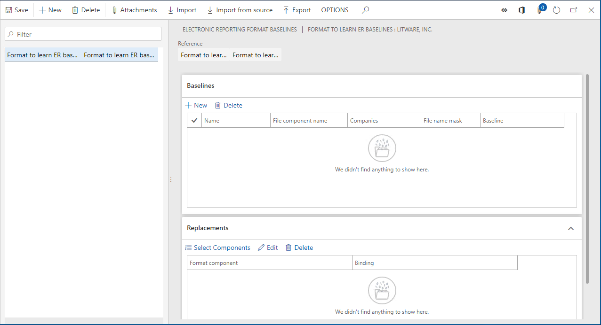
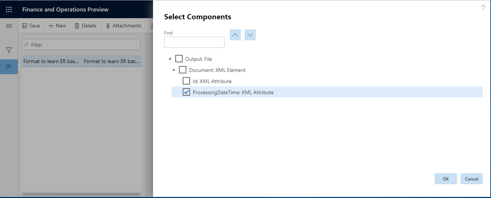
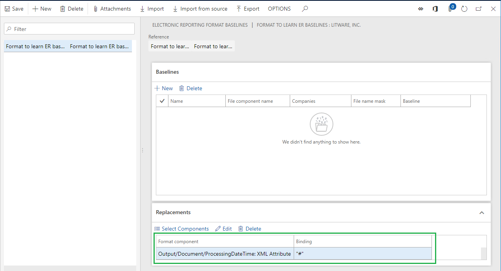
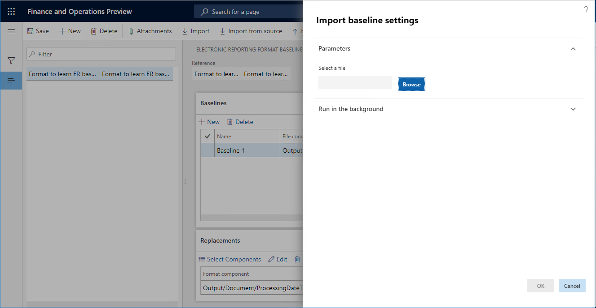
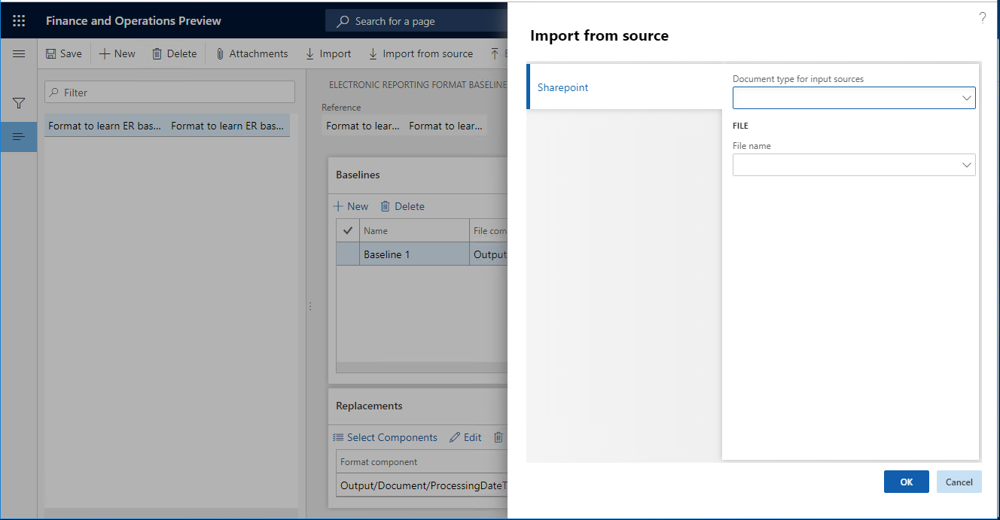

---
# required metadata

title: Improvements in tracing results of generated ER reports and comparing them with baseline values
description: This topic provides information about how the ER baseline feature has been improved in the 10.0.3 version.
author: NickSelin
manager: AnnBe
ms.date: 06/07/2019
ms.topic: article
ms.prod: 
ms.service: dynamics-ax-platform
ms.technology: 

# optional metadata

# ms.search.form: ERSolutionTable
# ROBOTS: 
audience: Application User, Developer, IT Pro
# ms.devlang: 
ms.reviewer: kfend
ms.search.scope: Core, Operations
# ms.tgt_pltfrm: 
ms.custom: 220314
ms.assetid: 2685df16-5ec8-4fd7-9495-c0f653e82567
ms.search.region: Global
# ms.search.industry: 
ms.author: nselin
ms.search.validFrom: 2018-04-01
ms.dyn365.ops.version: Release 8.0

---

# Improvements in tracing results of generated ER reports and comparing them with baseline values

[!include[banner](../includes/banner.md)]

This topic describes the first set of improvements that have been made to the Electronic reporting (ER) framework  baseline feature. These improvements are available in Microsoft Dynamics 365 for Finance and Operations starting from the 10.0.3 version.

## Automate the setting of baseline rules

The [Trace generated report results and compare them with baseline values](er-trace-reports-compare-baseline.md) page explains how to configure the Electronic reporting (ER) framework to collect information about ER format executions and evaluate the results of those executions. The example in this page presents the set of steps needs to be completed for that.

Among others, the following steps must be completed:

-	Execute an ER format to generate an outbound file and store it locally
-	Add the locally stored file as an attachment of the baseline added for an ER format
-	Configure the baseline rule for added baseline including the following:

    -	Specify an ER format element that is used to generate an outbound file
    - Select the attachment that refers to generated outbound file

Note that all these steps need to be performed manually. The new ER capabilities allow you to automate these steps. To learn more about this feature, complete the example in this topic below.

## Example: Automate the setting of baseline rules

To complete the steps in this example, you must first complete the steps of the example in [Trace generated report results and compare them with baseline values](er-trace-reports-compare-baseline.md) page till the section **Add a new baseline for a designed ER format** inclusively.

### Review added baseline
1.	Go to **Organization administration > Electronic reporting > Configurations**.

Note that the **Baselines** option is available on the **Action Pane** meaning that the ER user parameter **Run in debug mode** is turned on for the current company.

2.	Select **Baselines**.

Note that the baseline has been added for the selected **Format to learn ER baselines** format and the baseline rules have not been added for this baseline yet.

### Make a new baseline rule
1.	Go to **Organization administration > Electronic reporting > Configurations**.
2.	In the tree, expand **Model to learn ER baselines**.
3.	In the tree, select **Model to learn ER baselines\Format to learn ER baselines**.
4.	Select **Run** in the **Versions** Fast tab.
5.	In the **Enter Id** field, type **1**.
6.	Select **Yes** in the **Make baseline files** field.
7.	Select **OK**.

8.	Select **Baselines**.

Not that the generated outbound file has been automatically attached to the baseline of the executed ER format. The   baseline rule has been automatically added to this baseline as well as containing the reference to the attached file.

9.	In the **Name** field, type **Baseline 1**.
10.	In the **File name mask** field, type ***.xml**.
11.	Select **Save**.

### Run format

Now you are ready to complete the remaining steps in the example in [Trace generated report results and compare them with baseline values](er-trace-reports-compare-baseline.md) page from the section **Run the designed ER format and review the log to analyze the results** inclusively.

Note that when you delete the automatically added baseline rule in the Baselines Fast tab, the referred attachment is not deleted automatically.

## Configure baseline as insensitive to constantly changing parts of ER output

It must be required to use the ER baseline feature for comparison with baseline values results of execution of an ER format that had been designed as containing information that is changed at any execution of this ER format. For example, it can be the processing date & time, the unique identifier of a generated document in different formats (GUID, etc.), etc. The new ER capabilities allow you to configure your baseline rule as ignoring such changeable elements of an ER format when this format is executed with the purpose of the comparison with baseline values results of its execution. To learn more about this feature, complete the example in this topic.

## Example: Configure baseline as insensitive to constantly changing parts of ER output

To complete the steps in this example, you must first complete the steps of the example in [Trace generated report results and compare them with baseline values](er-trace-reports-compare-baseline.md) page.

### Modify configured ER format

1.	Go to **Organization administration > Electronic reporting > Configurations**.
2.	In the tree, expand **Model to learn ER baselines**.
3.	In the tree, select **Model to learn ER baselines\Format to learn ER baselines**.
4.	Select **Designer**.
5.	In the tree, select **Output\Document**.
6.	Select **Add** to open the drop dialog.
1.	In the tree, select **XML\Attribute**.
2.	In the **Name** field, type **ProcessingDateTime**.
3.	Select **OK**.
7.	Select the **Mapping** tab.
8.	In the tree, select **Output\Document\ProcessingDateTime**.
9.	Select **Edit formula**.
10.	In the **Formula** field, enter the following expression: **DATETIMEFORMAT(NOW(), "O")**
11.	Select **Save**.
12.	Select **Test**.
13.	Select **Test** to text configured expression once more.

Note that the **Test results** pane indicates that the configured expression returns a different date & time value whenever this expression is called.

14.	Close the Formula designer page.
15.	Select **Save**.

16.	Close the Electronic reporting Operations designer page.

### Remove earlier added baseline rule

1.	On the **Organization administration > Electronic reporting > Configurations** page, select **Baselines**.
2.	In the list of baselines, select the baseline configured for the **Format to learn ER baselines** format.
3.	In the **Baselines** Fast tab, select **Delete** to remove the earlier configured baseline rule.

### Define replacements for bindings of designed ER format

1.	In the **Replacements** Fast tab, select **Select components**.
2.	In the format components tree, expand **Output**.
3.	In the format components tree, expand **Output\Document**.
4.	In the format components tree, check **Output\Document\ProcessingDateTime**.

5.	Select **OK**.

Note that the selected ER format component has been added to the list of components of the **Replacements** Fast tab. These components will behave in a special way when the base ER format will be executed in debug mode - the actual format’s binding of each of such component will be replaced by the binding that is shown in the **Binding** column. Select **Edit** to modify the assigned by default binding for a component in the grid of the **Replacements** Fast tab.

### Make a new baseline rule

Complete the steps in the **Automate the setting of baseline rules example** that is presented in this page above. Note that since the outbound file has been generated by using baseline settings forcing to replace real format bindings, user is informed about it via Infolog.

### Suppress warnings about replacement of format bindings

You can suppress this kind of warnings in Infolog by turning on the appropriate ER user parameter. It can be useful when such execution is performed in unattended model by using the Regression Suite Automation Tool – in this case such warning can be considered as the failure of the running test case.

1.	On the **Action Pane**, select **Configurations**.
2.	Select **User parameters**.
3.	Select **Yes** in the **Suppress baseline warnings** field.
4.	Select **OK**.

### Review generated baseline file

1.	Go to **Organization administration > Electronic reporting > Configurations**.
2.	Select **Baselines**.
3.	Select **Attachments**.

Note that the generated file contains the processing date & time text **“#”** from the binding that has been configured in added baseline rule, not from the format’s binding.

4.	Close the **Attachments** page.

### Run designed ER format and review the log to analyze the results

1.	Go to **Organization administration > Electronic reporting > Configurations**.
2.	In the tree, expand **Model to learn ER baselines**.
3.	In the tree, select **Model to learn ER baselines\Format to learn ER baselines**.
4.	Select **Run** in the **Versions** Fast tab.
5.	In the **Enter Id** field, type **1**.
6.	Select **OK**.
7.	Go to **Organization administration > Electronic reporting > Configuration debug logs**.

Note that the execution log contains information about the results of the comparison of the generated file with the configured baseline. It indicates that they are equal despite the fact that the executed format contains the binding to populate to the outbound file a constantly changing date & time value.

Note that despite the fact that the outbound file has been generated by using baseline settings forcing to replace real format bindings, Infolog does not contain warnings about that.

## Exchange settings of baselines

The new ER capabilities allow you to export baseline settings for the selected ER format from the current Finance and Operations environment and store them as XML files. Select the **Export** option in the ER format baselines page.

Exported baseline settings can be imported to another Finance and Operations environment. You need to import to this environment an ER format first and then import its baseline settings.

Select the **Import** option in the ER format baselines page if you want to import baseline settings from the locally stored XML file that is selected manually.

Select the **Import from source** option in the ER format baselines page if you want to import baseline settings from the manually selected XML file that resides in a folder of the SharePoint server based on the current settings of the Document management and selected document type. Note that the required document type to access desired SharePoint folder must configured in advance.

Note that the steps for entering the required document type and file name in the dialog page of a user importing baseline settings can be recorded by using the Task Recorder. It allows you to keep necessary baseline settings in SharePoint server and import them automatically by playing a task recording as part of execution of automated tests by using the Regression Suite Automation Tool.

## Additional resources

- [Trace generated report results and compare them with baseline values](er-trace-reports-compare-baseline.md)
- [Automate testing with electronic reporting](er-automate-testing.md)
- [Task recorder](../user-interface/task-recorder.md)

