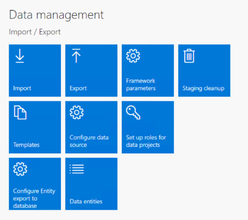
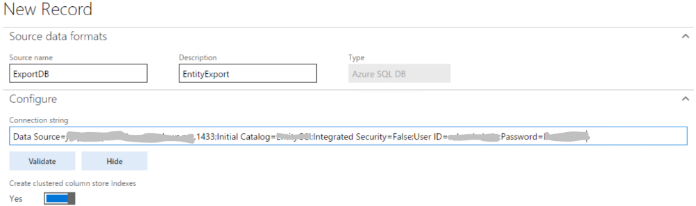
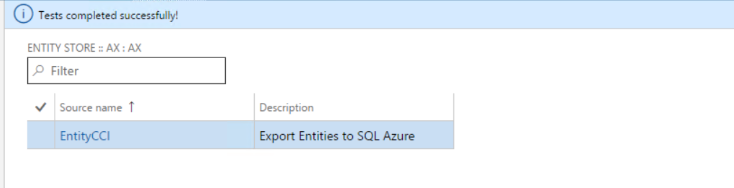
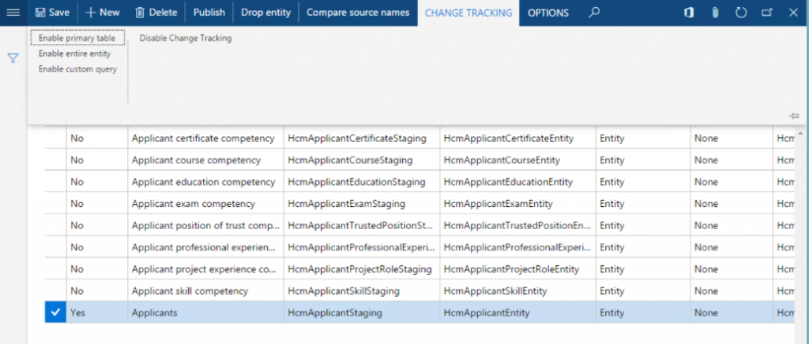
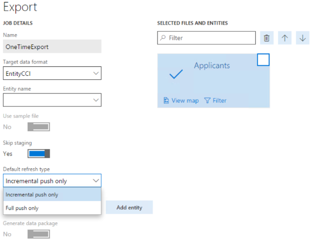

---
# required metadata

title: Bring your own database
description: This topic explains how to export entities to your own Azure SQL database.
author: MilindaV2
manager: AnnBe
ms.date: 10/16/2017
ms.topic: article
ms.prod: 
ms.service: dynamics-ax-platform
ms.technology: 

# optional metadata

# ms.search.form:  [Operations AOT form name to tie this topic to]
audience: Developer, IT Pro
# ms.devlang: 
ms.reviewer: sericks
ms.search.scope:  Operations, UnifiedOperations, Platform 
# ms.tgt_pltfrm: 
# ms.custom: [used by loc for topics migrated from the wiki]
ms.search.region: Global 
# ms.search.industry: [leave blank for most, retail, public sector]
ms.author: milindav
ms.search.validFrom: 2016-08-30 
ms.dyn365.ops.version: Platform update 2 
---

# Bring your own database

[!include[banner](../includes/banner.md)]

This topic explains how administrators can export data entities from Microsoft Dynamics 365 for Finance and Operations, Enterprise edition, to their own Microsoft Azure SQL database. This feature is also known as *bring your own database* (BYOD). The BYOD feature was released in Platform update 2 (August 2016). Minor improvements and bug fixes have been included in subsequent platform updates.

This feature lets administrators configure their own database, and export one or more of the data entities that are available in Finance and Operations. (Currently, more than 1,700 data entities are available.) Specifically, this feature lets you complete these tasks:

- Define one or more SQL databases into which you can export entity data from Finance and Operations.
- Export either all the records (*full push*) or only the records that have changed (*incremental push*).
- Use the rich scheduling capabilities of the Finance and Operations batch framework to enable recurring exports.
- Access the entity database by using Transact-SQL (T-SQL), and even extend the database by adding more tables.

## Entity store or BYOD?

If you followed the series of [blog posts about Microsoft Power BI integration](https://blogs.msdn.microsoft.com/dynamicsaxbi/2016/06/09/power-bi-integration-with-entity-store-in-dynamics-ax-7-may-update/), you might be familiar with Entity store. Entity store is the operational data warehouse that is included with Finance and Operations. Entity store provides built-in integration of operational reports with Power BI. Ready-made reports and analytical workspaces that are built into Finance and Operations use Entity store. If you write Power BI reports by using data in your Finance and Operations environment, you should use Entity store.

The BYOD feature is recommended for the following scenarios:

- You must export data from Finance and Operations into your own data warehouse.
- You use analytical tools besides Power BI, and those tools require T-SQL access to data.
- You must perform batch integration with other systems.

> [!NOTE]
> Finance and Operations doesn't allow T-SQL connections to the production database. If you're upgrading from a previous version of Finance and Operations, and you have integration solutions that require direct T-SQL access to the database, BYOD is the recommended upgrade path.

As a customer of Finance and Operations, you can use either Entity store or BYOD. Ready-made operational reports (especially the reports in the (July 2017)), take advantage of embedded Power BI and Entity store. You should use ready-made operational reports as your first choice. You can also extend the operational reports to meet your requirements. You should consider BYOD as a complementary option that you use as you require.

## Creating an SQL database

Before you begin this option, you must create an SQL database by using the Azure portal.

For one-box development environments, you can create a database in the local Microsoft SQL Server database. However, this database should be used only for development and testing purposes. For production environments, you must create an SQL database.

You should also create an SQL user account to sign in to the database. Write down the server name, database name, and the SQL user ID and password. You will use this information in the next step.

If you're using this functionality for integration with a business intelligence (BI) tool, you should consider creating an SQL premium database. Premium databases support clustered columnstore indexes (CCIs). CCIs are in-memory indexes that improve the performance of read queries that are typical in analytical and reporting workloads. If you're using this functionality to export data into a staging database or for general integration purposes, you can use a standard database.

## Configuring the entity export option

Start the Finance and Operations client, and then, on the **Data management** workspace, select the **Configure Entity export to database** tile.

If you've configured any databases, a list is shown. Otherwise, you must configure a new database. Select **New**, and enter a unique name and a description for the new database. Note that you can export entities into multiple databases.

Next, you must enter the connection string in the following format.

    Data Source=<logical server name>,1433; Initial Catalog=<your DB name>; Integrated Security=False; User ID=<SQL user ID>; Password=<password>

In this connection string, the logical server name should resemble **nnnn.database.windows.net**. You should be able to find the logical server name from the Azure portal.

After you enter the connection string, select **Validate**, and make sure that the connection is successful.

The **Create clustered column store indexes** option optimizes the destination database for selected queries by defining CCIs for entities that are copied from Finance and Operations. However, CCIs are currently supported only on SQL premium databases. Therefore, to enable this option, you must create an SQL premium database.

When the validation is passed, the database that you configured for entity export now appears in the lists, as shown in the following illustration.

Next, you can publish one or more entities to the new database by selecting the **Publish** option on the menu.

### Publishing the entity schema to the database

The **Publish** page enables several scenarios:

- Publish new entities to the database.
- Delete previously published entities from the database. (For example, you might want to re-create the schema.)
- Compare published entities with the entity schema in Finance and Operations. (For example, if new fields are added to Finance and Operations later, you can compare the fields with your database schema.)
- Configure change tracking functionality that enables incremental updates of your data.

Let’s look at each option.

#### Publish

The **Publish** option defines the entity database schema on the destination database. When you select one or more entities, and then select the **Publish** option, a batch job is started. This job creates the entities in the destination database. When the database definition job is completed, you receive a message, which you can access by using the bell symbol in the upper right.

The actual data update occurs when you export data. At this point, you're just creating the schema.

#### Drop entity

The **Drop entity** option deletes the data and the entity definition from the destination database.

#### Compare source names

The **Compare source names** option lets you compare the entity schema in the destination with the entity schema in Finance and Operations. This option is used for version management. You can also use this option to remove any unwanted columns from the destination table.

#### Configure change tracking

Change tracking is a feature that is provided in SQL Server and SQL Database. Change tracking enables the database to track changes that are made on tables. The system uses change tracking to identify changes that are made to tables as transactions are performed in Finance and Operations.

The **Change tracking** option on the **Publish** page lets you configure how changes are tracked on the underlying entity.

The following table describes the change tracking options that are available.

| Option               | Description |
|----------------------|-------------|
| Enable primary table | An entity is composed of several tables. Select this option to track all changes that are made to the primary table of the entity. When changes are made to the primary table, the corresponding record is inserted into or updated in the destination database. Although data from the whole entity is written to the destination table, the system triggers the insert or update option only when the primary table is modified. |
| Enable entire entity | Select this option to track all changes to the entity. (These changes include changes to all the tables that make up the entity.) When changes are made to the entity, corresponding updates are made to the destination. |
| Enable custom query  | This option lets a developer provide a custom query that the system runs to evaluate changes. This option is useful when you have a complex requirement to track changes from only a selected set of fields. You can also select this option when the entities that will be exported were built by using a hierarchy of nested views. |

For the change tracking functionality to work, you must enable the **Change tracking** option in the Finance and Operations database. This option is enabled by default.

If you republish an entity that exists in the destination database, the system warns you that existing data will be deleted as a result of the new operation.

When you confirm the publish operation, the system publishes the schema to the database, and you're notified about when the operation is completed.

By selecting the **Show published only** option back on the **Publish** page, you can show only the entities that were published to a given destination database. The Publish function creates the entity schema in the database. You can navigate to the database and see the table schemas that were created, together with corresponding indexes.

> [!NOTE]
> Currently, you can't export composite entities into BYOD. You must export each entity in the composite entity.

## Export data into your database

After entities are published to the destination database, you can use the Export function in the **Data management** workspace to move data. The Export function lets you to define a Data movement job that contains one or more entities.

You can use the **Export** page to export data from Finance and Operations into many target data formats, such as a comma-separated values (CSV) file. This page also supports SQL databases as another destination.

When you add an entity for data export, you can select to do an incremental export (which is also known as incremental push) or a full push. For incremental push to work, you must enable the **Change tracking** option in the Finance and Operations database and specify an appropriate change tracking option, as described earlier.

If you select to do an incremental push, whenever a new record is inserted, or a record is added, the corresponding change will be reflected in the destination entity. In Platform update 8, records that are deleted in the source aren't updated in the destination.

Full push truncates the table and inserts all the records from the selected entity.

You can create a data project that has multiple entities. You can schedule this data project to run by using the Finance and Operations batch framework. You also schedule the data export job to run on a recurring basis by selecting the **Create recurring data job** option.

### Best practices and known limitations

In Platform update 8, there are several known limitations in this feature.

**Incremental push doesn't propagate records that have been deleted in the source**

If records are deleted from any table in the source entity, corresponding delete operations aren't applied to the destination database. If you work with entities where records are deleted, we recommended that you periodically do full-push update operations.

**Export data projects are specific to a single legal entity**

You can't create a single job to export data across multiple legal entities. When you create a data project to export data, the job exports data from the current legal entity. If you must export data from multiple legal entities, you must create multiple data projects by switching legal entities.

**You can't export composite entities into BYOD**

Currently, composite entities aren't supported. You must export individual entities that make up the composite entity. However, you can export both the entities in the same data project.

**Entities that don't have unique keys can’t be exported by using incremental push**

You might face this limitation especially when you try to incrementally export records from a few ready-made entities. Because these entities were designed to enable the import of data into Finance and Operations, they don't have a unique key. However, you can enable change tracking only for entities that have a unique key. Therefore, there is a limitation on incremental push. One workaround is to extend the required entity and define a unique key.
