---
# required metadata

title: Formula designer in Electronic reporting
description: This topic explains how to use the formula designer in Electronic reporting (ER).
author: kfend
manager: AnnBe
ms.date: 06/20/2017
ms.topic: article
ms.prod: 
ms.service: dynamics-ax-platform
ms.technology: 

# optional metadata

ms.search.form: ERDataModelDesigner, ERExpressionDesignerFormula, ERMappedFormatDesigner, ERModelMappingDesigner
# ROBOTS: 
audience: Application User, IT Pro
# ms.devlang: 
ms.reviewer: kfend
ms.search.scope: Core, AX 7.0.0, Operations, UnifiedOperations
# ms.tgt_pltfrm: 
ms.custom: 58771
ms.assetid: 24223e13-727a-4be6-a22d-4d427f504ac9
ms.search.region: Global
# ms.search.industry: 
ms.author: nselin
ms.search.validFrom: 2016-02-28
ms.dyn365.ops.version: AX 7.0.0

---

# Formula designer in Electronic reporting

[!include[banner](../includes/banner.md)]

This topic explains how to use the formula designer in Electronic reporting (ER). When you design a format for a specific electronic document in ER, you can use formulas to transform data so that it meets the requirements for the document's fulfillment and formatting. These formulas resemble formulas in Microsoft Excel. Various types of functions are supported in the formulas: text, date and time, mathematical, logical, information, data type conversion, and other (business domain–specific functions).

## Formula designer overview

ER supports the formula designer. Therefore, at design time, you can configure expressions that can be used for the following tasks at runtime:

- Transform data that is received from a Microsoft Dynamics 365 for Finance and Operations, Enterprise edition database, and that should be entered in an ER data model that is designed to be a data source for ER formats. (For example, these transformations might include filtering, grouping, and data type conversion.)
- Format data that must be sent to a generating electronic document in accordance with the layout and conditions of a specific ER format. (For example, the formatting might be done in accordance with the requested language or culture, or the encoding).
- Control the process of creating electronic documents. (For example, the expressions can enable or disable the output of specific elements of the format, depending on processing data. They can also interrupt the document creation process or throw messages to users.)

You can open the **Formula designer** page when you perform any of the following actions:

- Bind data source items to data model components.
- Bind data source items to format components.
- Complete maintenance of calculated fields that are part of data sources.
- Define the visibility conditions for user input parameters.
- Design a format's transformations.
- Define the enabling conditions for the format's components.
- Define the file names for the format's FILE components.
- Define the conditions for process control validations.
- Define the message text for process control validations.

## Designing ER formulas

### Data binding

The ER formula designer can be used to define an expression that transforms data that is received from data sources, so that the data can be entered in the data consumer at runtime:

- From Finance and Operations data sources and runtime parameters to an ER data model
- From an ER data model to an ER format
- From Finance and Operations data sources and runtime parameters to an ER format

The following illustration shows the design of an expression of this type. In this example, the expression rounds the value of the **Intrastat.AmountMST** field the Intrastat table in Finance and Operations to two decimal places and then returns the rounded value.

[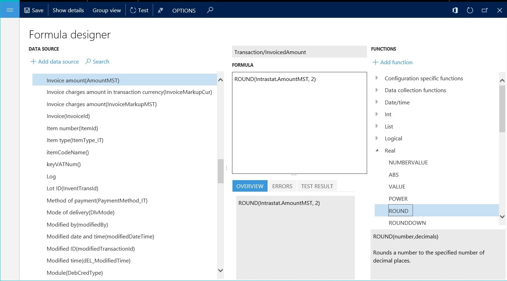](./media/picture-expression-binding.jpg)

The following illustration shows how an expression of this type can be used. In this example, the result of the designed expression is entered in the **Transaction.InvoicedAmount** component of the **Tax reporting model** data model.

At runtime, the designed formula, **ROUND (Intrastat.AmountMST, 2)**, rounds the value of the **AmountMST** field for each record in the Intrastat table to two decimal places. It then enters the rounded value in the **Transaction.InvoicedAmount** component of the **Tax reporting** data model.

### Data formatting

The ER formula designer can be used to define an expression that formats data that is received from data sources, so that the data can be sent as part of the generating electronic document. You might have formatting that must be applied as a typical rule that should be reused for a format. In this case, you can introduce that formatting one time in the format configuration, as a named transformation that has a formatting expression. This named transformation can then be linked with many format components where the output must be formatted according to the formatting expression that you created.

The following illustration shows the design of a transformation of this type. In this example, the **TrimmedString** transformation truncates incoming data of the **String** data type by removing leading and trailing spaces. Itd then returns the truncated string value.

[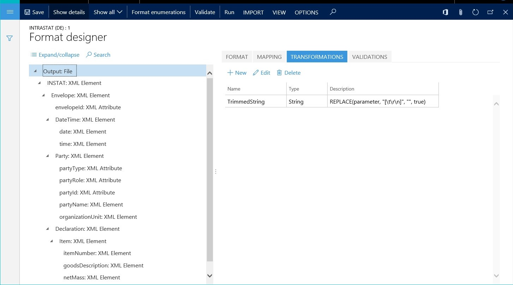](./media/picture-transformation-design.jpg)

The following illustration shows how a transformation of this type can be used. In this example, several format components send text as output to the generating electronic document at runtime. All these format components refer to the **TrimmedString** transformation by name.

[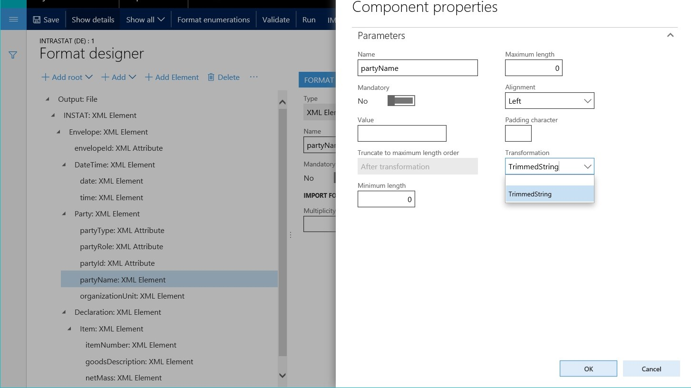](./media/picture-transformation-usage.jpg)

When format components, such as the **partyName** component in the preceding illustration, refer to the **TrimmedString** transformation, the transformation sends text as output to the generating electronic document. This text doesn't include leading and trailing spaces.

If you have formatting that must be applied individually, you can introduce that formatting as an individual expression of a binding of a specific format component. The following illustration shows an expression of this type. In this example, the **partyType** format component is bound to the data source via an expression that converts incoming data from the **Model.Company.RegistrationType** field in the data source to uppercase text. The expression then sends that text as output to the electronic document.

### Process flow control

The ER formula designer can be used to define expressions that control the process flow of generating electronic documents. You can perform the following tasks:

- Define conditions that determine when a document creation process must be stopped.
- Specify expressions that either create messages for the user about stopped processes or throw execution log messages about the continuing process of report generation.
- Specify the file names of generating electronic documents, and control the conditions of their creation.

Each rule of the process flow control is designed as an individual validation. The following illustration shows a validation of this type. Here is an explanation of the configuration in this example:

- The validation is evaluated when the **INSTAT** node is created during generation of the XML file.
- If the list of transactions is empty, the validation stops the execution process and returns **FALSE**.
- The validation returns an error message that includes the text of Finance and Operations label SYS70894 in the user's preferred language.

The ER formula designer can also be used to generate a file name for a generating electronic document and control the file creation process. The following illustration shows the design of a process flow control of this type. Here is an explanation of the configuration in this example:

- The list of records from the **model.Intrastat** data source is divided into batches. Each batch contains up to 1,000 records.
- The output creates a zip file that contains one file in XML format for every batch that was created.
- An expression returns a file name for generating electronic documents by concatenating the file name and the file name extension. For the second batch and all subsequent batches, the file name contains the batch ID as a suffix.
- An expression enables (by returning **TRUE**) the file creation process for batches that contain at least one record.

### Basic syntax

ER expressions can contain any or all of the following elements:

- Constants
- Operators
- References
- Paths
- Functions

#### Constants

When you design expressions, you can use text and numeric constants (that is, values that aren't calculated). For example, the expression **VALUE ("100") + 20** uses the numeric constant **20** and the string constant **"100"**, and returns the numeric value **120**. The ER formula designer supports escape sequences. Therefore, you can specify an expression string that should be handled differently. For example, the expression **"Leo Tolstoy ""War and Peace"" Volume 1"** returns the text string **Leo Tolstoy "War and Peace" Volume 1**.

#### Operators

The following table shows the arithmetic operators that you can use to do basic mathematical operations, such as addition, subtraction, multiplication, and division.

| Operator | Meaning               | Example |
|----------|-----------------------|---------|
| +        | Addition              | 1+2     |
| -        | Subtraction, negation | 5-2, -1 |
| \*       | Multiplication        | 7\*8    |
| /        | Division              | 9/3     |

The following table shows the comparison operators that are supported. You can use these operators to compare two values.

| Operator | Meaning                  | Example    |
|----------|--------------------------|------------|
| =        | Equal                    | X=Y        |
| &gt;     | Greater than             | X&gt;Y     |
| &lt;     | Less than                | X&lt;Y     |
| &gt;=    | Greater than or equal to | X&gt;=Y    |
| &lt;=    | Less than or equal to    | X&lt;=Y    |
| &lt;&gt; | Not equal to             | X&lt;&gt;Y |

Additionally, you can use an ampersand (&) as a text concatenation operator. In this way, you can join, or concatenate, one or more text strings into a single piece of text.

| Operator | Meaning     | Example                                             |
|----------|-------------|-----------------------------------------------------|
| &        | Concatenate | "Nothing to print" & ":&nbsp;" & "no records found" |

##### Operator precedence

The order that the parts of a compound expression are evaluated in is important. For example, the result of the expression **1 + 4 / 2** varies, depending on whether the addition operation or the division operation is done first. You can use parentheses to explicitly define how an expression is evaluated. For example, to indicate that the addition operation should be done first, you can change the preceding expression to **(1 + 4) / 2**. If you don't explicitly indicate the order of operations in an expression, the order is based on the default precedence that is assigned to the supported operators. The following table shows the precedence that is assigned to each operator. Operators that have a higher precedence (for example, 7) are evaluated before operators that have a lower precedence (for example, 1).

| Precedence | Operators      | Syntax                                                                  |
|------------|----------------|-------------------------------------------------------------------------|
| 7          | Grouping       | ( … )                                                                   |
| 6          | Member access  | … . …                                                                   |
| 5          | Function call  | … ( … )                                                                 |
| 4          | Multiplicative | … \* … … / …                                                         |
| 3          | Additive       | … + … … - …                                                          |
| 2          | Comparison     | … &lt; … … &lt;= … … =&gt; … … &gt; … … = … … &lt;&gt; … |
| 1          | Separation     | … , …                                                                   |

If an expression includes multiple consecutive operators that have the same precedence, those operations are evaluated from left to right. For example, the expression **1 + 6 / 2 \* 3 &gt; 5** returns **true**. We recommend that you use parentheses to explicitly indicate the desired order of operations in expressions, so that the expressions are easier to read and maintain.

#### References

All data sources of the current ER component that are available during the design of an expression can be used as named references. (The current ER component can be either a model or a format.) For example, the current ER data model contains the **ReportingDate** data source, and this data source returns a value of the **DATETIME** data type. To properly format that value in the generating document, you can reference the data source in the expression as **DATETIMEFORMAT (ReportingDate, "dd-MM-yyyy")**.

All characters in the name of a referencing data source that don't represent a letter of the alphabet must be preceded by a single quotation mark ('). If the name of a referencing data source contains at least one symbol that doesn't represent a letter of the alphabet, the name must be enclosed in single quotation marks. (For example, these non-alphabetic symbols can be punctuation marks or other written symbols.) Here are some examples:

- The **Today's date & time** data source must be referred to in an ER expression as **'Today''s date & time'**.
- The **name()** method of the **Customers** data source must be referred to in an ER expression as **Customers.'name()'**.

If the methods of Finance and Operations data sources have parameters, the following syntax is used to call those methods:

- If the **isLanguageRTL** method of the **System** data source has an **EN-US** parameter of the **String** data type, this method must be referred to in an ER expression as **System.'isLanguageRTL'("EN-US")**.
- Quotation marks aren't required when a method name contains only alphanumeric symbols. However, they are required for a method of a table if the name includes brackets.

When the **System** data source is added to an ER mapping that refers to the **Global** Finance and Operations application class, the expression returns the Boolean value **FALSE**. The modified expression **System.' isLanguageRTL'("AR")** returns the Boolean value **TRUE**.

You can limit the way that values are passed to the parameters of this type of method:

- Only constants can be passed to methods of this type. The values of the constants are defined at design time.
- Only primitive (basic) data types are supported for parameters of this type. (The primitive data types are integer, real, Boolean, string, and so on).

#### Paths

When an expression references a structured data source, you can use the path definition to select a specific primitive element of that data source. A dot character (.) is used to separate individual elements of a structured data source. For example, the current ER data model contains the **InvoiceTransactions** data source, and this data source returns a list of records. The **InvoiceTransactions** record structure contains the **AmountDebit** and **AmountCredit** fields, and both these fields return numeric values. Therefore, you can design the following expression to calculate the invoiced amount: **InvoiceTransactions.AmountDebit - InvoiceTransactions.AmountCredit**.

#### Functions

The next section describes the functions that can be used in ER expressions. All data sources of the expression context (the current ER data model or ER format) can be used as parameters of calling functions, in accordance with the list of arguments for calling functions. Constants can also be used as parameters of calling functions. For example, the current ER data model contains the **InvoiceTransactions** data source, and this data source returns a list of records. The **InvoiceTransactions** record structure contains the **AmountDebit** and **AmountCredit** fields, and both these fields return numeric values. Therefore, to calculate the invoiced amount, you can design the following expression that uses the built-in ER rounding function: **ROUND (InvoiceTransactions.AmountDebit - InvoiceTransactions.AmountCredit, 2)**.

## Supported functions

The following tables describe the data manipulation functions that you can use to design ER data models and ER reports. The list of functions isn't fixed. Developers can extend it. To see the list of functions that you can use, open the functions pane in the ER formula designer.

### Date and time functions

| Function | Description | Example |
|----------|-------------|---------|
| ADDDAYS (datetime, days) | Add the specified number of days to the specified date/time value. | **ADDDAYS (NOW(), 7)** returns the date and time seven days in the future. |
| DATETODATETIME (date) | Convert the specified date value to a date/time value. | **DATETODATETIME (CompInfo. 'getCurrentDate()')** returns the current Finance and Operations session date, December 24, 2015, as **12/24/2015 12:00:00 AM**. In this example, **CompInfo** is an ER data source of the **Finance and Operations/Table** type and refers to the CompanyInfo table. |
| NOW () | Return the current Finance and Operations application server date and time as a date/time value. | |
| TODAY () | Return the current Finance and Operations application server date as a date value. | |
| NULLDATE () | Return a **null** date value. | |
| NULLDATETIME () | Return a **null** date/time value. | |
| DATETIMEFORMAT (datetime, format) | Convert the specified date/time value to a string in the specified format. (For information about the supported formats, see [standard](https://msdn.microsoft.com/en-us/library/az4se3k1(v=vs.110).aspx) and [custom](https://msdn.microsoft.com/en-us/library/8kb3ddd4(v=vs.110).aspx).) | **DATETIMEFORMAT (NOW(), "dd-MM-yyyy")** returns the current Finance and Operations application server date, December 24, 2015, as **"24-12-2015"**, based on the specified custom format. |
| DATETIMEFORMAT (datetime, format, culture) | Convert the specified date/time value to a string in the specified format and [culture](https://msdn.microsoft.com/en-us/goglobal/bb896001.aspx). (For information about the supported formats, see [standard](https://msdn.microsoft.com/en-us/library/az4se3k1(v=vs.110).aspx) and [custom](https://msdn.microsoft.com/en-us/library/8kb3ddd4(v=vs.110).aspx)). | **DATETIMEFORMAT (NOW(), "d", "de")** returns the current Finance and Operations application server date, December 24, 2015, as **"24.12.2015"**, based on the selected German culture. |
| SESSIONTODAY () | Return the current Finance and Operations session date as a date value. | |
| SESSIONNOW () | Return the current Finance and Operations session date and time as a date/time value. | |
| DATEFORMAT (date, format) | Return a string representation of the specified date in the specified format. | **DATEFORMAT (SESSIONTODAY (), "dd-MM-yyyy")** returns the current Finance and Operations session date, December 24, 2015, as **"24-12-2015"**, based on the specified custom format. |
| DATEFORMAT (date, format, culture) | Convert the specified date value to a string in the specified format and [culture](https://msdn.microsoft.com/en-us/goglobal/bb896001.aspx). (For information about the supported formats, see [standard](https://msdn.microsoft.com/en-us/library/az4se3k1(v=vs.110).aspx) and [custom](https://msdn.microsoft.com/en-us/library/8kb3ddd4(v=vs.110).aspx)). | **DATETIMEFORMAT (SESSIONNOW (), "d", "de")** returns the current Finance and Operations session date, December 24, 2015, as **"24.12.2015"**, based on the selected German culture. |
| DAYOFYEAR (date) | Return an integer representation of the number of days between January 1 and the specified date. | **DAYOFYEAR (DATEVALUE ("01-03-2016", "dd-MM-yyyy"))** returns **61**. **DAYOFYEAR (DATEVALUE ("01-01-2016", "dd-MM-yyyy"))** returns **1**. |
| DAYS (date 1, date 2) | Return the number of days between the first specified date and the second specified date. Return a positive value when the first date is later than the second date, return **0** (zero) when the first date equals the second date, or return a negative value otherwise. | **DAYS (TODAY (), DATEVALUE( DATETIMEFORMAT( ADDDAYS(NOW(), 1), "yyyyMMdd"), "yyyyMMdd"))** returns **-1**. |

### Data conversion functions

| Function | Description | Example |
|----------|-------------|---------|
| DATETODATETIME (date) | Convert the specified date value to a date/time value. | **DATETODATETIME (CompInfo. 'getCurrentDate()')** returns the current Finance and Operations session date, December 24, 2015, as **12/24/2015 12:00:00 AM**. In this example, **CompInfo** is an ER data source of the **Finance and Operations/Table** type and refers to the CompanyInfo table. |
| DATEVALUE (string, format) | Return a date representation of the specified string in the specified format. | **DATEVALUE ("21-Dec-2016", "dd-MMM-yyyy")** returns the date December 21, 2016, based on specified custom format and the default application's **EN-US** culture. |
| DATEVALUE (string, format, culture) | Return a date representation of the specified string in the specified format and culture. | **DATEVALUE ("21-Gen-2016", "dd-MMM-yyyy", "IT")** returns the date January 21, 2016, based on the specified custom format and culture. However, **DATEVALUE ("21-Gen-2016", "dd-MMM-yyyy", "EN-US")** will throw an exception to inform the user that the specified string isn't recognized as a valid date. |
| DATETIMEVALUE (string, format) | Return a date/time representation of the specified string in the specified format. | **DATETIMEVALUE ("21-Dec-2016 02:55:00", "dd-MMM-yyyy hh:mm:ss")** returns 2:55:00 AM on December 21, 2016, based on the specified custom format and the default application's **EN-US** culture. |
| DATETIMEVALUE (string, format, culture) | Return a date/time representation of the specified string in the specified format and culture. | **DATETIMEVALUE ("21-Gen-2016 02:55:00", "dd-MMM-yyyy hh:mm:ss", "IT")** returns 2:55:00 AM on December 21, 2016, based on the specified custom format and culture. However, **DATETIMEVALUE ("21-Gen-2016 02:55:00", "dd-MMM-yyyy hh:mm:ss", "EN-US")** will throw an exception to inform the user that the specified string isn't recognized as a valid date/time. |

### List functions

<table>
<colgroup>
<col width="33%" />
<col width="33%" />
<col width="33%" />
</colgroup>
<thead>
<tr class="header">
<th>Function</th>
<th>Description</th>
<th>Example</th>
</tr>
</thead>
<tbody>
<tr class="odd">
<td>SPLIT (input, length)</td>
<td>Split the specified input string into substrings, each of which has the specified length. Return the result as a new list.</td>
<td><strong>SPLIT (&quot;abcd&quot;, 3)</strong> returns a new list that consists of two records that have a <strong>STRING</strong> field. The field in the first record contains the text <strong>&quot;abc&quot;</strong>, and the field in the second record contains the text <strong>&quot;d&quot;</strong>.</td>
</tr>
<tr class="even">
<td>SPLITLIST (list, number)</td>
<td>Split the specified list into batches, each of which contains the specified number of records. Return the result as a new list of batches that contains the following elements:
<ul>
<li>Batches as regular lists (<strong>Value</strong> component)</li>
<li>The current batch number (<strong>BatchNumber</strong> component)</li>
</ul></td>
<td>In the following illustration, a <strong>Lines</strong> data source is created as a record list of three records. This list is divided into batches, each of which contains up to two records.

<a href="./media/picture-splitlist-datasource.jpg">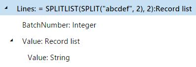</a>

The following illustration shows the designed format layout. In this format layout, bindings to the <strong>Lines</strong> data source are created to generate output in XML format. This output presents individual nodes for each batch and the records in it.

<a href="./media/picture-splitlist-format.jpg">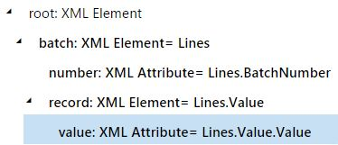</a>

The following illustration shows the result when the designed format is run.

<a href="./media/picture-splitlist-result.jpg">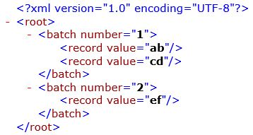</a></td>
</tr>
<tr class="odd">
<td>LIST (record 1 [, record 2, …])</td>
<td>Return a new list that is created from the specified arguments.</td>
<td><strong>LIST (model.MainData, model.OtherData)</strong> returns an empty record, where the list of fields contains all fields of the <strong>MainData</strong> and <strong>OtherData</strong> record lists.</td>
</tr>
<tr class="even">
<td>LISTJOIN (list 1, list 2, …)</td>
<td>Return a joined list that is created from lists of specified arguments.</td>
<td><strong>LISTJOIN (SPLIT (&quot;abc&quot;, 1), SPLIT (&quot;def&quot;, 1))</strong> returns a list of six records, where one field of the <strong>STRING</strong> data type contains single letters.</td>
</tr>
<tr class="odd">
<td>ISEMPTY (list)</td>
<td>Return <strong>TRUE</strong> if the specified list contains no elements. Otherwise, return <strong>FALSE</strong>.</td>
<td></td>
</tr>
<tr class="even">
<td>EMPTYLIST (list)</td>
<td>Return an empty list by using the specified list as a source for the list structure.</td>
<td><strong>EMPTYLIST (SPLIT (&quot;abc&quot;, 1))</strong> returns a new empty list that has the same structure as the list that is returned by the <strong>SPLIT</strong> function.</td>
</tr>
<tr class="odd">
<td>FIRST (list)</td>
<td>Return the first record of the specified list, if that record isn't empty. Otherwise, throw an exception.</td>
<td></td>
</tr>
<tr class="even">
<td>FIRSTORNULL (list)</td>
<td>Return the first record of the specified list, if that record isn't empty. Otherwise, return a <strong>null</strong> record.</td>
<td></td>
</tr>
<tr class="odd">
<td>LISTOFFIRSTITEM (list)</td>
<td>Return a list that contains only the first item of the specified list.</td>
<td></td>
</tr>
<tr class="even">
<td>ALLITEMS (path)</td>
<td>Return a new flattened list that represents all items that match the specified path. The path must be defined as a valid data source path of a data source element of a record list data type. Data elements such as the path string and date should raise an error in the ER expression builder at design time.</td>
<td>If you enter <strong>SPLIT(&quot;abcdef&quot; , 2)</strong> as a data source (DS), <strong>COUNT( ALLITEMS (DS.Value))</strong> returns <strong>3</strong>.</td>
</tr>
<tr class="odd">
<td>ORDERBY (list [, expression 1, expression 2, …])</td>
<td>Return the specified list after it has been sorted according to the specified arguments. These arguments can be defined as expressions.</td>
<td>If <strong>Vendor</strong> is configured as an ER data source that refers to the VendTable table, <strong>ORDERBY (Vendors, Vendors.'name()')</strong> returns a list of vendors that is sorted by name in ascending order.</td>
</tr>
<tr class="even">
<td>REVERSE (list)</td>
<td>Return the specified list in reversed sort order.</td>
<td>If <strong>Vendor</strong> is configured as an ER data source that refers to the VendTable table, <strong>REVERSE (ORDERBY (Vendors, Vendors.'name()')) )</strong> returns a list of vendors that is sorted by name in descending order.</td>
</tr>
<tr class="odd">
<td>WHERE (list, condition)</td>
<td>Return the specified list after it has been filtered according to the specified condition. The specified condition is applied to the list in memory. In this way, the <strong>WHERE</strong> function differs from the <strong>FILTER</strong> function.</td>
<td>If <strong>Vendor</strong> is configured as an ER data source that refers to the VendTable table, <strong>WHERE(Vendors, Vendors.VendGroup = &quot;40&quot;)</strong> returns a list of just the vendors that belong to vendor group 40.</td>
</tr>
<tr class="even">
<td>ENUMERATE (list)</td>
<td>Return a new list that consists of enumerated records of the specified list, and that exposes the following elements:
<ul>
<li>Specified list records as regular lists (<strong>Value</strong> component)</li>
<li>The current record index (<strong>Number</strong> component)</li>
</ul></td>
<td>In the following illustration, an <strong>Enumerated</strong> data source is created as an enumerated list of vendor records from the <strong>Vendors</strong> data source that refers to the VendTable table.

<a href="./media/picture-enumerate-datasource.jpg">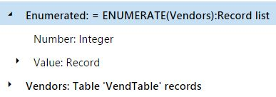</a>

The following illustration shows the format. In this format, data bindings are created to generate output in XML format. This output presents individual vendors as enumerated nodes.

<a href="./media/picture-enumerate-format.jpg">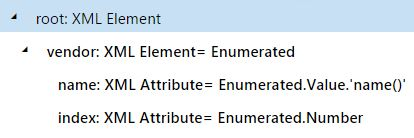</a>

The following illustration shows the result when the designed format is run.

<a href="./media/picture-enumerate-result.jpg">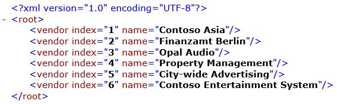</a></td>
</tr>
<tr class="odd">
<td>COUNT (list)</td>
<td>Return the number of records in the specified list, if the list isn't empty. Otherwise, return <strong>0</strong> (zero).</td>
<td><strong>COUNT (SPLIT(&quot;abcd&quot; , 3))</strong> returns <strong>2</strong>, because the <strong>SPLIT</strong> function creates a list that consists of two records.</td>
</tr>
<tr class="even">
<td>LISTOFFIELDS (path)</td>
<td>Return a record list that is created from an argument of one of the following types:
<ul>
<li>Model enumeration</li>
<li>Format enumeration</li>
<li>Container</li>
</ul>

The list that is created consists of records that have the following fields:

<ul>
<li>Name</li>
<li>Label</li>
<li>Description</li>
</ul>
At runtime, the <strong>Label</strong> and <strong>Description</strong> fields return values that are based on the format's language settings.</td>
<td>In the following illustration, an enumeration is introduced in a data model.

The following illustration shows these details:

<ul>
<li>The model enumeration is inserted into a report as a data source.</li>
<li>An ER expression uses the model enumeration as a parameter of the <strong>LISTOFFIELDS</strong> function.</li>
<li>A data source of the record list type is inserted into a report by using the ER expression that is created.</li>
</ul>

<a href="./media/ger-listoffields-function-in-format-expression.png">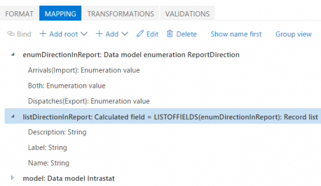</a>

The following example shows the ER format elements that are bound to the data source of the record list type that was created by using the <strong>LISTOFFIELDS</strong> function.

The following illustration shows the result when the designed format is run.

<blockquote>[!NOTE] 
Based on the language settings of the parent FILE and FOLDER format elements, translated text for labels and descriptions is entered in the output of the ER format.</blockquote></td>
</tr>
<tr class="odd">
<td>LISTOFFIELDS (path, language)</td>
<td>Return a record list that is created from an argument, such as a model enumeration, a format enumeration, or a container. The list that is created consists of records that have the following fields:
<ul>
<li>Name</li>
<li>Label</li>
<li>Description</li>
<li>Is translated</li>
</ul>

At runtime, the <strong>Label</strong> and <strong>Description</strong> fields return values that are based on the format's language settings and the specified language. The <strong>Is translated</strong> field indicates that the <strong>Label</strong> field has been translated into the specified language.</td>
<td>For example, you use the <strong>Calculated field</strong> data source type to configure the <strong>enumType_de</strong> and <strong>enumType_deCH</strong> data sources for the <strong>enumType</strong> data model enumeration:
<ul>
<li>enumType_de = <strong>LISTOFFIELDS</strong> (enumType, &quot;de&quot;)</li>
<li>enumType_deCH = <strong>LISTOFFIELDS</strong> (enumType, &quot;de-CH&quot;)</li>
</ul>
In this case, you can use the following expression to get the label of the enumeration value in Swiss German, if this translation is available. If the Swiss German translation isn't available, the label is in German: <strong>IF (NOT (enumType_deCH.IsTranslated), enumType_de.Label, enumType_deCH.Label)</strong>.</td>
</tr>
<tr class="even">
<td>STRINGJOIN (list, field name, delimiter)</td>
<td>Return a string that consists of concatenated values of the specified field from the specified list. The values are separated by the specified delimiter.</td>
<td>If you enter <strong>SPLIT(&quot;abc&quot; , 1)</strong> as a data source (DS), the expression <strong>STRINGJOIN (DS, DS.Value, &quot;:&quot;)</strong> returns <strong>&quot;a:b:c&quot;</strong>.</td>
</tr>
<tr class="odd">
<td>SPLITLISTBYLIMIT (list, limit value, limit source)</td>
<td>Split the specified list into a new list of sub-lists, and return the result in record list content. The limit value parameter defines the value of the limit for splitting the original list. The limit source parameter defines the step that the total sum is increased on. The limit isn't applied to a single item of the original list if the limit source exceeds the defined limit.</td>
<td>The following illustrations show a format and the data sources that are used for it. 

<a href="./media/ger-splitlistbylimit-format.png">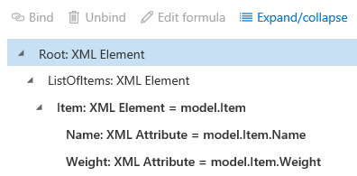</a>

<a href="./media/ger-splitlistbylimit-datasources.png">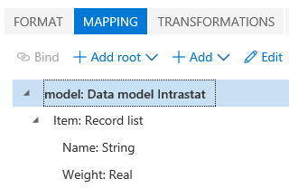</a>

The following illustration shows the result when the format is run. In this case, the output is a flat list of commodity items.

In the following illustrations, the same format has been adjusted so that it presents the list of commodity items in batches when a single batch must include commodities, and the total weight should not exceed the limit of 9.

<a href="./media/ger-splitlistbylimit-datasources-1.png">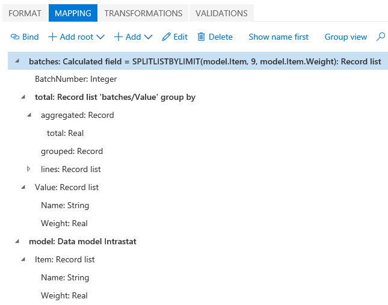</a>

The following illustration shows the result when the adjusted format is run.

<a href="./media/ger-splitlistbylimit-output-1.png">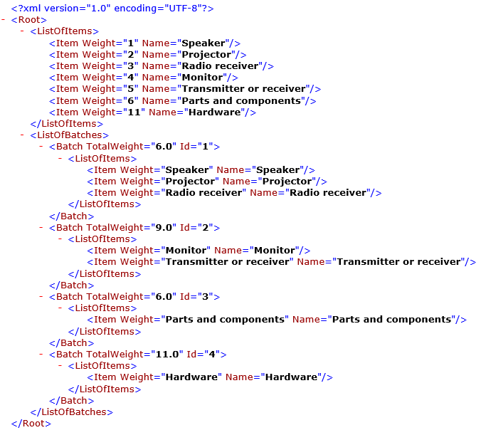</a>

<blockquote>[!NOTE] 
The limit isn't applied to the last item of the original list, because the value (11) of the limit source (weight) exceeds the defined limit (9). Use either the <strong>WHERE</strong> function or the <strong>Enabled</strong> expression of the corresponding format element to ignore (skip) sub-lists during report generation, as required.</blockquote></td>
</tr>
<tr class="even">
<td>FILTER (list, condition)</td>
<td>Return the specified list after the query has been modified to filter for the specified condition. This function differs from the <strong>WHERE</strong> function, because the specified condition is applied to any ER data source of the <strong>Table records</strong> type at the database level. The list and condition can be defined by using tables and relations.</td>
<td>If <strong>Vendor</strong> is configured as an ER data source that refers to the VendTable table, <strong>FILTER (Vendors, Vendors.VendGroup = &quot;40&quot;)</strong> returns a list of just the vendors that belong to vendor group 40. If a vendor is configured as an ER data source that refers to the VendTable table and <strong>parmVendorBankGroup</strong> that is configured as ER data source returning the value in the string data type, <strong>FILTER (Vendor.'&lt;Relations'.VendBankAccount, Vendor.'&lt;Relations'.VendBankAccount.BankGroupID = parmVendorBankGroup)</strong> returns a list of just the vendor accounts that belong to a specific bank group.</td>
</tr>
</tbody>
</table>

### Logical functions

| Function | Description | Example |
|----------|-------------|---------|
| CASE (expression, option 1, result 1 \[, option 2, result 2\] … \[, default result\]) | Evaluate the specified expression value against the specified alternative options. Return the result of the option that equals the value of the expression. Otherwise, return the optional default result, if a default result is specified. (The default result is the last parameter that isn't preceded by an option.) | **CASE( DATETIMEFORMAT( NOW(), "MM"), "10", "WINTER", "11", "WINTER", "12", "WINTER", "")** returns the string **"WINTER"** when the current Finance and Operations session date is between October and December. Otherwise, it returns a blank string. |
| IF (condition, value 1, value 2) | Return the first specified value when the specified condition is met. Otherwise, return the second specified value. If value 1 and value 2 are records or record lists, the result has only the fields that exist in both lists. | **IF (1=2, "condition is met", "condition is not met")** returns the string **"condition is not met"**. |
| NOT (condition) | Return the reversed logical value of the specified condition. | **NOT (TRUE)** returns **FALSE**. |
| AND (condition 1\[, condition 2, …\]) | Return **TRUE** if *all* specified conditions are true. Otherwise, return **FALSE**. | **AND (1=1, "a"="a")** returns **TRUE**. **AND (1=2, "a"="a")** returns **FALSE**. |
| OR (condition 1\[, condition 2, …\]) | Return **FALSE** if *all* specified conditions are false. Return **TRUE** if *any* specified condition is true. | **OR (1=2, "a"="a")** returns **TRUE**. |

### Mathematical functions

| Function | Description | Example |
|----------|-------------|---------|
| ABS (number) | Return the absolute value of the specified number. (In other words, return the number without its sign). | **ABS (-1)** returns **1**. |
| POWER (number, power) | Return the result of raising the specified positive number to the specified power. | **POWER (10, 2)** returns **100**. |
| NUMBERVALUE (string, decimal separator, digit grouping separator) | Convert the specified string to a number. The specified decimal separator is used between the integer and fractional parts of a decimal number. The specified digit grouping separator is used as the thousands separator. | **NUMBERVALUE("1 234,56", ",", " ")** returns the value **1234.56**. |
| VALUE (string) | Convert the specified string to a number. Commas and dot characters (.) are considered decimal separators, and a leading hyphen (-) is used as a negative sign. Throw an exception if the specified string contains other non-numeric characters. | **VALUE ("1 234,56")** throws an exception. |
| ROUND (number, decimals) | Return the specified number after it has been rounded to the specified number of decimal places:<ul><li>If the value of the decimals parameter is more than 0 (zero), the specified number is rounded to that many decimal places.</li><li>If the value of the decimals parameter is **0** (zero), the specified number is rounded to the nearest integer.</li><li>If the value of the decimals parameter is less than 0 (zero), the specified number is rounded to the left of the decimal point.</li></ul> | **ROUND (1200.767, 2)** rounds to two decimal places and returns **1200.77**. **ROUND (1200.767, -3)** rounds to the nearest multiple of 1,000 and returns **1000**. |
| ROUNDDOWN (number, decimals) | Return the specified number after it has been rounded down to the specified number of decimal places.<blockquote>[!NOTE] This function behaves like <strong>ROUND</strong>, but it always rounds the specified number down (toward zero).</blockquote> | **ROUNDDOWN (1200.767, 2)** rounds down to two decimal places and returns **1200.76**. **ROUNDDOWN (1700.767, -3)** rounds down to the nearest multiple of 1,000 and returns **1000**. |
| ROUNDUP (number, decimals) | Return the specified number after it has been rounded up to the specified number of decimal places.<blockquote>[!NOTE] This function behaves like <strong>ROUND</strong>, but it always rounds the specified number up (away from zero).</blockquote> | **ROUNDUP (1200.763, 2)** rounds up to two decimal places and returns **1200.77**. **ROUNDUP (1200.767, -3)** rounds up to the nearest multiple of 1,000 and returns **2000**. |

### Data conversion functions

| Function | Description | Example |
|----------|-------------|---------|
| VALUE (string) | Convert the specified string to a number. Commas and dot characters (.) are considered decimal separators, and a leading hyphen (-) is used as a negative sign. Throw an exception if the specified string contains other non-numeric characters. | **VALUE ("1 234,56")** throws an exception. |
| NUMBERVALUE (string, decimal separator, digit grouping separator) | Convert the specified string to a number. The specified decimal separator is used between the integer and fractional parts of a decimal number. The specified digit grouping separator is used as the thousands separator. | **NUMBERVALUE("1 234,56", ",", " ")** returns **1234.56**. |
| INTVALUE (string) | Return an integer representation of the specified string. Any decimal places are truncated. | **INTVALUE ("100.77")** returns **100**. |
| INTVALUE (number) | Return an integer representation of the specified number. Any decimal places are truncated. | **INTVALUE (-100.77)** returns **-100**. |
| INT64VALUE (string) | Return an int64 representation of the specified string. Any decimal places are truncated. | **INT64VALUE ("22565422744")** returns **22565422744**. |
| INT64VALUE (number) | Return an int64 representation of the specified number. Any decimal places are truncated. | **INT64VALUE (22565422744.00)** returns **22565422744**. |

### Record functions

| Function | Description | Example |
|----------|-------------|---------|
| NULLCONTAINER (list) | Return a **null** record that has the same structure as the specified record list or record.<blockquote>[!NOTE] This function is obsolete. Use <strong>EMPTYRECORD</strong> instead.</blockquote> | **NULLCONTAINER (SPLIT ("abc", 1))** returns a new empty record that has the same structure as the list that is returned by the **SPLIT** function. |
| EMPTYRECORD (record) | Return a **null** record that has the same structure as the specified record list or record.<blockquote>[!NOTE] A <strong>null</strong> record is a record where all fields have an empty value. An empty value is <strong>0</strong> (zero) for numbers, an empty string for strings, and so on.</blockquote> | **EMPTYRECORD (SPLIT ("abc", 1))** returns a new empty record that has the same structure as the list that is returned by the **SPLIT** function. |

### Text functions

<table>
<colgroup>
<col width="33%" />
<col width="33%" />
<col width="33%" />
</colgroup>
<thead>
<tr class="header">
<th>Function</th>
<th>Description</th>
<th>Example</th>
</tr>
</thead>
<tbody>
<tr class="odd">
<td>UPPER (string)</td>
<td>Return the specified string after it has been converted to uppercase letters.</td>
<td><strong>UPPER(&quot;Sample&quot;)</strong> returns <strong>&quot;SAMPLE&quot;</strong>.</td>
</tr>
<tr class="even">
<td>LOWER (string)</td>
<td>Return the specified string after it has been converted to lowercase letters.</td>
<td><strong>LOWER (&quot;Sample&quot;)</strong> returns <strong>&quot;sample&quot;</strong>.</td>
</tr>
<tr class="odd">
<td>LEFT (string, number of characters)</td>
<td>Return the specified number of characters from the start of the specified string.</td>
<td><strong>LEFT (&quot;Sample&quot;, 3)</strong> returns <strong>&quot;Sam&quot;</strong>.</td>
</tr>
<tr class="even">
<td>RIGHT (string, number of characters)</td>
<td>Return the specified number of characters from the end of the specified string.</td>
<td><strong>RIGHT (&quot;Sample&quot;, 3)</strong> returns <strong>&quot;ple&quot;</strong>.</td>
</tr>
<tr class="odd">
<td>MID (string, starting position, number of characters)</td>
<td>Return the specified number of characters from the specified string, starting at the specified position.</td>
<td><strong>MID (&quot;Sample&quot;, 2, 3)</strong> returns <strong>&quot;amp&quot;</strong>.</td>
</tr>
<tr class="even">
<td>LEN (string)</td>
<td>Return the number of characters in the specified string.</td>
<td><strong>LEN (&quot;Sample&quot;)</strong> returns <strong>6</strong>.</td>
</tr>
<tr class="odd">
<td>CHAR (number)</td>
<td>Return the string of characters that is referenced by the specified Unicode number.</td>
<td><strong>CHAR (255)</strong> returns <strong>&quot;ÿ&quot;</strong>.
<blockquote>[!NOTE] 
The string that this function returns depends on the encoding that is selected in the parent FILE format element. For the list of supported encodings, see <a href="https://msdn.microsoft.com/en-us/library/system.text.encoding(v=vs.110).aspx">Encoding class</a>.</blockquote>
</td>
</tr>
<tr class="even">
<td>CONCATENATE (string 1 [, string 2, …])</td>
<td>Return all specified text strings after they have been joined into one string.</td>
<td><strong>CONCATENATE (&quot;abc&quot;, &quot;def&quot;)</strong> returns <strong>&quot;abcdef&quot;</strong>.
<blockquote>[!NOTE] 
The expression <strong>&quot;abc&quot; &amp; &quot;def&quot;</strong> also returns <strong>&quot;abcdef&quot;</strong>.</blockquote>
</td>
</tr>
<tr class="odd">
<td>TRANSLATE (string, pattern, replacement)</td>
<td>Return the specified string after all occurrences of the characters in the specified pattern string have been replaced by the characters at the corresponding position in the specified replacement string.</td>
<td><strong>TRANSLATE (&quot;abcdef&quot;, &quot;cd&quot;, &quot;GH&quot;)</strong> replaces the pattern <strong>&quot;cd&quot;</strong> with the string <strong>&quot;GH&quot;</strong> and returns <strong>&quot;abGHef&quot;</strong>.</td>
</tr>
<tr class="even">
<td>REPLACE (string, pattern, replacement, regular expression flag)</td>
<td>When the specified regular expression flag is <strong>true</strong>, return the specified string after it has been modified by applying the regular expression that is specified as a pattern argument for this function. This expression is used to find characters that must be replaced. Characters of the specified replacement argument are used to replace characters that are found. When the specified regular expression flag is <strong>false</strong>, this function behaves like <strong>TRANSLATE</strong>.</td>
<td><strong>REPLACE (&quot;+1 923 456 4971&quot;, &quot;[^0-9]&quot;, &quot;&quot;, true)</strong> applies a regular expression that removes all non-numeric symbols, and returns <strong>&quot;19234564971&quot;</strong>. <strong>REPLACE (&quot;abcdef&quot;, &quot;cd&quot;, &quot;GH&quot;, false)</strong> replaces the pattern <strong>&quot;cd&quot;</strong> with the string <strong>&quot;GH&quot;</strong> and returns <strong>&quot;abGHef&quot;</strong>.</td>
</tr>
<tr class="odd">
<td>TEXT (input)</td>
<td>Return the specified input after it has been converted to a text string that is formatted according to the server locale settings of the current Finance and Operations instance. For values of the <strong>real</strong> type, the string conversion is limited to two decimal places.</td>
<td>If the Finance and Operations instance server locale is defined as <strong>EN-US</strong>, <strong>TEXT (NOW ())</strong> returns the current Finance and Operations session date, December 17, 2015, as the text string <strong>&quot;12/17/2015 07:59:23 AM&quot;</strong>. <strong>TEXT (1/3)</strong> returns <strong>&quot;0.33&quot;</strong>.</td>
</tr>
<tr class="even">
<td>FORMAT (string 1, string 2[, string 3, …])</td>
<td>Return the specified string after it has been formatted by substituting any occurrences of <strong>%N</strong> with the <em>n</em>th argument. The arguments are strings. If an argument isn't provided for a parameter, the parameter is returned as <strong>&quot;%N&quot;</strong> in the string. For values of the <strong>real</strong> type, the string conversion is limited to two decimal places.</td>
<td>In the following illustration, the <strong>PaymentModel</strong> data source returns the list of customer records via the <strong>Customer</strong> component and the processing date value via the <strong>ProcessingDate</strong> field.

<a href="./media/picture-format-datasource.jpg">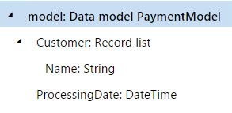</a>

In the ER format that is designed to generate an electronic file for selected customers, <strong>PaymentModel</strong> is selected as a data source and controls the process flow. An exception is thrown to inform the user when a selected customer is stopped for the date when the report is processed. The formula that is designed for this type of processing control can use the following resources:

<ul>
<li>Finance and Operations label SYS70894, which has the following text:
<ul>
<li><strong>For the EN-US language:</strong> &quot;Nothing to print&quot;</li>
<li><strong>For the DE language:</strong> &quot;Nichts zu drucken&quot;</li>
</ul></li>
<li>Finance and Operations label SYS18389, which has the following text:
<ul>
<li><strong>For the EN-US language:</strong> &quot;Customer %1 is stopped for %2.&quot;</li>
<li><strong>For the DE language:</strong> &quot;Debitor '%1' wird für %2 gesperrt.&quot;</li>
</ul></li>
</ul>

Here is the formula that can be designed:

FORMAT (CONCATENATE (@&quot;SYS70894&quot;, &quot;. &quot;, @&quot;SYS18389&quot;), model.Customer.Name, DATETIMEFORMAT (model.ProcessingDate, &quot;d&quot;))

If a report is processed for the <strong>Litware Retail</strong> customer on December 17, 2015, in the <strong>EN-US</strong> culture and the <strong>EN-US</strong> language, this formula returns the following text, which can be presented as an exception message for the user:

&quot;Nothing to print. Customer Litware Retail is stopped for 12/17/2015.&quot;

If the same report is processed for the <strong>Litware Retail</strong> customer on December 17, 2015, in the <strong>DE</strong> culture and the <strong>DE</strong> language, this formula returns the following text, which uses a different date format:

&quot;Nichts zu drucken. Debitor 'Litware Retail' wird für 17.12.2015 gesperrt.&quot;

<blockquote>[!NOTE] 
The following syntax is applied in ER formulas for labels:
<ul>
<li><strong>For labels from Finance and Operations resources:</strong> <strong>@&quot;X&quot;</strong>, where X is the label ID in the Application Object Tree (AOT)</li>
<li><strong>For labels that reside in ER configurations:</strong> <strong>@&quot;GER_LABEL:X&quot;</strong>, where X is the label ID in the ER configuration</li>
</ul></blockquote></td>
</tr>
<tr class="odd">
<td>NUMBERFORMAT (number, format)</td>
<td>Return a string representation of the specified number in the specified format. (For information about the supported formats, see <a href="https://msdn.microsoft.com/en-us/library/dwhawy9k(v=vs.110).aspx">standard</a> and <a href="https://msdn.microsoft.com/en-us/library/0c899ak8(v=vs.110).aspx">custom</a>.) The context that this function is run in determines the culture that is used to format numbers.</td>
<td>For the EN-US culture, <strong>NUMBERFORMAT (0.45, &quot;p&quot;)</strong> returns <strong>&quot;45.00 %&quot;</strong>. <strong>NUMBERFORMAT (10.45, &quot;#&quot;)</strong> returns <strong>&quot;10&quot;</strong>.</td>
</tr>
<tr class="even">
<td>NUMERALSTOTEXT (number, language, currency, print currency name flag, decimal points)</td>
<td>Return the specified number after it has been spelled out (converted) to text strings in the specified language. The language code is optional. When it's defined as an empty string, the language code for the running context is used instead. (The running context language code is defined for a generating folder or file.) The currency code is also optional. When it's defined as an empty string, the company currency is used.
<blockquote>[!NOTE] 
The print currency name flag and decimal points parameters are analyzed only for the following language codes: <strong>CS</strong>, <strong>ET</strong>, <strong>HU</strong>, <strong>LT</strong>, <strong>LV</strong>, <strong>PL</strong>, and <strong>RU</strong>. Additionally, the print currency name flag parameter is analyzed only for Finance and Operations companies where the country's or region's context supports declension of currency names.</blockquote></td>
<td><strong>NUMERALSTOTEXT (1234.56, &quot;EN&quot;, &quot;&quot;, false, 2)</strong> returns <strong>&quot;One Thousand Two Hundred Thirty Four and 56&quot;</strong>. <strong>NUMERALSTOTEXT (120, &quot;PL&quot;, &quot;&quot;, false, 0)</strong> returns <strong>&quot;Sto dwadzieścia&quot;</strong>. <strong>NUMERALSTOTEXT (120.21, &quot;RU&quot;, &quot;EUR&quot;, true, 2)</strong> returns <strong>&quot;Сто двадцать евро 21 евроцент&quot;</strong>.</td>
</tr>
<tr class="odd">
<td>PADLEFT (string, length, padding chars)</td>
<td>Return a string of the specified length, where the start of the specified string is padded with the specified characters.</td>
<td><strong>PADLEFT (&quot;1234&quot;, 10, &quot;&nbsp;&quot;)</strong> returns the text string <strong>&quot;&nbsp;&nbsp;&nbsp;&nbsp;&nbsp;&nbsp;1234&quot;</strong>.</td>
</tr>
<tr class="even">
<td>TRIM (string)</td>
<td>Return the specified text string after leading and trailing spaces have been truncated, and after multiple spaces between words have been removed.</td>
<td><strong>TRIM (&quot;&nbsp;&nbsp;&nbsp;&nbsp;&nbsp;Sample&nbsp;&nbsp;&nbsp;&nbsp;&nbsp;text&nbsp;&nbsp;&nbsp;&nbsp;&nbsp;&quot;)</strong> returns <strong>&quot;Sample text&quot;</strong>.</td>
</tr>
<tr class="odd">
<td>GETENUMVALUEBYNAME (enumeration data source path, enumeration value label text)</td>
<td>Return a value of the specified enumeration data source, based on the specified text of the enumeration label.</td>
<td>In the following illustration, the <strong>ReportDirection</strong> enumeration is introduced in a data model. Note that labels are defined for enumeration values.

<a href="./media/ER-data-model-enumeration-values.PNG">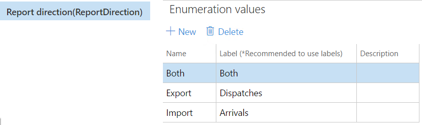</a>

The following illustration shows these details:

<ul>
<li>The <strong>ReportDirection</strong> model enumeration is inserted into a report as a data source, <strong>$Direction</strong>.</li>
<li>An ER expression, <strong>$IsArrivals</strong>, is designed to use the model enumeration as a parameter of this function. The value of this expression is <strong>TRUE</strong>.</li>
</ul>
<a href="./media/ER-data-model-enumeration-usage.PNG">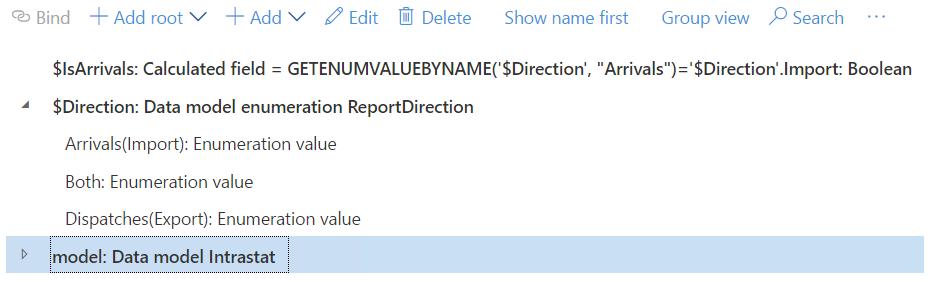</a></td>
</tr>
</tbody>
</table>

### Data conversion functions

| Function | Description | Example |
|----------|-------------|---------|
| TEXT (input) | Return the specified input after it has been converted to a text string that is formatted according to the server locale settings of the current Finance and Operations instance. For values of the **real** type, the string conversion is limited to two decimal places. | If the Finance and Operations instance server locale is defined as **EN-US**, **TEXT (NOW ())** returns the current Finance and Operations session date, December 17, 2015, as the text string **"12/17/2015 07:59:23 AM"**. **TEXT (1/3)** returns **"0.33"**. |
| QRCODE (string) | Return a QR code image in base64 binary format for the specified string. | **QRCODE ("Sample text")** returns **U2FtcGxlIHRleHQ=**. |

### Data collection functions

| Function | Description | Example |
|----------|-------------|---------|
| FORMATELEMENTNAME () | Return the name of the current format's element. Return an empty string when the **Collect output details** flag of the current files is turned off. | To learn more about how to use this function, see the **ER Use data of format output for counting and summing** task guide, which is part of the **Acquire/Develop IT service/solution components** business process. |
| SUMIFS (key string for summing, criteria range1 string, criteria value1 string \[, criteria range2 string, criteria value2 string, …\]) | Return the sum of values of XML nodes (where the name is defined as a key) that has been collected during execution of the format, and that satisfies the specified conditions (pairs of ranges and values). Return a **0** (zero) value when the **Collect output details** flag of the current files is turned off. | |
| SUMIF (key string for summing, criteria range string, criteria value string) | Return the sum of values of XML nodes (where the name is defined as a key) that has been collected during execution of the format, and that satisfies the specified condition (range and value). Return a **0** (zero) value when the **Collect output details** flag of the current files is turned off. | |
| COUNTIFS (criteria range1 string, criteria value1 string \[, criteria range2 string, criteria value2 string, …\]) | Return the number of XML nodes that has been collected during execution of the format, and that satisfies the specified conditions (pairs of ranges and values). Return a **0** (zero) value when the **Collect output details** flag of the current files is turned off. | |
| COUNTIF (criteria range string, criteria value string) | Return number of XML nodes that has been collected during execution of the format, and that satisfies the entered condition (range and value). Return a **0** (zero) value the flag **Collect output details** flag of the current files is turned off. | |
| COLLECTEDLIST (criteria range1 string, criteria value1 string \[, criteria range2 string, criteria value2 string, …\]) | Return the list of values of XML nodes of XML that has been collected during execution of the format, and that satisfies the entered conditions (range and value). Return an empty list when the **Collect output details** flag of the current files is turned off. | |

### Other (business domain–specific) functions

| Function | Description | Example |
|----------|-------------|---------|
| CONVERTCURRENCY (amount, source currency, target currency, date, company) | Convert the specified monetary amount from the specified source currency to the specified target currency by using the settings of the specified Finance and Operations company on the specified date. | **CONVERTCURRENCY (1, "EUR", "USD", TODAY(), "DEMF")** returns the equivalent of one euro in US dollars on the current session date, based on settings for the DEMF company. |
| ROUNDAMOUNT (number, decimals, round rule) | Round the specified amount to the specified number of decimal places according to the specified rounding rule.<blockquote>[!NOTE] The rounding rule must be specified as a value of the Finance and Operations <strong>RoundOffType</strong> enumeration.</blockquote> | If the **model.RoundOff** parameter is set to **Downward**, **ROUNDAMOUNT (1000.787, 2, model.RoundOff)** returns the value **1000.78**. If the **model.RoundOff** parameter is set to either **Normal** or **Rounding-up**, **ROUNDAMOUNT (1000.787, 2, model.RoundOff)** returns the value **1000.79**. |
| CURCredRef (digits) | Return a creditor reference, based on the digits of the specified invoice number. | **CURCredRef ("VEND-200002")** returns **"2200002"**. |
| MOD\_97 (digits) | Return a creditor reference as a MOD97 expression, based on the digits of the specified invoice number. | **MOD\_97 ("VEND-200002")** returns **"20000285"**. |
| ISOCredRef (digits) | Return an International Organization for Standardization (ISO) creditor reference, based on the digits and alphabetic symbols of the specified invoice number.<blockquote>[!NOTE] To eliminate symbols from alphabets that aren't ISO-compliant, the input parameter must be translated before it's passed to this function.</blockquote> | **ISOCredRef ("VEND-200002")** returns **"RF23VEND-200002"**. |
| CN\_GBT\_AdditionalDimensionID (string, number) | Get the additional financial dimension ID. Dimensions are represented in this string as IDs that are separated by commas. In this string, numbers define the sequence code of the requested dimension. | **CN\_GBT\_AdditionalDimensionID ("AA,BB,CC,DD,EE,FF,GG,HH",3)** returns **"CC"**. |
| GetCurrentCompany () | Return a text representation of the code for the legal entity (company) that a user is currently signed in to. | **GETCURRENTCOMPANY ()** returns **USMF** for a user who is signed in to the **Contoso Entertainment System USA** company in Finance and Operations. |
| CH\_BANK\_MOD\_10 (digits) | Return a creditor reference as an MOD10 expression, based on the digits of the specified invoice number. | **CH\_BANK\_MOD\_10 ("VEND-200002")** returns **3**. |
| FA\_SUM (fixed asset code, value model code, start date, end date) | Return the prepared data container of the fixed asset amount for the specified period. | **FA\_SUM ("COMP-000001", "Current", Date1, Date2)** returns the prepared data container of fixed asset **"COMP-000001"** that has the **"Current"** value model for a period from **Date1** to **Date2**. |
| FA\_BALANCE (fixed asset code, value model code, reporting year, reporting date) | Return the prepared data container of the fixed asset balance. The reporting year must be specified as a value of the **AssetYear** enumeration in Finance and Operations. | **FA\_SUM ("COMP-000001", "Current", AxEnumAssetYear.ThisYear, SESSIONTODAY ())** returns the prepared data container of balances for fixed asset **"COMP-000001"** that has the **"Current"** value model on the current Finance and Operations session date. |
| TABLENAME2ID (string) | Return an integer representation of a table ID for the specified table name. | **TABLENAME2ID ("Intrastat")** returns **1510**. |
| ISVALIDCHARACTERISO7064 (string) | Return the Boolean value **TRUE** when the specified string represents a valid international bank account number (IBAN). Otherwise, return the Boolean value **FALSE**. | **ISVALIDCHARACTERISO7064 ("AT61 1904 3002 3457 3201")** returns **TRUE**. **ISVALIDCHARACTERISO7064 ("AT61")** returns **FALSE**. |

### Functions list extension

ER lets you extend the list of functions that are used in ER expressions. Some engineering effort is required. For detailed information, see [Extending the list of Electronic reporting functions](general-electronic-reporting-formulas-list-extension.md).

## See also

[Electronic Reporting overview](general-electronic-reporting.md)

[Extend the list of Electronic reporting (ER) functions](general-electronic-reporting-formulas-list-extension.md)
