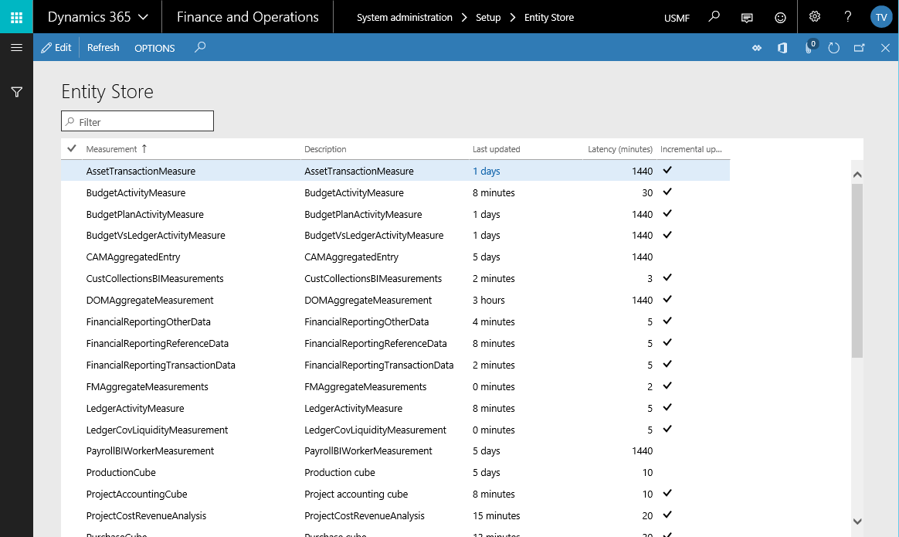

---
# required metadata

title: Incremental refresh option for entity store models
description: Incremental refresh is an option for updating entity store models in response to changes in objects referenced by the model.
author: tjvass
manager: AnnBe
ms.date: 04/09/2018
ms.topic: article
ms.prod: 
ms.service: dynamics-ax-applications
ms.technology: 

# optional metadata

# ms.search.form:
# ROBOTS:
audience: IT Pro
# ms.devlang: 
ms.reviewer: sericks
ms.search.scope: Operations
# ms.tgt_pltfrm: 
# ms.custom:
ms.search.region: Global
# ms.search.industry:
ms.author: tjvass
ms.search.validFrom: 2018-3-31 
ms.dyn365.ops.version: Platform update 16
---

# Incremental refresh option for entity store models

[!include[banner](../includes/banner.md)]

[!include[banner](../includes/pre-release.md)] 

## What are entity store models?
Entity store models are used in Microsoft Dynamics 365 for Finance and Operations to provide customers with accessible views of business data for reporting and analytical tools. Delivered as part of the application metadata, entity store models can be described as collections of data sets and relationships associated with a particular business process. Models often contain a root data source and a series of related views that are useful in analyzing business activities and performance. 

For instance, customer collections and ledger activity are examples of business processes that require an entity store model for reporting and analytics. Defined in the application metadata using aggregate measurements, these views are designed to be the source of data for high-volume consumers like visualizations that are embedded in dashboards and electronic reports.

The entity store functions as an intermediary cache between the Finance and Operations transactional database and the published end-points consumed by external reporting and analytical tooling like Excel or Power BI.com. Entity store ensures the memory consumed by reporting and monitoring solutions do not interfere with resources supporting active user sessions in the web application. The cloud-hosted service automatically updates entity store models based on a refresh schedule managed by the system administrator. 

The following diagram illustrates the management of business data for reporting and analytics tooling.

 

Within the customer collections model, you'll find a group of data sets that provide views relevant to a person within a business responsible for tracking outstanding customer debts. These views provide advanced calculations and aggregations known as **Measures** that you can pivot on category fields referred to as **Dimensions**. For example, the application suite provides an entity store model for customer collections agents that can be used to visualize the aging buckets of customers. Because the data is sourced from the entity store, reports bound to this model can visualize the data in milliseconds instead of waiting minutes for the data to be processed in the transactional database. For more information about the entity store, see [Overview of Power BI integration with entity store](power-bi-integration-entity-store.md).

## Managing entity store models
By channeling reporting and analytical queries to the entity store, system administrators can control the time accuracy of the data. For some data analytics scenarios, data that is delayed by 5-10 minutes will be acceptable by users. However, for other types of reporting experiences, customers require near real-time results. It's important to understand time requirements associated with the data before rolling out a refresh strategy for entity store models.

System administrators use built-in tooling to manage the frequency at which entity store models are refreshed with the latest updates available in the transactional database. Finance and Operations supports both a full and incremental synchronization strategy that can be used to keep models up to date.

- **Full synchronization** - Existing data in the entity store is deleted and the entire model is calculated and materialized during the background process.

- **Incremental refresh** - Updates to the transactional database, including object deletes, are synchronized with the entity store models.

### Full synchronization
While full synchronization ensures that all aspects of an entity store model are refreshed, the process could take several minutes for large data sets. For this reason, it's recommended that full-refresh operations are only performed during non-business hours where possible.

### Incremental refresh
Incremental refresh, available starting in Platform update 16, is an option for updating entity store models in response to changes in objects referenced by the model. These are changes to root attributes within a model that are detected by the delta processing engine during an entity store refresh. This includes entity store model collections that can be uniquely identified using a field reference. System administrators can use the entity store management tooling provided with Finance and Operations to identify entity store models supported by the incremental delta detection logic.

> [!Note]
> We recommend that you occasionally perform a full synchronization for all models, including those that take advantage of the incremental refresh option, to ensure all details of the model are up to date.

## Can I have an entity store model that uses both incremental and full-refresh? 
Not at this time. We are currently working to expand the collection of aggregate data modelling patterns supported by the incremental refresh process. Enhancements will be delivered routinely as part of future platform updates.

Here's a screenshot of the entity store model administration experience using incremental refresh options.

 

System administrators use the entity store model management page to define the schedule for synchronizing data with the Finance and Operations transactional database. For more information about using the entity store administration tools, see [Scheduling entity store model updates](aggregate-measurements-refreshed-incrementally.md).
