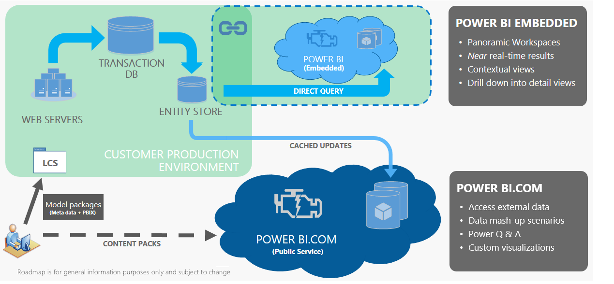

---
# required metadata

title: Power BI Embedded integration
description: Power BI content that partners and ISVs develop can be embedded directly into the application. This topic describes some of the ways that you can use the Power BI Embedded integration.
author: TJVass
manager: AnnBe
ms.date: 07/26/2017
ms.topic: article
ms.prod: 
ms.service: dynamics-ax-platform
ms.technology: 

# optional metadata

# ms.search.form: 
# ROBOTS: 
audience: Developer, IT Pro
# ms.devlang: 
ms.reviewer: sericks
ms.search.scope: Operations, Platform, UnifiedOperations
# ms.tgt_pltfrm: 
ms.custom: 270754
ms.assetid: ca4b2ccf-d68d-4344-833e-1c45d966246c
ms.search.region: Global
# ms.search.industry: 
ms.author: tjvass
ms.search.validFrom: 2017-02-28
ms.dyn365.ops.version: Platform update 4

---

# Power BI Embedded integration

[!include[banner](../includes/banner.md)]

Microsoft Power BI content that partners and independent software vendors (ISVs) developed can be embedded directly into the Microsoft Dynamics 365 for Finance and Operations, Enterprise edition. This topic describes some of the ways that you can use the Microsoft Power BI Embedded integration.

## Overview
The integration of Finance and Operations and [Power BI](http://www.powerbi.com/) enables data mash-up scenarios that require access to external data sources that are supported through Microsoft Power Query for Excel. Users can personalize workspaces by embedding tiles that are hosted on PowerBI.com. Users can also add direct links to reports that are hosted on PowerBI.com. In this way, users can access and interact with the reports without leaving the application. Power BI content (PBIX files) that partners and ISVs develop can be embedded directly into the application. PBIX files that are associated with a model file are automatically published in Power BI Embedded as part of the application deployment process. Additionally, you can add X++ extensions for embedded reporting scenarios that require the following functionality:

- Drill-down navigation into detailed pages in response to user interactions
- Report filters that are based on user and session context information, such as company or date range
- The ability to navigate directly to a specific tab on a Power BI report via menu items

For more information about customizations that use extensions, see [Customization: Overlayering and extensions](../extensibility/customization-overlayering-extensions.md).

## Why might I want to use Power BI Embedded?
Although both Power BI services are available, it's important that you know which service is best suited to target application scenarios. The following illustration shows a comparison of features across services.

 

For more information about the Power BI Embedded service, see the [Power BI Embedded FAQ](https://powerbi.microsoft.com/en-us/documentation/powerbi-frequently-asked-questions/).

## Advantages of Power BI Embedded
- **Deliver Power BI workspaces and reports in the application.** If you're a power user or a business analyst, you can tweak ready-made reports or create new reports by using Power BI tools. As a developer, you can use the reports that your users create to provide rich navigation experiences in the product through workspaces. If you're in the partner and ISV community, you can build rich workspaces that include Power BI experiences, and then release those workspaces as part of your solution.
- **The Power BI Embedded service license is bundled with Finance and Operations.** If you're an ISV or a systems integrator, you can package workspaces that are enabled for Power BI (and navigational experiences that those workspaces provide) as part of a Microsoft Dynamics Lifecyle Services (LCS) solution. Your customers get the same experience without having to have a PowerBI.com subscription. The workspaces just work with Finance and Operations.
- **Enable drill-down into detailed pages from Power BI.** The visuals are the starting point for action. Your users can drill down to business processes and pages to act immediately on issues that they uncover. The visuals let users filter data and uncover trends. Action pages reflect just the set of data that requires attention.
- **Help secure access to Power BI reports by using menu items.** As a developer, you can use familiar programming concepts that are available in Finance and Operations, because we have extended the same concepts to workspaces that are based on Power BI. You can create new workspaces or extend existing workspaces by adding an overview page that is driven by Power BI. Developers can associate menu items with Power BI reports and include them as links in workspaces. The role-based and task-based security in Finance and Operations can be used to help secure these menu items.
- **Filter reports based on application context.** You can build navigation experiences by passing one or more filters to Power BI reports. For example, depending on a user’s actions or context, you can filter the Power BI report to reflect data from one business unit or a specific product. The user doesn't have to filter the data. You can define drill-through links to Finance and Operations pages, so that users can go directly to the transactional details pages.

## Service availability
**The Power BI Embedded service is automatically deployed and configured for all cloud-hosted, multi-box deployments.**  Because the service relies on Microsoft Azure services, application analytical workspaces and reports are unavailable in one-box environments. The Power BI Embedded service is already available in most Azure datacenters. You can check the latest availability on the [Azure status](https://azure.microsoft.com/status/) page.  
 
> [!NOTE]
> The Microsoft Dynamics 365 team is working on a solution that will enable analytical workspaces in one-box environments without requiring that customers host their own instance of the Power BI Embedded service. Watch for announcements on the [Dynamics 365 Roadmap](http://roadmap.dynamics.com) site.
 
## Frequently asked questions

### Can I customize the Power BI embedded reports?
Yes. To customize the Power BI embedded reports, just install Power BI Desktop in a one-box environment, and follow the steps in [Author and distribute Power BI reports with Entity store](author-distribute-power-bi-reports.md).
 
### Do customers have to purchase a separate Power BI license to use the new embedded analytics?
No, customers don't have to purchase a separate Power BI license to use the new embedded analytics. However, a Power BI Pro license is required in order to connect to Entity Store from PowerBI.com by using DirectQuery.
 
### Can I do data mash-ups by using external data in the embedded reports?
No, you can't currently do data mash-ups by using external data in the embedded reports.
 
### Can I help secure data to only those companies that I have access to?
Yes, the single company view prevents users from accessing data from companies that they don’t have access to. For more information about how to help secure custom solutions, see [Help secure analytical workspaces and reports by using Power BI Embedded](secure-analytical-workspaces.md).
 
### How is currency shown across multiple companies?
Currency is shown as a system currency. The system currency is defined on the **System parameters** page in Finance and Operations.
 
### Can I drill from summary balances back into Finance and Operations?
Yes, you can drill into the details on a Power BI report. However, there is limited support for drill-down into Finance and Operations.
 
### What languages are currently supported?
Currently, only English is supported. However, the Power BI team plans to add support for other languages.
 
### Can I access analytical workspaces and reports in the on-premises version of Finance and Operations?
No, you can't currently access analytical workspaces and reports in Microsoft Dynamics 365 for Finance and Operations, Enterprise edition (on-premises). Systems of Intelligence functions rely on cloud-hosted solutions.
