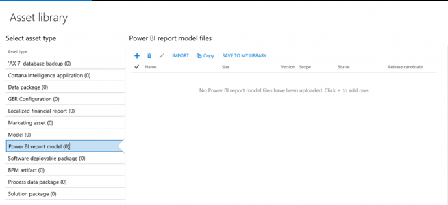
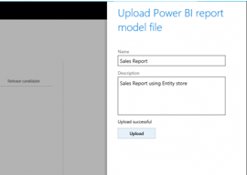
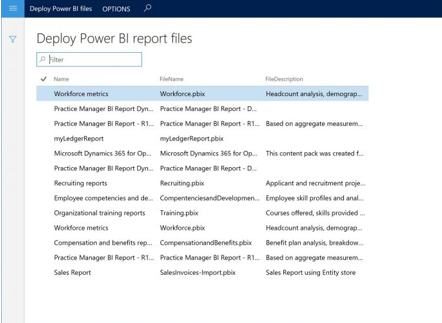

---
# required metadata

title: Publish analytical applications on Power BI 
description: This topic explains how administrators can publish analytical applications on Power BI.
author: TJVass
manager: AnnBe
ms.date: 07/26/2017
ms.topic: article
ms.prod: 
ms.service: dynamics-ax-platform
ms.technology: 

# optional metadata

# ms.search.form: 
# ROBOTS: 
audience: Developer, IT Pro
# ms.devlang: 
ms.reviewer: sericks
ms.search.scope: Operations, Platform
# ms.tgt_pltfrm: 
ms.custom: 265864
ms.assetid: e253a57a-979b-4ca5-8e09-2bfce97395a5
ms.search.region: Global
# ms.search.industry: 
ms.author: TJVass
ms.search.validFrom: 2016-05-31
ms.dyn365.ops.version: Platform update 9

---

# Publish analytical applications on Power BI 

[!include[banner](../includes/banner.md)]

The steps that are described in this topic require administrative privileges in the subscription for Microsoft Dynamics 365 for Finance and Operations, Enterprise edition. When analytical applications are created in the organization, administrators are responsible for deploying them to Microsoft Dynamics Lifecycle Services (LCS) as implementation assets.

After the reports are uploaded to an LCS project, they can be published to production environments. This process represents the Application Lifecycle Management process for transitioning analytical applications from developer environments to production environments.

## Publishing analytical applications to PowerBI.com

Before you continue, make sure that you've verified and packaged your analytical applications into a PBIX file by using Microsoft Power BI Desktop. For information about how to create analytical applications by using the local Entity Store database, see [Author analytical reports by using Power BI Desktop](author-distribute-power-bi-reports.md). When you're ready to promote your solution, follow these steps to publish the analytical applications to PowerBI.com.

### Step 1: Upload the report to LCS

LCS is the tool that is used to migrate development artifacts from developer environments to production environments. LCS supports the migration of PBIX files between environments.

1. From the developer environment, open LCS (<http://lcs.dynamics.com>).
2. If you haven’t already created a project in the LCS environment, create a project.
3. Scroll to the right, and select the **Asset library** tile.

    Notice that, in the Asset library, you can add assets of the **Power BI report model** type (.pbix files) to a project as implementation artifacts.

    

4. Select the plus sign (**+**) to add an asset.
5. Enter a file name and a description.
6. Select **Upload**, and select the file that you saved earlier.

    

7. After the file is uploaded, select **Confirm**.

Notice that the selected file is uploaded to LCS as an implementation asset. LCS supports the management of versions and releases for Power BI reports. You can maintain several versions and publish reports to other environments, as for other implementation artifacts. Because you added the PBIX files as an asset in an LCS project, Finance and Operations environments that are deployed by using that project can access the report.

Optionally, you can publish the report so that all your projects can access the shared assets. If you're a Microsoft partner or an independent software vendor (ISV), and you want to share the report with your customers, you can save it to your global library and let your customers import the asset into their own LCS projects. To save the report to your global library, select the **Save to my library** option.

### Step 2: Deploy the report to a production environment

Your administrator should associate your environment with an LCS project, so that Finance and Operations can consume assets in the project. This step has probably already been performed in your production environment. Start the client from the environment that you want to deploy the Power BI reports to. Typically, this environment is the test instance or a production instance where your report should use a different set of data than the data sets that you worked with as a business analyst. 

1. On the **System parameters** page, select **Help**. 
2. In the **Lifecycle Services help configuration** list, select the LCS project that you uploaded the PBIX file to.
3. Select **Save**. 

> [!NOTE] 
> The page show only the LCS projects that the current user has access to. If an administrator performs this step, either the administrator must have access to the project, or the PBIX artifacts must be imported into a project that the administrator has access to.

1. In the client, select **System Administration** \> **Setup** \> **Deploy Power BI**. You see a list of the file that you uploaded into LCS.

    

2. Select the **Sales Report** file, and then select **Deploy Power BI files**.
3. If you're asked to give consent to publish to the PowerBI.com service, click the link to give consent. After you give consent, you must return to the original browser window and select the **Close** button.

When publication is successful, the Power BI report appears in your PowerBI.com subscription. Notice that the report now points to the Entity Store in the production environment.

## Distribute analytical applications as solution assets

This topic describes how to use LCS to migrate analytical applications from a developer environment to a production environment. Because Power BI reports that are captured as PBIX files are recognized as implementation assets in LCS, you can bundle the reports with other solution assets. If you're interested in making custom solutions available to other people, this functionality offers the following opportunities:

- Amaze customers by creating rich, interactive reports that are released as part of a custom solution.
- Use Power BI to create analytical applications that include semantic models, sample data, and custom visualizations.
- Build and share customized Power BI reports with specific customers.
- Because Power BI reports are available as stand-alone implementation assets, reports can be delivered “out of band” to customers without disrupting services. This functionality enables an iterative creation process, where individuals in an organization can author and enhance reports without requiring a developer.
