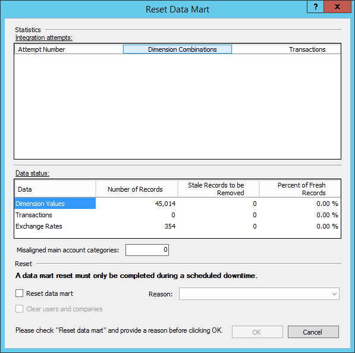

---
# required metadata

title: Reset the Financial reporting data mart for Finance and Operations
description: This topic describes how to reset the Financial reporting data mart for Microsoft Dynamics 365 for Finance and Operations, Enterprise edition.
author: aprilolson
manager: AnnBe
ms.date: 02/07/2018
ms.topic: article
ms.prod: 
ms.service: dynamics-ax-platform
ms.technology: 

# optional metadata

ms.search.form: FinancialReports
# ROBOTS: 
audience: IT Pro
# ms.devlang: 
ms.reviewer: twheeloc
ms.search.scope: Core, Operations
# ms.tgt_pltfrm: 
ms.custom: 261824
ms.search.region: Global
# ms.search.industry: 
ms.author: aolson
ms.search.validFrom: 2016-11-30
ms.dyn365.ops.version: Version 1611

---

# Reset the Financial reporting data mart

[!include[banner](../includes/banner.md)]

This topic explains how to reset the Financial reporting data mart for the following versions of Microsoft Dynamics 365 for Finance and Operations, Enterprise edition:

- Financial reporting release 7.2.6.0 and later
- Financial reporting release 7.0.10000.4 and later
- Microsoft Dynamics 365 for Finance and Operations, Enterprise edition (on-premises)

To get Finance and Operations Financial reporting release 7.2.6.0, you can download KB 4052514 from <https://fix.lcs.dynamics.com/Issue/Resolved?kb=4052514>.

## Reset the Financial reporting data mart for Finance and Operations Financial reporting release 7.2.6.0 and later

### Reset the Financial reporting data mart from Report designer

> [!NOTE]
> The steps in this process are supported for Finance and Operations Financial reporting release 7.2.6.0 and later. If you have an earlier release, contact the Support team for assistance.

To find the version of report designer, watch this video:
> [!Video https://www.youtube.com/embed/icfA5Q3kp4w]

In specific scenarios, you might have to reset the data mart for Financial reporting. You can complete this task in the Report designer client. Here are some scenarios where you might have to reset the data mart:

- The Finance and Operations database was restored, but the data mart database wasn't restored.
- You see incorrect data for a period.
- Support instructs you to reset the data mart as part of a troubleshooting step.

The data mart reset should be done only during times when the amount of processing on the database is small. Financial reporting will be unavailable during the reset process.

#### Reset the data mart

To reset the data mart, in Report designer, on the **Tools** menu, select **Reset Data Mart**. The dialog box that appears has two sections: **Statistics** and **Reset**.

[](./media/Reset-72.jpg)

##### Integration attempts

The **Integration attempts** grid shows how many times the system has tried to integrate transactions. The system continues to try to integrate data over a period of days if the first few attempts aren't successful. You will know that the data mart must be reset is if the number of attempts is 8 or more, and if there are many Dimension combination or Transaction records. In this situation, the data won't be reported on.

##### Data status

The **Data status** grid provides a snapshot of the transactions, exchange rates, and dimension values in the data mart. A large number of stale records indicates that numerous updates to the records have occurred. This situation might cause slower report generation times.

##### Misaligned main account categories

If you're using a release that is earlier than Microsoft Dynamics 365 for Finance and Operations Financial reporting release 7.2.1, you might have to reset the data mart if you rename accounts and move accounts between account categories. These actions can cause main account categories to become misaligned. The **Misaligned main account categories** field shows whether you're experiencing that issue.

### Reset the data mart in Finance and Operations Financial reporting release 7.2.6.0

To reset the data mart in Finance and Operations Financial reporting release 7.2.6.0 and earlier, in the **Reset Data Mart** dialog box, select the **Reset data mart** check box, and then select **OK**. You should reset the data mart only during scheduled downtime.

[](./media/Reset-72.jpg)

### Reset the data mart and select a reason in Microsoft Dynamics 365 for Finance and Operations Financial reporting release 7.3.0

If you determine that a data mart reset is required, select the **Reset data mart** check box, and then select a reason in the **Reason** field. The following options are available:

- **Missing or incorrect data** – Based on the statistics, you've determined that data might be missing. Before you continue, we recommend that you work with Support to determine the root cause.
- **Restore database** – The Finance and Operations database was restored, but the database for the Financial reporting data mart wasn't restored.
- **Other** – You're resetting the data mart for another reason. If you're concerned that there is an issue, contact Support to identify it.

[](./media/Integration.png)

> [!NOTE]
> Verify that all data mart reset tasks have completed an initial load before you begin a reset. You can confirm this by looking for a value in the Last Runtime column by selecting **Tools** &gt; **Integration status**.

#### Clear users and companies

Select the **Clear users and companies** check box if you restored your database, but you then made changes to users or companies. You should rarely have to select this check box.

When you're ready to start the reset process, select **OK**. You're prompted to confirm that you're ready to start the process. Note that Financial reporting won't be available during the reset and the initial data integration that occurs afterward.

If you want to review the status of the integration, select **Tools** &gt; **Integration status** to see the last time that the integration was run and the status.

[](./media/New-integration.PNG)

> [!NOTE]
> The reset is finished when all mappings show the status of RanToCompletion and the Integration Status window says “Integration complete” in the bottom-left corner.

## Reset the Financial reporting data mart for Finance and Operations Financial reporting release 7.0.10000.4 and later

If you ever restore your Finance and Operations database from a backup or copy the database from another environment, you must follow the steps in this section to help guarantee that the Financial reporting data mart correctly uses the restored Finance and Operations database.

> [!NOTE]
> The steps in this process are supported for Microsoft Dynamics AX application version 7.0.1 (May 2016) (application build 7.0.1265.23014 and Financial reporting build 7.0.10000.4) and later. If you have an earlier version of Finance and Operations, contact Support for assistance.

### Export report definitions

First, follow these steps to export the report designs from Report designer.

1. In Report designer, select **Company** &gt; **Building Block Groups**.
2. Select the building block group to export, and then select **Export**.

    > [!NOTE]
    > For Finance and Operations, only one building block group is supported, **Default**.

3. Select the report definitions to export:

    - To export all your report definitions and the associated building blocks, select **Select All**.
    - To export specific reports, rows, columns, trees, or dimension sets, select the appropriate tab, and then select the items to export. Press and hold the Ctrl key to select multiple items on a tab. When you select reports to export, the associated rows, columns, trees, and dimension sets are selected.

4. Select **Export**.
5. Enter a file name, and select a secure location where you want to save the exported report definitions.
6. Select **Save**.

You can copy or upload the file to a secure location. In this way, the file can be imported into a different environment later. For information about how to use a Microsoft Azure storage account, see [Transfer data with the AzCopy Command-Line Utility](/azure/storage/storage-use-azcopy).

> [!NOTE]
> Microsoft doesn't provide a storage account as part of your Finance and Operations agreement. You must either purchase a storage account or use a storage account from a separate Azure subscription.

> [!WARNING]
> Be aware of the behavior of drive D on Azure virtual machines (VMs). Don't permanently store your exported building block groups on drive D. For more information about temporary drives, see [Understanding the temporary drive on Windows Azure Virtual Machines](https://blogs.msdn.microsoft.com/mast/2013/12/06/understanding-the-temporary-drive-on-windows-azure-virtual-machines/).

### Stop services

The following Microsoft Windows services will have open connections to the Finance and Operations database. Therefore, you must use Microsoft Remote Desktop to connect to all the computers in the environment and then use services.msc to stop these services.

- World wide web publishing service (on all Application Object Servers [AOS] computers)
- Microsoft Dynamics 365 for Finance and Operations Batch Management Service (on non-private AOS computers only)
- Management Reporter 2012 Process Service (on Business intelligence [BI] computers only)

### Reset

#### Download the latest MinorVersionDataUpgrade.zip package

Download the latest MinorVersionDataUpgrade.zip package. For instructions about how to find and download the correct version of the data upgrade package, see the[Select the correct data upgrade deployable package](..\migration-upgrade\upgrade-data-to-latest-update.md#select-the-correct-data-upgrade-deployable-package). 

An upgrade isn't required in order to download the MinorVersionDataUpgrade.zip package. Therefore, you just have follow the steps in the "Download the latest data upgrade deployable package" section of that topic. You can skip all the other steps in the topic.

#### Run scripts against the Finance and Operations database

Run the following scripts against the Finance and Operations database (not against the Financial reporting database):

- DataUpgrade.zip\\AosService\\Scripts\\ConfigureAxReportingIntegration.sql
- DataUpgrade.zip\\AosService\\Scripts\\GrantAzViewChangeTracking.sql

These scripts help guarantee that the users, roles, and change tracking settings are correct.

#### Run a Windows PowerShell command to reset the database

On the AOS computer, start Microsoft Windows PowerShell as an administrator, and run the following commands to reset the integration between Finance and Operations and Financial reporting.

```
F:
cd F:\MRApplicationService\MRInstallDirectory
Import-Module .\Server\MRDeploy\MRDeploy.psd1
Reset-DatamartIntegration -Reason OTHER -ReasonDetail "<reason for resetting>" -SkipMRTableReset
```
 > [!NOTE]
 > SkipMRTableReset preserves tree unit security if you are using it. 
  - If you get an error that a parameter cannot be found that matches SkipMRTableReset, you can remove the parameter and try again (later versions have updated the default behavior to include this switch).


Here is an explanation of the parameters in the **Reset-DatamartIntegration** command:

- The valid values for **-Reason** are **SERVICING**, **BADDATA**, and **OTHER**.
- The **-ReasonDetail** parameter is free text.
- The reason and reason detail will be recorded in telemetry/environment monitoring.

> [!NOTE]
> After you run the commands, you will be asked to enter **Y** to confirm that you want to reset the database.

#### Restart services

Use services.msc to restart the services that you stopped earlier:

- World wide web publishing service (on all AOS computers)
- Microsoft Dynamics 365 for Finance and Operations Batch Management Service (on non-private AOS computers only)
- Management Reporter 2012 Process Service (on BI computers only)

#### Import report definitions

Import your report designs from Report designer by using the file that was created during the export.

1. In Report designer, select **Company** &gt; **Building Block Groups**.
2. Select the building block group to export, and then select **Export**.

    > [!NOTE]
    > For Finance and Operations, only one building block group is supported, **Default**.

3. Select the **Default** building block, and then select **Import**.
4. Select the file that contains the exported report definitions, and then select **Open**.
5. In the **Import** dialog box, select the report definitions to import:

    - To import all the report definitions and the associated building blocks, select **Select All**.
    - To import specific reports, rows, columns, trees, or dimension sets, select the reports, rows, columns, trees, or dimension sets to import.

6. Select **Import**.

## Reset the Financial reporting data mart for Finance and Operations (on-premises)

1. Instruct all users to exit Report designer and the Financial reporting area of Finance and Operations.
2. Run the following script against the Financial reporting database (MRDB).

    ```
    DECLARE @triggerIds table(id uniqueidentifier, taskTypeId uniqueidentifier)
    INSERT INTO @triggerIds SELECT tr.[Id], tt.[Id]
    FROM [Scheduling].[Task] t with(nolock)
    JOIN [Scheduling].[Trigger] tr ON t.[TriggerId] = tr.[Id]
    JOIN [Scheduling].[TaskState] ts ON ts.[TaskId] = t.[Id]
    LEFT JOIN [Scheduling].[TaskCategory] tc ON tc.[Id] = t.[CategoryId]
    JOIN [Scheduling].[TaskType] tt ON t.[TypeId] = tt.[Id]
    WHERE tt.[Id] IN ('D81C1197-D486-4FB7-AF8C-078C110893A0', '55D3F71A-2618-4EAE-9AA6-D48767B974D8') -- 'Maintenance Task', 'Map Task'
    PRINT 'Disable integration tasks'
    UPDATE [Scheduling].[Trigger] SET IsEnabled = 0 WHERE [Id] in (SELECT id FROM @triggerIds)
    ```

3. Truncate or delete all records from the FINANCIALREPORTS table in the Finance and Operations database (AXDB).
4. Truncate or delete all records from the FINANCIALREPORTVERSION table, if this table exists in the Finance and Operations database. If the table doesn't exist in the Finance and Operations database, skip this step.
5. Run the **ResetDatamart.sql** script against the Financial reporting database. This script disables the data mart integration, deletes all the data mart data, and then reenables the data mart integration.

    ```
    DECLARE @triggerIds table(id uniqueidentifier, taskTypeId uniqueidentifier)
    INSERT INTO @triggerIds SELECT tr.[Id], tt.[Id]
    FROM [Scheduling].[Task] t with(nolock)
    JOIN [Scheduling].[Trigger] tr ON t.[TriggerId] = tr.[Id]
    JOIN [Scheduling].[TaskState] ts ON ts.[TaskId] = t.[Id]
    LEFT JOIN [Scheduling].[TaskCategory] tc ON tc.[Id] = t.[CategoryId]
    JOIN [Scheduling].[TaskType] tt ON t.[TypeId] = tt.[Id]
    WHERE tt.[Id] IN ('D81C1197-D486-4FB7-AF8C-078C110893A0', '55D3F71A-2618-4EAE-9AA6-D48767B974D8') -- 'Maintenance Task', 'Map Task'
    PRINT 'Disable integration tasks'
    UPDATE [Scheduling].[Trigger] SET IsEnabled = 0 WHERE [Id] in (SELECT id FROM @triggerIds)
    ------------------------------
    PRINT 'Drop archive tables'
    ------------------------------
    DECLARE @tableId nvarchar(max)
    DECLARE dropCursor CURSOR LOCAL FAST_FORWARD FOR
    SELECT Id FROM [Datamart].Archive
    OPEN dropCursor
    FETCH NEXT FROM dropCursor INTO @tableId
    WHILE @@FETCH_STATUS = 0
    BEGIN
        IF EXISTS (SELECT 1 FROM INFORMATION_SCHEMA.TABLES t WHERE t.TABLE_NAME = 'FactStaging' + @tableId and t.TABLE_SCHEMA = 'Datamart')
        EXEC('DROP TABLE [Datamart].FactStaging' + @tableId)
        IF EXISTS (SELECT 1 FROM INFORMATION_SCHEMA.TABLES t WHERE t.TABLE_NAME = 'DimensionCombinationStaging' + @tableId and t.TABLE_SCHEMA = 'Datamart')
        EXEC('DROP TABLE [Datamart].DimensionCombinationStaging' + @tableId)
        FETCH NEXT FROM dropCursor INTO @tableId
    END
    CLOSE dropCursor
    DEALLOCATE dropCursor
    IF EXISTS (SELECT 1 FROM INFORMATION_SCHEMA.TABLES t WHERE t.TABLE_NAME = 'DimensionCombinationProcessing' and t.TABLE_SCHEMA = 'Datamart')
        EXEC('DROP TABLE [Datamart].DimensionCombinationProcessing')
    ------------------------------
    PRINT 'Begin Truncating tables'
    ------------------------------
    DECLARE @tablename nvarchar(200)
    DECLARE @schemaname nvarchar(200)
    DECLARE clear_tables CURSOR
        FOR SELECT TABLE_NAME, TABLE_SCHEMA FROM INFORMATION_SCHEMA.TABLES WHERE TABLE_SCHEMA = 'Datamart' AND TABLE_TYPE='BASE TABLE'
    PRINT 'remove check constraints'
    OPEN clear_tables
    FETCH NEXT FROM clear_tables INTO @tablename, @schemaname
    WHILE @@FETCH_STATUS = 0
    BEGIN
        IF @tablename <> 'VersionHistory'
        BEGIN
        EXEC('ALTER TABLE [' + @schemaname + '].[' + @tablename + '] NOCHECK CONSTRAINT ALL')
        END
        FETCH NEXT FROM clear_tables INTO @tablename, @schemaname
    END
    CLOSE clear_tables
    ------------------------------
    PRINT 'delete data from tables and rebuild indexes'
    ------------------------------
    OPEN clear_tables
    FETCH NEXT FROM clear_tables INTO @tablename, @schemaname
    WHILE @@FETCH_STATUS = 0
    BEGIN
        IF @tablename <> 'VersionHistory'
        BEGIN
            IF(EXISTS (select TOP 1 1 from sys.foreign_keys where referenced_object_id = OBJECT_ID(@schemaname + '.' + @tablename)) OR
            EXISTS(SELECT TOP 1 1 FROM sys.sql_expression_dependencies sed
            INNER JOIN sys.objects o ON sed.referencing_id = o.[object_id]
            WHERE o.[type] = 'V' 
            AND referenced_schema_name = @schemaname
            AND referenced_entity_name = @tablename))
            BEGIN
            PRINT 'deleting from ' + @tablename
            EXEC('DELETE FROM [' + @schemaname + '].[' + @tablename + ']')
            END
            ELSE
            BEGIN
            PRINT 'truncating from ' + @tablename
            EXEC('TRUNCATE TABLE [' + @schemaname + '].[' + @tablename + ']')
            END
        END
        EXEC('ALTER INDEX ALL ON [' + @schemaname + '].[' + @tablename + '] REBUILD')
        FETCH NEXT FROM clear_tables INTO @tablename, @schemaname
    END
    CLOSE clear_tables
    ------------------------------
    PRINT 'reenable check constraints'
    ------------------------------
    OPEN clear_tables
    FETCH NEXT FROM clear_tables INTO @tablename, @schemaname
    WHILE @@FETCH_STATUS = 0
    BEGIN
        IF @tablename <> 'VersionHistory'
        BEGIN
        EXEC('ALTER TABLE [' + @schemaname + '].[' + @tablename +'] WITH CHECK CHECK CONSTRAINT ALL')
        END
        FETCH NEXT FROM clear_tables INTO @tablename, @schemaname
    END
    CLOSE clear_tables
    DEALLOCATE clear_tables
    ------------------------------
    PRINT 'Complete Truncating tables'
    ------------------------------
    ------------------------------
    PRINT 'Remove indexes from DimensionCombination'
    ------------------------------
    DECLARE @indexname nvarchar(200)
    DECLARE drop_indexes CURSOR
    FOR SELECT Name FROM sys.indexes WHERE object_id = OBJECT_ID('[Datamart].[DimensionCombination]') AND is_primary_key = 0
    OPEN drop_indexes
    FETCH NEXT FROM drop_indexes INTO @indexname
    WHILE @@FETCH_STATUS = 0
    BEGIN
        EXEC('DROP INDEX [' + @indexname + '] on [Datamart].[DimensionCombination]')
        FETCH NEXT FROM drop_indexes INTO @indexname
    END
    CLOSE drop_indexes
    DEALLOCATE drop_indexes
    ------------------------------
    PRINT 'Drop Columns on DimensionCombination'
    ------------------------------
    DECLARE @objectname nvarchar(200)
    DECLARE drop_objects CURSOR
    FOR SELECT Name FROM sys.columns WHERE object_id = OBJECT_ID('[Datamart].[DimensionCombination]')
    OPEN drop_objects
    FETCH NEXT FROM drop_objects INTO @objectname
    WHILE @@FETCH_STATUS = 0
    BEGIN
        IF @objectname NOT IN ('Id', 'Description', 'SourceKey', 'OrganizationId', 'InactiveDimensions')
        BEGIN
        EXEC('ALTER TABLE [Datamart].[DimensionCombination] DROP COLUMN ' + @objectname)
        END
        FETCH NEXT FROM drop_objects INTO @objectname
    END
    CLOSE drop_objects
    DEALLOCATE drop_objects
    ------------------------------
    PRINT 'Drop Columns on DimensionCombinationResolving'
    ------------------------------
    DECLARE drop_objects CURSOR
    FOR SELECT Name FROM sys.columns WHERE object_id = OBJECT_ID('[Datamart].[DimensionCombinationResolving]')
    OPEN drop_objects
    FETCH NEXT FROM drop_objects INTO @objectname
    WHILE @@FETCH_STATUS = 0
    BEGIN
        IF @objectname NOT IN ('Id', 'Description', 'SourceKey', 'OrganizationId')
        BEGIN
        EXEC('ALTER TABLE [Datamart].[DimensionCombinationResolving] DROP COLUMN ' + @objectname)
        END
        FETCH NEXT FROM drop_objects INTO @objectname
    END
    CLOSE drop_objects
    DEALLOCATE drop_objects
    ------------------------------
    PRINT 'Drop Columns on DimensionCombinationStaging'
    ------------------------------
    DECLARE drop_objects CURSOR
    FOR SELECT Name FROM sys.columns WHERE object_id = OBJECT_ID('[Datamart].[DimensionCombinationStaging]')
    OPEN drop_objects
    FETCH NEXT FROM drop_objects INTO @objectname
    WHILE @@FETCH_STATUS = 0
    BEGIN
        IF @objectname NOT IN ('Id', 'OrganizationId', 'Description', 'SourceKey', 'OrganizationKey', 'FreshnessDate')
        BEGIN
        EXEC('ALTER TABLE [Datamart].[DimensionCombinationStaging] DROP COLUMN ' + @objectname)
        END
        FETCH NEXT FROM drop_objects INTO @objectname
    END
    CLOSE drop_objects
    DEALLOCATE drop_objects
    ------------------------------
    PRINT 'Drop Columns on DimensionCombinationUnreferenced'
    ------------------------------
    DECLARE drop_objects CURSOR
    FOR SELECT Name FROM sys.columns WHERE object_id = OBJECT_ID('[Datamart].[DimensionCombinationUnreferenced]')
    OPEN drop_objects
    FETCH NEXT FROM drop_objects INTO @objectname
    WHILE @@FETCH_STATUS = 0
    BEGIN
        IF @objectname NOT IN ('Id', 'Description', 'SourceKey', 'OrganizationId')
        BEGIN
        EXEC('ALTER TABLE [Datamart].[DimensionCombinationUnreferenced] DROP COLUMN ' + @objectname)
        END
        FETCH NEXT FROM drop_objects INTO @objectname
    END
    CLOSE drop_objects
    DEALLOCATE drop_objects
    ------------------------------
    PRINT 'Drop Columns on DimensionValueAttributeValue'
    ------------------------------
    DECLARE drop_objects CURSOR
    FOR SELECT Name FROM sys.columns WHERE object_id = OBJECT_ID('[Datamart].[DimensionValueAttributeValue]')
    OPEN drop_objects
    FETCH NEXT FROM drop_objects INTO @objectname
    WHILE @@FETCH_STATUS = 0
    BEGIN
        IF @objectname NOT IN ('DimensionValueId')
        BEGIN
        EXEC('ALTER TABLE [Datamart].[DimensionValueAttributeValue] DROP COLUMN ' + @objectname)
        END
        FETCH NEXT FROM drop_objects INTO @objectname
    END
    CLOSE drop_objects
    DEALLOCATE drop_objects
    ------------------------------
    PRINT 'Drop Columns on FactAttributeValue'
    ------------------------------
    DECLARE drop_objects CURSOR
    FOR SELECT Name FROM sys.columns WHERE object_id = OBJECT_ID('[Datamart].[FactAttributeValue]')
    OPEN drop_objects
    FETCH NEXT FROM drop_objects INTO @objectname
    WHILE @@FETCH_STATUS = 0
    BEGIN
        IF @objectname NOT IN ('FactId')
        BEGIN
        EXEC('ALTER TABLE [Datamart].[FactAttributeValue] DROP COLUMN ' + @objectname)
        END
        FETCH NEXT FROM drop_objects INTO @objectname
    END
    CLOSE drop_objects
    DEALLOCATE drop_objects
    ------------------------------
    PRINT 'Remove constraints from TranslatedPeriodBalance'
    ------------------------------
    DECLARE @name nvarchar(200)
    DECLARE drop_constraints CURSOR
    FOR SELECT Name FROM sys.default_constraints WHERE parent_object_id = OBJECT_ID('[Datamart].[TranslatedPeriodBalance]')
    OPEN drop_constraints
    FETCH NEXT FROM drop_constraints INTO @name
    WHILE @@FETCH_STATUS = 0
    BEGIN
        EXEC('ALTER TABLE [Datamart].[TranslatedPeriodBalance] DROP CONSTRAINT [' + @name + ']')
        FETCH NEXT FROM drop_constraints INTO @name
    END
    CLOSE drop_constraints
    DEALLOCATE drop_constraints
    ------------------------------
    PRINT 'Drop Columns on TranslatedPeriodBalance'
    ------------------------------
    DECLARE drop_objects CURSOR
    FOR SELECT Name FROM sys.columns WHERE object_id = OBJECT_ID('[Datamart].[TranslatedPeriodBalance]')
    OPEN drop_objects
    FETCH NEXT FROM drop_objects INTO @objectname
    WHILE @@FETCH_STATUS = 0
    BEGIN
        IF @objectname NOT IN ('PeriodId', 'DimensionsId', 'ScenarioId', 'FactType', 'PostingLayerId')
        BEGIN
        EXEC('ALTER TABLE [Datamart].[TranslatedPeriodBalance] DROP COLUMN ' + @objectname)
        END
        FETCH NEXT FROM drop_objects INTO @objectname
    END
    CLOSE drop_objects
    DEALLOCATE drop_objects
    ------------------------------
    PRINT 'Remove constraints from TranslatedPeriodBalanceChanges'
    ------------------------------
    DECLARE drop_constraints CURSOR
    FOR SELECT Name FROM sys.default_constraints WHERE parent_object_id = OBJECT_ID('[Datamart].[TranslatedPeriodBalanceChanges]')
    OPEN drop_constraints
    FETCH NEXT FROM drop_constraints INTO @name
    WHILE @@FETCH_STATUS = 0
    BEGIN
        EXEC('ALTER TABLE [Datamart].[TranslatedPeriodBalanceChanges] DROP CONSTRAINT [' + @name + ']')
        FETCH NEXT FROM drop_constraints INTO @name
    END
    CLOSE drop_constraints
    DEALLOCATE drop_constraints
    ------------------------------
    PRINT 'Drop Columns on TranslatedPeriodBalanceChanges'
    ------------------------------
    DECLARE drop_objects CURSOR
    FOR SELECT Name FROM sys.columns WHERE object_id = OBJECT_ID('[Datamart].[TranslatedPeriodBalanceChanges]')
    OPEN drop_objects
    FETCH NEXT FROM drop_objects INTO @objectname
    WHILE @@FETCH_STATUS = 0
    BEGIN
        IF @objectname NOT IN ('PeriodId', 'DimensionsId', 'ScenarioId', 'FactType', 'PostingLayerId')
        BEGIN
        EXEC('ALTER TABLE [Datamart].[TranslatedPeriodBalanceChanges] DROP COLUMN ' + @objectname)
        END
        FETCH NEXT FROM drop_objects INTO @objectname
    END
    CLOSE drop_objects
    DEALLOCATE drop_objects
    -- Rebuild dropped indexes that are dynamic
    EXEC [Datamart].ConfigureIndexesAndConstraints
    ------------------------------------------
    ------------------------------------------
    PRINT 'Reset the map tokens'
    UPDATE [Connector].[Map] SET InitalLoad = 0, ReaderToken=NULL, LastQuerySuccess='1900-01-01' WHERE MapId IN (SELECT t.[Id]
    FROM [Scheduling].[Task] t with(nolock)
    JOIN [Scheduling].[Trigger] tr ON t.[TriggerId] = tr.[Id]
    JOIN [Scheduling].[TaskState] ts ON ts.[TaskId] = t.[Id]
    LEFT JOIN [Scheduling].[TaskCategory] tc ON tc.[Id] = t.[CategoryId]
    JOIN [Scheduling].[TaskType] tt ON t.[TypeId] = tt.[Id]
    WHERE tt.[Id] = '55D3F71A-2618-4EAE-9AA6-D48767B974D8')
    PRINT 'Reset the tasks'
    UPDATE [Scheduling].[TaskState] SET StateType = 0, Progress = 0.0, LastRunTime = NULL, NextRunTime = NULL WHERE TaskId IN (SELECT ts.[TaskId]
    FROM [Scheduling].[Task] t with(nolock)
    JOIN [Scheduling].[Trigger] tr ON t.[TriggerId] = tr.[Id]
    JOIN [Scheduling].[TaskState] ts ON ts.[TaskId] = t.[Id]
    LEFT JOIN [Scheduling].[TaskCategory] tc ON tc.[Id] = t.[CategoryId]
    JOIN [Scheduling].[TaskType] tt ON t.[TypeId] = tt.[Id]
    WHERE tt.[Id] IN ('D81C1197-D486-4FB7-AF8C-078C110893A0', '55D3F71A-2618-4EAE-9AA6-D48767B974D8'))
    PRINT 'Enable integration tasks, RunImmediately'
    UPDATE [Scheduling].[Trigger] SET IsEnabled = 1, RunImmediately = 1, StartBoundary = '1900-01-01' 
    WHERE Id in (SELECT [id] from @triggerIds WHERE taskTypeId = '55D3F71A-2618-4EAE-9AA6-D48767B974D8')
    PRINT 'Enable the Maintenance Task'
    UPDATE [Scheduling].[Trigger] SET IsEnabled = 1, RunImmediately = 0, StartBoundary = GETDATE() WHERE Id in
    (SELECT [id] from @triggerIds WHERE taskTypeId = 'D81C1197-D486-4FB7-AF8C-078C110893A0')
    ------------------------------------------
    ------------------------------------------
    ```

6. After the reset, you can manually verify the data reload by running the following query against the Financial reporting database.

    ```
    select ReaderObjectName, WriterObjectName, LastRunTime, StateType from Connector.MapsWithDetail with (nolock)
    ```

    Confirm that all rows have a **LastRunTime** value, and that **StateType** is set to **5**. A **StateType** value of **5** indicates that the data was successfully reloaded. A value of **7** indicates a faulted state. Sometimes, the Organization Hierarchy map has this state the first time that it runs. However, the faulted state but should be automatically resolved.
