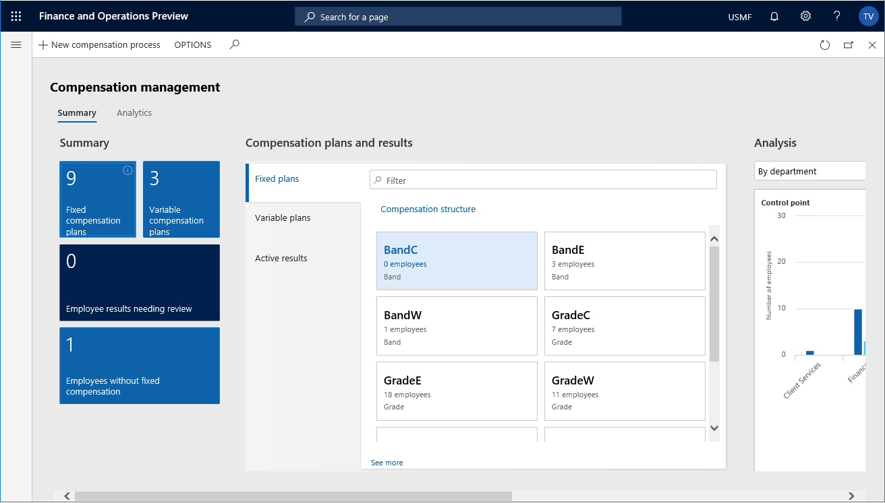
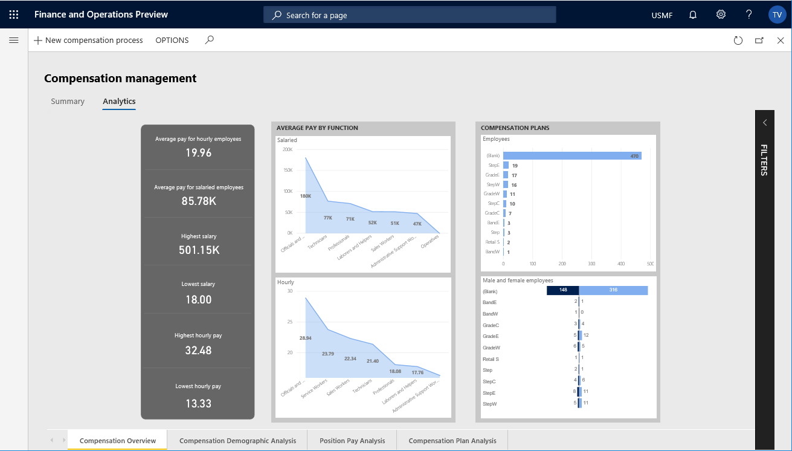
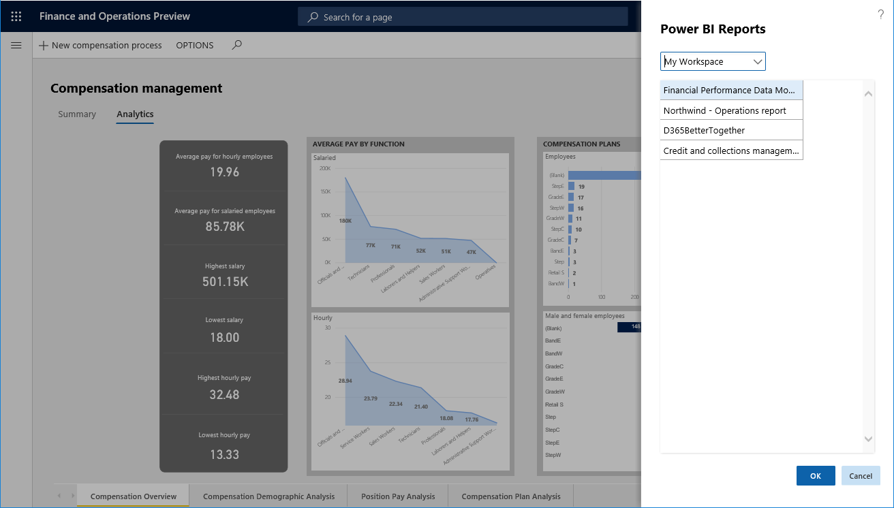
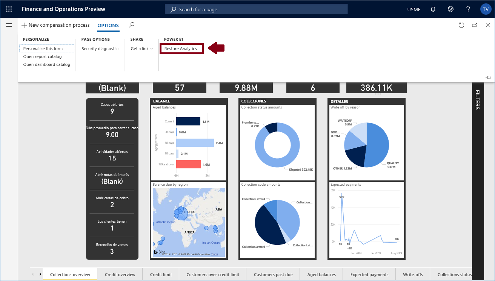

---
# required metadata

title: Select Analytical Workspace from PowerBI.com 
description: This topic explains how to select a report hosted on PowerBI.com for an application workspace.
author: tjvass
manager: AnnBe
ms.date: 07/18/2019
ms.topic: article
ms.prod: 
ms.service: dynamics-ax-applications
ms.technology: 

# optional metadata

# ms.search.form:
# ROBOTS:
audience: IT Pro
# ms.devlang: 
ms.reviewer: kfend
ms.search.scope: Operations
# ms.tgt_pltfrm: 
# ms.custom:
ms.search.region: Global
# ms.search.industry:
ms.author: tjvass
ms.search.validFrom: 2019-07-18 
ms.dyn365.ops.version: Platform update 27
---

# Select Analytical Workspace from PowerBI.com

[!include[banner](../includes/banner.md)]

## Analytical Workspaces
Analytical Workspaces bundled with the application Suite offer users relevant insights into their business data.  However, there will be cases where it makes sense to replace the standard reports with custom solutions more appropriate for users within your organization.  

PowerBI.com provides world-class tooling for producing analytical solutions containing mash-up views with data from external sources.  With the latest Platform update, power users are able to replace the standard embedded solutions with reports hosted on PowerBI.com.    

**Important -** this is not an exercise of personalization.  Customizations the analytical workspaces apply to all users within the active Legal Entity.

### Motivations for embedding PowerBI.com report
Although, the standard solutions deliver insights tailored for a given business persona, there will be cases where an organization prefers a custom solution.  Dynamics 365 for Finance & Operations allows a Power User to promote custom solutions hosted on PowerBI.com which are shared with members of the organization.  

Here are a few of the top motivations for selecting reports hosted on PowerBI.com
- PowerBI.com reports support data-mashups with external data sources and are accessible outside of Dynamics 365 Finances & Operations
- Appropriate for demonstrating custom solutions hosted on PowerBI.com embedded in the application on 1Box deployment 
- Organizations with Power BI Premium services that wish to augment the standard solutions

### Embedding a PowerBI.com report into an Analytical Workspace
To replace the standard application solutions you must be a member of the System Report Editors security group.  Members of this security group have access to Options in the Application Workspaces that allow them to customize the standard solution.  In this example, we will replace the standard Analytical Workspace with a customer report hosted on PowerBI.com

**Step #1 -** Log into Dynamics 365 for Finance and Operations, and then access the Application Workspace you'll be customizing.  Here, we'll replace the standard analytical report embedded in the **Compensation management** Workspace.

  
 **Step #2 -** Click on the **Analytics** tab to access the workspace's embedded analytical report.

 
By default, you will see the standard Analytical Workspace solution that is packaged with your Dynamics 365 for Finance and Operations application.  These reports are automatically deployed and configured for your F&O environment during the provisioning process.

**Note:** The Analytical Workspaces require a hosted Power BI service which is only available for dedicated environments. Review related articles for insights on **Accessing Analytical Workspaces on 1Box environment.**

**Step #3 -** Click on the **Options** menu in the top navigation, locate the **POWER BI** section, and then click on **Select Analytics**.  This will expand the **Power BI Reports** portfolio selection control.

  
This form allows the user to select from the collection of reports that have been shared on PowerBI.com service.  The reports are organized into Workspace collections.

**Step #4 -** Expand the drop-down to choose the workspace containing the report.  Next, select the report to embed in the Application Workspace and then click on the **OK** button.  

**Step #5 -** To view the workspace updates you must reload the page be either navigating away or refreshing your browser.  Enter the **Compensation management** workspace and then click on the **Analytics tab** to access the PowerBI.com report embedded in the Analytical Workspace.

  
**Congratulations -** you have replaced the standard analytical solution embedded in the Application Workspace with a report hosted on PowerBI.com.

### Reverting back to the standard solution
Once a PowerBI.com report has been embedded into an Application Workspace updates to the solution are reflected immediately for F&O users.  However, to replace the report with another PowerBI.com solution, a Power user must first revert back to the standard application solution.  Use the following steps to revert back to the standard application solution.

**Step #1 -** Click on the **Options** menu in the top navigation, locate the **POWER BI** section, and then click on **Restore Analytics**.  

  
**Step #2 -** To view the workspace updates you must reload the page be either navigating away or refreshing your browser.  Enter the **Compensation management** workspace and then click on the Analytics tab to access the standard solution embedded in the Analytical Workspace.

