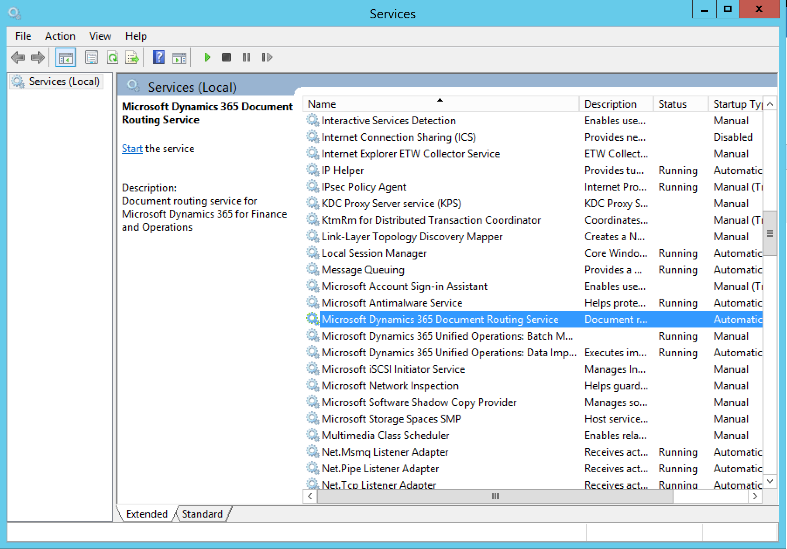
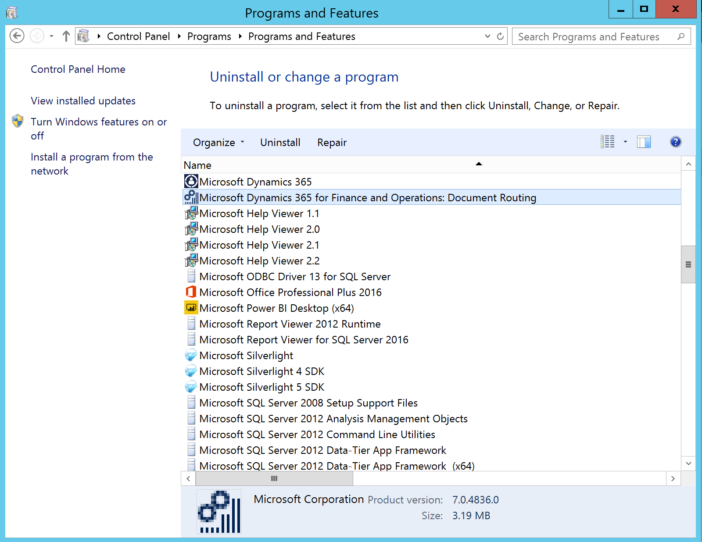
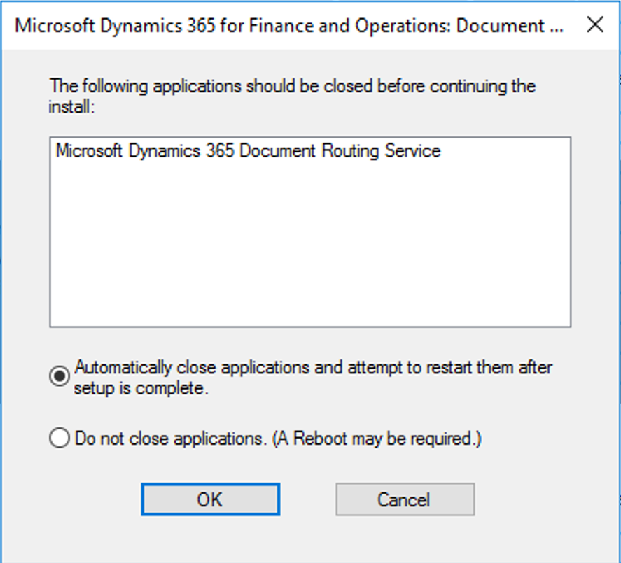

---
# required metadata

title: Upgrade the Document Routing Agent
description: This topic explains how to upgrade the Document Routing Agent.
author: TJVass
manager: AnnBe
ms.date: 03/13/2018
ms.topic: article
ms.prod: 
ms.service: dynamics-ax-applications
ms.technology: 

# optional metadata

# ms.search.form:  [Operations AOT form name to tie this topic to]
audience: IT Pro
# ms.devlang: 
ms.reviewer: sericks
ms.search.scope: Operations
# ms.tgt_pltfrm: 
# ms.custom: [used by loc for topics migrated from the wiki]
ms.search.region: Global
# ms.search.industry: [leave blank for most, retail, public sector]
ms.author: tjvass
ms.search.validFrom: 2016-02-28
ms.dyn365.ops.version: AX 7.0.0
---

# Upgrade the Document Routing Agent

[!include[banner](../includes/banner.md)]

**Platform Update 12 Release** includes a number of significant enhancements in components used to deliver network printing capabilities for Dynamics 365 for Finance & Operations applications. These update include a redesigned print job queue management solution providing customers with a service capable of scaling to satisfy high volume printing requirements. Although, the Print Job Management Service is backward compatible with in-market versions of the Document Routing Agent (DRA) client, it is highly recommended that customers upgrade existing installations of the DRA.

Failure to upgrade existing installments of the **Document Routing Agent** to PU12 or later may result in the following:
	• Observable performance degradation in the Dynamics 365 for Finance & Operations applications
	• Potential loss of documents associated with orphaned print jobs
	• Inconsistent handling for printed documents with custom margins

IT Admins must perform the following steps on each domain resource used to host a DRA for Dynamics 365 for Finance & Operations.

### Getting started…
To continue running the DRA as a windows service, you'll need both the user name and password of the domain account used to run the service.  This information must be available after completing the upgrade process.  The active service account information can be accessed in the open “Services” window and find the “Microsoft Dynamics 365 Document Routing Service”.

Step 1) Uninstall existing Document Routing Agent (DRA)
Open the “Programs and Features” window, and then find and uninstall the “Microsoft Dynamics 365 for Finance and Operations: Document Routing”.

During the uninstallation process, you'll likely be prompted with the following dialog…

**Important:** select “Automatically close applications and attempt to restart them after setup is complete.”

Step 2) Reinstall the latest Document Routing Agent available in your deployment
Follow these steps to [Download and install the latest version of the Document Routing Agent](https://docs.microsoft.com/en-us/dynamics365/unified-operations/dev-itpro/analytics/install-document-routing-agent) available with your subscription.

