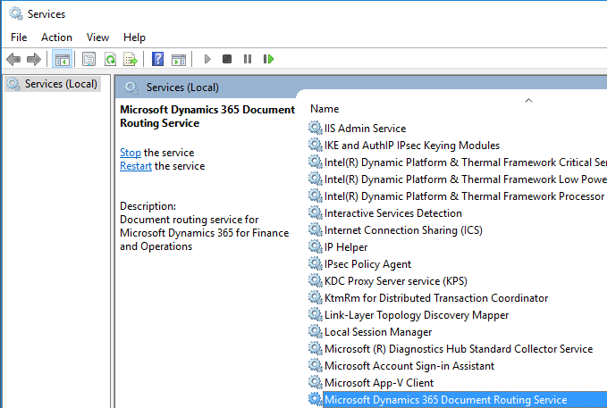
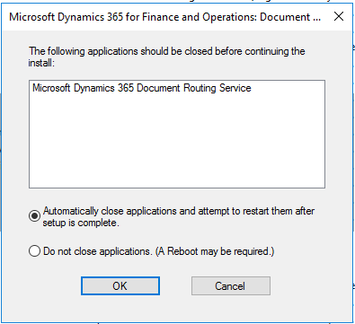

---
# required metadata

title: Upgrade the Document Routing Agent
description: This topic explains how to upgrade the Document Routing Agent.
author: TJVass
manager: AnnBe
ms.date: 03/13/2018
ms.topic: article
ms.prod: 
ms.service: dynamics-ax-applications
ms.technology: 

# optional metadata

# ms.search.form:  [Operations AOT form name to tie this topic to]
audience: IT Pro
# ms.devlang: 
ms.reviewer: sericks
ms.search.scope: Operations
# ms.tgt_pltfrm: 
# ms.custom: [used by loc for topics migrated from the wiki]
ms.search.region: Global
# ms.search.industry: [leave blank for most, retail, public sector]
ms.author: tjvass
ms.search.validFrom: 2016-02-28
ms.dyn365.ops.version: AX 7.0.0
---

# Upgrade the Document Routing Agent

[!include[banner](../includes/banner.md)]

To update the Document Routing Agent, complete the following steps on **each machine where the Document Routing Agent is
installed**.

> [!Important]
> If the Document Routing Agent is running as a Windows service, make sure that the service account information (user name and password) is available. This will be used after the Document Routing Agent is upgraded. The service account information can be obtained by opening the **Services** window and finding the **Microsoft Dynamics 365 Document Routing Service**.

    

1.  Uninstall the existing Document Routing Agent. 

    Open the **Programs and Features** window, and then find and uninstall **Microsoft Dynamics 365 for Finance and Operations: Document Routing**.

    During the uninstallation, the following window might display. Choose **Automatically close applications and attempt to restart them after setup is complete.**

    

2.  Reinstall the latest Document Routing Agent.

    Go to the **Network printers** page of Dynamics 365 for Finance and Operations. Download the latest Document Routing Agent and install it.

    

3.  Start the Document Routing Agent from the link on the desktop and sign in. Click the **Printers** menu to make sure that it shows the correct printers.

4.  If the Document Routing Agent is running as a Windows service, you need to change the service account to the same account used previously (as noted at the beginning of this topic).
