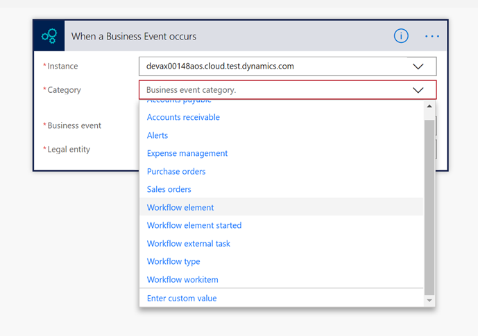

---
# required metadata

title: Workflow business events
description: Workflow business events are generated at various points in the processing of a workflow.
author: ChrisGarty
manager: AnnBe
ms.date: 08/30/2019
ms.topic: article
ms.prod: 
ms.service: dynamics-ax-applications
ms.technology: 

# optional metadata

# ms.search.form:  [Operations AOT form name to tie this topic to]
audience: Developer
# ms.devlang: 
ms.reviewer: sericks
ms.search.scope: Operations, Core
# ms.custom: [used by loc for topics migrated from the wiki]
ms.search.region: Global 
# ms.search.industry: 
ms.author: cgarty
ms.search.validFrom: 2019-3-31
ms.dyn365.ops.version: Platform update 24
---

# Workflow business events
[!include[banner](../includes/banner.md)]

Workflow business events are generated at various points in the processing of a workflow.   

## Workflow construction

To construct a workflow, a developer can define workflows components in metadata and code in the Visual Studio tools.

An administrator can create workflows in the web client and then design them in the workflow designer. For more information, see [Create workflows](../../fin-and-ops/organization-administration/create-workflow.md).

### Workflow components
Workflow components are defined in metadata as:
- **Workflow types** - Also known as templates, workflow types define the elements allowed in a workflow. The administrator decides which elements are actually used when they create the workflow design. 
     - In the Application Explorer, go to **AOT > Business Process and Workflow > Workflow Types**.
- **Workflow elements** - Workflow elements are the executable pieces that make up a workflow. For details, see [Workflow elements](../../fin-and-ops/organization-administration/workflow-elements.md).
     - Tasks (aka manual tasks) - Go to **AOT > Business Process and Workflow > Workflow Tasks**.
     - Approvals - Go to **AOT > Business Process and Workflow > Workflow Approvals**.
     - Automated tasks - Go to **AOT > Business Process and Workflow > Workflow Automated Tasks**.

## Workflow runtime
After a workflow is submitted by a user, it is added to a queue and run using the **Workflow message processing** batch job. As the workflow runs, it will progress through all the [connected workflow elements](../../fin-and-ops/organization-administration/create-workflow.md#connect-the-elements) until it reaches the end. When the workflow runtime encounters a [manual task element](../../fin-and-ops/organization-administration/workflow-elements.md#manual-task), it will create a work item for the [user assigned to the task](../../fin-and-ops/organization-administration/configure-manual-task-workflow.md#assign-the-task). When the workflow runtime encounters an [approval element](../../fin-and-ops/organization-administration/workflow-elements.md#approval-processes), it will create a work item for each [user assigned to each approval step](../../fin-and-ops/organization-administration/configure-approval-step-workflow.md#assign-the-approval-step).

## Workflow business event categories

There are five different categories of workflow business events. The category will show up in Microsoft Flow to help with event selection.

- **Category: Workflow type** 
     - These events will fire on workflow events like started and completed. All workflow instances will be represented in this category.
     - **ID format** - "Workflow_" + Workflow name + Workflow instance ID, for example "Workflow_BudgetPlanReview_000002"
     - **Name format** - Workflow label + " (" + Workflow instance ID ")", for example "Prepare department budget (000002)"
- **Category: Workflow element started**
     - These events will fire when a workflow element is started. All enabled workflow elements within a workflow instance will be represented in this category. 
     - **ID format** - "Workflow_" + Workflow name + Workflow instance ID + "_" + Workflow element name + "_Started", for example "Workflow_BudgetPlanReview_000002_BudgetActivateBudgetPlanChild_Started"
     - **Name format** - Workflow label + " (" + Workflow instance ID ") - " + Workflow element label, for example "Prepare department budget (000002) - Activate associated budget plan"
- **Category: Workflow element**
     - These events will fire on workflow element events other than started, such as completed. All enabled workflow elements within a workflow instance will be represented in this category. 
     - **ID format** - "Workflow_" + Workflow name + Workflow instance ID + "_" + Workflow element name, for example "Workflow_BudgetPlanReview_000002_BudgetActivateBudgetPlanChild"
     - **Name format** - Workflow label + " (" + Workflow instance ID ") - " + Workflow element label, for example "Prepare department budget (000002) - Activate associated budget plan"
- **Category: Workflow external task** 
     - These events will fire when a workflow automated task element is started. All enabled workflow automated task elements within a workflow instance will be represented in this category. 
     - **ID format** - "Workflow_" + Workflow name + Workflow instance ID + "_" + Workflow element name + "_ExternalTask", for example "Workflow_BudgetPlanReview_000002_BudgetActivateBudgetPlanChild_ExternalTask"
     - **Name format** - Workflow label + " (" + Workflow instance ID ") - " + Workflow element label, for example "Prepare department budget (000002) - Activate associated budget plan"
- **Category: Workflow workitem**
     - These events will fire when a workflow work item is created for a user. All enabled workflow tasks and workflow approvals within a workflow instance will be represented in this category. 
     - **ID format** - "Workflow_" + Workflow name + Workflow instance ID + "_" + Workflow element name + "_WorkItem", for example "Workflow_BudgetPlanReview_000002_BudgetActivateBudgetPlanChild_WorkItem"
     - **Name format** - Workflow label + " (" + Workflow instance ID ") - " + Workflow element label, for example "Prepare department budget (000002) - Activate associated budget plan"

## Completion of a work item in Flow
Workflow business events are a good target for triggering approval flows. The **workflow workitem** event can be used in conjunction with the validate and complete OData actions to facilitate completion of a work item in Flow.

An approval or task work item can be completed in Flow using the following steps:
- Trigger the Flow using the **when a business event occurs** trigger targeting the appropriate **workflow workitem** event.
- Validate that the **workflow workitem**  contains a valid set of information so it is ready for completion by calling the **Validate** method on the **WorkflowWorkItems** entity. 
- If the workitem is not ready for completion, then send a notification to the assigned user to let them know that there is a workitem that needs their attention.
- If the workitem is ready for completion, then request a response from the assigned user by sending the available response options to the user.
- After a response is provided, complete the workitem with that response by calling the **Complete** method on the **WorkflowWorkItems** entity. 

Templates for work item completion in Microsoft Flow will be available soon and a link will be provided here for easy reference.

For a step-by-step guide to setting up work item completion in Microsoft Flow, see [Consume workflow approval business events](https://docs.microsoft.com/dynamics365/unified-operations/dev-itpro/business-events/how-to/how-to-flow).

## Troubleshooting workflow business events

There are a number of key factors that need to work correctly in order for workflow business events to run without errors:

- **Workflow** - Ensure that the workflow is running correctly and creating work items correctly. If the workflow doesn't work inside Finance and Operations so that state changes are occurring, then the events won't occur. Adjust the workflow configuration as needed. If needed, review the workflow details in the **Workflow History** form.

- **Flow** - Ensure that the Flow subscription is available in the **System administration > Setup > Business events > Business events catalog** on the **Active events** tab. If the Flow subscription isn't there, then check the Flow and recreate it if needed.

- **Business events** - Ensure that other business events are occurring by creating a Flow to trigger off another business event. For example, the Free Text Invoice Posted event can be triggered by simply creating a Free Text Invoice with a single line and posting it. For more information, see [Troubleshoot business events](troubleshooting.md).
