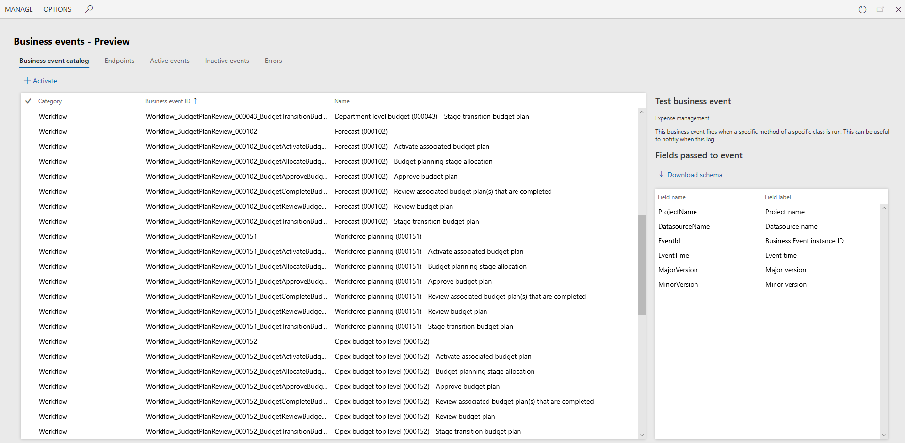
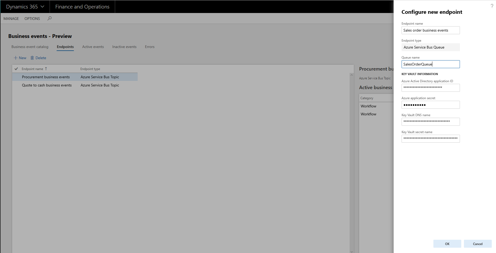
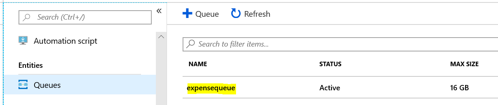
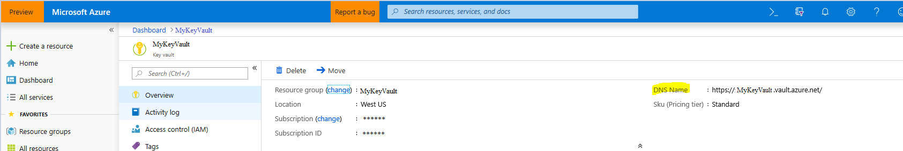
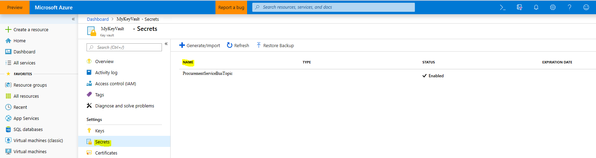
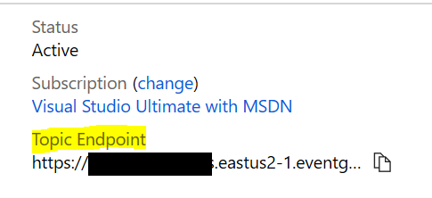
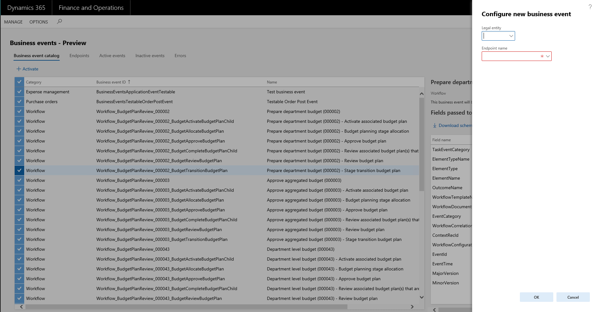
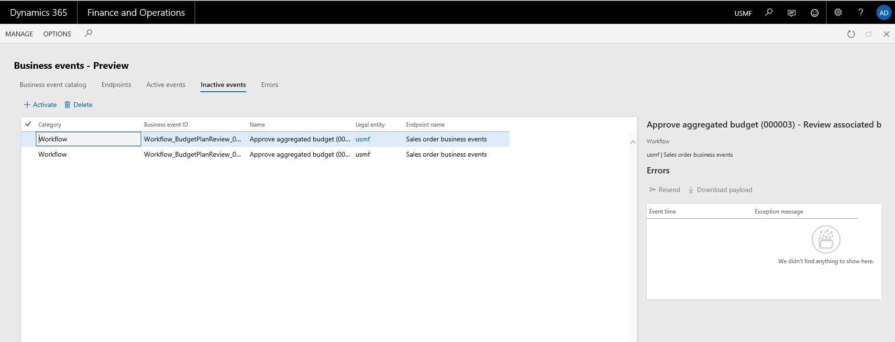
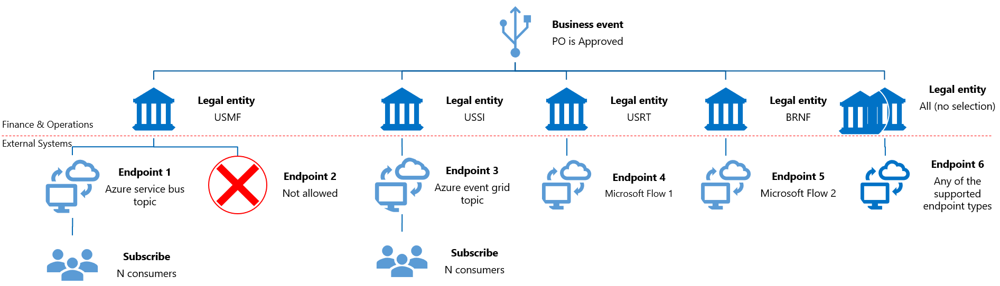

---
# required metadata

title: Business events
description: This topic provides information about business events, which s provide a mechanism for external systems to receive notifications from Dynamics 365 for Finance and Operations.
author: Sunil-Garg
manager: AnnBe
ms.date: 02/01/2019
ms.topic: article
ms.prod: 
ms.service: dynamics-ax-applications
ms.technology: 

# optional metadata

# ms.search.form:  [Operations AOT form name to tie this topic to]
audience: IT Pro
# ms.devlang: 
ms.reviewer: sericks
ms.search.scope: Operations, Core
# ms.custom: [used by loc for topics migrated from the wiki]
ms.search.region: Global for most topics. Set Country/Region name for localizations
# ms.search.industry: 
ms.author: sunilg
ms.search.validFrom: Platform update 24
ms.dyn365.ops.version: 2019-02-28
---

# Business events

[!include[banner](../includes/banner.md)]
[!include[banner](../includes/preview-banner.md)]

Business events provide a mechanism that lets external systems receive notifications from Microsoft Dynamics 365 for Finance and Operations. In this way, the systems can perform business actions in response to the business events.

Business events occur when a business process is run. During a business process, users who participate in it perform business actions to complete the tasks that make up the business process. 

In Finance and Operations, a business action that a user performs can be either a workflow action or a non-workflow action. Approval of a purchase requisition is an example of a workflow action, whereas confirmation of a purchase order is an example of a non-workflow action. Both types of actions can generate business events that external systems can use in integration and notification scenarios. 

## Prerequisites

- Business events can be consumed via Microsoft Flow and Azure messaging services. Therefore, customers must bring their subscriptions to such asset(s) to use business events.
- Business events are available in Platform update 24 and later. Therefore, at least Platform update 24 is required.

> [!IMPORTANT]
> Business events must not be considered a mechanism for exporting data out of Finance and Operations. By definition, business events are supposed to be lightweight and nimble. They aren't intended to carry large payloads to fulfill data export scenarios.

## Enabling business events

By default, the business event functionality is turned off. To turn it on, follow one of these steps.

- In non-production environments, turn on the BusinessEventsMaster flight by running the following SQL statement

    ```
    INSERT INTO SYSFLIGHTING (FLIGHTNAME, ENABLED, FLIGHTSERVICEID) VALUES ('BusinessEventsMaster', 1, 12719367)
    ```

- After running the SQL statement, ensure that the following is set in the web.config file on each of the AOS's. 
key="DataAccess.FlightingServiceCatalogID" value="12719367"

- Perform an IISRESET

- In production environments, you must create a support case with Microsoft.

## Business events that are implemented in Finance and Operations

In Finance and Operations, business events are implemented in some business processes out of the box. These business events include both workflow and non-workflow business events. For more information, see [Application business events](app-business-events.md) and [Workflow business events](business-events-workflow.md).

A developer must use extensions to implement new business events. For more information, see [Business events developer documentation](business-events-dev-doc.md).

## Business event catalog

The business event catalog lists the business events that are available in the instance of Finance and Operations that you're using. The catalog is useful because it shows which business events are available, and you can filter it by category, business event ID, and name.

The category of a business event identifies its source in Finance and Operations. Business events that originate from the workflow system are assigned to the **Workflow** category. For business events that originate from other modules, the module name is used as the category name. 

The business event catalog is built during database synchronization at the time of deployment. Therefore, users should see the complete list of business events in the catalog. However, if an explicit update of the catalog is required, you can select **Manage \> Rebuild business events catalog**.



For each business event, the business event catalog shows a description. This description can help you better understand the business event and its context in the business process. The catalog also shows the list of data fields that will be sent out in the event.

In scenarios where external integration systems require the schema of the payload for a business event during development, you can select **Download schema** to download the JavaScript Object Notation (JSON) schema.

In summary, the business event catalog helps identify the business events that are required for an implementation. It also helps identify the schema for each business event.

The next step is to manage the endpoints.

## Managing endpoints

Endpoints let you manage the destinations that Finance and Operations must send business events to. The following types of endpoints are currently supported. Therefore, endpoints can be created for these messaging and event brokers out of the box.

- Azure Service Bus Queue
- Azure Service Bus Topic
- Azure Event Grid

Some scenarios might require multiple endpoints for organized distribution of business events to consumers. You can create multiple endpoints to support these scenarios.

The Azure-based endpoints must be in the customer's Azure subscription. For example, if Event Grid is used as an endpoint, the endpoint must be in the customer's Azure subscription.

Finance and Operations doesn't provision the endpoints. It just sends events to the endpoints that are provided. Customer might incur additional costs if they use these endpoints in their Azure subscription.


### Create an Azure Service Bus Queue endpoint

To create a new endpoint, select **New**. Then, in the **Endpoint type** field, select the appropriate endpoint type. To create an endpoint to a Service Bus queue, select **Azure Service Bus Queue**.


Select **Next**, and specify the name of the endpoint and the Service Bus queue. In addition, you must set up Azure Key Vault to provide the secret to the Azure messaging resource. You must also set up the Azure Active Directory (Azure AD) application ID and application secret.



In the **Queue Name** field, enter the **Azure Service Bus Queue** name that you created in the Azure Service Bus Queue configuration in Azure.  



In the **Azure Active Directory application ID** field, enter the application ID that is created in Azure AD in the Azure portal.


In the **Azure application secret** field, enter the secret value for the application.


In the **Key vault DNS name** field, enter the name from your Key Vault setup.



In the **Key vault secret name** field, enter the secret name for the endpoint resource that must be created in Key Vault.



The **Key Vault Secret** value, in Azure, will be the Azure Service Bus **Primary Connection String** value. This value is found in the Azure Service Bus that you configured in **Shared Access Policies > RootManagedSharedAccessKey**.


> [!IMPORTANT]
> The Azure application that was registered must be also added to the Key Vault set up under Access policies in the Key Vault. For this setup to be complete, select the **Key, Secret & Certificate Management** template and then select the application as the **principal**.

### Create an Azure Service Bus Topic endpoint

To create an endpoint to a Service Bus topic, select **New**, and then, in the **Endpoint type** field, select **Azure Service Bus Topic**. The **Topic name** field must be set to the name of the Service Bus topic. Key Vault information is set up in the same way that it is set up for an Azure Service Bus Queue endpoint.

### Create an Azure Event Grid endpoint

To create an endpoint, you need to create and configure an **Azure Event Grid Topic** in Azure Portal, and then create an endpoint to the Event Grid Topic in the **Business Events Workspace**. Go to the **Endpoints** tab, select **New**, and then select **Azure Event Grid** as the **Endpoint type**. In the **Endpoint URL** field, enter the URL from the **Azure Event Grid Topic**. This is the **Topic Endpoint** value in the **Overview** section of your Event Grid Topic.



Key Vault information is set up in the same way that it is set up for an Azure Service Bus Queue endpoint, except the Key Vault secret should now point to the Event Grid credential, rather than the Service Bus connection string.  The Event Grid Crendtial can be found under the Event Grid you created in the **Access Keys** section under Settings. 


After you've created the endpoints that you require, the next step is to activate the business events.


## Activating business events

Business events in the business event catalog aren't active by default. From the catalog, you can activate any business events that you require. Select one or more business events, and then select **Activate**.



Business events can be activated either in all legal entities or in specific legal entities. If you leave the **Legal entity** field blank, the selected business events will be activated in *all* legal entities. If a business event is required only for specific legal entities, it must be configured separately for each legal entity.

Endpoints must be assigned to the business events that are activated.

When business events occur as business processes are run, the system will do outbound processing only for business events that have been activated.

After business events are activated, they appear on the **Active events** tab.


From the **Active events** tab, you can inactivate business events. The system won't do outbound processing for inactivated events.

After businessevents are inactivated, they appear on the **Inactive events** tab.



Business events can be inactivated when processing of business events must be paused for a period because of specific system maintenance activities in the integration landscape.

When business requirements change, some business events might no longer be required. In this case, you can inactivate them instead of deleting them from the list of active events. This approach is useful if the history of errors for the business events must be preserved. Inactivated business events can be deleted later, when there is no longer a business need to keep them inactivated.

## Errors

While the system does outbound processing of business events, errors can occur. These errors might prevent the system from successfully delivering a business event to the endpoint. If an error occurs, the system retries several times to successfully process the business event. However, if all attempts are unsuccessful, the business event is saved in an error log.

Error logs can be accessed from the **Active events**, **Inactive events**, and **Errors** tabs. The **Errors** tab shows all errors across all business events, whereas the other two tabs show errors in the context of a specific business event.

You can do on-demand outbound processing on each error by using the **Resend** action. This action invokes the outbound processing logic. This logic includes retries. If the outbound processing is still unsuccessful, the error is logged in the error log. In this case, the **Last process time** field on the **Errors** tab indicates when the last attempt to process the event occurred.

If an error can't be successfully processed, you can use the **Download payload** option to download the payload from the event for offline processing, as you require.

> [!NOTE]
> If an endpoint is deleted and a new endpoint is associated with business events, all errors that are associated with the business events can still be resent. In this case, the system will do outbound processing to send to the new endpoint that is associated with the corresponding business event. This functionality allows for graceful recovery from misconfiguration or other error states.

## Business event consumption models

The integration requirements and integration solution design for implementations vary. The integration requirements play a role in identifying the consumption model for business events. The following illustration shows the consumption models that Finance and Operations makes available.



In summary, you must consider the following points when you design integrations that use business events:

- Business events can be consumed via Microsoft Flow, Service Bus, or Event Grid.
- Customers must bring their own subscriptions to use Microsoft Flow, Service Bus, or Event Grid.
- A business event can be activated in all legal entities or in specific legal entities.
- A business event in a legal entity can be sent to only one endpoint. Messaging brokers make one-to-many (1:N) consumption available.
- A business event across unique legal entities can be sent to unique endpoints or the same endpoints.
- Microsoft Flow can directly subscribe to business events.
- Endpoints such as Service Bus or Event Grid endpoints enable *n* consumers to subscribe to and receive the events.
