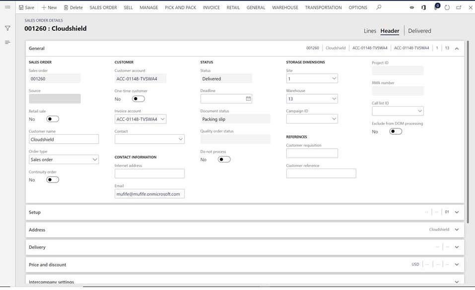
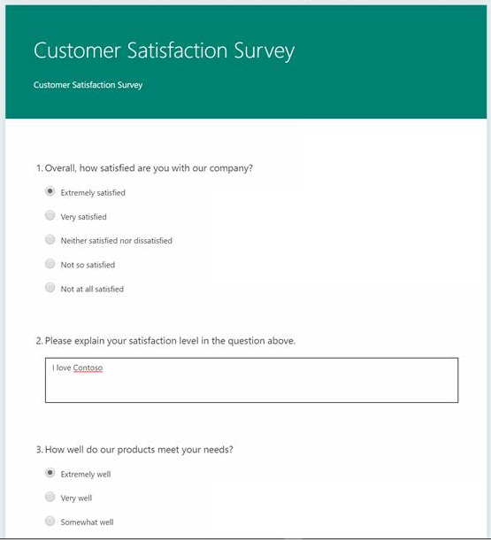
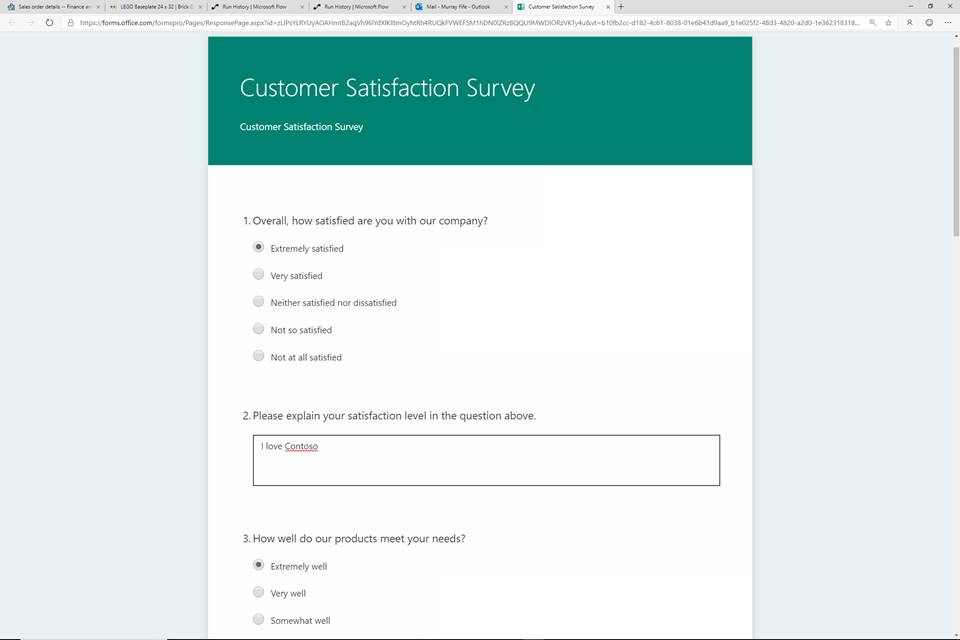

---
# required metadata

title: Use Microsoft Forms Pro
description: This topic provides the steps to enable a scenario where a survey is sent to users when a product has been shipped. The survey is gathered using Microsoft Forms Pro.
author: Sunil-Garg
manager: AnnBe
ms.date: 07/09/2019
ms.topic: article
ms.prod: 
ms.service: dynamics-ax-applications
ms.technology: 

# optional metadata

# ms.search.form:  [Operations AOT form name to tie this topic to]
audience: IT Pro
# ms.devlang: 
ms.reviewer: sericks
ms.search.scope: Operations, Core
# ms.custom: [used by loc for topics migrated from the wiki]
ms.search.region: Global for most topics. Set Country/Region name for localizations
# ms.search.industry: 
ms.author: sunilg
ms.search.validFrom: Platform update 27
ms.dyn365.ops.version: 2019-6-30 

---

# Use Microsoft Forms Pro with business events

[!include[banner](../../includes/banner.md)]

This topic will walk you thorugh the scenario where Microsoft Forms Pro can be used to create a survey, which can be used with business events. In this scenario a survey is sent to users when a product has been shipped. The survey is gathered using Forms Pro.

## Prerequisite
If you have not used Forms Pro, the [Forms Pro documentation](https://docs.microsoft.com/en-us/forms-pro/) is a prerequisite to first learn how to use Foms Pro.

## Scenario
1. Create a new survey. Based on the title of the survey, suggested questions will be provided.

  

2. The sales order tracks the shipment, and when the product is shipped, the status is changed to **Delivered**.

  

  Configure an alert on the sales order such that, whenever the **Status** field is changed, it creates an alert. Be sure to enable the alert to **Send External**. This will ensure that the alert is sent out as a business event.

  

3. The Flow is shown below which gets triggered by the business event every time the status on a sales order is updated. The Flow then goes on to use the Forms connector to get the survey to the customer email address that is registered on the order. The customer email address and other needed information must be in the payload of the business event. If the payload does not have the required data as needed by a given scenario, the payload can be extended to include such fields. This is covered in the [Business events developer documentation](../business-events/business-events-dev-doc.md).

4. Since Flow is being used to orchestrate this scenario, let Flow subscribe to the **When a change based alert occurs** business event directly, as opposed to activating the business event in Finance and Operations.

  

5. Once the Flow is completed, it is ready to go in action. Once the sales order's status is updated, the Flow gets triggered and it will send the survey. As users fill in the survey and submit, Forms Pro also shows some analytics.

  

  

