---
# required metadata

title: Consume business events with Azure Event Grid
description: This topics provides information about the business events that are available for consumption in Azure EventGrid via the Finance and Operations connector.
author: ibenbouzid
manager: AnnBe
ms.date: 07/03/2019
ms.topic: article
ms.prod: 
ms.service: dynamics-ax-applications
ms.technology: 

# optional metadata

# ms.search.form:  [Operations AOT form name to tie this topic to]
audience: IT Pro
# ms.devlang: 
ms.reviewer: sericks
ms.search.scope: Operations, Core
# ms.custom: [used by loc for topics migrated from the wiki]
ms.search.region: Global for most topics. Set Country/Region name for localizations
# ms.search.industry: 
ms.author: imbenbou
ms.search.validFrom: Platform update 27
ms.dyn365.ops.version: 2019-6-30 

---
# Consume business events with Azure Event Grid

The objective of this lab is to provide guided steps of how to configure an
Azure Event Grid Endpoint with Dynamics 365 Finance and Operation and how to
consume a Business Event form Azure Event Grid.

Scenario overview
=================

Security best practices recommend storing connection strings outside of
applications but in a Key Vault drive and giving applications the
right access to the key vault keys, secrets or certificates.

This has many benefits, first, if someone gets access to the application
database he will not be able to get the 3rd party connection string. Second,
maintainability becomes easier as there is only one place where we need to
update connection strings especially when multiple applications access the same
resources.

So, the steps will be as follows:

-   Create a new Event Grid Topic,

-   Create a new Key Vault to store Event Grid key

-   Register an Azure App with permissions to access the key vault on behalf of
    F&O

-   Configure F&O endpoint’s parameters

-   Consume your business event.

Exercise 1: Create a new Event Grid Topic
=========================================

1.  Log into the Azure Portal

2.  Select **All services \> Integration \> Event Grid Topics**

    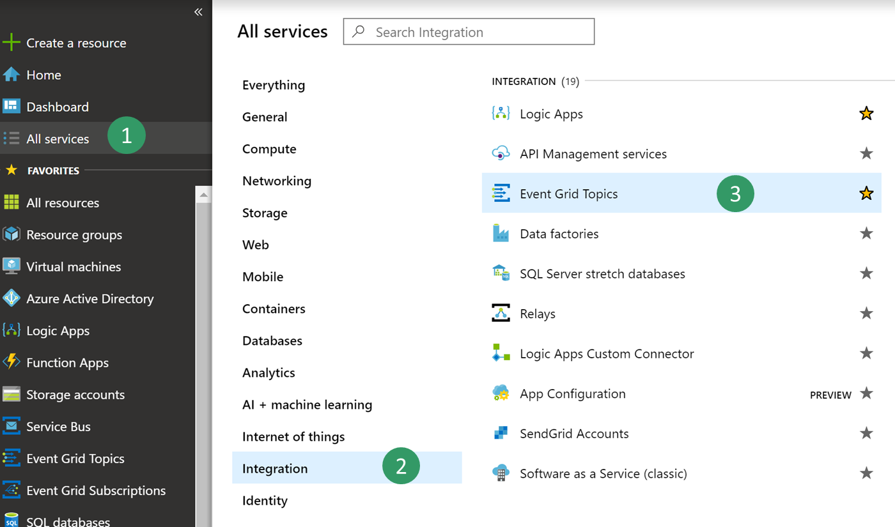

3.  Click **Add** to create a new **Event Grid Topic** then fill in the
    parameters and click on **Create**. You can create a new **resource group**
    as a container for your lab or use an existing one.

    

4.  Once deployment is complete **select** you newly created event grid. Click
    on **Overview** and **Note** the Topic Endpoint value, you will need this
    later in the F&O.

    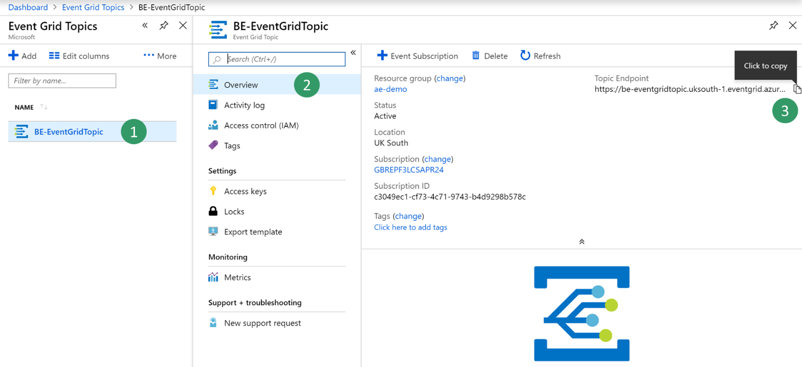

5.  Back on the property blade **select Access Keys** and **copy** the **Key 1**
    value, you will need this later when configuring the **Key Vault**

    

Exercise 2: Create a Key Vault
==============================

For this exercise, you will have to create a Key Vault to store the Key you
copied above. A key vault is a secure drive used to store keys, secrets and
certificates. Instead of storing the Connection string in F&O it is more common
and secure to store it in a key vault then register a new application with Azure
active directory that will have the right to retrieve the secret form the key
vault on behalf of F&O.

1.  Select **All services \> Security \> key vaults**

    

2.  **Create** a new key vault within your resource group and **default
    parameters**

    

2.  Select **Overview** and **copy** the key vault URL **DNS Name** and save it
    for later use.

    

3.  Then **select** new **BE-key vault \>Secrets\>Generate/Import**, choose a
    new name for your secret and **copy** the **Event Grid Topic key** you saved
    earlier on exercise 1.

    

4.  Click **Create**

Exercise 3: Register a new Application
======================================

For this exercise, you will register a new application with Azure AD and give
read and retrieve access to key vault secrets. Then this application will be
used by F&O to retrieve Event Grid Secrets

1.  Select **All services \> Security \> Azure Active Directory**

    

2.  Select **App registrations (preview) \> New registration** then type a new
    name for your application

    

3.  Click on **Register**

4.  **Select** the new application then **Certificates & Secret\> New client
    secret**. Then type a name for your secret set it as **never expires** and
    click on **Add**.

   

5.  **Copy your new secret** for later step. Secrets are visible only once, if
    you forget to copy it you will need to delete it and create a new one.

   

6.  Select **Overview** and **copy your application ID** and save it for later
    usage

    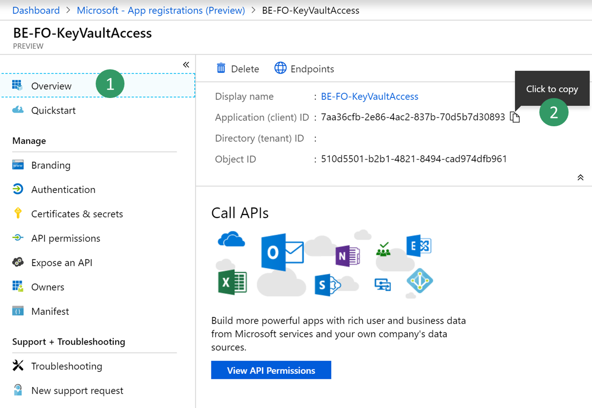

7.  Then go back to the previously created Key vault by selecting **All services
    \> Security \> key vaults**

    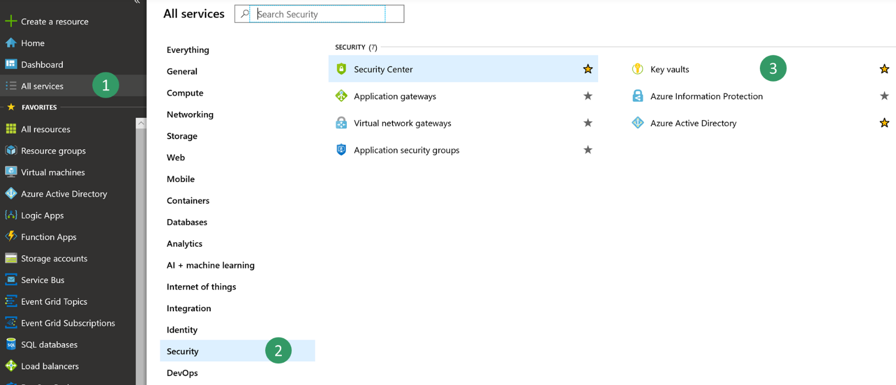

8.  Select **your key vault \> Access policies\> Add new**

    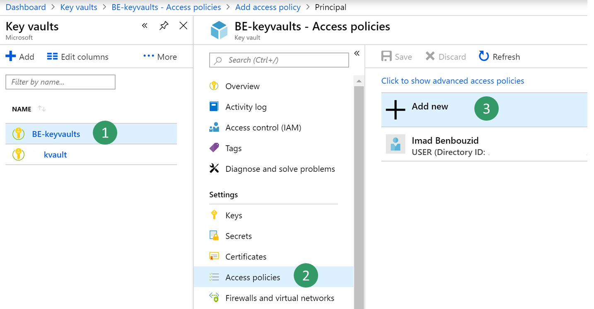

9.  **Select** your **new registered application** in the principal field then
    you need only **Get and List** Secret permissions to retrieve key vault
    secrets.

    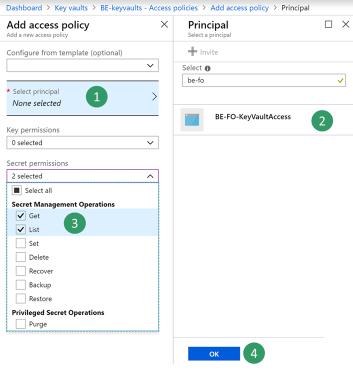

10.  **Save** your new access policy.
    
   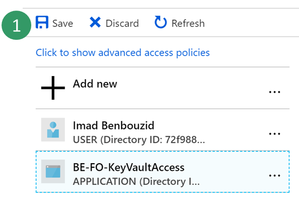

Exercise 4: Configure a Business Events Endpoint in F&O
=======================================================

1.  Log into the Dynamics client

2.  Go to **System Administration \> Setup \> System Parameters**

3.  Click on the **Business Events** tab

4.  Click on **Business Events**

5.  Click **Endpoints**

6.  Click **New**

7.  Select **Azure Event Grid**

    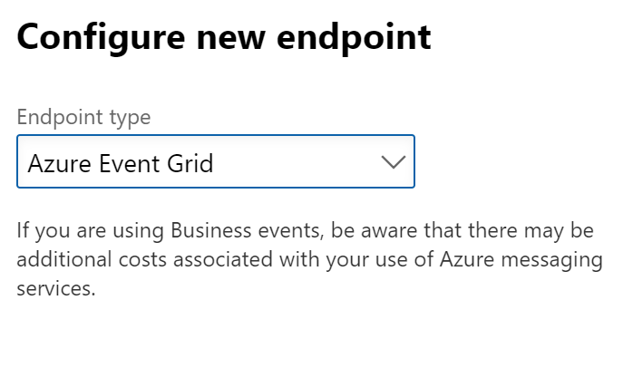

      
8.  Click **Next**

9.  Provide the necessary parameters value

    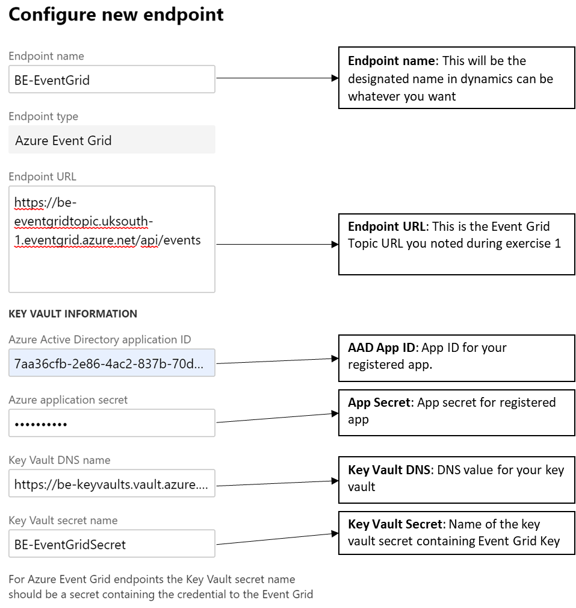

10.  Then click **OK**

Exercise 5: Consuming a Business Event
======================================

Scenario/business problem

The business scenario is to send an email whenever a Free Text Invoice has been
posted for USMF. The message needs to contain some details as the Customer
Account Number, Customer Name and Total of Invoice.

1.  **Activate** the Free Text Invoice posted business event for USMF.

    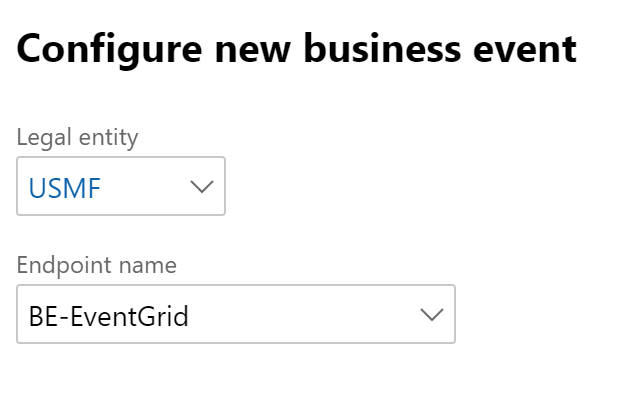

2.  Once you activate a Business Event with a new endpoint, F&O sends a test
    message to verify that the configuration was right and to cash the
    connection. In order to verify that the test message has been received
    **Navigate** to Azure and select your **Event Grid Topic \> Metrics**

3.  **Verify** that the **published events** metric and **unmatched events** are
    both showing a value of at least 1. If this is not the case wait for the
    batch job to pick up your message.

    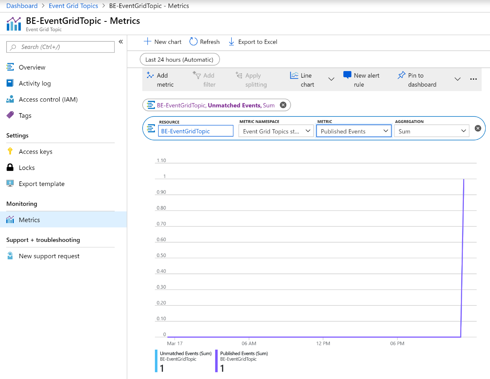

4.  If the above is fine, then we will create a new Logic Apps to subscribe to
    our Event Grid Topic. Select **All services\> Integration\> Logic Apps**

    

5.  Then **Create** a new logic apps in your resource group

    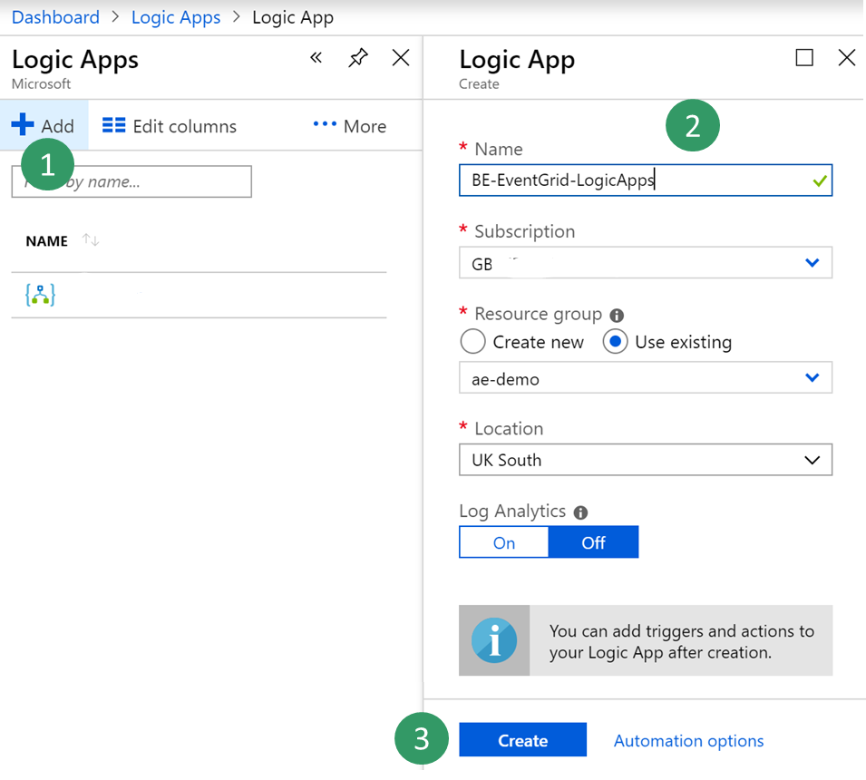

6.  Once your Logic Apps resource has been created choose option to create a
    **Blank Logic Apps**

7.  Then **search** for **Event Grid** and **select** trigger “**When a resource
    event occurs (preview)**”

    

8.  **Select** your subscription, the resource type
    “**Microsoft.EventGrid.Topics**” and your Event Grid topic Name you created
    in exercise 1.

    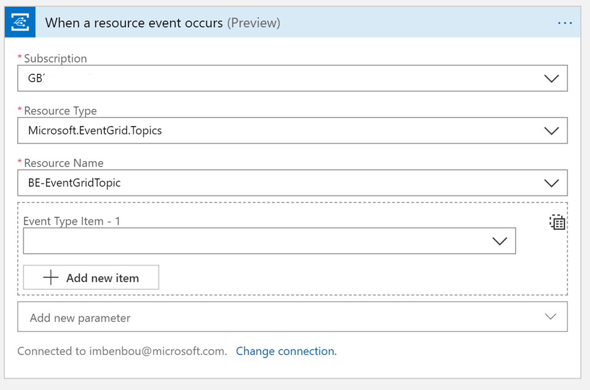

9.  **Select New Step** button to add a new action:

10. **Search** for **Parse Json** data operation. This step is needed to be able
    to parse our message with the schema of our data contract provided by F&O.

    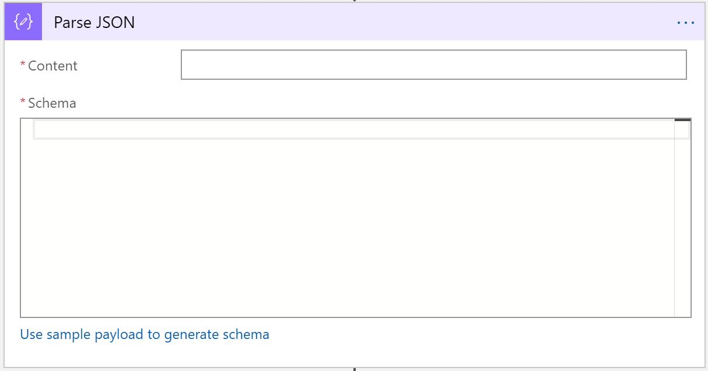

11. **Select** the content field of “**Parse Json**” action then a side bar will
    appear and give you option form the previous trigger. You need to select the
    **Data object** field of Event Grid message which contains the payload
    transmitted by F&O.

    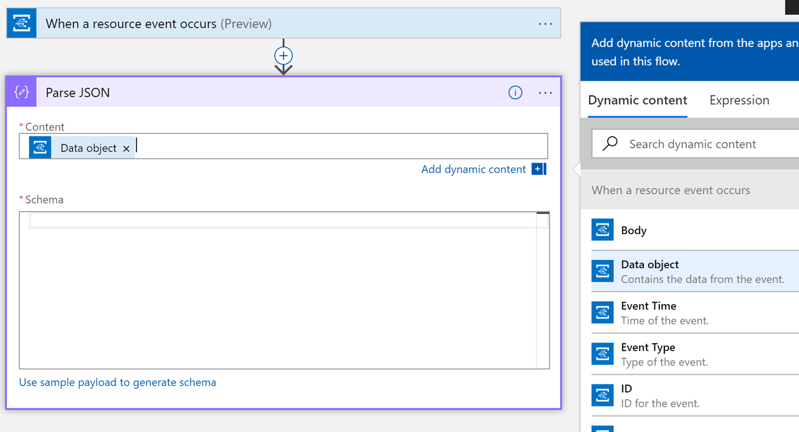

12. Now we need to type in the schema of the contract received from F&O.
    However, F&O provides only a sample payload instead. Hence, we can use Logic
    Apps capability to generate a schema from a payload. **Go back** to **F&O**,
    **select** your **event in the catalog** and **click on download Schema**
    link. This will download a text file. **Open** the text file and **copy**
    the content.

    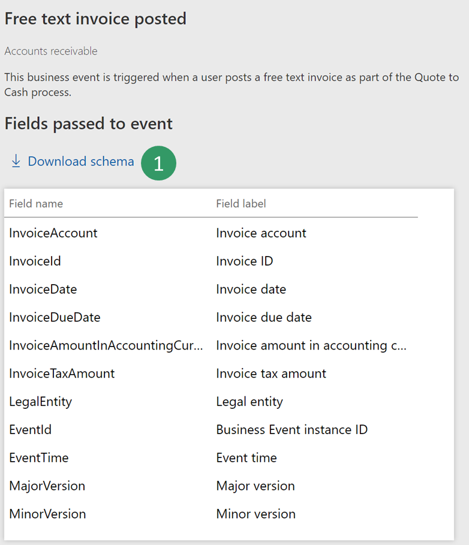

13. **Go Back** to Logic Apps **click** on “**Use sample payload to generate
    schema**” link. Then **past** you’re the text file content and click on
    **Done**

    

14. Depending on the quality of your sample payload, your generator will note
    recognize an Integer from a real especially if the real is provided as a
    whole number in the sample payload. Review your generated schema and check
    if you need to change an “integer” filed into “number”. (in Json a “number”
    data type means real).

    

15.  Then choose another final action like to send an email to notify with
    customer payment details. **Search** for **send email** action, then login
    to your Office365 account.

   

16.  Then fill-in the message with the required fields.

   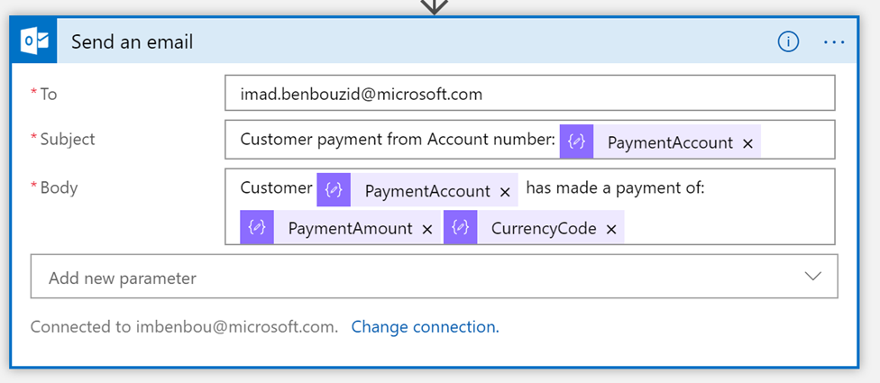

17.  **Save** your logic apps.

18.  Then final step is to **trigger the Business Event** by posting a customer payment
    then check whether the logic Apps runs and whether you receive an
    email with customer payment details.
