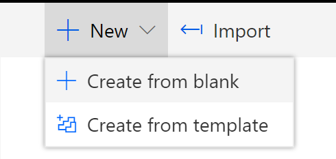
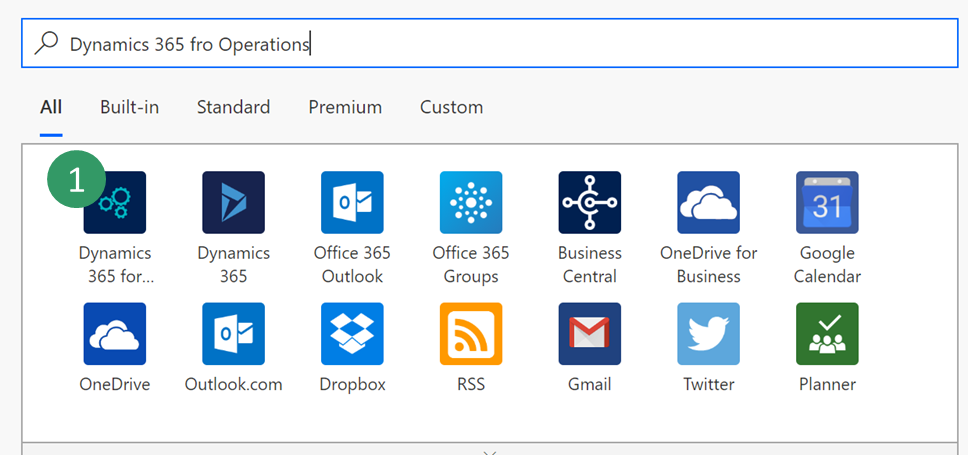
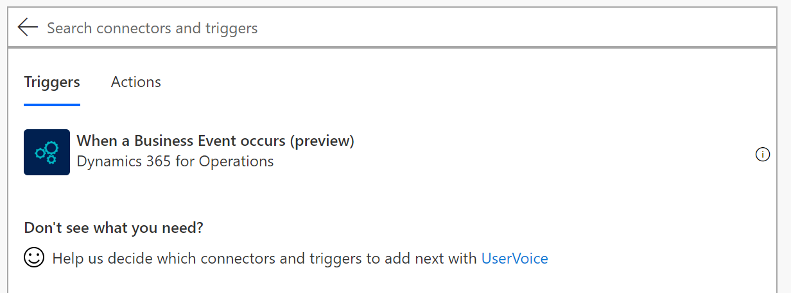
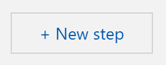
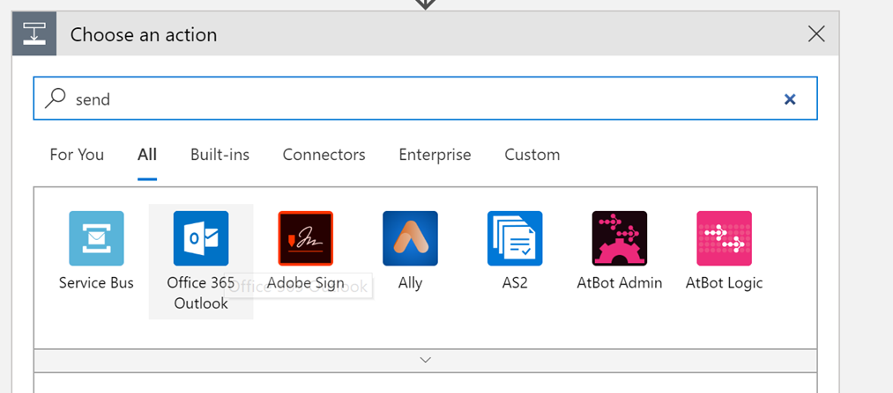

---
# required metadata

title: How-To Consume Business events with Microsoft Flow
description: This topics provides information abou the business events that are available for consumption in Microsoft Flow via the Finance and Operations connector.
author: ibenbouzid
manager: AnnBe
ms.date: 06/28/2019
ms.topic: article
ms.prod: 
ms.service: dynamics-ax-applications
ms.technology: 

# optional metadata

# ms.search.form:  [Operations AOT form name to tie this topic to]
audience: IT Pro
# ms.devlang: 
ms.reviewer: sericks
ms.search.scope: Operations, Core
# ms.custom: [used by loc for topics migrated from the wiki]
ms.search.region: Global for most topics. Set Country/Region name for localizations
# ms.search.industry: 
ms.author: imbenbou
ms.search.validFrom: Platform update 27
ms.dyn365.ops.version: 2019-02-28
---

# Consume Business events with Microsoft Flow

[!include[banner](../../includes/banner.md)]
The objective of this lab is to provide guided steps of how to configure and
consume a Dynamics 365 Finance and Operation Business Event from a Microsoft Flow Endpoint .

Scenario overview
=================

This lab illustrates the following tasks:

-   Exercise 1: Create a new Microsoft Flow

-   Exercise 2: Trigger a Business Event

Exercise 1: Create a new Microsoft Flow
=======================================

1.  Log into Microsoft Flow portal

2.  Select an existing environment where you have the right to create a flow
    resource - (default) environment is open to all company.

3.  Select **New \> Create from blank**

    

4.  Search for **Dynamics 365 for Finance and Operations** and **select** the connector.

     
     
5.  You will notice a new trigger for Finance and Operations called “**When a
    Business Event occurs**”. Select it.

    

6.  Then **select** your environment instance, Category, Event Name and Legal
    entity.

    

7.  **Select New Step** button to add a new action:

    

8.  **Search** for **Parse Json** data operation. This step is needed to be able
    to parse our message with the schema of our data contract provided by F&O.

    

9.  **Select** the content field of “**Parse Json**” action then the **Body**
    output from the previous step should appear as an option. Select **Body**.

    

10. Now we need to type in the schema of the contract received from F&O.
    However, F&O provides only a sample payload instead. Hence, we can use
    Microsoft Flow capability to generate a schema from a payload. **Go back**
    to **F&O**, **select** an **event in the catalog** (here Customer Payment as
    example) and **click on download Schema** link. This will download a text
    file. **Open** the text file and **copy** the content.

    

11. **Go Back** to Microsoft Flow **click** on “**Use sample payload to generate
    schema**” link. Then **past** your text file content and click **Done**

    

12. Depending on the quality of your sample payload, your generator will note
    recognize an Integer from a real especially if the real is provided as a
    whole number in the sample payload. Review your generated schema and check
    if you need to change an “integer” filed into “number”. (in Json a “number”
    data type means real).

    

13.  Then choose another final action to consume the business event content. For
    instance we can send an email (or posting a text message into Teams) to
    notify with customer payment details. **Search** for **send email** action,
    then login to your Office365 account.

   

14.  Then fill-in the message with the required fields.

   

15.  Then **Save** Flow.

Exercise 2: Trigger a Business Event
====================================

Microsoft Flow can configure F&O automatically for you. Once you save your Flow
it creates for you an endpoint in F&O then it activates the Business Event for
you. There is no remaining configuration step in F&O apart from verifying that
the endpoint has been correctly configured then triggering an event.

1.  Log into the Dynamics client

2.  Go to **System Administration \> Setup \> System Parameters**

3.  Click on the **Business Events** tab

4.  Click on **Business Events**

5.  Click **Endpoints**

6.  Then Verify that a new Endpoint has been created with a GUID appended in the
    name.

    

7.  If you check the **Active events** tab you can also verify that “**Payment
    Posted**” is activated for GBSI

    

8.  Then final step is to **trigger the Business Event** of a customer payment
    posted and check whether the Flow runs and whether you receive an email with
    customer payment details.
