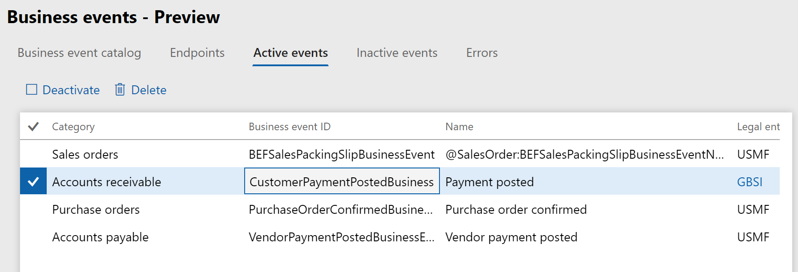

---
# required metadata

title: Business events and Microsoft Flow
description: This topics provides information about the business events that are available for consumption in Microsoft Flow via the Finance and Operations connector.
author: ibenbouzid
manager: AnnBe
ms.date: 08/07/2019
ms.topic: article
ms.prod: 
ms.service: dynamics-ax-applications
ms.technology: 

# optional metadata

# ms.search.form:  [Operations AOT form name to tie this topic to]
audience: IT Pro
# ms.devlang: 
ms.reviewer: sericks
ms.search.scope: Operations, Core
# ms.custom: [used by loc for topics migrated from the wiki]
ms.search.region: Global for most topics. Set Country/Region name for localizations
# ms.search.industry: 
ms.author: imbenbou
ms.search.validFrom: Platform update 27
ms.dyn365.ops.version: 2019-6-30 

---

# Business events and Microsoft Flow

[!include[banner](../../includes/banner.md)]

This topic provides steps detailing how to configure and consume a Microsoft Dynamics 365 for Finance and Operations business event from a Microsoft Flow endpoint.

This topic shows how to perform the following tasks:

-   Create a new Microsoft Flow.
-   Trigger a business event.

## Create a new Microsoft Flow

1.  Sign in to Microsoft Flow portal.

2.  Select an existing environment where you have the permissions needed to create a flow resource. The default environment is open to all companies.

3.  Select **New \> Create from blank**.

4.  Search for **Dynamics 365 for Finance and Operations** and select the connector.
     
5.  You will notice a trigger for Finance and Operations named **When a Business Event occurs**. Select this trigger.

6.  Select your environment instance, category, event name, and legal entity. 
    > [!TIP]
    > Take advantage of the auto-complete that Flow provides by entering only part of the environment instance URL or part of the event name.

    

7.  Select the **New Step** button to add a new action.

8.  Search for the **Parse JSON** data operation. This step is needed to parse the message with the schema of the data contract provided by Finance and Operations.

    

9.  Select the content field of **Parse Json** action, then the **Body** output from the previous step should appear as an option. Select **Body**.

    

10. Enter the schema of the contract received from Finance and Operations. Because Finance and Operations provides only a sample payload you can use the Microsoft Flow capability to generate a schema from a payload. Go back to Finance and Operations, select an event in the catalog (for example, Customer Payment) and select the **Download schema** link. This will download a text file. Open the text file and copy the content.

    

11. Go Back to Microsoft Flow and select the **Use sample payload to generate schema** link. Paste your text file content and select **Done**.

    

12. Depending on the quality of your sample payload, your generator will not be able to distinguish between an integer and a real number. This is true if the real number is provided as a whole number in the sample payload. Review your generated schema and check if you need to change an “integer” into “number”. (In JSON, a “number” data type means real number).

    

13.  Choose another final action to consume the business event content. For instance, you can send an email (or post a text message to Teams) to notify the customer about payment details. Search for the **Send email** action, then sign in to your Office 365 account.

14.  Fill in the message with the required fields.

   

15. Save Flow.

## Trigger a Business Event

Microsoft Flow can configure Finance and Operations automatically for you. After you save your Flow it creates an endpoint in Finance and Operations, then it activates the business event for you. There is no remaining configuration step in Finance and Operations apart from verifying that the endpoint has been correctly configured before triggering an event.

1. Sign in to the Finance and Operations client.

2.  Go to **System Administration \> Setup \> Business Events**.

3.  Select **Endpoints**.

4.  Verify that a new endpoint has been created with a GUID appended in the name.

    

5.  If you check the **Active events** tab you can also verify that “**Payment Posted**” is activated for legal entity GBSI.

    

6.  The final step is to trigger the business event of a posted customer payment and check whether the Flow runs and you receive an email with customer payment details.

## Troubleshooting a Flow
Here are some troubleshooting suggestions:
- Microsoft Flow provides a full history of runs so can review this information to determine what might be wrong with a failing Flow.
- When reviewing a failed run, carefully review the inputs and outputs of trigger and action blocks. 
- After changes have been made to Flow, go to the latest run or a particular run, and **Resubmit** the inputs to run the Flow again.
