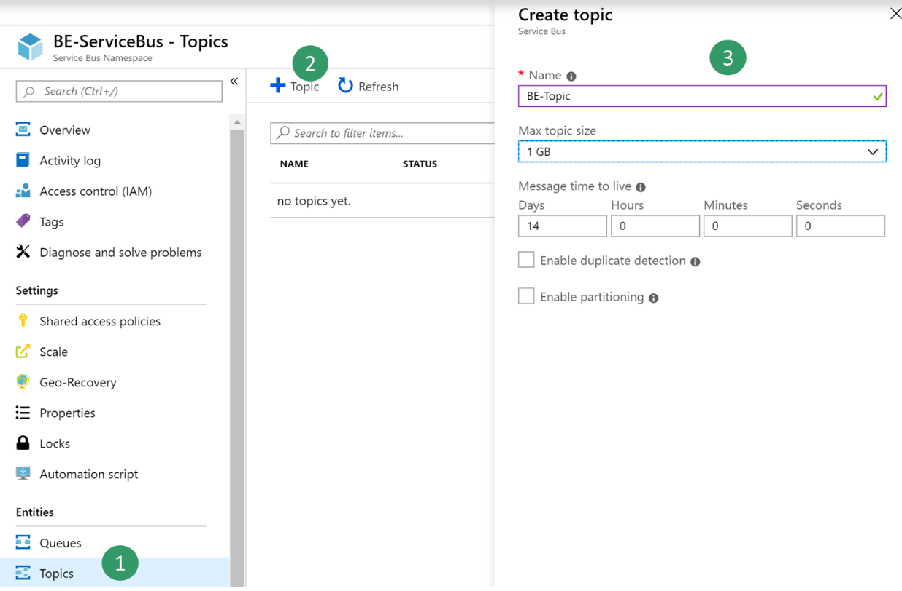
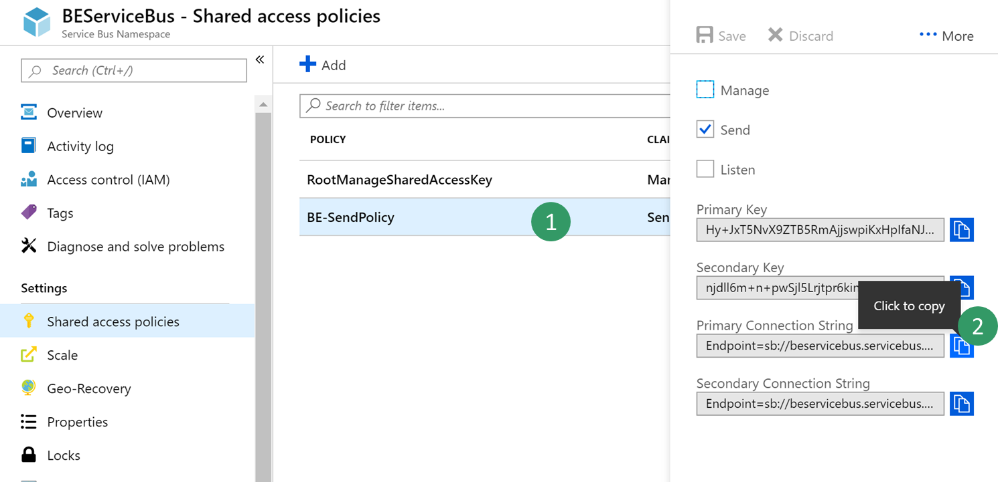
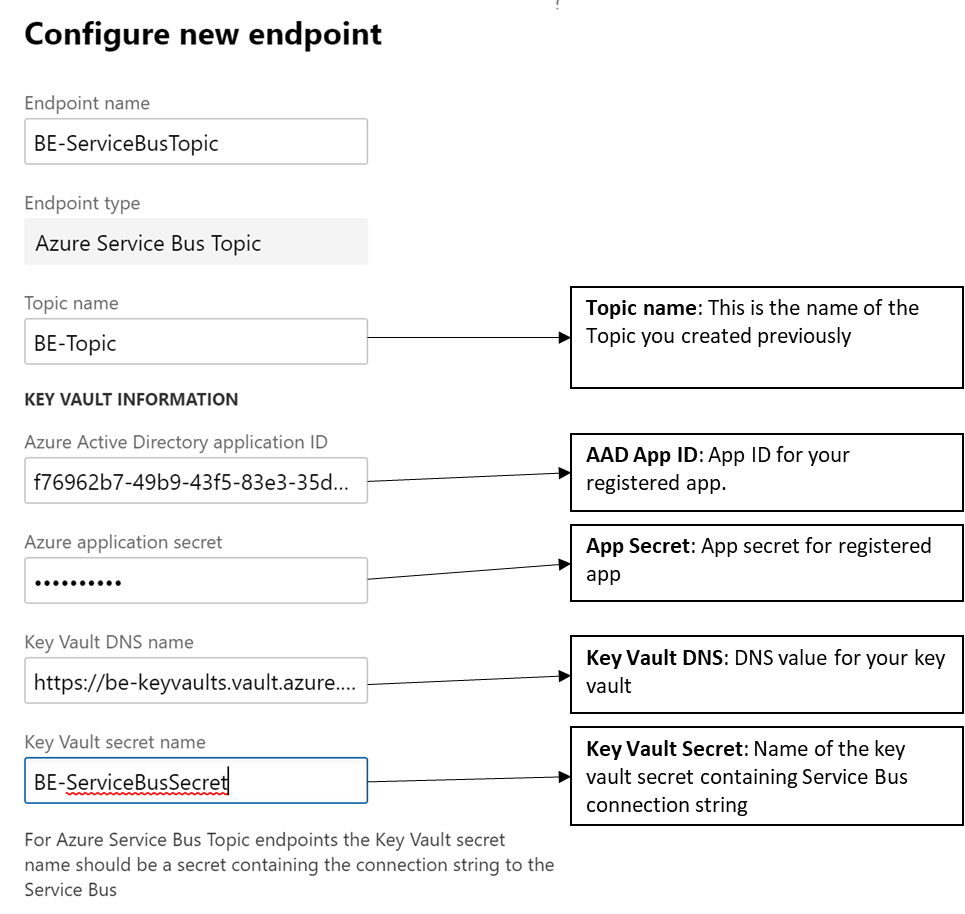
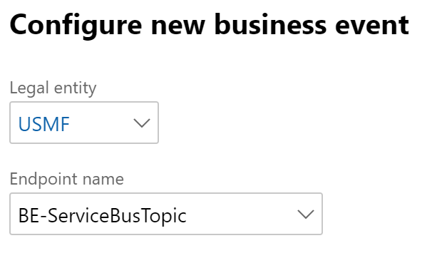
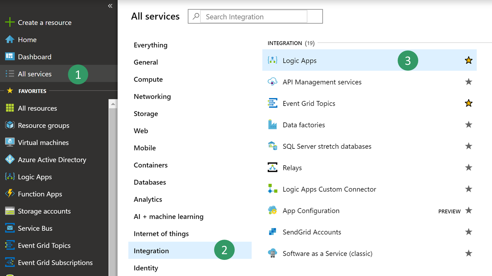
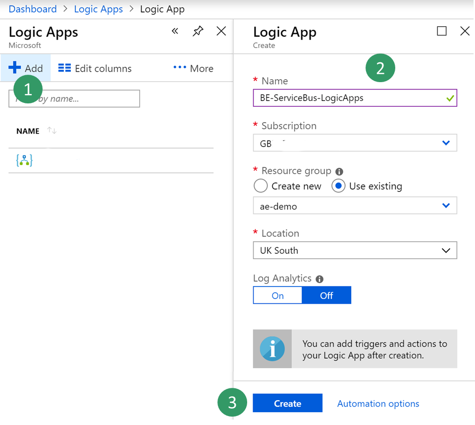
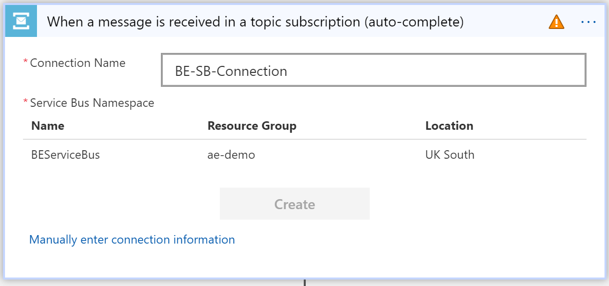
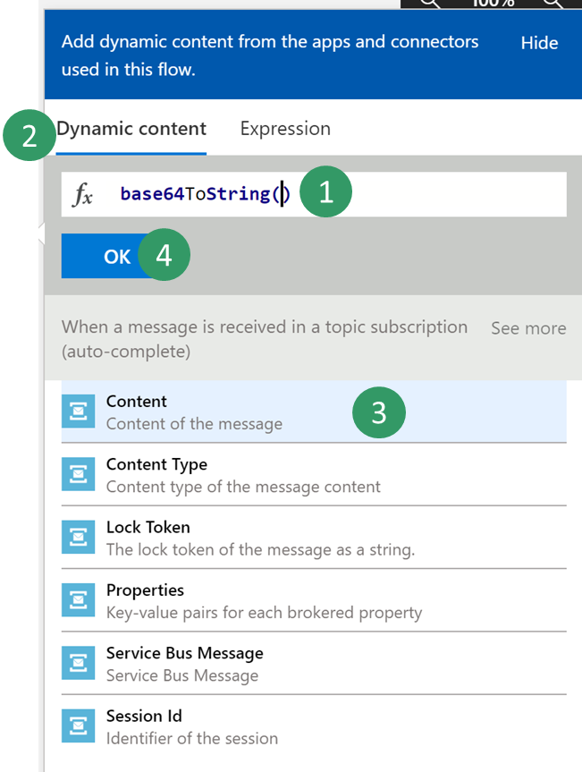
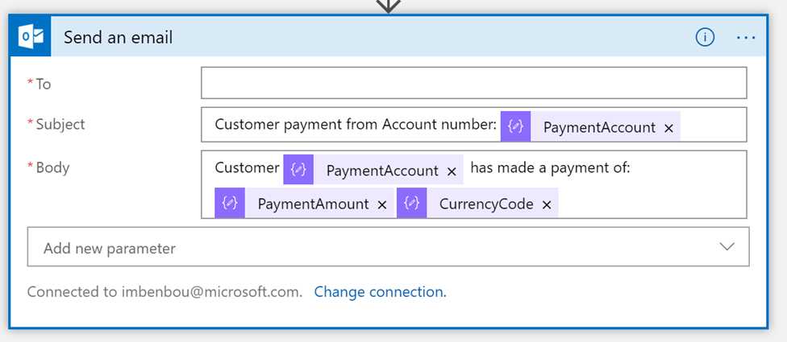

---
# required metadata

title: Consume business events with Azure Service Bus
description: This topic explains how to configure an Azure Service Bus endpoint with Dynamics 365 Finance and Operations and how to consume a business event form Azure Service Bus.
author: ibenbouzid
manager: AnnBe
ms.date: 07/12/2019
ms.topic: article
ms.prod: 
ms.service: dynamics-ax-applications
ms.technology: 

# optional metadata

# ms.search.form:  [Operations AOT form name to tie this topic to]
audience: IT Pro
# ms.devlang: 
ms.reviewer: sericks
ms.search.scope: Operations, Core
# ms.custom: [used by loc for topics migrated from the wiki]
ms.search.region: Global
# ms.search.industry: 
ms.author: imbenbou
ms.search.validFrom: Platform update 27
ms.dyn365.ops.version: 2019-6-30 

---
# Consume business events with Azure Service Bus
This topic explains how to configure an Azure Service Bus endpoint with Dynamics 365 Finance and Operations and how to consume a business event from Azure Service Bus.

## Scenario overview
Security best practices recommend storing connection strings outside of applications application but in a Key Vault drive and giving applications the right access to the key vault keys, secrets or certificates.

This has many benefits, first, if someone gets access to the application database he will not be able to get the 3rd party connection string. Second, maintainability becomes easier as there is only one place where we need to update connection strings especially when multiple applications access the same resources.

The process includes the following procedures:

1.   Create a new Service Bus Namespace
2.   Create a new Azure Service Bus topic and subscription
3.   Create a new Key Vault to store Service Bus key
4.   Register an Azure App with permissions to access the key vault on behalf of Finance and Operations
5.   Configure a Business Events Endpoint in F&O
6.   Consume your business event

## Create a new Service Bus namespace

1.  Log into the Azure Portal.

2.  Select **All services \> Integration \> Service Bus**

3.  Click **Add** to create a new Service Bus Namespace, and then fill in the parameters. Select the **Standard** pricing tier. You can create a new resource group as a container for your lab or use an existing one.

    > [!Note]
    > With the **Basic** pricing tier, you can create only Queues. You need to select the **Standard** pricing tier for Topics.

4.  Once all parameters are filled, click **Create**.

## Create a new Service Bus Topic and Subscription

1.  Select the Service Bus you just created, then create a new topic.

    

2.  Select the newly created Topic, and then create a new subscription called BE-USMF.

    

3.  Go back to your Service Bus panel and create a new shared access policy to send events. Only the **Send** policy is needed to send events to the Service Bus Topic.

    

4.  Select the new send policy, and then copy the **Primary Connection String** and save it for later usage.

    

## Create a Key Vault

For this procedure, you will have to create a Key Vault to store the connection string you copied above. A key vault is a secure drive used to store keys, secrets, and certificates. Instead of storing the connection string in Finance and Operations, it is more common and secure to store it in a key vault, and then register a new application with Azure active directory that will have the right to retrieve the secret form the key vault on behalf of Finance and Operations.

1.  Select **All services \> Security \> key vaults**.

2.  Create a new key vault within your resource group and **default parameters**

    

3.  Select **Overview** and copy the key vault URL **DNS Name** and save it for later use.

    

4.  Select **BE-key vault \> Secrets \> Generate/Import** and choose a new name for your secret and **copy** the service bus **connection string** you saved earlier.

    

5.  Click **Create**.

## Register a new Application

For this exercise, you will register a new application with Azure AD and give read and retrieve access to key vault secrets. Then this application will be used by F&O to retrieve Service Bus Secrets

1.  Select **All services \> Security \> Azure Active Directory**

    

2.  Select **App registrations (preview) \> New registration** then type a new name for your application

    

3.  Click on **Register**

4.  **Select** the new application then **Certificates & Secret\> New client secret**. Then type a name for your secret set it as **never expires** and click on **Add**.

   

5.  **Copy your new secret** for later step. Secrets are visible only once, if you forget to copy it you will need to delete it and create a new one.

   

6.  Select **Overview** and **copy your application ID** and save it for later usage

    

7.  Then go back to the previously created Key vault by selecting **All services \> Security \> key vaults**

    

8.  Select **your key vault \> Access policies\> Add new**

    

9.  **Select** your **new registered application** in the principal field then you need only **Get and List** Secret permissions to retrieve key vault secrets.

    

10.  **Save** your new access policy.
    
     

## Configure a Business Events Endpoint in F&O

1.  Log into the Dynamics client

2.  Go to **System Administration \> Setup \> System Parameters**

3.  Click on the **Business Events** tab

4.  Click on **Business Events**

5.  Click **Endpoints**

6.  Click **New**

7.  Select **Azure Service Bus Topic**

    

8.  Click **Next**

9.  Provide the necessary parameters value

    

10. Then click **OK**

## Consuming a Business Event

Scenario/business problem

The business scenario is to send an email or a message to a team channel whenever a customer payment has been posted for USMF. The message needs to contain some details as the Customer Account Number, Customer Name and Amount of payment.

1.  **Activate** the Customer payment posted business event for USMF.

    

2.  Once you activate a Business Event with a new endpoint, F&O sends a test message to verify that the configuration was right and to cash the connection. In order to verify that the test message has been received **Navigate** to Azure and select your service bus topic **BE-Topic**

3.  From there jump into your **Service Bus Subscription BE-USMF** that you created earlier

4.  **Verify** that the message count of your subscription is showing a value of at least 1. If this is not the case **wait for the batch job** to pick up your message.

    

5.  Select **All services\> Integration\> Logic Apps**

    

6.  Then **Create** a new logic apps in your resource group

    

7.  Once your Logic Apps resource has been created choose option to create a **Blank Logic Apps**

8.  Then **search** for **Service Bus** and **select** it.

    

9.  **Select** trigger called **“When a message is received in a topic subscription (auto-complete)”**.

    **Note:** Auto complete means that once the message is retrieved it is deleted from the subscription queue. Peek-lock will authorize concurrent consumers and will need a call to Service Bus “complete” API command to delete the message.

    

10. As it is the first time Logic Apps will access your Service Bus it asks you for a **new connection** that will cash connection details as Service Bus Namespace URL and Credential. **Select** your **Service Bus namespace** and **give a name** to your new connection.

    

11. Then choose the **RootManageSharedAccessKey** policy for your Logic Apps and select **Create**.

    **Note**: The send policy can’t be used here as we want to retrieve messages instead. A best practice would have been to create a new policy for our use case with Listen permission only.

    

12. **Select** your trigger parameters with the right **topic name** and **subscription name** you created.

    **Note** that this API polls Service Bus for new messages continually with a configurable recurrence (each 3 minutes by default). If the volume of messages is low this API will have a cost impact for unnecessary triggers as Logic Apps is priced per trigger calls and action runs. However, a push architecture is possible leveraging Event Grid in the middle. Service Bus can push events to Event Grid when there are messages in a queue or a subscription. For more details please refer to following article: <https://docs.microsoft.com/en-us/azure/service-bus-messaging/service-bus-to-event-grid-integration-concept>

    

13. **Select New Step** button to add a new action.

14. **Search** for **Parse Json** data operation. This step is needed to be able to parse our message with the schema of our data contract provided by F&O.

    

15. The body content received form the service bus is encoded into **base64** so we need to transform into string before parsing the json payload. **Select** the **Content** input Field and on the side bar select **Expression** tab then type the following expression **Base64ToString().**

    

16. Put your **cursor** between the parenthesis and **select** the **Dynamic content** tab to look for the **Content of the message** from the previous service bus trigger. Then select the Content and click on **OK**.

    

17. Now we need to type in the schema of the contract received from F&O. However, F&O provides only a sample payload instead. Hence, we can use Logic Apps capability to generate a schema from a payload. **Go back** to **F&O**, **select** your **event in the catalog** and **click on download Schema** link. This will download a text file. **Open** the text file and **copy** the content.

    

18. **Go Back** to Logic Apps **click** on “**Use sample payload to generate schema**” link. Then **past** you’re the text file content and click on **Done**

    

19. Depending on the quality of your sample payload, your generator will note recognize an Integer from a real especially if the real is provided as a whole number in the sample payload. Review your generated schema and check if you need to change an “integer” filed into “number”. (in Json a “number” data type means real).

    

20. Then choose another final action like to send an email to notify with customer payment details. **Search** for **send email** action, then login to your Office365 account.

    

21. Then fill-in the message with the required fields.

    

22.  **Save** your logic apps.

23. Then final step is to **trigger the Business Event** by posting a customer payment then check whether the logic Apps runs and whether you receive an email with customer payment details
