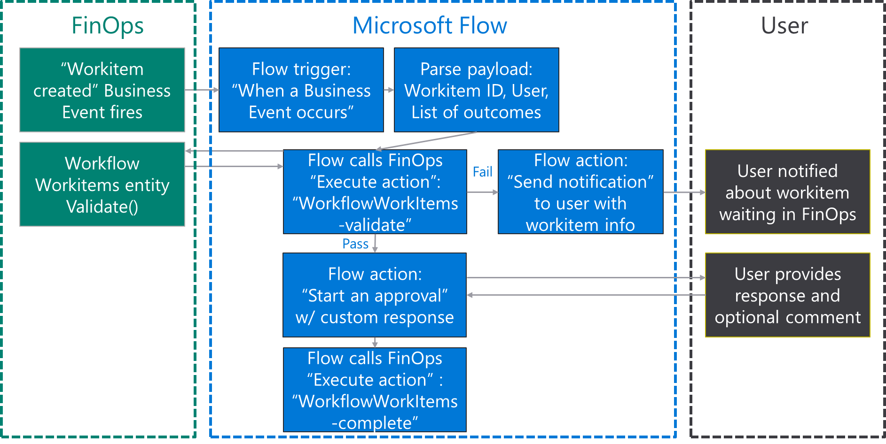
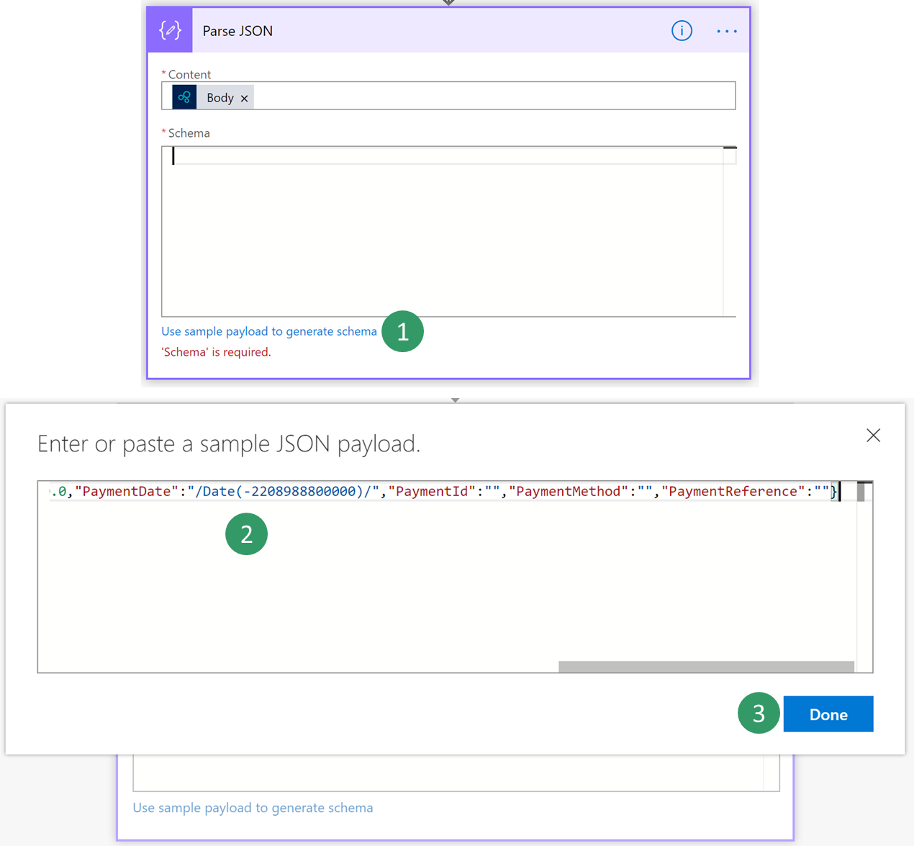
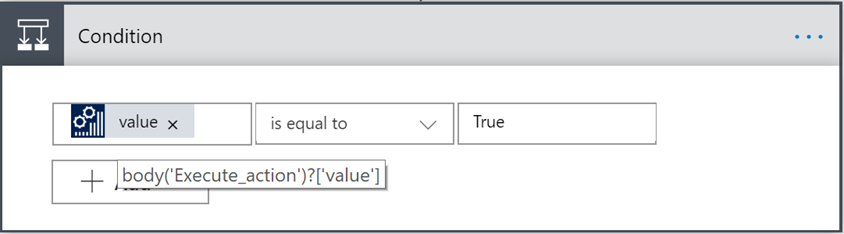
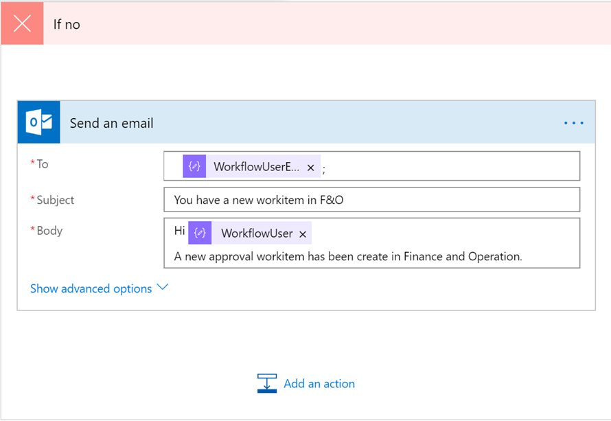
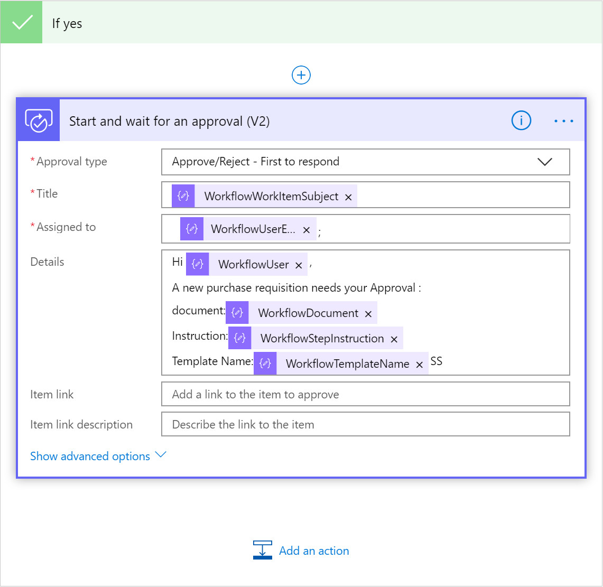
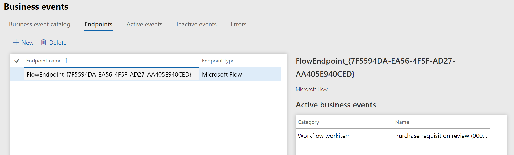
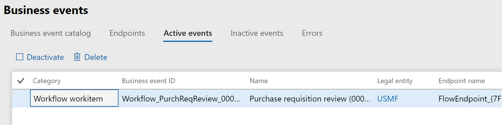

---
# required metadata

title: Consume workflow approval business events
description: This topic explains how to configure and consume a workflow business event with Microsoft Flow for a purchase requisition
approval.
author: ibenbouzid
manager: AnnBe
ms.date: 07/18/2019
ms.topic: article
ms.prod: 
ms.service: dynamics-ax-applications
ms.technology: 

# optional metadata

# ms.search.form:  [Operations AOT form name to tie this topic to]
audience: IT Pro
# ms.devlang: 
ms.reviewer: sericks
ms.search.scope: Operations, Core
# ms.custom: [used by loc for topics migrated from the wiki]
ms.search.region: Global 
# ms.search.industry: 
ms.author: imbenbou
ms.search.validFrom: Platform update 27
ms.dyn365.ops.version: 2019-6-30 

---

# Consume workflow approval business events

The objective of this lab is to provide guided steps of how to configure and consume a Workflow Business Event with Microsoft Flow for a purchase requisition approval.

In order to complete this lab, you will need a minimum application version of 10.0.2 with PU26

Scenario overview
=================

The below logical diagram shows the high-level process view you will need to configure with Microsoft Flow.

-   F&O fires a business event whenever a new approval start

-   Microsoft flow F&O triggers start and call back an Odata action to check that the workflow with Id provided form the trigger is running.

-   If the check fails, we notify the user by email of the new workitem

-   If the check is successful we start a new Microsoft Flow Approval.

-   Last step is the complete the workflow with the outcome of the approval be it Approve or Reject.

    

Exercise 1: Create a new Microsoft Flow
=======================================

1.  Log into Microsoft Flow portal

2.  Select an existing environment where you have the right to create a flow resource - (default) environment is open to all company.

3.  Select **New \> Create from blank**

4.  Search for **Dynamics 365 for Finance and Operations** and **select** the connector.

5.  You will notice a new trigger for Finance and Operations called “**When a Business Event occurs**”. Select it.

    

6.  Then **select** your environment instance, Category: **Workflow workitem**, Event Name: **Purchase requisition review (000062) – Approve purchase requisitions** and any Legal entity.

    

7.  **Select New Step** button to add a new action:

8.  **Search** for **Parse Json** data operation. This step is needed to be able to parse our message with the schema of our data contract provided by F&O.

    

9.  **Select** the content field of “**Parse Json**” action then the **Body** output from the previous step should appear as an option. Select **Body**.

    

10. Now we need to type in the schema of the contract received from F&O. However, F&O provides only a sample payload instead. Hence, we can use Microsoft Flow capability to generate a schema from a payload. **Go back** to **F&O**, **select** workflow 00062 **event in the catalog** and **click on download Schema** link. This will download a text file. **Open** the text file and **copy** the content.

    

11. **Go Back** to Microsoft Flow **click** on “**Use sample payload to generate schema**” link. Then **past** your text file content and click **Done**

    

12. The add a new step as follows to call a workflow action that validate whether a workflow with the right instance id is running and awaiting approval.

    

13. Then add a new condition control step to check the result of the validate action. The output to use will not show up from the dynamics field you will need to type manually the following expression: **Body(‘Execute_action’)?[‘value’]** Then click on **OK.**

    

    **Note:** Next time you open your workflow, you will notice that the expression will be updated to show the ‘**value**’ field as below with a F&O icon.

    

14. The condition control creates automatically two branches for Yes/No results. If the validate step result is ‘No” we need to alert by email the user that a new task is needing his attention and needs to login to F&O client.

    The email that the Workflow Business Event will return is the workflow Approver one. If this has not been configured in your F&O demo environment, you can use your email instead for demo purpose.

    

15. Then if the validation is successful we need to start a new Microsoft approval step. Choose within the Yes container a new action called **Start and wait for an approval (v2)**. And filling the details as shown in the picture. Again, you can use your email in the **Assign** field for demo purpose if your workflow approver user has not been configured in your demo environment.

    

16. Last step is to complete the F&O Workflow approval with the outcome from the Microsoft flow approval step. You need to add a new **F&O Execute Action** step within the “Yes” container. And fill the fields with **WorkflowWorkitem-complete** action and **WorkflowWorkitemInstanceID** parameter. Because approval step can support multiple approver the response output is an Array. Thus, as soon as you select it as an input for an action Microsoft flow automatically embed your action within an **Apply to each** container.

    

17. Then click **Save**

Exercise 2: Trigger a Business Event
====================================

Microsoft Flow can configure F&O automatically for you. Once you save your Flow it creates for you an endpoint in F&O then it activates the Business Event for you. There is no remaining configuration step in F&O apart from verifying that the endpoint has been correctly configured then triggering an event.

1.  Log into the Dynamics client

2.  Go to **System Administration \> Setup \> Business events**

3.  Click on **Business Events**

4.  Click **Endpoints**

5.  Then Verify that a new Endpoint has been created with a GUID appended in the name.

    

6.  If you check the **Active events** tab you can also verify that “**Workflow workitem**” is activated for USMF

    
