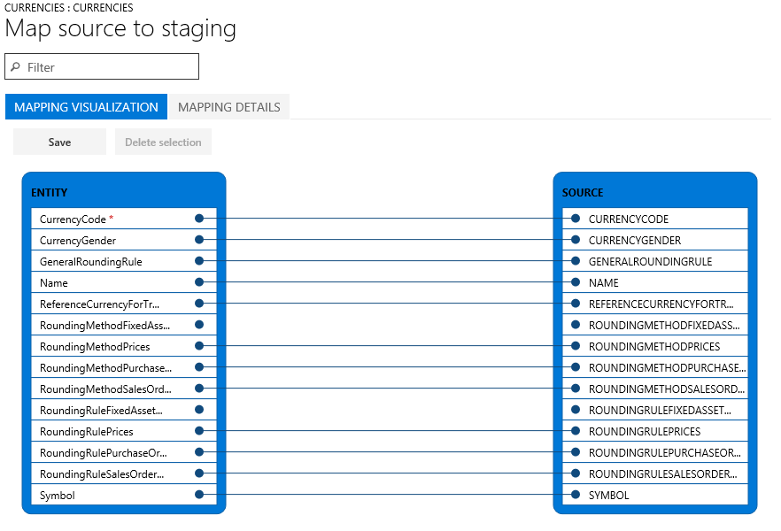
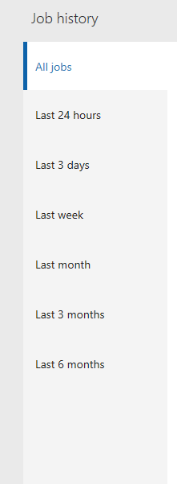

---
# required metadata

title: Data import and export jobs
description: Use the Data management workspace to create and manage data import and export jobs.
author: Sunil-Garg
manager: AnnBe
ms.date: 08/28/2017
ms.topic: article
ms.prod: 
ms.service: dynamics-ax-platform
ms.technology: 

# optional metadata

# ms.search.form: 
# ROBOTS: 
audience: Application user
# ms.devlang: 
ms.reviewer: margoc
ms.search.scope: Operations
# ms.tgt_pltfrm: 
ms.search.region: Global
# ms.search.industry: 
ms.author: sunilg
ms.search.validFrom: 2016-02-28
ms.dyn365.ops.version: AX 7.0.0

---

# Data import and export jobs

[!include[banner](../includes/banner.md)]

To create and manage data import and export jobs in Microsoft Dynamics 365 for Finance and Operations, Enterprise edition, you use the **Data management** workspace. By default, the data import and export process creates a staging table for each entity in the target database. Staging tables let you verify, clean up, or convert data before you move it.

> [!NOTE]
> This topic assumes that you are familiar with [data entities](data-entities.md).

## Data import/export process
Here are the steps to import or export data.

1. Create an import or export job where you complete the following tasks:

    - Define the project category.
    - Identify the entities to import or export.
    - Set the data format for the job.
    - Sequence the entities, so that they are processed in logical groups and in an order that makes sense.
    - Determine whether to use staging tables.

2. Validate that the source data and target data are mapped correctly.
3. Verify the security for your import or export job.
4. Run the import or export job.
5. Validate that the job ran as expected by reviewing the job history.
6. Clean up the staging tables.

The remaining sections of this topic provide more details about each step of the process.

## Create an import or export job
A data import or export job can be run one time or many times.

### Define the project category
We recommend that you take the time to select an appropriate project category for your import or export job. Project categories can help you manage related jobs.

### Identify the entities to import or export
You can add specific entities to an import or export job or select a template to apply. Templates fill a job with a list of entities. The **Apply template** option is available after you give the job a name and save the job.

### Set the data format for the job
When you select an entity, you must select the format of the data that will be exported or imported. You define formats by using the **Data sources setup** tile. Many organizations start from the formats that are included by default in the demo data set. Here is a list of some of these formats:

- AX (for data that must be imported or exported in the same format that is used for Microsoft Dynamics 365 for Finance and Operations, Enterprise edition)
- ColonSeparated
- CSV
- Excel
- Package

### Sequence the entities
Entities can be sequenced in a data template, or in import and export jobs. When you run a job that contains more than one data entity, you must make sure that the data entities are correctly sequenced. You sequence entities primarily so that you can address any functional dependencies among entities. If entities don’t have any functional dependencies, they can be scheduled for parallel import or export.

#### Execution units, levels, and sequences
The execution unit, level in the execution unit, and sequence of an entity help control the order that the data is exported or imported in.

- Entities in different execution units are processed in parallel.
- In each execution unit, entities are processed in parallel if they have the same level.
- In each level, entities are processed according to their sequence number in that level.
- After one level has been processed, the next level is processed.

#### Resequencing
You might want to resequence your entities in the following situations:

- If only one data job is used for all your changes, you can use resequencing options to optimize the execution time for the full job. In these cases, you can use the execution unit to represent the module, the level to represent the feature area in the module, and the sequence to represent the entity. By using this approach, you can work across modules in parallel, but you can still work in sequence in a module. To help guarantee that parallel operations succeed, you must consider all dependencies.
- If multiple data jobs are used (for example, one job for each module), you can use sequencing to affect the level and sequence of entities for optimal execution.
- If there are no dependencies at all, you can sequence entities at different execution units for maximum optimization.

The **Resequencing** menu is available when multiple entities are selected. You can resequence based on execution unit, level, or sequence options. You can set an increment to resequence the entities that have been selected. The unit, level, and/or sequence number that is selected for each entity is updated by the specified increment.

#### Sorting
Use can use the **Sort by** option to view the entity list in sequential order.

## Validate that the source data and target data are mapped correctly
Mapping is a function that applies to both import and export jobs.

- In the context of an import job, mapping describes which columns in the source file become the columns in the staging table. Therefore, the system can determine which column data in the source file must be copied into which column of the staging table.
- In the context of an export job, mapping describes which columns of the staging table (that is, the source) become the columns in the target file.

If the column names in the staging table and the file match, the system automatically establishes the mapping, based on the names. However, if the names differ, columns aren’t mapped automatically. In these cases, you must complete the mapping by selecting the **View map** option on the entity in the data job.

There are two mapping views: **Mapping visualization**, which is the default view, and **Mapping details**. A red asterisk (\*) identifies any required fields in the entity. These fields must be mapped before you can work with the entity. You can unmap other fields as you require when you work with the entity. To unmap a field, select the field in either the **Entity** column or the **Source** column, and then select **Delete selection**. Select **Save** to save your changes, and then close the page to return to the project. You can use the same process to edit the field mapping from source to staging after you import.

You can generate a mapping on the page by selecting **Generate source mapping**. A generated mapping behaves like an automatic mapping. Therefore, you must manually map any unmapped fields.

## Verify the security for your import or export job
Access to the **Data management** workspace can be restricted, so that non-administrator users can access only specific data jobs. Access to a data job implies full access to the execution history of that job and access to the staging tables. Therefore, you must make sure that appropriate access controls are in place when you create a data job.

### Secure a job by roles and users
Use the **Applicable roles** menu to restrict the job to one or more security roles. Only users in those roles will have access to the job.

You can also restrict a job to specific users. When you secure a job by users instead of roles, there is more control if multiple users are assigned to a role.

### Secure a job by legal entity
Data jobs are global in nature. Therefore, if a data job was created and used in a legal entity, the job will be visible in other legal entities in the system. This default behavior might be preferred in some application scenarios. For example, an organization that imports invoices by using data entities might provide a centralized invoice processing team that is responsible for managing invoice errors for all divisions in the organization. In this scenario, it’s useful for the centralized invoice processing team to have access to invoice import jobs from all legal entities. Therefore, the default behavior meets the requirement from a legal entity perspective.

However, an organization might want to have invoice processing teams per legal entity. In this case, a team in a legal entity should have access only to the invoice import job in its own legal entity. To meet this requirement, you can configure legal entity–based access control on the data jobs by using the **Applicable legal entities** menu inside the data job. After the configuration is done, users can see only jobs that are available in the legal entity that they are currently signed in to. To see jobs from another legal entity, users must switch to that legal entity.

A job can be secured by roles, users, and legal entity at the same time.

## Run the import or export job
You can run a job one time by selecting the **Import** or **Export** button after you define the job. To set up a recurring job, select **Create recurring data job**.

## Validate that the job ran as expected
The job history is available for troubleshooting and investigation on both import and export jobs. Historical job runs are organized by time ranges.

Each job run provides the following details:

- Execution details
- Execution log

Execution details show the state of each data entity that the job processed. Therefore, you can quickly find the following information:

- Which entities were processed
- For an entity, how many records were successfully processed, and how many failed
- The staging records for each entity

You can download the staging data in a file for export jobs, or you can download it as a package for import and export jobs.

From the execution details, you can also open the execution log.

## Clean up the staging tables
You can clean up staging tables by using the **Staging clean up** feature in the **Data management** workspace. You can use the following options to select which records should be deleted from which staging table:

- **Entity** – If only an entity is provided, all records from that entity’s staging table are deleted. Select this option to clean up all the data for the entity across all data projects and all jobs.
- **Job ID** – If only a job ID is provided, all records for all entities in the selected job are deleted from the appropriate staging tables.
- **Data projects** – If only a data project is selected, all records for all entities and across all jobs for the selected data project are deleted.

You can also combine the options to further restrict the record set that is deleted.
