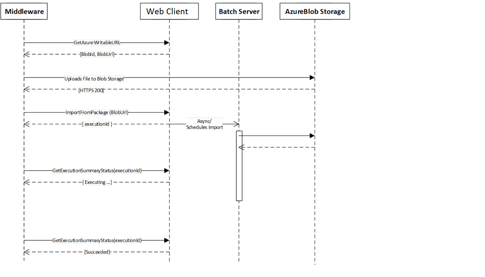
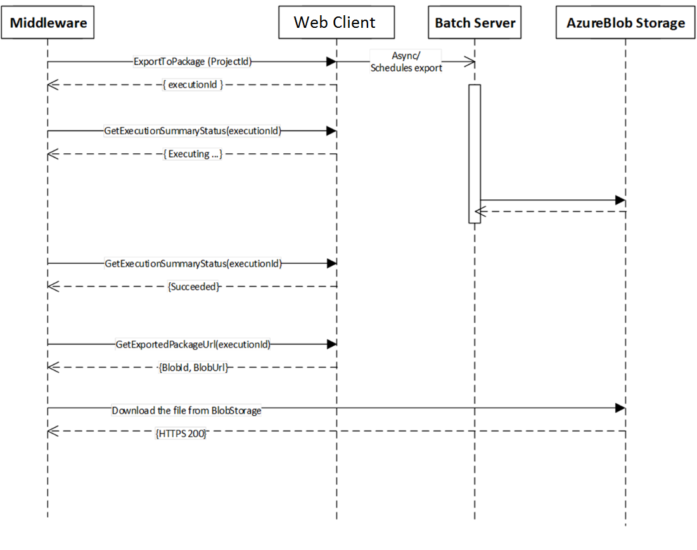

---
# required metadata

title: Data management package REST API
description: This topic describes the data management framework's package REST API.

author: Sunil-Garg
ms.date: 03/30/2018
manager: AnnBe
ms.topic: article
ms.prod: 
ms.service: dynamics-ax-platform
ms.technology: 

# optional metadata

# ms.search.form: 
# ROBOTS: 
audience: Developer
# ms.devlang: 
ms.reviewer: margoc
ms.search.scope: Operations
# ms.tgt_pltfrm: 
ms.search.region: Global
# ms.search.industry: 
ms.author: sunilg
ms.search.validFrom: 2017-03-31
ms.dyn365.ops.version: Platform update 5

---

# Data management package REST API

[!include [banner](../includes/banner.md)]

This topic describes the data management framework's package representational state transfer (REST) application programming interface (API). The package API lets you integrate with Microsoft Dynamics 365 for Finance and Operations, by using data packages. The REST API can be used with both cloud and on-premises deployments. For on-premises deployments this functionality is currently available for version 7.2, Platform update 12, build 7.0.4709.41184, and later.

Although on-premises support has been added, API names have not been changed, so that we can keep a single API set for both cloud and on-premises deployments.

## Choosing an integration API
Two APIs in Finance and Operations support file-based integration scenarios: the data management framework's package API and the recurring integrations API. Both APIs support both data import scenarios and data export scenarios. The following table describes the main decision points that you should consider when you're trying to decide which API to use.

| Decision point      | Recurring integrations API | Data management framework's package API |
|---------------------|--------------------------------------|-----------------------------|
| Scheduling          | Scheduling in Finance and Operations | Scheduling outside Finance and Operations |
| Format              | Files and data packages | Only data packages |
| Transformation      | Support for Extensible Stylesheet Language Transformations (XSLT) if the data file is in XML format | Transformations that are external to the system |
| Supported protocols | SOAP and REST | REST |
| Service type        | Custom service | Open Data Protocol (OData) action |
| Availability        | February 2016 release (RTW) and later | Platform update 5 and later |

If you decide that the recurring integrations API meets your requirement better than the data management framework's package API, see [Recurring integrations](recurring-integrations.md). The rest of this topic discusses the data management framework's package API.

## Authorization
The data management framework's package API uses OAuth 2.0 for authorizing access. The API must be called by using a valid OAuth access token. For more details about OAuth 2.0 and Microsoft Azure Active Directory (Azure AD), see [Authorize access to web applications using OAuth 2.0 and Azure Active Directory](/azure/active-directory/develop/active-directory-protocols-oauth-code). For on-premises deployments, Active Directory Federation Services (AD FS) will be used for authorization.

> [!NOTE]
> When you use the Client Credentials Grant flow, Finance and Operations maintains an access control list. You can find the access control list at **System administration** \> **Setup** \> **Azure Active Directory applications**. The **Azure Active Directory applications** page shows the approved client IDs and the user security mapping that should be enforced when the API is called by using the Client Credentials Grant flow.
>
> For on-premises deployments, this list must have a valid client ID from AD FS. Also, for on-premise use, the <baseurl> in the below examples must also append /namespaces/AXSF when connecting to Dynamics 365 for Finance and Operations.


## Import APIs
The following APIs are used to do file (data package) imports.

### GetAzureWritableUrl
The **GetAzureWritableUrl** API is used to get a writable blob URL. This method includes a shared access signature (SAS) token that is embedded in the URL. You can use this method to upload a data package to the Azure Blob storage container for Finance and Operations. For on-premises deployments, this API will still return the URL which has been abstracted to local storage.

> [!NOTE]
> An SAS is valid only during an expiry time window. Any request that is issued after the window has passed returns an error. For more information, see [Using shared access signatures (SAS)](/azure/storage/common/storage-dotnet-shared-access-signature-part-1).

```CSharp
POST /data/DataManagementDefinitionGroups/Microsoft.Dynamics.DataEntities.GetAzureWriteUrl
BODY
{
    "uniqueFileName":"<string>",
}
```

Here is an example of a successful response.

```json
HTTP/1.1 200 OK
{
    "@odata.context":"https://<baseurl>/data/$metadata#Edm.String",
    "value":{
        "BlobId":"{<GUID>}",
        "BlobUrl":"https://<baseurl_id>.blob.core.windows.net/dmf/<uniqueFileName>?<SAS Token>"
    }
}
```

**Input parameters**

| Parameter         | Description |
|-------------------|-------------|
| string packageUrl | A unique file name that is used to track blob IDs. You can include a globally unique identifier (GUID) to help guarantee a unique file name. |

**Output parameters**

| Parameter      | Description |
|----------------|-------------|
| string BlobId  | The blob ID of the allocated blob container. |
| string BlobUrl | A URL with an embedded SAS token. The URL can be used to write to blob storage. |

### ImportFromPackage
The **ImportFromPackage** API is used to initiate an import from the data package that is uploaded to the Azure Blob storage that is associated with your implementation of Finance and Operations. For on-premises deployments, the import will be initiated from the local storage to which the file was uploaded previously.

> [!NOTE]
> Starting platform update 12, ImportFromPackage will support composite entity. However, the limitation is to have only one composite entity in a package.

```CSharp
POST /data/DataManagementDefinitionGroups/Microsoft.Dynamics.DataEntities.ImportFromPackage
BODY
{
    "packageUrl":"<string>",
    "definitionGroupId":"<string>",
    "executionId":"<string>",
    "execute":<bool>,
    "overwrite":<bool>,
    "legalEntityId":"<string>"
}
```

Here is an example of a successful response.

```json
HTTP/1.1 200 OK
{
    "@odata.context":"https://<baseurl>/data/$metadata#Edm.String",
    "value":{
        "value":"<executionId>"
    }
}
```

**Input parameters**

| Parameter                | Description |
|--------------------------|-------------|
| string packageUrl        | The URL of the data package in the Azure Blob storage that is associated with Finance and Operations. |
| string definitionGroupId | The name of the data project for import. |
| string executionId       | The ID to use for the job. If an empty ID is assigned, a new execution ID will be created. |
| bool execute             | Set this parameter to **True** to run the target step. Otherwise, set it to **False**. |
| bool overwrite           | This must always be set to **False** when using a composite entity in a package. Otherwise, set it to **True** |
| string legalEntityId     | The legal entity for the data import. |

**Output parameters**

| Parameter          | Description |
|--------------------|-------------|
| string executionId | The execution ID of the data import. |

## Export APIs
The following APIs are used to do file (data package) exports.

### ExportToPackage
The **ExportToPackage** API is used to initiate an export of a data package. This is applicable to both cloud and on-premises deployments.

- The export data project must be created in Finance and Operations before you call this API. If the project doesn't exist, a call to the API returns an error.
- If change tracking has been turned on, only records that have been created or updated since the last run are exported. (In other words, only the delta is returned.)

```CSharp
POST /data/DataManagementDefinitionGroups/Microsoft.Dynamics.DataEntities.ExportToPackage
BODY
{
    "definitionGroupId":"<Data project Id>",
    "packageName":"<Name to use for downloaded file.>",
    "executionId":"<Execution Id if it is a rerun>",
    "reExecute":<bool>,
    "legalEntityId":"<Legal entity Id>"
}
```

Here is an example of a successful response.

```json
HTTP/1.1 200 OK
{
    "@odata.context":"https://<baseurl>/data/$metadata#Edm.String",
    "value":{
        "value":"<executionId>"
    }
}
```

**Input parameters**

| Parameter                | Description |
|--------------------------|-------------|
| string definitionGroupId | The name of the data project for export. |
| string packageName       | The name of the exported data package. |
| string executionId       | The ID to use for the job. If an empty ID is assigned, a new execution ID will be created. |
| bool reExecute           | Set this parameter to **True** to run the target step. Otherwise, set it to **False**. |
| string legalEntityId     | The legal entity for the data import. |
	
**Output parameters**

| Parameter          | Description |
|--------------------|-------------|
| string executionId | The execution ID of the data export. |

### GetExportedPackageUrl
The **GetExportedPackageUrl** API is used to get the URL of the data package that was exported by a call to **ExportToPackage**. This is applicable to both cloud and on-premises deployments.

```CSharp
POST /data/DataManagementDefinitionGroups/Microsoft.Dynamics.DataEntities.GetExportedPackageUrl
BODY
{"executionId":"<Execution Id>"}
```

Here is an example of a successful response.

```json
HTTP/1.1 200 OK
{
    "@odata.context":"https://<baseurl>/data/$metadata#Edm.String",
    "value":{
        "value":"https://<baseurl_id>.blob.core.windows.net/dmf/<uniqueFileName>?<SAS Token>"
    }
}
```

**Input parameters**

| Parameter          | Description |
|--------------------|-------------|
| string executionId | The execution ID of the data project run. |

**Output parameters**

| Parameter      | Description |
|----------------|-------------|
| string BlobUrl | A blob URL that has an embedded SAS token. The URL can be used to download the exported data package. |

## Status check API	
The following APIs are used to check status. They are used during both import flows and export flows.

### GetExecutionSummaryStatus
The **GetExecutionSummaryStatus** API is used for both import jobs and export jobs to check the status of a data project execution job. This is applicable to both cloud and on-premises deployments.

```CSharp
POST /data/DataManagementDefinitionGroups/Microsoft.Dynamics.DataEntities.GetExecutionSummaryStatus
BODY
{"executionId":"<executionId>"}
```

Here is an example of a successful response.

```json
HTTP/1.1 200 OK
{
    "@odata.context":"https://<baseurl>/data/$metadata#Edm.String",
    "value":{
        "value":"<executionStatus>"
    }
}
```

**Input parameters**

| Parameter          | Description |
|--------------------|-------------|
| string executionId | The execution ID of the data project run. |

**Output parameters**

| Parameter                                 | Description |
|-------------------------------------------|-------------|
| DMFExecutionSummaryStatus executionStatus | The execution status. |

Here are the possible values for the execution status:

- Unknown
- NotRun
- Executing
- Succeeded
- PartiallySucceeded
- Failed
- Canceled

> [!NOTE]
> The file in the blob storage will remain in the storage for seven days, after which it will be automatically deleted.

## Import and export processes 
The following illustration shows how the data management package methods can be used to import data packages.



The following illustration shows how the data management package methods can be used to export data packages.



A sample console application is available on GitHub to showcase the data import and data export methods. For more information, go to <https://github.com/Microsoft/Dynamics-AX-Integration/tree/master/FileBasedIntegrationSamples/ConsoleAppSamples>.
