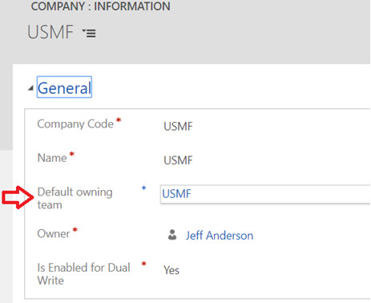

---
# required metadata

title: Company concept in Common Data Services
description: 
author: RamaKrishnamoorthy 
manager: AnnBe
ms.date: 07/15/2019
ms.topic: article
ms.prod: 
ms.service: dynamics-ax-applications
ms.technology: 

# optional metadata

ms.search.form: 
# ROBOTS: 
audience: Application User, IT Pro
# ms.devlang: 
ms.reviewer: rhaertle
ms.search.scope: Core, Operations
# ms.tgt_pltfrm: 
ms.custom: 
ms.assetid: 
ms.search.region: global
ms.search.industry: 
ms.author: ramasri
ms.dyn365.ops.version: 
ms.search.validFrom: 2019-07-15

---

## Company concept in Common Data Services

"Company" concept in F&O is both a legal/business construct, as well as a security and visibility boundary for data. F&O users are always working in the context of a single company. So, vast majority of the data is striped by company. We don't have an equivalent concept in CDS, but the closest one is "Business unit" and it is primarily a security and visibility boundary for user data. But it does not have the same legal/business implications as F&O company. 

For CDS integration, since Business Unit and Company are not equivalent constructs, we cannot force a 1:1 mapping between them. At the same time, it is necessary to ensure that by default a user will see the same records in F&O as that user sees in CDS. To support this, we introduce a new entity in CDS called cdm\_Company which* is* equivalent to Company in F&O. To ensure visibility of records is equivalent between F&O and CDS out of the box, we recommend the following setup of data in CDS: 

-   For each F&O Company that is dual written, an associated cdm\_Company record is created 
-   When a cdm\_Company is created and enabled for dual write, it creates a default Business Unit (BU) by the same name. That business unit gets a default team created automatically, but is not used.
-   A separate "Owner team" is created by the same name and also associated with that business unit. 
-   By default, any record created in F&O and dual-written to CDS will have its owner set to the DW "owner team", which is linked to the associated BU. 

The impact of this configuration is any F&O record related to the USMF company will be owned by a team linked to the USMF BU in CDS. So, any user who has access to that BU through a security role, set to BU-level visibility can now see those records. An example of how teams can be used to provide access to these records correctly is shown below. 

-   The "USMF Sales" team gives members of the team the "Sales manager" role. 
-   The Sales Manager role says people with the role can access any Account records which are members of the same BU as the user. 
-   The USMF Sales team is linked to the USMF BU mentioned earlier.  
-   This means members of the "USMF Sales" team can see any account owned by the "USMF DW" user, which would have come from the USMF company in F&O. 

As shown in the diagram, this one-to-one mapping between Business Unit, Company, and Team is just a starting point. In this example, a new "Europe BU" is manually created in CDS as the parent for both DEMF and ESMF. This new root BU is completely unrelated to Dual Write, but can be used to give members of the "EUR Sales" team access to both DEMF and ESMF account data by setting the data visibility to "Parent/Child BU" in the associated security role. 

A final element to discuss is how Dual Write knows *which* owner team to assign records to. This is controlled by the "Default owning team" field on the cdm\_Company record. When a cdm\_Company record is enabled for dual write, a plugin automatically creates the associated BU and owner team (if not yet existing) and will set the default owning team field. The administrator can change the default owning team to a different value, but can not clear the field as long as the entity is enabled for dual write. 

### Company striping and bootstrapping

CDS integration brings company parity through striping of data with company identifier. All company specific entities are extended to have a N:1 relationship with cdm\_company entity as shown below.

-   For a record, once a Company is added and saved, the value becomes read-only.​ So, users should make sure they choose the right company in the first place.
-   Only records having company data is eligible for dual-sync between F&O and CDS.
-   For the existing CDs data, an Administrator lead bootstrapping experience will be available soon.

