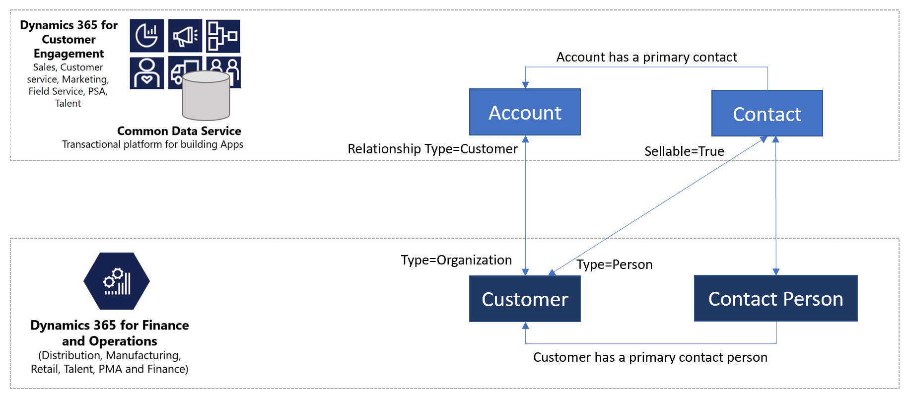
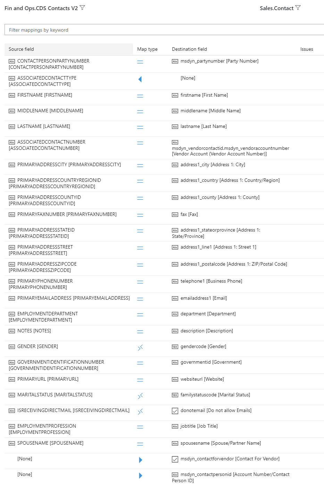
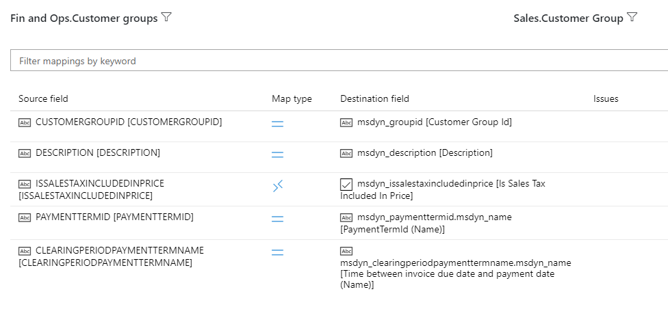
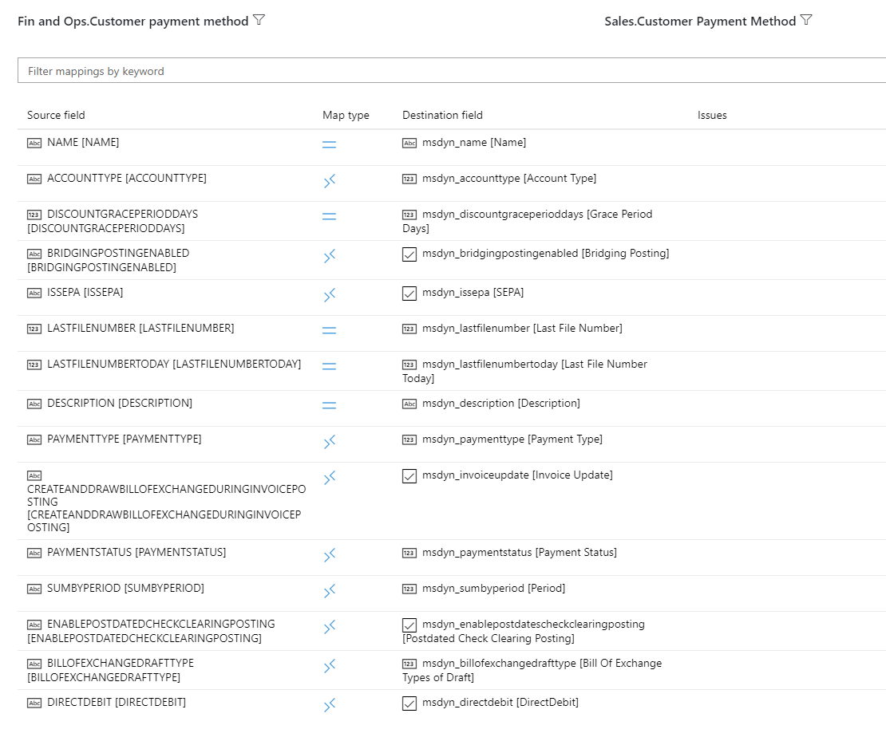
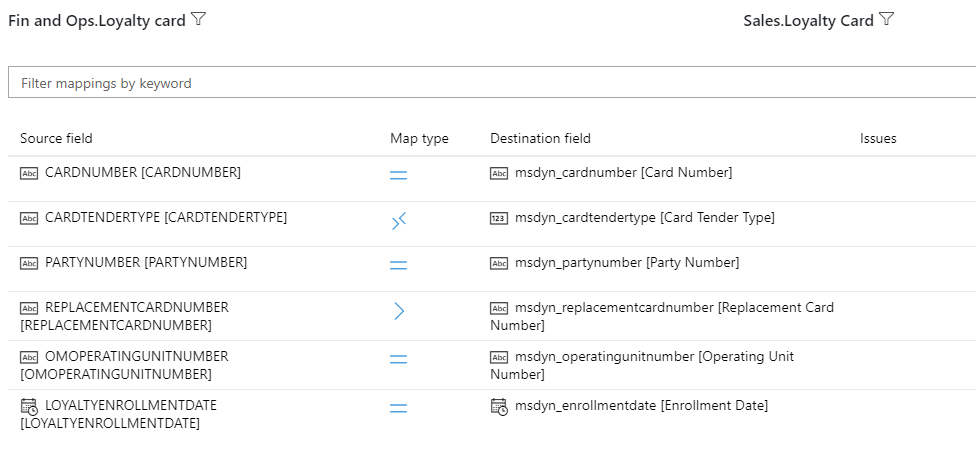
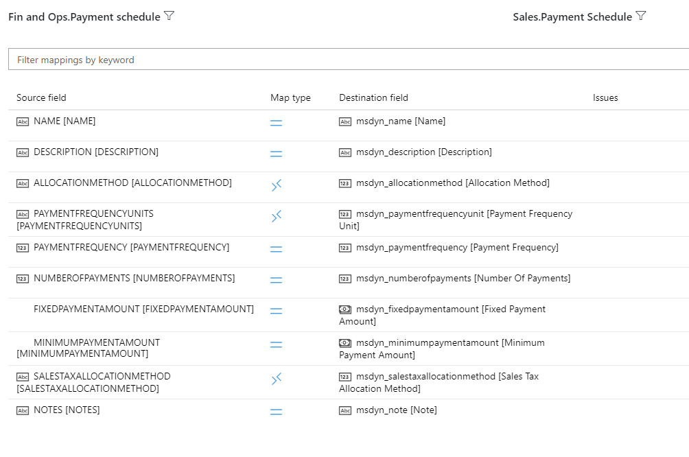
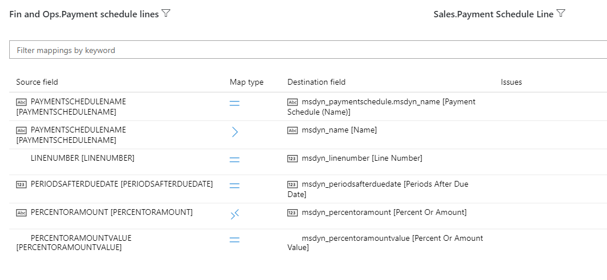
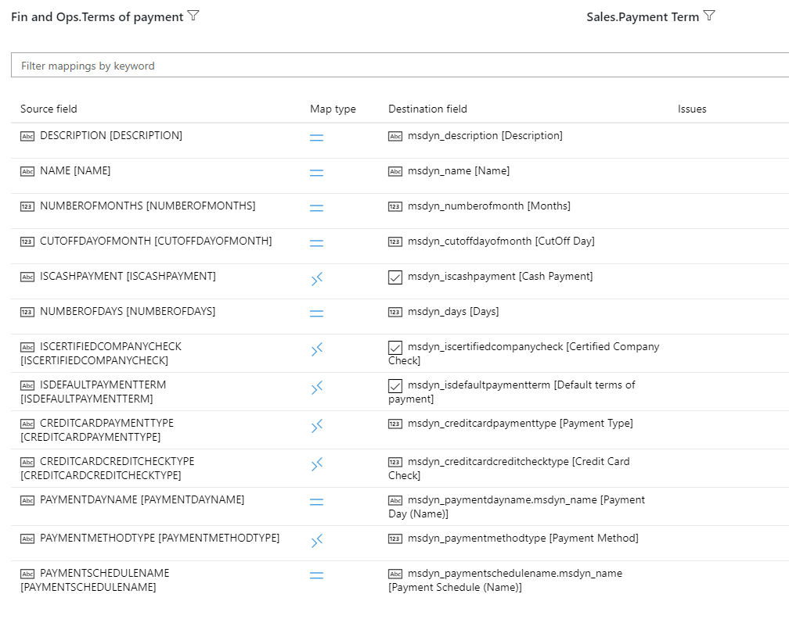
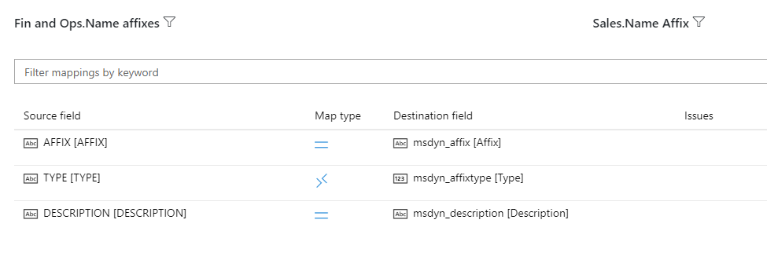

---
# required metadata

title: Integrated customer master
description: This topic describes the integration of customer data between Finance and Operations and Common Data Service.
author: RamaKrishnamoorthy 
manager: AnnBe
ms.date: 07/15/2019
ms.topic: article
ms.prod: 
ms.service: dynamics-ax-applications
ms.technology: 

# optional metadata

ms.search.form: 
# ROBOTS: 
audience: Application User, IT Pro
# ms.devlang: 
ms.reviewer: rhaertle
ms.search.scope: Core, Operations
# ms.tgt_pltfrm: 
ms.custom: 
ms.assetid: 
ms.search.region: global
ms.search.industry: 
ms.author: ramasri
ms.dyn365.ops.version: 
ms.search.validFrom: 2019-07-15

---

## Integrated customer master

[!include [banner](../includes/banner.md)]

[!include [preview](../includes/preview-banner.md)]

It's typical for customer records to be mastered in more than one application. For example, sales activity can bring in commercial customer records through a Sales application, and e-Commerce or retail sales can bring in customer records through a Finance and Operations application. Regardless of where the customer record originates, it's integrated behind the scenes across application boundaries and infrastructure differences. Integrated customer mastering helps handle multi-mastering scenarios and provides a comprehensive view of the customer to the Dynamics 365 application suite.

## Customer data flow

*Customer* is a well-defined concept in both Finance and Operations and Common Data Service. Therefore, the integration of customer data just involves harmonizing the customer concept between Finance and Operations and Common Data Service applications. The following illustration shows the customer data flow.

Customers can be broadly classified into two types: commercial/organizational customers and consumers/end users. These two types of customers are stored and handled differently in Finance and Operations and Common Data Service.

In Finance and Operations, both commercial/organizational customers and consumers/end users are mastered in a single table that is named **CustTable** (CustomerCustomerV3Entity), and they are classified based on the **Type** attribute. (If **Type** is set to **Organization**, the customer is a commercial/organizational customer, and if **Type** is set to **Person**, the customer is a consumer/end user.) The primary contact person information is handled through the SMMContactPersonEntity entity.

In Common Data Service, commercial/organizational customers are mastered in the Account entity and are identified as customers when the **RelationshipType** attribute is set to **Customer**. Both consumers/end users and the contact person are represented by the Contact entity. To provide a clear separation between a consumer/end user and a contact person, the **Contact** entity has a Boolean flag that is named **Sellable**. When **Sellable** is **True**, the contact is a consumer/end user, and quotations and orders can be created for that contact. When **Sellable** is **False**, the contact is just a primary contact person of a customer.

When a non-sellable contact participates in a quotation or order process, **Sellable** is set to **True** to flag the contact as a sellable contact. A contact that has become a sellable contact remains a sellable contact.

## Templates

Customer data includes all information about the customer, such as the customer group, addresses, contact information, payment profile, invoice profile, and loyalty status. A collection of entity maps works together during customer data interaction, as shown in the following table.

Finance and Operations    | Customer Engagement application
--------------------------|---------------------------------
Customer V3               | Account
Customer V3               | Contact
CDS Contacts V2           | Contact
Customer groups           | Msdyn\_customergroups
Customer Payment Method   | Msdyn\_customerpaymentmethods
Loyalty Card              | Msdyn\_loyaltycards
Payment Schedule          | Msdyn\_paymentschedules
Payment Schedule          | Msdyn\_paymentschedulelines
Payment day CDS           | Msdyn\_paymentdays
Payment day lines CDS     | Msdyn\_paymentdaylines
Terms of Payment          | Msdyn\_paymentterms
Name Affixes              | Msdyn\_nameaffixes

[!include [banner](../includes/dual-write-symbols.md)]

## Customer V3 to Account

This template synchronizes customer master information for commercial and organizational customers between Finance and Operations and Common Data Service.

<!--  -->

<!--  -->

Source field | Map type | Destination field
---|---|---
CUSTOMERACCOUNT | = | accountnumber
INVOICEADDRESSCITY | = | address2\_city
INVOICEADDRESSCOUNTRYREGIONISOCODE | = | address2\_country
INVOICEADDRESSCOUNTY | = | address2\_county
INVOICEADDRESSLATITUDE | \> | address2\_latitude
INVOICEADDRESSLONGITUDE | \> | address2\_longitude
INVOICEADDRESSSTATE | = | address2\_stateorprovince
INVOICEADDRESSSTREET | = | address2\_line1
INVOICEADDRESSZIPCODE | = | address2\_postalcode
CREDITLIMIT | = | creditlimit
DELIVERYADDRESSCITY | = | address1\_city
DELIVERYADDRESSCOUNTRYREGIONISOCODE | = | address1\_country
DELIVERYADDRESSCOUNTY | = | address1\_county
DELIVERYADDRESSLATITUDE | \> | address1\_latitude
DELIVERYADDRESSLONGITUDE | \> | address1\_longitude
DELIVERYADDRESSZIPCODE | = | address1\_postalcode
ORGANIZATIONNAME | = | name
ORGANIZATIONNUMBEROFEMPLOYEES | = | numberofemployees
PRIMARYCONTACTEMAIL | = | emailaddress1
PRIMARYCONTACTFAX | = | fax
PRIMARYCONTACTPHONE | = | telephone1
PRIMARYCONTACTTWITTER | = | primarytwitterid
PRIMARYCONTACTURL | = | websiteurl
SALESCURRENCYCODE | = | transactioncurrencyid.isocurrencycode
SALESMEMO | = | description
CREDITLIMITISMANDATORY | \>\< | msdyn\_creditlimitismandatory
CREDITRATING | = | msdyn\_creditrating
CUSTOMERGROUPID | = | msdyn\_customergroupid.msdyn\_groupid
IDENTIFICATIONNUMBER | = | msdyn\_identificationnumber
INVOICEACCOUNT | = | msdyn\_billingaccount.accountnumber
INVOICEADDRESS | \>\< | msdyn\_invoiceaddress
ISONETIMECUSTOMER | \>\< | msdyn\_onetimecustomer
ONHOLDSTATUS | \>\< | msdyn\_onholdstatus
PARTYCOUNTRY | = | msdyn\_partycountry
PARTYSTATE | = | msdyn\_partystateprovince
PAYMENTDAY | = | msdyn\_paymentday.msdyn\_name
PAYMENTMETHOD | = | msdyn\_customerpaymentmethod.msdyn\_name
PAYMENTSCHEDULE | = | msdyn\_paymentschedule.msdyn\_name
PAYMENTTERMS | = | msdyn\_paymentterm.msdyn\_name
PAYMENTTERMSBASEDAYS | = | msdyn\_paymenttermsbasedays
PRIMARYCONTACTFACEBOOK | = | msdyn\_primaryfacebookid
PRIMARYCONTACTFAXEXTENSION | = | msdyn\_faxextension
PRIMARYCONTACTLINKEDIN | = | msdyn\_primarylinkedinid
TAXEXEMPTNUMBER | = | msdyn\_taxexemptnumber
VENDORACCOUNT | = | msdyn\_vendor.msdyn\_vendoraccountnumber
PRIMARYCONTACTEMAILDESCRIPTION | = | msdyn\_emailaddress1description
PRIMARYCONTACTFACEBOOKDESCRIPTION | = | msdyn\_primaryfacebookdescription
PRIMARYCONTACTFAXDESCRIPTION | = | msdyn\_faxdescription
PRIMARYCONTACTLINKEDINDESCRIPTION | = | msdyn\_primarylinkedindescrption
PRIMARYCONTACTPHONEDESCRIPTION | = | msdyn\_telephone1description
PRIMARYCONTACTPHONEEXTENSION | = | msdyn\_telephone1extension
PRIMARYCONTACTTWITTERDESCRIPTION | = | msdyn\_primarytwitteriddescription
PRIMARYCONTACTURLDESCRIPTION | = | msdyn\_websiteurldescription
LANGUAGEID | \<\< | none
DELIVERYADDRESSSTREET | = | address1\_line1
DELIVERYADDRESSSTATE | = | address1\_stateorprovince
none | \>\> | address1\_addresstypecode
none | \>\> | customertypecode
PARTYTYPE | \<\< | none
PARTYNUMBER | = | msdyn\_partynumber

## Customer V3 to Contact

This template synchronizes customer master data for consumers and end users between Finance and Operations and Customer Engagement.

<!--  -->
<!--  -->

Source field | Map type | Destination field
---|---|---
none | \>\> | msdyn\_sellable
PARTYTYPE | \<\< | none
PARTYNUMBER | = | msdyn\_partynumber
CUSTOMERACCOUNT | = | msdyn\_contactpersonid
CUSTOMERGROUPID | = | msdyn\_customergroupid.msdyn\_groupid
PERSONFIRSTNAME | = | firstname
PERSONLASTNAME | = | lastname
PERSONMIDDLENAME | = | middlename
PERSONPROFESSIONALTITLE | = | jobtitle
PERSONGENDER | \>\< | gendercode
PERSONMARITALSTATUS | \>\< | familystatuscode
LANGUAGEID | \<\< | none
ADDRESSCITY | = | address1\_city
ADDRESSCOUNTRYREGIONISOCODE | = | address1\_country
ADDRESSCOUNTY | = | address1\_county
ADDRESSLATITUDE | \> | address1\_latitude
ADDRESSLONGITUDE | \> | address1\_longitude
ADDRESSLOCATIONROLES | \<\< | none
ADDRESSSTATE | = | address1\_stateorprovince
ADDRESSSTREET | = | address1\_line1
ADDRESSZIPCODE | = | address1\_postalcode
ADDRESSPOSTBOX | = | address1\_postofficebox
none | \>\> | address1\_addresstypecode
INVOICEADDRESSCITY | = | address2\_city
INVOICEADDRESSCOUNTRYREGIONISOCODE | = | address2\_country
INVOICEADDRESSCOUNTY | = | address2\_county
INVOICEADDRESSLATITUDE | \> | address2\_latitude
INVOICEADDRESSLONGITUDE | \> | address2\_longitude
INVOICEADDRESSSTATE | = | address2\_stateorprovince
INVOICEADDRESSSTREET | = | address2\_line1
INVOICEADDRESSZIPCODE | = | address2\_postalcode
none | \>\> | address2\_addresstypecode
DELIVERYADDRESSCITY | = | address3\_city
DELIVERYADDRESSCOUNTRYREGIONISOCODE | = | address3\_country
DELIVERYADDRESSCOUNTY | = | address3\_county
DELIVERYADDRESSLATITUDE | \> | address3\_latitude
DELIVERYADDRESSLONGITUDE | \>\> | address3\_longitude
DELIVERYADDRESSSTATE | = | address3\_stateorprovince
DELIVERYADDRESSSTREET | = | address3\_line1
DELIVERYADDRESSZIPCODE | = | address3\_postalcode
none | \>\> | address3\_addresstypecode
PRIMARYCONTACTEMAIL | = | emailaddress1
PRIMARYCONTACTEMAILDESCRIPTION | = | msdyn\_emailaddress1description
PRIMARYCONTACTFAX | = | fax
PRIMARYCONTACTFAXDESCRIPTION | = | msdyn\_faxdescription
PRIMARYCONTACTFAXEXTENSION | = | msdyn\_faxextension
IDENTIFICATIONNUMBER | = | msdyn\_identificationnumber
PARTYCOUNTRY | = | msdyn\_partycountry
PARTYSTATE | = | msdyn\_partystateprovince
PRIMARYCONTACTFACEBOOK | = | msdyn\_primaryfacebookid
PRIMARYCONTACTFACEBOOKDESCRIPTION | = | msdyn\_primaryfacebookdescription
PRIMARYCONTACTLINKEDIN | = | msdyn\_primaryinkedinid
PRIMARYCONTACTLINKEDINDESCRIPTION | = | msdyn\_primarylinkedindescrption
PRIMARYCONTACTPHONE | = | telephone1
PRIMARYCONTACTPHONEDESCRIPTION | = | msdyn\_telephone1description
PRIMARYCONTACTPHONEEXTENSION | = | msdyn\_telephone1extension
PRIMARYCONTACTTWITTER | = | msdyn\_primarytwitterid
PRIMARYCONTACTTWITTERDESCRIPTION | = | msdyn\_primarytwitteriddescription
PRIMARYCONTACTURL | = | websiteurl
PRIMARYCONTACTURLDESCRIPTION | = | msdyn\_websiteurldescription
SALESCURRENCYCODE | = | transactioncurrencyid.isocurrencycode
SALESMEMO | = | description

## Contacts

This template synchronizes all primary, secondary, and tertiary contact information, for both customers and vendors, between Finance and Operations and Customer Engagement.

<!--  -->

Source field | Map type | Destination field
---|---|---
CONTACTPERSONPARTYNUMBER | = | msdyn\_partynumber
ASSOCIATEDCONTACTTYPE | \<\< | none
FIRSTNAME | = | firstname
MIDDLENAME | = | middlename
LASTNAME | = | lastname
ASSOCIATEDCONTACTNUMBER | = | msdyn\_vendorcontactid.msdyn\_vendoraccountnumber
PRIMARYADDRESSCITY | = | address1\_city
PRIMARYADDRESSCOUNTRYREGIONID | = | address1\_country
PRIMARYADDRESSCOUNTYID | = | address1\_county
PRIMARYFAXNUMBER | = | fax
PRIMARYADDRESSSTATEID | = | address1\_stateorprovince
PRIMARYADDRESSSTREET | = | address1\_line1
PRIMARYADDRESSZIPCODE | = | address1\_postalcode
PRIMARYPHONENUMBER | = | telephone1
PRIMARYEMAILADDRESS | = | emailaddress1
EMPLOYMENTDEPARTMENT | = | department
NOTES | = | description
GENDER | \>\< | gendercode
GOVERNMENTIDENTIFICATIONNUMBER | = | governmentid
PRIMARYURL | = | websiteurl
MARITALSTATUS | \>\< | familystatuscode
ISRECEIVINGDIRECTMAIL | \>\< | donotemail
EMPLOYMENTPROFESSION | = | jobtitle
SPOUSENAME | = | spousesname
none | \>\> | msdyn\_contactforvendor
none | \>\> | msdyn\_contactpersonid

## Customer Groups

This template synchronizes customer group information between Finance and Operations and Customer Engagement.

<!--  -->

Source field | Map type | Destination field
---|---|---
CUSTOMERGROUPID | = | msdyn\_groupid
DESCRIPTION | = | msdyn\_description
ISSALESTAXINCLUDEDINPRICE | \>\< | msdyn\_issalestaxincludedinprice
PAYMENTTERMID | = | msdyn\_paymenttermid.msdyn\_name
CLEARINGPERIODPAYMENTTERMNAME | = | msdyn\_clearingperiodpaymenttermname.msdyn\_name

## Customer Payment Methods

This template synchronizes customer payment method information between Finance and Operations and Customer Engagement.

<!--  -->

Source field | Map type | Destination field
---|---|---
NAME | = | msdyn\_name
ACCOUNTTYPE | \>\< | msdyn\_accounttype
DISCOUNTGRACEPERIODDAYS | = | msdyn\_discountgraceperioddays
BRIDGINGPOSTINGENABLED | \>\< | msdyn\_bridgingpostingenabled
ISSEPA | \>\< | msdyn\_issepa
LASTFILENUMBER | = | msdyn\_lastfilenumber
LASTFILENUMBERTODAY | = | msdyn\_lastfilenumbertoday
DESCRIPTION | = | msdyn\_description
PAYMENTTYPE | \>\< | msdyn\_paymenttype
CREATEANDDRAWBILLOFEXCHANGEDURINGINVOICEPOSTING | \>\< | msdyn\_invoiceupdate
PAYMENTSTATUS | \>\< | msdyn\_paymentstatus
SUMBYPERIOD | \>\< | msdyn\_sumbyperiod
ENABLEPOSTDATEDCHECKCLEARINGPOSTING | \>\< | msdyn\_enablepostdatescheckclearingposting
BILLOFEXCHANGEDRAFTTYPE | \>\< | msdyn\_billofexchangedrafttype
DIRECTDEBIT | \>\< | msdyn\_directdebit

## Loyalty Cards

This template synchronizes customer loyalty card information between Finance and Operations and Customer Engagement.

<!--  -->

Source field | Map type | Destination field
---|---|---
CARDNUMBER | = | msdyn\_cardnumber
CARDTENDERTYPE | \>\< | msdyn\_cardtendertype
PARTYNUMBER | = | msdyn\_partynumber
REPLACEMENTCARDNUMBER | \> | msdyn\_replacementcardnumber
OMOPERATINGUNITNUMBER | = | msdyn\_operatingunitnumber
LOYALTYENROLLMENTDATE | = | msdyn\_enrollmentdate

## Payment Schedules

This template synchronizes payment schedule reference data, for both customers and vendors, between Finance and Operations and Customer Engagement.

<!--  -->

Source field | Map type | Destination field
---|---|---
NAME | = | msdyn\_name
DESCRIPTION | = | msdyn\_description
ALLOCATIONMETHOD | \>\< | msdyn\_allocationmethod
PAYMENTFREQUENCYUNITS | \>\< | msdyn\_paymentfrequencyunit
PAYMENTFREQUENCY | = | msdyn\_paymentfrequency
NUMBEROFPAYMENTS | = | msdyn\_numberofpayments
FIXEDPAYMENTAMOUNT | = | msdyn\_fixedpaymentamount
MINIMUMPAYMENTAMOUNT | = | msdyn\_minimumpaymentamount
SALESTAXALLOCATIONMETHOD | \>\< | msdyn\_salestaxallocationmethod
NOTES | = | msdyn\_note

## Payment Schedule Lines

Syncs payment schedule lines reference data, for both customers and vendors, between Finance and Operations and Customer Engagement.

<!--  -->

Source field | Map type | Destination field
---|---|---
PAYMENTSCHEDULENAME | = | msdyn\_paymentschedule.msdyn\_name
PAYMENTSCHEDULENAME | \> | msdyn\_name
LINENUMBER | = | msdyn\_linenumber
PERIODSAFTERDUEDATE | = | msdyn\_periodsafterduedate
PERCENTORAMOUNT | \>\< | msdyn\_percentoramount
PERCENTORAMOUNTVALUE | = | msdyn\_percentoramountvalue

## Payment days

This template synchronizes payment days reference data, for both customers and vendors, between Finance and Operations and Customer Engagement.

<!--  -->

Source field | Map type | Destination field
---|---|---
NAME | = | msdyn\_name
DESCRIPTION | = | msdyn\_description

## Payment Day Lines

This template synchronizes payment day lines reference data, for both customers and vendors, between Finance and Operations and Customer Engagement.

<!--  -->

Source field | Map type | Destination field
---|---|---
CDSINTEGRATIONKEY | = | msdyn\_paymentdaylineid
FREQUENCY | \>\< | msdyn\_frequency
DAYOFWEEK | \>\< | msdyn\_dayofweek
DAYOFMONTH | = | msdyn\_dayofmonth
NAME | = | msdyn\_paymentday.msdyn\_name

## Payment Terms

This template synchronizes payment terms (terms of payment) reference data, for both customers and vendors, between Finance and Operations and Customer Engagement.

<!--  -->

Source field | Map type | Destination field
---|---|---
DESCRIPTION | = | msdyn\_description
NAME | = | msdyn\_name
NUMBEROFMONTHS | = | msdyn\_numberofmonth
CUTOFFDAYOFMONTH | = | msdyn\_cutoffdayofmonth
ISCASHPAYMENT | \>\< | msdyn\_iscashpayment
NUMBEROFDAYS | = | msdyn\_days
ISCERTIFIEDCOMPANYCHECK | \>\< | msdyn\_iscertifiedcompanycheck
ISDEFAULTPAYMENTTERM | \>\< | msdyn\_isdefaultpaymentterm
CREDITCARDPAYMENTTYPE | \>\< | msdyn\_creditcardpaymenttype
CREDITCARDCREDITCHECKTYPE | \>\< | msdyn\_creditcardcreditchecktype
PAYMENTDAYNAME | = | msdyn\_paymentdayname.msdyn\_name
PAYMENTMETHODTYPE | \>\< | msdyn\_paymentmethodtype
PAYMENTSCHEDULENAME | = | msdyn\_paymentschedulename.msdyn\_name

## Name Affixes

This template synchronizes name affixes reference data, for both customers and vendors, between Finance and Operations and Customer Engagement.

<!--  -->

Source field | Map type | Destination field
---|---|---
AFFIX | = | msdyn\_affix
TYPE | \>\< | msdyn\_affixtype
DESCRIPTION | = | msdyn\_description
