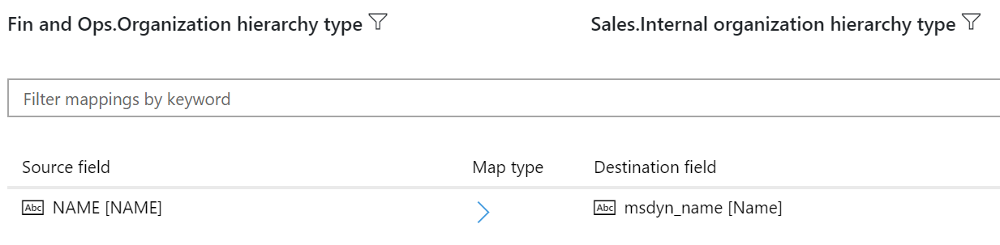
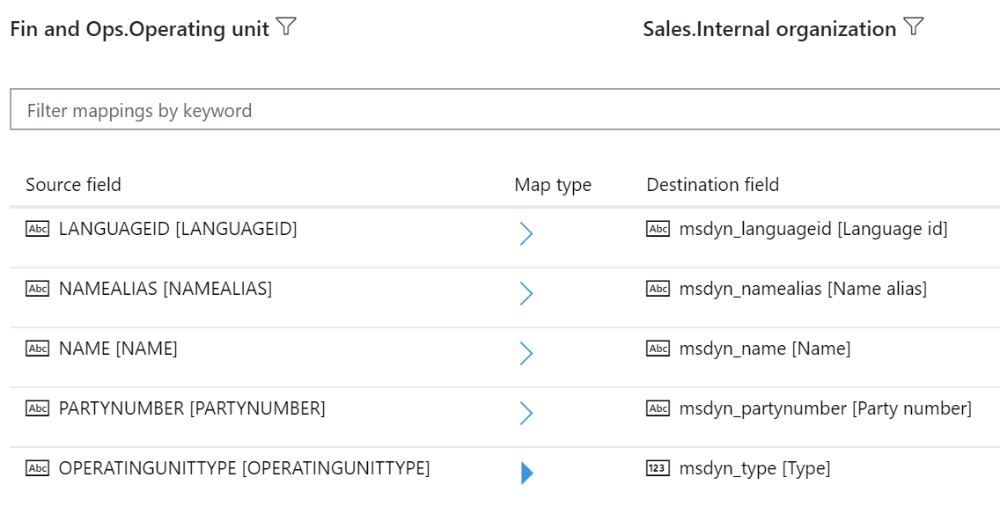

---
# required metadata

title: Organization hierarchy in Common Data Service
description: This topic describes the integration of organizational data between Finance and Operations and Common Data Service.
author: RamaKrishnamoorthy 
manager: AnnBe
ms.date: 07/15/2019
ms.topic: article
ms.prod: 
ms.service: dynamics-ax-applications
ms.technology: 

# optional metadata

ms.search.form: 
# ROBOTS: 
audience: Application User, IT Pro
# ms.devlang: 
ms.reviewer: rhaertle
ms.search.scope: Core, Operations
# ms.tgt_pltfrm: 
ms.custom: 
ms.assetid: 
ms.search.region: global
ms.search.industry: 
ms.author: ramasri
ms.dyn365.ops.version: 
ms.search.validFrom: 2019-07-15

---

## Organization hierarchy in Common Data Service

[!include [banner](../includes/banner.md)]

[!include [preview](../includes/preview-banner.md)]

Because Microsoft Dynamics 365 for Finance and Operations is a financial system, *organization* is a core concept, and system setup starts with the configuration of an organization hierarchy. Business financials and operations can then be tracked at the organization level and also at any level in the organization hierarchy.

Although Common Data Service doesn't have the concept of an organization hierarchy, it does have a few loose concepts, such as total sales revenue. As part of Common Data Service integration, the organization hierarchy data structure is added to Common Data Service.

## Data flow

A business ecosystem that consists of Finance and Operations and Common Data Service will continue to have an organization hierarchy. This organization hierarchy is built on Finance and Operations, but it's exposed in Common Data Service for informational and extensibility purposes. The following illustration shows the organization hierarchy information that is exposed in Common Data Service as a one-way data flow from Finance and Operations to Common Data Service.

## Templates

Organization hierarchy entity maps are available for one-way synchronization of data from Finance and Operations to Common Data Service.

[!include [banner](../includes/dual-write-symbols.md)]

## Internal Organization Hierarchy Purpose

This template provides one-way synchronization of the Organization Hierarchy Purpose entity from Finance and Operations to other Dynamics 365 apps.
.

<!--  -->

Source field | Map type | Destination field
---|---|---
HIERARCHYTYPE | \> | msdyn\_hierarchypurposetypename
HIERARCHYTYPE | \> | msdyn\_hierarchytype.msdyn\_name
HIERARCHYPURPOSE | \>\> | msdyn\_hierarchypurpose
IMMUTABLE | \>\> | msdyn\_immutable
SETASDEFAULT | \>\> | msdyn\_setasdefault

## Internal Organization Hierarchy Type

Tihs template provides one-way synchronization of the Organization Hierarchy Type entity from Finance and Operations to other Dynamics 365 apps.

<!--  -->

Source field | Map type | Destination field
---|---|---
NAME | \> | msdyn\_name

## Internal Organization Hierarchy

This template provides one-way synchronization of the Organization Hierarchy Published entity from Finance and Operations to other Dynamics 365 apps.

<!--  -->

Source field | Map type | Destination field
---|---|---
VALIDTO | \> | msdyn\_validto
VALIDFROM | \> | msdyn\_validfrom
HIERARCHYTYPE | \> | msdyn\_hierarchytypename
PARENTORGANIZATIONPARTYNUMBER | \> | msdyn\_parentpartyid
CHILDORGANIZATIONPARTYNUMBER | \> | msdyn\_childpartyid
HIERARCHYTYPE | \> | msdyn\_hierarchytypeid.msdyn\_name
CHILDORGANIZATIONPARTYNUMBER | \> | msdyn\_childid.msdyn\_partynumber
PARENTORGANIZATIONPARTYNUMBER | \> | msdyn\_parentid.msdyn\_partynumber

## Internal Organization

Internal organization information in Common Data Service comes from two Finance and Operations entities, **operating unit** and **legal entities**.

<!--  -->

<!--  -->

### Operating unit

Source field | Map type | Destination field
---|---|---
LANGUAGEID | \> | msdyn\_languageid
NAMEALIAS | \> | msdyn\_namealias
NAME | \> | msdyn\_name
PARTYNUMBER | \> | msdyn\_partynumber
OPERATINGUNITTYPE | \>\> | msdyn\_type

### Legal entity

Source field | Map type | Destination field
---|---|---
NAMEALIAS | \> | msdyn\_namealias
LANGUAGEID | \> | msdyn\_languageid
NAME | \> | msdyn\_name
PARTYNUMBER | \> | msdyn\_partynumber
none | \>\> | msdyn\_type
LEGALENTITYID | \> | msdyn\_companycode

## Company

Provides bidirectional synchronization of legal entity (company) information between Finance and Operations and other Dynamics 365 apps.

<!--  -->

Source field | Map type | Destination field
---|---|---
NAME | = | cdm\_name
LEGALENTITYID | = | cdm\_companycode
