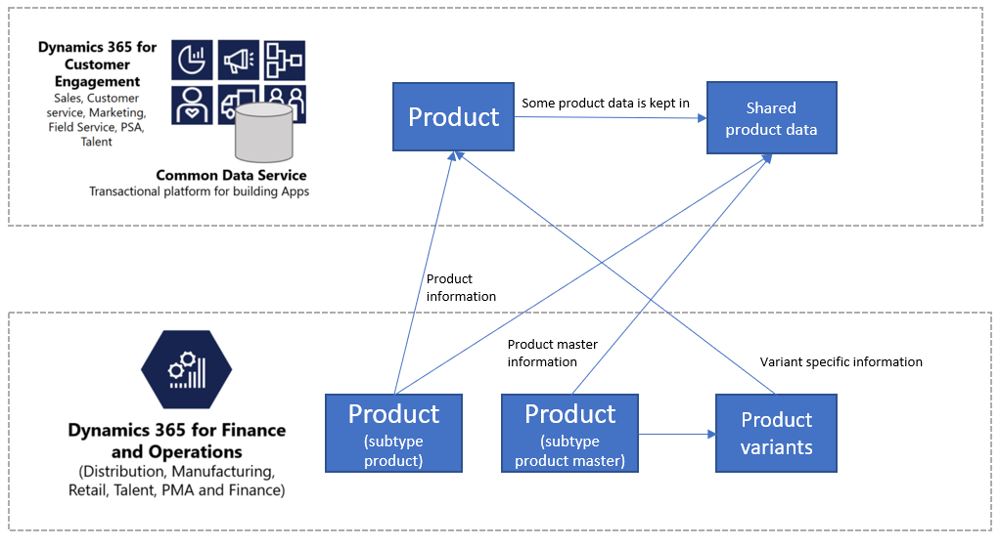

---
# required metadata

title: Unified product experience
description: This topic describes the integration of product data between Microsoft Dynamics 365 for Finance and Operations and Common Data Service.
author: t-benebo 
manager: AnnBe
ms.date: 08/6/2019
ms.topic: article
ms.prod: 
ms.service: dynamics-ax-applications
ms.technology: 

# optional metadata

ms.search.form: 
# ROBOTS: 
audience: Application User, IT Pro
# ms.devlang: 
ms.reviewer: rhaertle
ms.search.scope: Core, Operations
# ms.tgt_pltfrm: 
ms.custom: 
ms.assetid: 
ms.search.region: global
ms.search.industry: 
ms.author: ramasri
ms.dyn365.ops.version: 
ms.search.validFrom: 2019-07-15

---

# Unified product experience

[!include [banner](../includes/banner.md)]

[!include [preview](../includes/preview-banner.md)]

Integration of products lets you synchronize product data from Microsoft Dynamics 365 for Finance and Operations to Common Data Service. Because of the integration, product data that originates in Finance and Operation can be viewed and used in Dynamics 365 for Customer Engagement.

Because the concept of a product is richer in Finance and Operations than in Customer Engagement, Finance and Operations is considered the master of the integration. In Customer Engagement, the product data from Finance and Operations is read-only.

The richness of the supply chain management related fields that hold product data is also available in Common Data Service, and all the existing concepts that are used to define the product are also defined.

## Templates

Product information contains all the information that is related to the product and its definition, such as the product dimensions or the tracking and storage dimensions. As the following table shows, a collection of entity maps is created to sync products and related information.

Finance and Operations | Customer Engagement application
-----------------------|--------------------------------
Released products V2 | msdyn\_sharedproductdetails
CDS released distinct products | Product
Product number identified barcode | msdyn\_productbarcodes
Default order settings | msdyn\_productdefaultordersettings
Product specific default order settings | msdyn_productspecificdefaultordersettings
Product dimension groups | msdyn\_productdimensiongroups
Storage dimension groups | msdyn\_productstoragedimensiongroups
Tracking dimension groups | msdyn\_producttrackingdimensiongroups
Colors | msdyn\_productcolors
Sizes | msdyn\_productsizes
Styles | msdyn\_productsytles
Configurations | msdyn\_productconfigurations
Product master colors | msdyn_sharedproductcolors
Product master sizes | msdyn_sharedproductsizes
Product master styles | msdyn_sharedproductstyles
Product master configurations | msdyn_sharedproductconfigurations
All products | msdyn_globalproducts
Unit | uoms
Unit conversions | msdyn_ unitofmeasureconversions
Product specific unit of measure conversion | msdyn_productspecificunitofmeasureconversion
Sites | msdyn\_operationalsites
Warehouses | msdyn\_inventwarehouses

[!include [banner](../includes/dual-write-symbols.md)]

## Integration of products

In this model, the product is represented by the combination of two entities in Common Data Service: **Product** and **msdyn\_sharedproductdetails**. Whereas the first entity contains the definition of a product (the unique identifier for the product, the product name, and the description), the second entity contains the fields that are stored at the product level in Finance and Operations. The combination of these two entities is used to define the product according to the concept of the stock keeping unit (SKU).

Because the product is represented as an SKU, the concepts of distinct products, product masters, and product variants from Finance and Operations can be captured in Common Data Service in the following way:

- **Products with subtype product** are products that are defined by themselves. No dimensions have to be defined for them. An example is a specific book. For these products, one record is created in the **Product** entity, and one record is created in the **msdyn\_sharedproductdetails** entity. No product family record is created.
- **Product masters** in Finance and Operations are used as generic products that hold the definition and rules that determine the behavior in business processes. Based on these definitions, distinct products that are known as product variants can be generated. For example, T-shirt is the product master, and it can have Color and Size as dimensions. Variants can be released that have different combinations of these dimensions, such a small blue T-shirt or a medium green T-shirt. In the integration, one record per variant is created in the product table. This record contains the variant-specific information, such as the different dimensions. The generic information for the product is stored in the **msdyn\_sharedproductdetails** entity. (In Finance and Operations, this generic information is held in the product master.) Additionally, one product family record is created per product master. The product master information is synced to Common Data Service as soon as the released product master is created (but before variants are released).
- **Distinct products** refer to all the products subtype product and all the product variants. 

With the dual-write functionality enabled, the released products from Dynamics 365 for Finance and Operations will be syncronized in Dynamics 365 for Customer Engagement with **Active** state, so you can directly used in sales order quotations, for example. They are added to the first pricelist with the same currency. In other words, they are added to the first pricelist in Dynamics 365 for Customer Engagement that matches the currency of your legal entity where the product is released in Dynamics 365 for Finance and Operations. 

### CDS released distinct products to Product

The **Product** entity contains the fields that define the product. It includes individual products (products with subtype product) and the product variants. The following table shows the mappings.

Source field | Map type | Destination field
---|---|---
PRODUCTNUMBER | >> | productnumber
PRODUCTNAME | >> | name
PRODUCTDESCRIPTION | >> | description
ITEMNUMBER | >> | msdyn_itemnumber
CURRENCYCODE | >> | transactioncurrencyid.isocurrencycode
SALESUNITSYMBOL | >> | defaultuomid.msdyn_symbol
SALESPRICE | >> | price
UNITCOST | >> | currentcost
PRODUCTTYPE | >> | producttypecode
SALESUNITDECIMALPRECISION | >> | quantitydecimal
ISCATCHWEIGHTPRODUCT | >> | msdyn_iscatchweight
PRODUCTCOLORID | >> | msdyn_productcolor.msdyn_productcolorname
PRODUCTCONFIGURATIONID | >> | msdyn_productconfiguration.msdyn_productconfiguration
PRODUCTSIZEID | >> | msdyn_productsize.msdyn_productsize
PRODUCTSTYLEID | >> | msdyn_productstyle.msdyn_productstyle

### Released products V2 to msdyn\_sharedproductdetails

The **msdyn\_sharedproductdetails** entity contains the fields from Finance and Operations that define the product, and that contain the product's financial and management information. The following table shows the mappings.

Source field | Map type | Destination field
---|---|---
PRODUCTNUMBER | \> | msdyn\_productnumber
INTRASTATCHARGEPERCENTAGE | \> | msdyn\_intrastatchargepercentage
ITEMNUMBER | \>\> | msdyn\_itemnumber
APPROXIMATESALESTAXPERCENTAGE | \> | msdyn\_approximatesalestaxpercentage
ARRIVALHANDLINGTIME | \> | msdyn\_arrivalhandlingtime
BESTBEFOREPERIODDAYS | \> | msdyn\_bestbeforeperioddays
CARRYINGCOSTABCCODE | \>\> | msdyn\_carryingcostabccode
CONSTANTSCRAPQUANTITY | \> | msdyn\_constantscrapquantity
COSTCHARGESQUANTITY | \> | msdyn\_costchargesquantity
DEFAULTRECEIVINGQUANTITY | \> | msdyn\_defaultreceivingquantity
FIXEDPURCHASEPRICECHARGES | \> | msdyn\_fixedpurchasepricecharges
FIXEDSALESPRICECHARGES | \> | msdyn\_fixedsalespricecharges
GROSSDEPTH | \> | msdyn\_grossdepth
GROSSPRODUCTHEIGHT | \> | msdyn\_grossproductheight
GROSSPRODUCTWIDTH | \> | msdyn\_grossproductwidth
INVENTORYUNITSYMBOL | \> | msdyn\_inventoryunitsymbol.name
ISDISCOUNTPOSREGISTRATIONPROHIBITED | \>\> | msdyn\_isdiscountposregistrationprohibited
ISEXEMPTFROMAUTOMATICNOTIFICATIONANDCANCELLATION | \>\> | msdyn\_exemptautomaticnotificationcancel
ISINSTALLMENTELIGIBLE | \>\> | msdyn\_isinstallmenteligible
ISINTERCOMPANYPURCHASEUSAGEBLOCKED | \>\> | msdyn\_isintercompanypurchaseusageblocked
ISINTERCOMPANYSALESUSAGEBLOCKED | \>\> | msdyn\_isintercompanysalesusageblocked
ISMANUALDISCOUNTPOSREGISTRATIONPROHIBITED | \>\> | msdyn\_ismanualdiscposregistrationprohibited
ISPHANTOM | \>\> | msdyn\_isphantom
ISPOSREGISTRATIONBLOCKED | \>\> | msdyn\_isposregistrationblocked
ISPOSREGISTRATIONQUANTITYNEGATIVE | \>\> | msdyn\_isposregistrationquantitynegative
ISPURCHASEPRICEAUTOMATICALLYUPDATED | \>\> | msdyn\_ispurchasepriceautomaticallyupdated
ISPURCHASEPRICEINCLUDINGCHARGES | \>\> | msdyn\_ispurchasepriceincludingcharges
ISSALESWITHHOLDINGTAXCALCULATED | \>\> | msdyn\_issaleswithholdingtaxcalculated
ISRESTRICTEDFORCOUPONS | \>\> | msdyn\_isrestrictedforcoupons
ISSALESPRICEADJUSTMENTALLOWED | \>\> | msdyn\_issalespriceadjustmentallowed
ISSALESPRICEINCLUDINGCHARGES | \>\> | msdyn\_issalespriceincludingcharges
ISSCALEPRODUCT | \>\> | msdyn\_isscaleproduct
ISSHIPALONEENABLED | \>\> | msdyn\_isshipaloneenabled
ISUNITCOSTPRODUCTVARIANTSPECIFIC | \>\> | msdyn\_isunitcostproductvariantspecific
ISVARIANTSHELFLABELSPRINTINGENABLED | \>\> | msdyn\_isvariantshelflabelsprintingenabled
ISZEROPRICEPOSREGISTRATIONALLOWED | \>\> | msdyn\_iszeropriceposregistrationallowed
KEYINPRICEREQUIREMENTSATPOSREGISTER | \>\> | msdyn\_keyinpricerequirementsatposregister
KEYINQUANTITYREQUIREMENTSATPOSREGISTER | \>\> | msdyn\_keyinquantityrequirementsatposregister
MARGINABCCODE | \>\> | msdyn\_marginabccode
MAXIMUMPICKQUANTITY | \> | msdyn\_maximumpickquantity
MUSTKEYINCOMMENTATPOSREGISTER | \>\> | msdyn\_mustkeyincommentatposregister
NECESSARYPRODUCTIONWORKINGTIMESCHEDULINGPROPERTYID | \> | msdyn\_necessaryproductionworkingtimeschedulingp
NETPRODUCTWEIGHT | \> | msdyn\_netproductweight
PACKINGDUTYQUANTITY | \> | msdyn\_packingdutyquantity
POSREGISTRATIONACTIVATIONDATE | \> | msdyn\_posregistrationactivationdate
POSREGISTRATIONBLOCKEDDATE | \> | msdyn\_posregistrationblockeddate
POSREGISTRATIONPLANNEDBLOCKEDDATE | \> | msdyn\_posregistrationplannedblockeddate
POTENCYBASEATTIBUTETARGETVALUE | \> | msdyn\_potencybaseattibutetargetvalue
POTENCYBASEATTRIBUTEVALUEENTRYEVENT | \>\> | msdyn\_potencybaseattributevalueentryevent
PRODUCTTYPE | \>\> | msdyn\_producttype
PRODUCTIONCONSUMPTIONDENSITYCONVERSIONFACTOR | \> | msdyn\_productionconsumptiondensityconversion
PRODUCTIONCONSUMPTIONDEPTHCONVERSIONFACTOR | \> | msdyn\_productionconsumptiondepthconversion
PRODUCTIONCONSUMPTIONHEIGHTCONVERSIONFACTOR | \> | msdyn\_productionconsumptionheightconversion
PRODUCTIONCONSUMPTIONWIDTHCONVERSIONFACTOR | \> | msdyn\_productionconsumptionwidthconversion
PRODUCTVOLUME | \> | msdyn\_productvolume
PURCHASECHARGESQUANTITY | \> | msdyn\_purchasechargesquantity
PURCHASEOVERDELIVERYPERCENTAGE | \> | msdyn\_purchaseoverdeliverypercentage
PURCHASEPRICE | \> | msdyn\_purchaseprice
PURCHASEPRICEDATE | \> | msdyn\_purchasepricedate
PURCHASEPRICINGPRECISION | \> | msdyn\_purchasepricingprecision
PURCHASEUNDERDELIVERYPERCENTAGE | \> | msdyn\_purchaseunderdeliverypercentage
RAWMATERIALPICKINGPRINCIPLE | \>\> | msdyn\_rawmaterialpickingprinciple
SALESCHARGESQUANTITY | \> | msdyn\_saleschargesquantity
SALESOVERDELIVERYPERCENTAGE | \> | msdyn\_salesoverdeliverypercentage
SALESPRICE | \> | msdyn\_salesprice
SALESPRICECALCULATIONCHARGESPERCENTAGE | \> | msdyn\_salespricecalculationchargespercentage
SALESPRICECALCULATIONCONTRIBUTIONRATIO | \> | msdyn\_salespricecalculationcontributionratio
SALESPRICECALCULATIONMODEL | \>\> | msdyn\_salespricecalculationmodel
SALESPRICEDATE | \> | msdyn\_salespricedate
SALESPRICINGPRECISION | \> | msdyn\_salespricingprecision
SALESUNDERDELIVERYPERCENTAGE | \> | msdyn\_salesunderdeliverypercentage
SALESUNITSYMBOL | \> | msdyn\_salesunitsymbol.name
SCALEINDICATOR | \>\> | msdyn\_scaleindicator
SHELFADVICEPERIODDAYS | \> | msdyn\_shelfadviceperioddays
SHELFLIFEPERIODDAYS | \> | msdyn\_shelflifeperioddays
TAREPRODUCTWEIGHT | \> | msdyn\_tareproductweight
TRANSFERORDEROVERDELIVERYPERCENTAGE | \> | msdyn\_transferorderoverdeliverypercentage
TRANSFERORDERUNDERDELIVERYPERCENTAGE | \> | msdyn\_transferorderunderdeliverypercentage
UNITCOST | \> | msdyn\_unitcost
UNITCOSTDATE | \> | msdyn\_unitcostdate
UNITCOSTQUANTITY | \> | msdyn\_unitcostquantity
VARIABLESCRAPPERCENTAGE | \> | msdyn\_variablescrappercentage
WAREHOUSEMOBILEDEVICEDESCRIPTIONLINE1 | \> | msdyn\_warehousemobiledevicedescriptionline1
WAREHOUSEMOBILEDEVICEDESCRIPTIONLINE2 | \> | msdyn\_warehousemobiledevicedescriptionline2
WILLINVENTORYISSUEAUTOMATICALLYREPORTASFINISHED | \>\> | msdyn\_willinventoryissueautoreportasfinished
WILLINVENTORYRECEIPTIGNOREFLUSHINGPRINCIPLE | \>\> | msdyn\_willinventoryreceiptignoreflushing
WILLPICKINGWORKBENCHAPPLYBOXINGLOGIC | \>\> | msdyn\_willpickingworkbenchapplyboxinglogic
WILLTOTALPURCHASEDISCOUNTCALCULATIONINCLUDEPRODUCT | \>\> | msdyn\_willtotalpurchdiscountcalcincludeproduct
WILLTOTALSALESDISCOUNTCALCULATIONINCLUDEPRODUCT | \>\> | msdyn\_willtotalsalesdiscountcalcincludeproduct
WILLWORKCENTERPICKINGALLOWNEGATIVEINVENTORY | \>\> | msdyn\_willworkcenterpickingallownegativeinvent
YIELDPERCENTAGE | \> | msdyn\_yieldpercentage
ISUNITCOSTAUTOMATICALLYUPDATED | \>\> | msdyn\_isunitcostautomaticallyupdated
PURCHASEUNITSYMBOL | \> | msdyn\_purchaseunitsymbol.name
PURCHASEPRICEQUANTITY | \> | msdyn\_purchasepricequantity
ISUNITCOSTINCLUDINGCHARGES | \>\> | msdyn\_isunitcostincludingcharges
FIXEDCOSTCHARGES | \>\> | msdyn\_fixedcostcharges
MINIMUMCATCHWEIGHTQUANTITY | \>\> | msdyn\_minimumcatchweightquantity
MAXIMUMCATCHWEIGHTQUANTITY | \>\> | msdyn\_maximumcatchweightquantity
ALTERNATIVEITEMNUMBER | \>\> | msdyn\_alternativeitemnumber.msdyn\_itemnumber
BOMUNITSYMBOL | \>\> | msdyn\_bomunitsymbol.name
CATCHWEIGHTUNITSYMBOL | \>\> | msdyn\_catchweightunitsymbol.name
COMPARISONPRICEBASEUNITSYMBOL | \>\> | msdyn\_comparisonpricebaseunitsymbol.name
PRIMARYVENDORACCOUNTNUMBER | \>\> | msdyn\_vendorid.msdyn\_vendoraccountnumber
ISCATCHWEIGHTPRODUCT | \>\> | msdyn\_iscatchweight
PRODUCTDIMENSIONGROUPNAME | \>\> | msdyn\_productdimensiongroupid.msdyn\_groupname

## Product dimensions 

Product dimensions are characteristics that identify a product variant. The four product dimensions (Color, Size, Style, and Configuration) are also mapped to Common Data Service to define the product variants. The following illustration shows the data model for the product dimension Color. The same model is applied to Sizes, Styles and Configurations. 

### Colors

All the possible colors in Finance and Operations are available in Common Data Service through the following mappings.

Source field | Map type | Destination field
---|---|---
COLORID | \>\> | msdyn\_productcolorname

### Sizes

All the possible sizes in Finance and Operations are available in Common Data Service through the following mappings.

Source field | Map type | Destination field
---|---|---
SIZEID | \>\> | msdyn\_productsize

### Styles

All the possible styles in Finance and Operations are available in Common Data Service through the following mappings.

Source field | Map type | Destination field
---|---|---
STYLEID | \>\> | msdyn\_productstyle

### Configurations

All the possible configurations in Finance and Operations are available in Common Data Service through the following mappings.

Source field | Map type | Destination field
---|---|---
CONFIGURATIONID | \>\> | msdyn\_name

When a product has different product dimensions (for example, a product master has Size and Color as product dimensions), each distinct product (that is, each product variant) is defined as a combination of those product dimensions. For example, product number B0001 is an extra-small black T-shirt, and product number B0002 is a small black T-shirt. In this case, the existing combinations of product dimensions are defined. For example, the T-shirt from the preceding example can be extra-small and black, small and black, medium and black, or large and black, but it can't be extra-large and black. In other words, the product dimensions that a product master can take are specified, and variants can be released based on these values.

To keep track of the product dimensions that a product master can take, the following entities are created and mapped in Common Data Service for each product dimension. For more information about products in Finance and Operations, see [Product information overview](https://docs.microsoft.com/dynamics365/unified-operations/supply-chain/pim/product-information).

### Shared product color

The **Shared product color** entity indicates the colors that a specific product master in Finance and Operations can have. This concept is migrated to Common Data Service to keep data consistent. The following table shows the mappings.

Source field | Map type | Destination field
---|---|---
PRODUCTCOLORID | \>\> | msdyn\_productcolorid.msdyn\_productcolorname
PRODUCTMASTERNUMBER | \>\> | msdyn\_sharedproductdetailid.msdyn\_itemnumber
REPLENISHMENTWEIGHT | \>\> | msdyn\_replenishmentweight
DISPLAYSEQUENCENUMBER | \>\> | msdyn\_retaildisplayorder

### Shared product size

The **Shared product size** entity indicates the sizes that a specific product master in Finance and Operations can have. This concept is migrated to Common Data Service to keep data consistent. The following table shows the mappings.

Source field | Map type | Destination field
---|---|---
PRODUCTMASTERNUMBER | \>\> | msdyn\_sharedproductdetailid.msdyn\_itemnumber
PRODUCTSIZEID | \>\> | msdyn\_productsizeid.msdyn\_productsize
REPLENISHMENTWEIGHT | \>\> | msdyn\_replenishmentweight
DISPLAYSEQUENCENUMBER | \>\> | msdyn\_displaysequencenumber

### Shared product style

The **Shared product style** entity indicates the styles that a specific product master in Finance and Operations can have. This concept is migrated to Common Data Service to keep data consistent. The following table shows the mappings.

Source field | Map type | Destination field
---|---|---
PRODUCTMASTERNUMBER | \>\> | msdyn\_sharedproductdetailsid.msdyn\_itemnumber
PRODUCTSTYLEID | \>\> | msdyn\_productstyleintegration
PRODUCTSTYLEID | \>\> | msdyn\_productstyleid.msdyn\_productstyle
REPLENISHMENTWEIGHT | \>\> | msdyn\_replenishmentweight
DISPLAYSEQUENCENUMBER | \>\> | msdyn\_displaysequencenumber

### Shared product configuration

The **Shared product configuration** entity indicates the configurations that a specific product master in Finance and Operations can have. This concept is migrated to Common Data Service to keep data consistent. The following table shows the mappings.

Source field | Map type | Destination field
---|---|---
CONTAINERUNITSYMBOL | \>\> | msdyn\_containerunitsymbol
PRODUCTCONFIGURATIONID | \>\> | msdyn\_productconfigurationid.msdyn\_productconfiguration
PRODUCTMASTERNUMBER | \>\> | msdyn\_sharedproductdetailid.msdyn\_itemnumber
REPLENISHMENTWEIGHT | \>\> | msdyn\_replenishmentweight
DISPLAYSEQUENCENUMBER | \>\> | msdyn\_displaysequencenumber

## Product number identifier bar codes

Product bar codes are used to uniquely identify products. The following mappings are used to make these product bar codes available in Common Data Service.

Source field | Map type | Destination field
---|---|---
PRODUCTNUMBER | \> | msdyn\_productnumberid.productnumber
BARCODE | \> | msdyn\_name
BARCODE | \> | msdyn\_barcode
PRODUCTQUANTITY | \> | msdyn\_productquantity
PRODUCTDESCRIPTION | \> | msdyn\_productdescription
BARCODESETUPID | \> | msdyn\_barcodesetupid
PRODUCTQUANTITYUNITSYMBOL | \> | msdyn\_unitofmeasureid.name
ISDEFAULTSCANNEDBARCODE | \>\> | msdyn\_isdefaultscannedbarcode
ISDEFAULTPRINTEDBARCODE | \>\> | msdyn\_isdefaultprintedbarcode
ISDEFAULTDISPLAYEDBARCODE | \>\> | msdyn\_isdefaultdisplayedbarcode

## Default order settings and product specific default order settings

Default order settings in Microsoft Dynamics 365 for Finance and Operations define the site and warehouse where items will be sourced from or stored, the minimum, maximum, multiple and standard quantities that will be used for trading or inventory management, the lead times, the stop flag, and the order promising method. These information will be available in CDS using the default order settings and product specific default order settings entity. You can read more information about the functionality on [Default order settings page](https://docs.microsoft.com/en-us/dynamics365/unified-operations/supply-chain/production-control/default-order-settings)

### Default order settings

The following mappings are used to make the default order settings available in Common Data Service.

Source field | Map type | Destination field
---|---|---
INVENTWAREHOUSEID | = | msdyn_inventorywarehouse.msdyn_warehouseidentifier
INVENTORYSITEID | = | msdyn_inventorysite.msdyn_siteid
INVENTORYATPDELAYEDDEMANDOFFSETDAYS | = | msdyn_inventoryatpdelayeddemandoffsetdays
INVENTORYATPDELAYEDSUPPLYOFFSETDAYS | = | msdyn_inventoryatpdelayedsupplyoffsetdays
ITEMNUMBER | = | msdyn_itemnumber.msdyn_itemnumber
INVENTORYATPBACKWARDDEMANDTIMEFENCEDAYS | = | msdyn_inventoryatpbackwarddemandtimefencedays
INVENTORYATPBACKWARDSUPPLYTIMEFENCEDAYS | = | msdyn_inventoryatpbackwardsupplytimefencedays
INVENTORYATPTIMEFENCEDAYS | = | msdyn_inventoryatptimefencedays
MAXIMUMINVENTORYORDERQUANTITY | = | msdyn_maximuminventoryorderquantity
MAXIMUMPROCUREMENTORDERQUANTITY | = | msdyn_maximumprocurementorderquantity
MAXIMUMSALESORDERQUANTITY | = | msdyn_maximumsalesorderquantity
MINIMUMINVENTORYORDERQUANTITY | = | msdyn_minimuminventoryorderquantity
MINIMUMPROCUREMENTORDERQUANTITY | = | msdyn_minimumprocurementorderquantity
MINIMUMSALESORDERQUANTITY | = | msdyn_minimumsalesorderquantity
STANDARDINVENTORYORDERQUANTITY | = | msdyn_standardinventoryorderquantity
STANDARDPROCUREMENTORDERQUANTITY | = | msdyn_standardprocurementorderquantity
STANDARDSALESORDERQUANTITY | = | msdyn_standardsalesorderquantity
INVENTORYLEADTIMEDAYS | = | msdyn_inventoryleadtimedays
INVENTORYQUANTITYMULTIPLES | = | msdyn_inventoryquantitymultiples
PROCUREMENTQUANTITYMULTIPLES | = | msdyn_procurementquantitymultiples
SALESQUANTITYMULTIPLES | = | msdyn_salesquantitymultiples
PROCUREMENTSITEID | = | msdyn_procurementsite.msdyn_siteid
PROCUREMENTLEADTIMEDAYS | = | msdyn_procurementleadtimedays
SALESSITEID | = | msdyn_salessite.msdyn_siteid
SALESATPDELAYEDDEMANDOFFSETDAYS | = | msdyn_salesatpdelayeddemandoffsetdays
SALESATPDELAYEDSUPPLYOFFSETDAYS | = | msdyn_salesatpdelayedsupplyoffsetdays
SALESATPBACKWARDDEMANDTIMEFENCEDAYS | = | msdyn_salesatpbackwarddemandtimefencedays
SALESATPBACKWARDSUPPLYTIMEFENCEDAYS | = | msdyn_salesatpbackwardsupplytimefencedays
SALESATPTIMEFENCEDAYS | = | msdyn_salesatptimefencedays
SALESLEADTIMEDAYS | = | msdyn_salesleadtimedays
PROCUREMENTWAREHOUSEID | = | msdyn_procurementwarehouse.msdyn_warehouseidentifier
SALESWAREHOUSEID | = | msdyn_saleswarehouse.msdyn_warehouseidentifier
AREINVENTORYORDERPROMISINGDEFAULTSOVERRIDDEN | >< | msdyn_areinventoryorderdefaultsoverridden
INVENTORYORDERPROMISINGMETHOD | >< | msdyn_inventoryorderpromisingmethod
ISINVENTORYATPINCLUDINGPLANNEDORDERS | >< | msdyn_isinventoryatpincludingplannedorders
ISINVENTORYUSINGWORKINGDAYS | >< | msdyn_isinventoryusingworkingdays
ISINVENTORYSITEMANDATORY | >< | msdyn_isinventorysitemandatory
ISINVENTORYPROCESSINGSTOPPED | >< | msdyn_isinventoryprocessingstopped
ISPROCUREMENTUSINGWORKINGDAYS | >< | msdyn_isprocurementusingworkingdays
ISPROCUREMENTSITEMANDATORY | >< | msdyn_isprocurementsitemandatory
ISPROCUREMENTPROCESSINGSTOPPED | >< | msdyn_isprocurementprocessingstopped
ARESALESORDERPROMISINGDEFAULTSOVERRIDDEN | >< | msdyn_aresalesorderdefaultsoverridden
SALESORDERPROMISINGMETHOD | >< | msdyn_salesorderpromisingmethod
ISSALESATPINCLUDINGPLANNEDORDERS | >< | msdyn_issalesatpincludingplannedorders
ISSALESSITEMANDATORY | >< | msdyn_issalessitemandatory
ISSALESLEADTIMEOVERRIDDEN | >< | msdyn_issalesleadtimeoverridden
ISSALESPROCESSINGSTOPPED | >< | msdyn_issalesprocessingstopped
ISINVENTORYWAREHOUSEMANDATORY | >< | msdyn_isinventorywarehousemandatory
ISPROCUREMENTWAREHOUSEMANDATORY | >< | msdyn_isprocurementwarehousemandatory
ISSALESWAREHOUSEMANDATORY | >< | msdyn_issaleswarehousemandatory

### Product specific default order settings

The following mappings are used to make the product specific default order settings available in Common Data Service.

Source field | Map type | Destination field
---|---|---
INVENTORYWAREHOUSEID | = | msdyn_inventorywarehouse.msdyn_warehouseidentifier
INVENTORYSITEID | = | msdyn_inventorysite.msdyn_siteid
INVENTORYATPDELAYEDDEMANDOFFSETDAYS | = | msdyn_inventoryatpdelayeddemandoffsetdays
INVENTORYATPDELAYEDSUPPLYOFFSETDAYS | = | msdyn_inventoryatpdelayedsupplyoffsetdays
ITEMNUMBER | = | msdyn_itemnumber.msdyn_itemnumber
INVENTORYATPBACKWARDDEMANDTIMEFENCEDAYS | = | msdyn_inventoryatpbackwarddemandtimefencedays
INVENTORYATPBACKWARDSUPPLYTIMEFENCEDAYS | = | msdyn_inventoryatpbackwardsupplytimefencedays
INVENTORYATPTIMEFENCEDAYS | = | msdyn_inventoryatptimefencedays
MAXIMUMINVENTORYORDERQUANTITY | = | msdyn_maximuminventoryorderquantity
MAXIMUMPROCUREMENTORDERQUANTITY | = | msdyn_maximumprocurementorderquantity
MAXIMUMSALESORDERQUANTITY | = | msdyn_maximumsalesorderquantity
MINIMUMINVENTORYORDERQUANTITY | = | msdyn_minimuminventoryorderquantity
MINIMUMPROCUREMENTORDERQUANTITY | = | msdyn_minimumprocurementorderquantity
MINIMUMSALESORDERQUANTITY | = | msdyn_minimumsalesorderquantity
STANDARDINVENTORYORDERQUANTITY | = | msdyn_standardinventoryorderquantity
STANDARDPROCUREMENTORDERQUANTITY | = | msdyn_standardprocurementorderquantity
STANDARDSALESORDERQUANTITY | = | msdyn_standardsalesorderquantity
INVENTORYLEADTIMEDAYS | = | msdyn_inventoryleadtimedays
INVENTORYQUANTITYMULTIPLES | = | msdyn_inventoryquantitymultiples
PROCUREMENTQUANTITYMULTIPLES | = | msdyn_procurementquantitymultiples
SALESQUANTITYMULTIPLES | = | msdyn_salesquantitymultiples
PROCUREMENTSITEID | = | msdyn_procurementsite.msdyn_siteid
PROCUREMENTLEADTIMEDAYS | = | msdyn_procurementleadtimedays
SALESSITEID | = | msdyn_salessite.msdyn_siteid
SALESATPDELAYEDDEMANDOFFSETDAYS | = | msdyn_salesatpdelayeddemandoffsetdays
SALESATPDELAYEDSUPPLYOFFSETDAYS | = | msdyn_salesatpdelayedsupplyoffsetdays
SALESATPBACKWARDDEMANDTIMEFENCEDAYS | = | msdyn_salesatpbackwarddemandtimefencedays
SALESATPBACKWARDSUPPLYTIMEFENCEDAYS | = | msdyn_salesatpbackwardsupplytimefencedays
SALESATPTIMEFENCEDAYS | = | msdyn_salesatptimefencedays
SALESLEADTIMEDAYS | = | msdyn_salesleadtimedays
PROCUREMENTWAREHOUSEID | = | msdyn_procurementwarehouse.msdyn_warehouseidentifier
SALESWAREHOUSEID | = | msdyn_saleswarehouse.msdyn_warehouseidentifier
AREINVENTORYDEFAULTORDERSETTINGSOVERRIDDEN | >< | msdyn_areinventoryorderdefaultsoverridden
INVENTORYORDERPROMISINGMETHOD | >< | msdyn_inventoryorderpromisingmethod
ISINVENTORYATPINCLUDINGPLANNEDORDERS | >< | msdyn_isinventoryatpincludingplannedorders
ISINVENTORYUSINGWORKINGDAYS | >< | msdyn_isinventoryusingworkingdays
ISINVENTORYSITEMANDATORY | >< | msdyn_isinventorysitemandatory
ISINVENTORYPROCESSINGSTOPPED | >< | msdyn_isinventoryprocessingstopped
ISPROCUREMENTUSINGWORKINGDAYS | >< | msdyn_isprocurementusingworkingdays
ISPROCUREMENTSITEMANDATORY | >< | msdyn_isprocurementsitemandatory
ISPROCUREMENTPROCESSINGSTOPPED | >< | msdyn_isprocurementprocessingstopped
ARESALESDEFAULTORDERSETTINGSOVERRIDDEN | >< | msdyn_aresalesorderdefaultsoverridden
SALESORDERPROMISINGMETHOD | >< | msdyn_salesorderpromisingmethod
ISSALESATPINCLUDINGPLANNEDORDERS | >< | msdyn_issalesatpincludingplannedorders
ISSALESSITEMANDATORY | >< | msdyn_issalessitemandatory
ISSALESLEADTIMEOVERRIDDEN | >< | msdyn_issalesleadtimeoverridden
ISSALESPROCESSINGSTOPPED | >< | msdyn_issalesprocessingstopped
ISINVENTORYWAREHOUSEMANDATORY | >< | msdyn_isinventorywarehousemandatory
ISPROCUREMENTWAREHOUSEMANDATORY | >< | msdyn_isprocurementwarehousemandatory
ISSALESWAREHOUSEMANDATORY | >< | msdyn_issaleswarehousemandatory
OPERATIONALSITEID | = | msdyn_operationalsite.msdyn_siteid
PRODUCTCOLORID | = | msdyn_productcolor.msdyn_productcolorname
PRODUCTCONFIGURATIONID | = | msdyn_productconfiguration.msdyn_productconfiguration
PRODUCTSIZEID | = | msdyn_productsize.msdyn_productsize
PRODUCTSTYLEID | = | msdyn_productstyle.msdyn_productstyle

## Unit of measure and unit of measure conversions

The units of measure and its respective conversions will be available in the Common Data Service following the data model shown in the diagram.

The unit of measure concept is harmonized between Dynamics 365 for Finance and Operations and Dynamics 365 for Customer Engagement. For each unit class of Dynamics 365 for Finance and Operations a unit group is created in Dynamics 365 for Customer Engagement, which contains the untis belonging to the unit class. A default base unit is also created for every unit group. 

### Unit of measure

The following mappings are used to make the units of measure of Dynamics 365 for Finance and Operations available in Common Data Service.

Source field | Map type | Destination field
---|---|---
UNITSYMBOL | >> | msdyn_symbol
UNITCLASS | >> | msdyn_externalunitclassname
DECIMALPRECISION | >> | msdyn_decimalprecision
ISBASEUNIT | >> | msdyn_isbaseunit
ISSYSTEMUNIT | >> | msdyn_issystemunit
SYSTEMOFUNITS | >> | msdyn_systemofunits
UNITSYMBOL | >> | name
UNITDESCRIPTION | >> | msdyn_description

### Unit of measure conversions

The following mappings are used to make the units of measure conversions of Dynamics 365 for Finance and Operations available in Common Data Service.

Source field | Map type | Destination field
---|---|---
DENOMINATOR | = | msdyn_denominator
NUMERATOR | = | msdyn_numerator
FACTOR | = | msdyn_factor
INNEROFFSET | = | msdyn_inneroffset
OUTEROFFSET | = | msdyn_outeroffset
ROUNDING | >< | msdyn_rounding
TOUNITSYMBOL | = | msdyn_tounit.msdyn_symbol
FROMUNITSYMBOL | = | msdyn_fromunit.msdyn_symbol

### Product specific unit of measure conversions

The following mappings are used to make the product specific unit of measure conversions of Dynamics 365 for Finance and Operations available in Common Data Service.

Source field | Map type | Destination field
---|---|---
DENOMINATOR | = | msdyn_denominator
NUMERATOR | = | msdyn_numerator
FACTOR | = | msdyn_factor
FROMUNITSYMBOL | = | msdyn_fromunit.msdyn_symbol
TOUNITSYMBOL | = | msdyn_tounit.msdyn_symbol
PRODUCTNUMBER | = | msdyn_globalproduct.msdyn_productnumber
INNEROFFSET | = | msdyn_inneroffset
OUTEROFFSET | = | msdyn_outeroffset
ROUNDING | >< | msdyn_rounding

## Product policies: dimension, tracking and storage groups

The product policies are sets of policies used for defining products and its characteristics in inventory. The product dimension group, product tracking dimension group and storage dimension group can be found as product policies in Dynamics 365 for Finance and Operations. 

### Product dimension group

The product dimension group defined which product dimensions define the product. The four possible product dimension groups are: size, color, style and configuration. The product dimension groups are available in the Common Data Service using the following mappings. 

Source field | Map type | Destination field
---|---|---
WILLSALESPRICESEARCHUSEPRODUCTSTYLE | >< | msdyn_willsalespricesearchuseproductstyle
WILLPURCHASEPRICESEARCHUSEPRODUCTSIZE | >< | msdyn_willpurchasepricesearchuseproductsize
WILLSALESPRICESEARCHUSEPRODUCTCONFIGURATION | >< | msdyn_willsalespricesearchuseprodconfig
WILLSALESPRICESEARCHUSEPRODUCTCOLOR | >< | msdyn_willsalespricesearchuseproductcolor
WILLPURCHASEPRICESEARCHUSEPRODUCTSTYLE | >< | msdyn_willpurchasepricesearchuseproductstyle
WILLPURCHASEPRICESEARCHUSEPRODUCTCONFIGURATION | >< | msdyn_willpurchpricesearchuseprodconfig
WILLPURCHASEPRICESEARCHUSEPRODUCTCOLOR | >< | msdyn_willpurchpricesearchuseproductcolor
ISPRODUCTSTYLEACTIVE | >< | msdyn_isproductstyleactive
ISPRODUCTSIZEACTIVE | >< | msdyn_isproductsizeactive
ISPRODUCTCONFIGURATIONACTIVE | >< | msdyn_isproductconfigurationactive
ISPRODUCTCOLORACTIVE | >< | msdyn_isproductcoloractive
GROUPNAME | = | msdyn_groupname
GROUPDESCRIPTION | = | msdyn_groupdescription
PRODUCTVARIANTNOMENCLATURENAME | = | msdyn_productvariantnomenclaturename
WILLSALESPRICESEARCHUSEPRODUCTSIZE | >< | msdyn_willsalespricesearchuseproductsize

### Product tracking dimension group

The product tracking dimension group represents the method used to track the product in inventory. These are available in the Common Data Service using the following mappings. 

Source field | Map type | Destination field
---|---|---
SERIALNUMBERCAPTURINGOPERATION | >< | msdyn_serialnumbercapturingoperation
GROUPNAME | = | msdyn_groupname
GROUPDESCRIPTION | = | msdyn_groupdescription
ISSERIALNUMBERENABLEDFORPRODUCTIONCONSUMPTIONPROCESS | >< | msdyn_issnenabledforpcprocess
ISSERIALNUMBERCONTROLENABLED | >< | msdyn_isserialnumbercontrolenabled
ISSERIALNUMBERENABLEDFORSALESPROCESS | >< | msdyn_isserialnumberenabledforsalesprocess
ISSERIALNUMBERACTIVE | >< | msdyn_isserialnumberactive
ISSALESPRICEBYSERIALNUMBER | >< | msdyn_issalespricebyserialnumber
ISSALESPRICEBYBATCHNUMBER | >< | msdyn_issalespricebybatchnumber
ISPURCHASEPRICEBYSERIALNUMBER | >< | msdyn_ispurchasepricebyserialnumber
ISPURCHASEPRICEBYBATCHNUMBER | >< | msdyn_ispurchasepricebybatchnumber
ISPRIMARYSTOCKINGENABLEDFORSERIALNUMBER | >< | msdyn_isprimarystockingenabledforsn
ISPRIMARYSTOCKINGENABLEDFORBATCHNUMBER | >< | msdyn_isprimarystockingenabledforbn
ISPHYSICALINVENTORYENABLEDFORSERIALNUMBER | >< | msdyn_isphysicalinventoryenabledforsn
ISPHYSICALINVENTORYENABLEDFORBATCHNUMBER | >< | msdyn_isphysicalinventoryenabledforbn
ISFINANCIALINVENTORYENABLEDFORSERIALNUMBER | >< | msdyn_isfinancialinventoryenabledforsn
ISFINANCIALINVENTORYENABLEDFORBATCHNUMBER | >< | msdyn_isfinancialinventoryenabledforbn
ISCOVERAGEPLANENABLEDFORSERIALNUMBER | >< | msdyn_iscoverageplanenabledforserialnumber
ISCOVERAGEPLANENABLEDFORBATCHNUMBER | >< | msdyn_iscoverageplanenabledforbatchnumber
ISBLANKRECEIPTALLOWEDFORSERIALNUMBER | >< | msdyn_isblankreceiptallowedforserialnumber
ISBLANKRECEIPTALLOWEDFORBATCHNUMBER | >< | msdyn_isblankreceiptallowedforbatchnumber
ISBLANKISSUEALLOWEDFORSERIALNUMBER | >< | msdyn_isblankissueallowedforserialnumber
ISBLANKISSUEALLOWEDFORBATCHNUMBER | >< | msdyn_isblankissueallowedforbatchnumber
ISBATCHNUMBERACTIVE | >< | msdyn_isbatchnumberactive
ISINVENTORYOWNERACTIVE | >< | msdyn_isinventoryowneractive

### Product storage dimension group

The product storage dimension group represents the method used to define the placement the product in the warehouse. These are available in the Common Data Service using the following mappings. 

Source field | Map type | Destination field
---|---|---
WILLSALESPRICESEARCHUSEWAREHOUSE | >< | msdyn_willsalespricesearchusewarehouse
WILLSALESPRICESEARCHUSESITE | >< | msdyn_willsalespricesearchusesite
WILLSALESPRICESEARCHUSEINVENTORYSTATUS | >< | msdyn_willsalespricesearchuseinventorystatus
WILLPURCHASEPRICESEARCHUSEWAREHOUSE | >< | msdyn_willpurchasepricesearchusewarehouse
WILLPURCHASEPRICESEARCHUSESITE | >< | msdyn_willpurchasepricesearchusesite
WILLPURCHASEPRICESEARCHUSEINVENTORYSTATUS | >< | msdyn_willpurchpricesearchuseinventstatus
WILLCOVERAGEPLANNINGUSEWAREHOUSE | >< | msdyn_willcoverageplanusewarehouse
WILLCOVERAGEPLANNINGUSELOCATION | >< | msdyn_iscoverageplanenabledforlocation
WILLCOVERAGEPLANNINGUSEINVENTORYSTATUS | >< | msdyn_willcoverageplanuseinventorystatus
AREADVANCEDWAREHOUSEMANAGEMENTPROCESSESENABLED | >< | msdyn_areadvancedwmprocessesenabled
ISWAREHOUSEPRIMARYSTORAGEDIMENSION | >< | msdyn_iswarehouseprimarystoragedimension
ISWAREHOUSEMANDATORY | >< | msdyn_iswarehousemandatory
ISPHYSICALINVENTORYENABLEDFORWAREHOUSE | >< | msdyn_isphysicalinventoryenabledforwarehouse
ISPHYSICALINVENTORYENABLEDFORLOCATION | >< | msdyn_isphysicalinventoryenabledforlocation
ISLOCATIONACTIVE | >< | msdyn_islocationactive
ISFINANCIALINVENTORYENABLEDFORWAREHOUSE | >< | msdyn_isfinancialinventoryenabledforwarehouse
GROUPNAME | = | msdyn_groupname
GROUPDESCRIPTION | = | msdyn_groupdescription
ISBLANKRECEIPTALLOWEDFORLOCATION | >< | msdyn_isblankreceiptallowedforlocation
ISBLANKISSUEALLOWEDFORLOCATION | >< | msdyn_isblankissueallowedforlocation

## All product to msdyn_global products

The all products entity contains all the products available in Dynamics 365 for Finance and Operations, both the released products and the non-released products. These products are available in the Common Data Service using the following mappings:

Source field | Map type | Destination field
---|---|---
PRODUCTNAME | >> | msdyn_productname
PRODUCTNUMBER | >> | msdyn_productnumber
