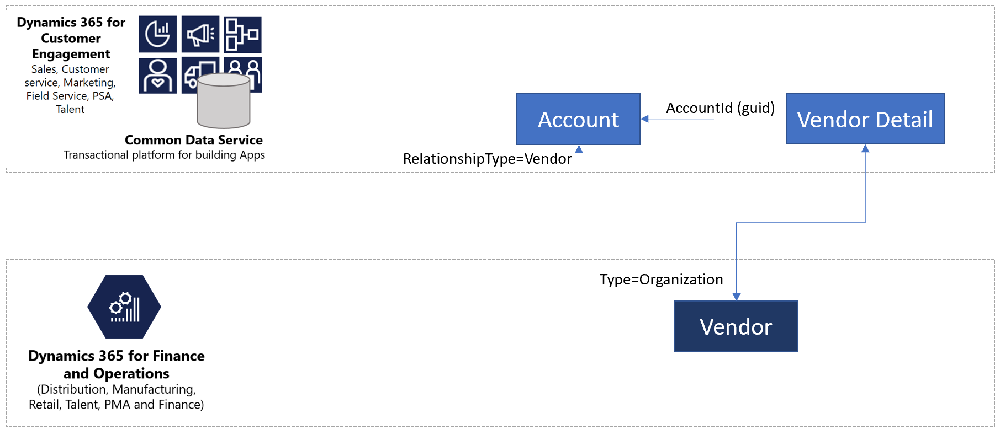
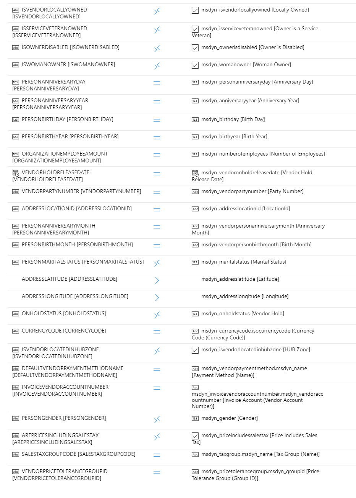

---
# required metadata

title: Vendor data flow
description: 
author: RamaKrishnamoorthy 
manager: AnnBe
ms.date: 07/15/2019
ms.topic: article
ms.prod: 
ms.service: dynamics-ax-applications
ms.technology: 

# optional metadata

ms.search.form: 
# ROBOTS: 
audience: Application User, IT Pro
# ms.devlang: 
ms.reviewer: rhaertle
ms.search.scope: Core, Operations
# ms.tgt_pltfrm: 
ms.custom: 
ms.assetid: 
ms.search.region: global
ms.search.industry: 
ms.author: ramasri
ms.dyn365.ops.version: 
ms.search.validFrom: 2019-07-15

---

## Integrated Vendor Master

*Vendor* refers to a supplier organization or a sole proprietor that is part of the supply chain process and supplies goods for the business. *Vendor* is an established concept in Finance and Operations. But in Customer Engagement, the *Vendor* concept does not exist. Some businesses overload the *Account* entity to store both customer and vendor information. Other uses a custom *Vendor* concept. Common Data Service (CDS) integration supports both these designs. You can choose to enable either of the designs based on your business scenario. Integrating the vendor data between Finance and Operations and Customer Engagement gives you the capability to multi-master vendor data. Regardless of where the vendor data originates, it is integrated behind the scenes across application boundaries and infrastructure differences. 

### Vendor data flow

If you want to use Customer Engagement for vendor-mastering and want to isolate vendor information from customers, then you can use the new vendor design.

If you want to use Customer Engagement for vendor mastering and you want to continue to use the **Account** entity for storing vendor information, you can use the new extended vendor design. In this design, extended vendor information like vendor group and vendor post profile are stored in the **vendor detail**.

Vendor contact information is similar to the customer contact information. Behind the scenes the contact person information is stored and retrieved from same entities.

## Templates

Vendor data includes all information about the vendor like vendor group, addresses, contact information, payment profile, and invoice profile. A collection of entity maps works together in vendor data interaction as listed below.

Finance and Operations  | Customer Engagement Application
------------------------|---------------------------------
Vendor V2               | Account
Vendor V2               | Msdyn\_vendors
CDS Contacts V2         | Contact
Vendor groups           | Msdyn\_vendorgroups
Vendor Payment Method   | Msdyn\_vendorpaymentmethods
Payment Schedule        | Msdyn\_paymentschedules
Payment Schedule        | Msdyn\_paymentschedulelines
Payment day CDS         | Msdyn\_paymentdays
Payment day lines CDS   | Msdyn\_paymentdaylines
Terms of Payment        | Msdyn\_paymentterms
Name Affixes            | Msdyn\_nameaffixes

## Vendor V2 and Account 

Businesses using the **Account** entity to store vendor information can continue to use it in the same way and also take advantage of the explicit vendor functionality coming due to Finance and Operations integration.

## Vendor V2 and Msdyn\_vendors

Businesses using a custom solution for vendors can take advantage of the out-of-the-box vendor concept introduced in CDS due to Finance and Operations integration. 

<!--  -->

<!--  -->

<!--  -->

Source field | Map type | Destination field
---|---|---
VENDORACCOUNTNUMBER | = | msdyn_vendoraccountnumber
VENDORGROUPID | = | msdyn_vendorgroupid.msdyn_vendorgroup
VENDORORGANIZATIONNAME | = | msdyn_name
VENDORPARTYTYPE | >< | msdyn_isperson
PERSONFIRSTNAME | = | msdyn_firstname
PERSONLASTNAME | = | msdyn_lastname
CREDITLIMIT | = | msdyn_vendorcreditlimit
ISFOREIGNENTITY | >< | msdyn_isforeignentity
ISONETIMEVENDOR | >< | msdyn_isonetimevendor
ADDRESSBUILDINGCOMPLIMENT | = | msdyn_addressbuildingcompliment
PERSONCHILDRENNAMES | = | msdyn_childrennames
ADDRESSCITY | = | msdyn_addresscity
ADDRESSCOUNTRYREGIONID | = | msdyn_addresscountryregionid
ADDRESSCOUNTRYREGIONISOCODE | = | msdyn_addresscountryregionisocode
ADDRESSCOUNTYID | = | msdyn_addresscountyid
CREDITRATING | = | msdyn_creditrating
ADDRESSDESCRIPTION | = | msdyn_addressdescription
ADDRESSDISTRICTNAME | = | msdyn_addressdistrictname
DUNSNUMBER | = | msdyn_dunsnumber
ETHNICORIGINID | = | msdyn_ethnicorigin
FORMATTEDPRIMARYADDRESS | = | msdyn_formattedprimaryaddress
PERSONHOBBIES | = | msdyn_hobbies
PERSONINITIALS | = | msdyn_initials
LANGUAGEID | = | msdyn_languageid
PERSONLASTNAMEPREFIX | = | msdyn_lastnameprefix
PERSONMIDDLENAME | = | msdyn_middlename
ORGANIZATIONNUMBER | = | msdyn_organizationnumber
OURACCOUNTNUMBER | = | msdyn_ourvendoraccountnumber
PAYMENTID | = | msdyn_paymentid
PERSONPHONETICFIRSTNAME | = | msdyn_phoneticfirstname
PERSONPHONETICMIDDLENAME | = | msdyn_phoneticmiddlename
PERSONPHONETICLASTNAME | = | msdyn_phoneticlastname
ORGANIZATIONPHONETICNAME | = | msdyn_organizationphoneticname
ADDRESSPOSTBOX | = | msdyn_addresspostbox
PRIMARYURL | = | msdyn_primarycontacturl
PRIMARYEMAILADDRESS | = | msdyn_primaryemailaddress
PRIMARYEMAILADDRESSDESCRIPTION | = | msdyn_primaryemailaddressdescription
PRIMARYFACEBOOK | = | msdyn_primaryfacebook
PRIMARYFACEBOOKDESCRIPTION | = | msdyn_primaryfacebookdescription
PRIMARYFAXNUMBER | = | msdyn_primaryfaxnumber
PRIMARYFAXNUMBERDESCRIPTION | = | msdyn_primaryfaxnumberdescription
PRIMARYFAXNUMBEREXTENSION | = | msdyn_primaryfaxnumberextension
PRIMARYLINKEDIN | = | msdyn_primarylinkedin
PRIMARYLINKEDINDESCRIPTION | = | msdyn_primarylinkedindescription
PRIMARYPHONENUMBER | = | msdyn_pimaryphonenumber
PRIMARYPHONENUMBERDESCRIPTION | = | msdyn_primaryphonenumberdescription
PRIMARYPHONENUMBEREXTENSION | = | msdyn_primaryphonenumberextension
PRIMARYTELEX | = | msdyn_primarytelex
PRIMARYTELEXDESCRIPTION | = | msdyn_primarytelexdescription
PRIMARYTWITTER | = | msdyn_primarytwitter
PRIMARYTWITTERDESCRIPTION | = | msdyn_primarytwitterdescription
PRIMARYURLDESCRIPTION | = | msdyn_primaryurldescription
PERSONPROFESSIONALSUFFIX | = | msdyn_professionalsuffix
PERSONPROFESSIONALTITLE | = | msdyn_professionatitle
ADDRESSSTATEID | = | msdyn_addressstateid
ADDRESSSTREET | = | msdyn_addressstreet
ADDRESSSTREETNUMBER | = | msdyn_addressstreetnumber
VENDORKNOWNASNAME | = | msdyn_vendorknownasname
ADDRESSZIPCODE | = | msdyn_addresszipcode
DEFAULTPAYMENTDAYNAME | = | msdyn_defaultpaymentdayname.msdyn_name
DEFAULTPAYMENTSCHEDULENAME | = | msdyn_paymentschedule.msdyn_name
DEFAULTPAYMENTTERMSNAME | = | msdyn_paymentterms.msdyn_name
HASONLYTAKENBIDS | >< | msdyn_hasonlytakenbids
ISMINORITYOWNED | >< | msdyn_isminorityowned
ISVENDORLOCALLYOWNED | >< | msdyn_isvendorlocallyowned
ISSERVICEVETERANOWNED | >< | msdyn_isserviceveteranowned
ISOWNERDISABLED | >< | msdyn_ownerisdisabled
ISWOMANOWNER | >< | msdyn_womanowner
PERSONANNIVERSARYDAY | = | msdyn_personanniversaryday
PERSONANNIVERSARYYEAR | = | msdyn_anniversaryyear
PERSONBIRTHDAY | = | msdyn_birthday
PERSONBIRTHYEAR | = | msdyn_birthyear
ORGANIZATIONEMPLOYEEAMOUNT | = | msdyn_numberofemployees
VENDORHOLDRELEASEDATE | = | msdyn_vendoronholdreleasedate
VENDORPARTYNUMBER | = | msdyn_vendorpartynumber
ADDRESSLOCATIONID | = | msdyn_addresslocationid
PERSONANNIVERSARYMONTH | = | msdyn_vendorpersonanniversarymonth
PERSONBIRTHMONTH | = | msdyn_vendorpersonbirthmonth
PERSONMARITALSTATUS | >< | msdyn_maritalstatus
ADDRESSLATITUDE | >> | msdyn_addresslatitude
ADDRESSLONGITUDE | >> | msdyn_addresslongitude
ONHOLDSTATUS | >< | msdyn_onholdstatus
CURRENCYCODE | = | msdyn_currencycode.isocurrencycode
ISVENDORLOCATEDINHUBZONE | >< | msdyn_isvendorlocatedinhubzone
DEFAULTVENDORPAYMENTMETHODNAME | = | msdyn_vendorpaymentmethod.msdyn_name
INVOICEVENDORACCOUNTNUMBER | = | msdyn_invoicevendoraccountnumber.msdyn_vendoraccountnumber
PERSONGENDER | >< | msdyn_gender
AREPRICESINCLUDINGSALESTAX | >< | msdyn_priceincludessalestax
SALESTAXGROUPCODE | = | msdyn_taxgroup.msdyn_name
VENDORPRICETOLERANCEGROUPID | = | msdyn_pricetolerancegroup.msdyn_groupid

## Contacts

Synchronizes all primary, secondary, and tertiary contact information of both customers and vendors between Finance and Operations and CE. For the entity map details, see [Integrated Customer Master](dual-write-customer.md#contacts).

## Vendor Groups

Synchronizes vendor group information between Finance and Operations and Customer Engagement.

<!--  -->

Source field | Map type | Destination field
---|---|---
DEFAULTPAYMENTTERMNAME | = | msdyn_paymentterms.msdyn_name
DESCRIPTION | = | msdyn_description
VENDORGROUPID | = | msdyn_vendorgroup
CLEARINGPERIODPAYMENTTERMNAME | = | msdyn_clearingperiodpaymentpermname.msdyn_name

### Vendor Payment Method

Synchronizes vendor payment method information between Finance and Operations and Customer Engagement.

<!--  -->

Source field | Map type | Destination field
---|---|---
NAME | = | msdyn_name
DESCRIPTION | = | msdyn_description
SUMBYPERIOD | >< | msdyn_sumbyperiod
DISCOUNTGRACEPERIODDAYS | = | msdyn_discountgraceperioddays
PAYMENTSTATUS | >< | msdyn_paymentstatus
ALLOWPAYMENTCOPIES | >< | msdyn_allowpaymentcopies
PAYMENTTYPE | >< | msdyn_paymenttype
LASTFILENUMBER | = | msdyn_lastfilenumber
LASTFILENUMBERTODAY | = | msdyn_lastfilenumbertoday
ACCOUNTTYPE | >< | msdyn_accounttype
BRIDGINGPOSTINGENABLED | >< | msdyn_bridgingposting
ENABLEPOSTDATEDCHECKCLEARINGPOSTING | >< | msdyn_postdatedcheckclearingposting
PROMISSORYNOTEDRAFTTYPE | >< | msdyn_promissorynotedrafttype
DIRECTDEBIT | >< | msdyn_directdebit

