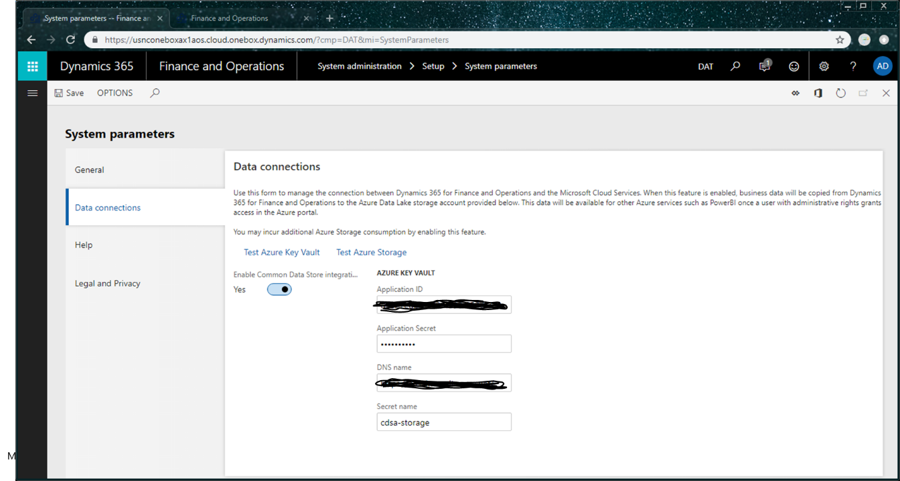

---
# required metadata

title: Entity store in an Azure Data Lake
description: This topic provides information about enabling the Entity store as an Azure Data Lake.
author: MilindaV2
manager: AnnBe
ms.date: 12/17/2018
ms.topic: article
ms.prod: 
ms.service: dynamics-ax-platform
ms.technology: 

# optional metadata

# ms.search.form: 
# ROBOTS: 
audience: Developer, IT Pro
# ms.devlang: 
ms.reviewer: kfend
ms.search.scope: Operations

# ms.tgt_pltfrm: 
ms.custom: 96283
ms.assetid: 
ms.search.region: Global
# ms.search.industry: 
ms.author: milindav
ms.search.validFrom: 2018-12-03
ms.dyn365.ops.version: Platform Update 23

---

# Entity store is a data lake

[!include [banner](../includes/banner.md)]
[!include [banner](../includes/private-preview-banner.md)]

> [!IMPORTANT]
> Access to this scenario is enabled by using the Carbon Flighting Service and is being released through multiple platform updates as follows:

> - Automated Entity store refresh - Available in Platform update 23 
> - Entity store data in Azure Data Lake (full push) – Available in Platform update 23(Restricted) 
> - DataFlows for Entity store schemas in PowerBI.com – Available in a future Platform update 
> - Entity store data in Azure Data Lake (trickle feed) – Available in a future Platform update 
> - Analytical workspaces extensible with PowerBI.com - Available in a future Platform update 

## Automated Entity store refresh  
1. Go to **System Administration** > **Set up** > **Entity store**. In the **Entity store** form, you will see a message indicating that you can switch to the **Automated Entity store refresh** option which is managed by the system. An administrator does not need to schedule or monitor the Entity store refresh.   

 
2. Choose **Switch now**.

> [!IMPORTANT]
> This is a non-reversible option. After you have selected this option, you can't re-enable the legacy UI. 

3. Select **Yes** to continue. You will now see the new experience. 

 
 
After the new experience is enabled, you will be able to define the refresh for each of the aggregate measurements.  
Following refresh options are available to choose: 

- Every hour 
- Twice a day 
- Once a day 
- Once a week 

In addition to these options, administrator can refresh any aggregate measurement on demand by selecting the Refresh now button. 
Additional options, including options for real-time refresh will be added in future platform updates.  
 
## Entity store data in Azure Data Lake 
> [!IMPORTANT]
> This restricted feature is enabled via flighting. This feature is only available if your environment is included in the flight. 

With this feature enabled, Entity store data is populated in an Azure Data Lake (storage gen2) account in your own subscription instead of the relational Entity store in Microsoft subscription. 
You can use full capabilities of PowerBI.com and other Azure tools to work with Entity store. 
Before you start, in the Azure portal, you will need to complete the steps in the following sections:

- **Create storage accounts**: Provision a storage account using Azure portal in the same data center that your Dynamics 365 for Finance and Operations is provisioned. Store the connection string to the storage account as you will need to provide it later.
- **Create a key value and a secret**: Provision a Key Vault in your own subscription using Azure portal. You will need the DNS name of the KeyVault entry you created. Add a secret to the Key Vault with the value of the connection string. Note down the name of the secret that you added to Key Vault as you will need to provide it later.
- **Register the app**: Create an Azure Active Directory Application and grant API access to the Azure Key vault. Store the Application ID and its Application Key/secret. You will need to provide the **Application ID** and **Application Secret** later. 
- **Add service principle to the Key vault**: In the Key vault, using the **Access policies** option, grant the application **Get** and **List** permissions. This grants the Azure application with access to the secrets in the Key Vault.  

  
## Create storage accounts 
1. Open the Azure portal and create a new storage account. 
2. In the **Create storage account** dialog, in the parameter fields, provide following specific values: 

 - **Location**: Select the data center where your Finance and Operations environment is located. If you select a data center which is in a different Azure region, you will incur additional data movement costs. If your PowerBI and/or data warehouse is in a different region. You can choose replication as a strategy to move storage between regions. 
- Performance: Standard is recommended 
- Account Kind: you must choose StorageV2 
 
3. In the **Advanced options** dialog, disable the **Data Lake storage Gen2 (preview)** option.  

> [!NOTE]
> This mode will be enabled in a later update. Until then, you can't consume data using ADLS APIs. 
> You may not see this option if you are not part of the preview program for ADLS Gen2 

4. Select **Review and create**. When the deployment is complete, the new resource will be shown in the Azure portal. 
5. Select the resource and then click **Settings** > **Access keys**.  
6. Make note of the connection string parameter value as you will need it again. 
 
## Create a key vault and a secret 

1. Open the Azure portal and create a new Key vault. 
2. In the **Create key vault** dialog, in the **Location** field, select the data center where your Finance and Operations environment is located. 
3. When the key vault is created, select it from the list, and then select **Secrets**.  
4. Select **Generate/Import**.  
5. In the **Create a secret** dialog, in the **Upload options** field, select **Manual**. 
6. Enter a name for the secret. Write the name down as you will need to provide it later. 
7. Enter the connection string you obtained from the storage account in previous step in the value field 
Select enabled and select the Create button 
Your secret will be created and added to the key vault 
 
## Register the App 

1. In the Azure portal, choose Azure Active Directory and then open **App registrations**. 
2. Select **New Application registration** and enter the following information: 
  - **Name**: App name 
  - **Application type**: Web API 
  - **Sign-on URL**: Copy and paste the root URL of Dynamics 365 Finance and Operations 

3. After the application is created, select the application and click the **Settings** icon.  
4. Select the **Required permissions** option.
5. Un the dialog that opens, select **Add option**, and then select **Add API**.  
6. In the list of APIs, select **Azure Key Vault**.
7. Select **Delegated permissions** check box,  select to grant permissions, and then click **Done** to save your changes.  
8. In the Application menu of the new app, select **Keys**. 
9. In the **Key Description** field, enter a name. Next, choose a duration and then click **Save**.
10. A secret will be generated in the **Value** field. Copy this secret to clipboard immediately as it will disappear within a minute or two. You will need to provide this key to the application later. 
 
## Add service principal to Key vault 

1. In the Azure portal, open the Key Vault you created earlier. 
2. Select **Access policies** and then click the **Add** icon to create a new access policy. 
3. In the **Select principal** field, choose the name of the application you previously registered. 
4. In the **Key permissions** field, choose Get and List permissions. 
5. In the **Secret permissions** field, choose Get and List permissions.

 

6. Click **Save**.
 
## Work in Entity store in Azure Data Lake 

1. Click **System Administration** > **Set up** > **System parameters**. 
  
  
  
2. Click the tab, **Data connections** and enter the following information:

  - The information you noted earlier in the Data connections tab in the system parameters form 
  - The Azure Active Direction Application ID you registered above in the Application ID field.  
  - The Application key/ secret in the Azure Active Directory application in the Application Secret field. 
  - The DNS name of the Key Vault in the DNS Name field. 
  - The name of the secret you added to the key vault with connection string information in the secret name field. 
3. Select Test Azure Key Vault and Test Azure storage links to validate whether the configuration information you provided is accessible to the system. 
4. Select the **Enable data connection** check box. 

With this configuration, Entity store data should be populated into the storage location you provided instead of the Relational Entity store database. 
Aggregate measurements and refresh options you choose in Entity store UI should now apply to data copied to Data lake. 
  
 
