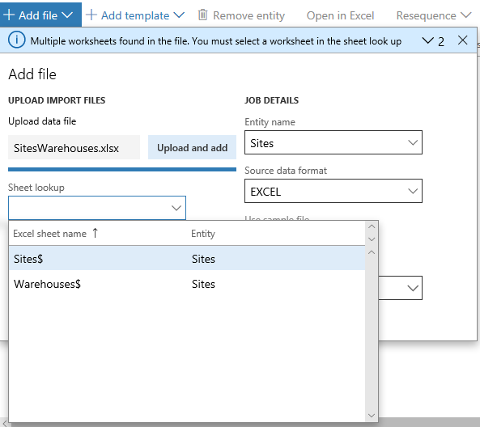

--
# required metadata

title: Excel data entity templates
description: This topic describes Excel data entity templates. 
author: Sunil-Garg
manager: AnnBe
ms.date: 01/01/2018
ms.topic: article
ms.prod: 
ms.service: dynamics-ax-platform
ms.technology: 

# optional metadata

# ms.search.form: 
# ROBOTS: 
audience: Application user
# ms.devlang: 
ms.reviewer: margoc
ms.search.scope: Operations
# ms.tgt_pltfrm: 
ms.custom: 
ms.assetid: 
ms.search.region: Global
# ms.search.industry: 
ms.author: sunilg
ms.search.validFrom: 2018-01-01
ms.dyn365.ops.version: Platform update 13

---

# Excel templates with multiple worksheets

Data management supports excel based templates for data entities. These templates can also have multiple worksheets. This often comes into play when data is logically grouped into a single excel file but in different worksheets, an example of which would be, sites and warehouses or journals of various kind. In such cases, it is convenient to manage the data in a single file and import across multiple data entities.

### Upload the file once and map it to all entities
Let’s take an example where there is one excel file with two worksheets called, Sites and Warehouses. When setting up the data import project, one would add the first data entity, say, Sites and then upload the excel file. You will be able to select ‘Sites’ as the worksheets to be used for this entity.

Now, if the second entity ‘Warehouses’ is also added without exiting the ‘add file’ form, the worksheet look-up will allow to select the ‘Warehouses’ worksheet without having to upload the file again. The only reason to upload a new file will be if the ‘Warehouses’ data was in a different file.

 

### Fixing the worksheet to entity mapping
The mapping of the worksheet to a data entity in the import job can be fixed from the grid. The ‘Worksheet’ column in the grid shows the worksheets from the file that was mapped. A different worksheet can be chosen from the dropdown. If the chosen worksheet is already mapped to an entity in the data project, the system seeks a confirmation before proceeding. It is recommended to fix the mapping in the grid itself if the file being used is the same file that was used initially.

### Re-mapping to a new file

In cases where a new file (new version of the same file or a completely new file) must be uploaded for existing entities in a data project, the ‘add file’ experience must be used, and the entities must be added again as if they were being added for the first time. The system will seek confirmation to override the existing entities in the data project before proceeding. Entities that are not added again (or overwritten) will continue to hold the previous mappings from the previous file.

### Uploading a file in the ‘Run project’ experience

When using the ‘Run project’ option to execute an import project, the excel file can be uploaded. However, care must be taken to upload the file that has the same worksheet(s) as per exiting mappings on the data entities in the data project. If a worksheet is not found in the newly uploaded file, the system would throw an error and will prevent from proceeding. If the mapping to the worksheet must be changed for an entity, then the mapping(s) in the data project must be first updated from within the data project before using the file in the ‘Run project’ experience.

