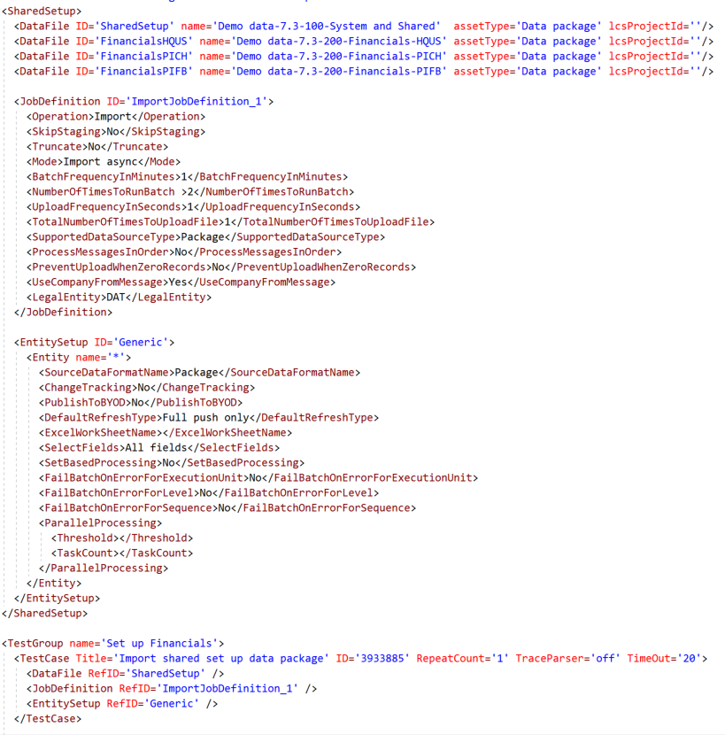

---
# required metadata

title: Generate demo data by using data packages
description: This topic describes how to use demo data packages to generate data for your system. 
author: mikefalkner
manager: AnnBe
ms.date: 10/29/2017
ms.topic: article
ms.prod: 
ms.service: dynamics-ax-platform
ms.technology: 

# optional metadata

# ms.search.form: 
# ROBOTS: 
audience: Developer, IT Pro
# ms.devlang: 
ms.reviewer: margoc
ms.search.scope: Operations, Platform, UnifiedOperations
# ms.tgt_pltfrm: 
ms.custom: 77523
ms.search.region: Global
# ms.search.industry: 
ms.author: mfalkner
ms.search.validFrom: 2017-10-31
ms.dyn365.ops.version: Platform update 11

---
# Generate demo data by using data packages

Demo data has been delivered as a database in prior releases. Starting in the Fall 2017 release, a subset of the demo data with changes will also be released in LCS as data packages in the shared asset library. These packages are designed to be loaded onto an empty environment and you can choose which packages that you need to load for your demonstration. 

Using data packages to deliver demo data provides some benefits over using the current database:
1. The download times are signficantly faster.
2. You can import only the data packages that you need.
3. You can edit the spreadsheets to customize the data for your customers. 
4. Updated demo data can be provided through LCS very quickly.

## How the packages are organized

The demo data packages are designed to be layered on top of each other as shown in this diagram:

However, the global information for one demo scenario may have completely different requirements than another demo scenario. For example, dimensions for one scenario would interfere with another scenario. In those cases, a separate global information package will be created and only packages related to that information can be layered on top of it.

### System and shared
The base package, **System and Shared**, is the foundation for all other packages. This package creates the legal entities, loads the global address book, and adds additional shared information. It must be loaded first to support all of the remaining packages. The package is entitled "100 - System and Shared.zip"

Once the package is loaded, you will one or more of the following legal entities:

| Legal entity | Description |  
|------|--------|
| HQUS | The US based headquarters for your demo company. This company was based on the original USMF data but changed to remove the manufacturing focus in the name. It includes setup information intended for US companies.|
| HQEU | The non-US based headquarters for your demo company. This company was based on the original DEMF data but changed to remove the manufacturing focus in the name. It includes setup information intended for non-US companies.|
| CONS | A small consolidations company. |
| PICH | A process industries company focused on chemicals. |
| PIFB | A process industries company focused on food and beverage. |

### Financials
The **Financial** data packages contain data for general ledger, bank, accounts payable, tax, accounts receivable, fixed assets, and budgeting for a single company. These data packages are entitled "200 - Financials" followed by the legal entity for which they were intended. For examples, the financial data packages for HQUS are entitled "200 - Financials - HQUS.zip".

At least two financials companies are required for cross company tasks such as centralized payments. All customers and vendors have been added to each legal entity to facilitate the cross company tasks. The CONS company is required if you want to do consolidations. 

The financial data packages also have five inventory products to support the creation of invoices that will move through the accounts receivables and accounts payables processes. These items use a minimum of inventory and product functionality to support those process while eliminating complexity of setting up products when you want to demonstrate only financials functionality. More complete products will be added when you import the supply chain packages.  

### Supply chain
The **Supply chain** data packages contain data for inventory management, product information, procurement and sourcing, sales and marketing, quality management, warehouse management, transportation management, production control, process manufacturing, costing, and master planning for a single company. Due to the large number of entities, the supply chain packages for some companies have been split up into two packages. Both packages must be loaded to complete the supply chain scenarios but they can be loaded as two separate projects. 

These data packages are entitled "300 - Supply chain" followed by the legal entity for which they were intended. For examples, the supply chain data packages for PICH are entitled "300 - Supply chain - PICH.zip". The HQUS supply chain packages were split into two package called "300 - Supply chain 1 of 2 - HQUS.zip" and "310 - Supply chain 2 of 2 - HQUS.zip"

### Project management and accounting
The **Project management and accounting** data packages contain data for project accounting and expense management. These data packages are entitled "400 - Project management and accounting" followed by the legal entity for which they were intended. For examples, the supply chain data packages for HQUS are entitled "400 - Project management and accounting - HQUS.zip"   

## Demo data package releases
The demo data packages will be released via LCS and matched to the release for which they were intended. Please note that the contents of the packages are subject to change as we add more demo scenarios and tune the packages. Additional packages will also be released when we add additional module areas and industry specific scenarios. These packages are not yet a full replacement for the demo database that is supplied today.

### Release information inthe data package name
The name of the packages will also include the release that it will work with. Using the naming conventions described above, the name of the files for the Fall 2017 release will be "Demo data - 2017 Fall release - " plus the name described above. For example, the full name for the Financials package for the Fall 2017 release will be "Demo data - 2017 Fall release - 200 - Financials - HQUS.zip"

## Steps to take before loading packages

There are some steps that you will need to do manually before you load the data. 
1) If you want to login as a specific user, you will need to change the user's email address to the login address that you want to use. You can make that change in the User information data entity spreadsheet or, after loading data, in the System administration, Users form.
2) You will need to start the Workflow jobs. Use System administration, Workflow infrastructure configuration and click on Ok. The workflow jobs will be started.
3) The Ready to post batch scheduler must be started. This batch will post transactions automatically. Follow the steps described for Ready to Post below. You must start the scheduler in every legal entity in which you want data to be processed.
4) You need to set up policy precedence rules. Use Procurement and sourcing, Setup, Policies, Purchasing policies and select the Parameters menu item. Click on Companies and move it to the right hand column.
5) Prior to loading the Project Management and Accounting package, the resource capacity roll-up batch job should be run. The batch can be run from Project management and accounting, Periodic, Capacity synchronization, Synchronize resource capacity roll-ups form. Use an end date that will allow you to schedule resources well into the future. After the batch is run, then the project work breakdown structure auto generation of team functionality will be enabled.

## Loading the packages

The data packages must be loaded in a specific order into a specific legal entity. The number preceding the name of the package provides guidance to the order that the data must be loaded. For example, to load the HQUS financials, you must import "100 - System and shared.zip" first, followed by "200 - Financials - HQUS.zip". If you want to add supply chain data to the HQUS company, add "300 - Supply chain 1 of 2 - HQUS.zip". The name of the package will also include the release for which it was intended.

Follow these steps to load the packages:
1) Start with an empty instance where no data is loaded
2) Open the data management workspace
3) Click on the Import tile to create an import job
4) Add a title to the job. For example, "Import shared information"
5) Select "Add file" 
6) Select "Upload and add" and browse to the data package that you want to import. You will need to start with the System and Shared data package.
7) Select the data package and wait for the data to load
8) Once the data is loaded, close the dialogue and click on Import 
9) Repeat the process for additional packages. Be sure to change to the company for which the data package was intended. For example, switch to the HQUS company before importing the data package

### Loading package combinations
The following packages are available to load. You must be in the legal entity listed in the package when you import it, except for System and Shared, which can be loaded from any legal entity but normally in DAT, the default company.

| Description | Notes |  
|------|--------|
| 100 - System and Shared | This must be loaded before any package.|  
| 200 - Financials - HQUS | This can be loaded alone or with another financials package. |  
| 200 - Financials - HQEU | This can be loaded alone or with another financials package. |  
| 200 - Financials - CONS | This can be loaded alone or with another financials package. |  
| 200 - Financials - PICH | This can be loaded alone or with another financials package. |  
| 200 - Financials - PIFB | This can be loaded alone or with another financials package. |  
| 300 - Supply chain 1 of 2 - HQUS | This must be loaded after the HQUS financials package. |  
| 310 - Supply chain 2 of 2 - HQUS | This must be loaded after the HQUS Supply chain 1 of 2 package. |  
| 300 - Supply chain - PIFB | This must be loaded after the PIFB Supply chain package. |  
| 300 - Supply chain - PICH | This must be loaded after the PICH Supply chain package. |  
| 400 - Project management - HQUS | This must be loaded after the HQUS financials package. |  
| 900 - Financial transactions - HQUS | This must be loaded after the HQUS financials package. |  
| 900 - Financial transactions - HQEU | This can be loaded alone or with another financials package. |  

### Steps to take after loading packages
In some cases, there may be data that you want to add due to a special scenario or missing entity. Add that data at this time. You may also want to manually post additional transactions or add your own data packages to enhance the demo experience.

### Scenario scripts
Scripts have been provided for many of the scenarios supported by the demo data. You can find those scripts here: [Demo data scripts for Dynamics 365 Finance and Operations, Enterprise Edition](https://go.microsoft.com/fwlink/?linkid=861599). Please note that we will be continually adding additional scripts as they are completed.

## Transactions and automatic posting
Many scenarios for demo data require that transactions be processed after they are imported. You can process transactions using the Ready to post feature, which includes both a form that allows you to define which transactions should be posted and an entity that allows you to import the definitions and automatically execute them. 

The following transaction types are supported for posting demo data:

| Document | Entity document ID | Date filter | ID filters | Other filters |  
|------|--------|--------|--------|--------|
| Budget registry update | BudgetRegistryUpdate |Default Date | Budget entry number | Not in use, Status = Draft. |
| Costing version | CostingVersion |n/a | Version Id | Version Activation blocked = No. | 
| Customer payment journal | CustomerPaymentJournal |Transaction date | Journal number | Not posted, not workflow, not system blocked. | 
| Daily journal | GeneralJournal |Transaction date | Journal number | Not posted, not workflow, not system blocked. |
| Fixed assets journal | FixedAssetsJournal |Transaction date | Journal number | Not posted, not workflow, not system blocked. |
| Free text invoice | FreeTextInvoice |Invoice Date | n/a |  |
| Inventory adjustment journal | InventoryAdjustmentJournal |Transaction date | Journal number | Not posted. |
| Invoice journal | InvoiceJournal |Transaction date | Journal number | Not posted, not workflow, not system blocked. |
| Price calculation | PriceCalculation |n/a | Version Id | Version Activation blocked = No. |
| Purchase order | PurchaseOrder |Delivery date | Purchase order id | Able to confirm/PR/Vendor confirm/invoice. |
| Sales order | SalesOrder |Delivery date | Sales order id | Able to confirm/packing slip/invoice. |
| Trade agreement | TradeAgreement |n/a | Price/discount journal number. |  |
| Vendor invoice | VendorInvoice |Posting date | Invoice number | Approved, not in use, not yet . |
| Vendor payment journal | VendorPaymentJournal |Transaction date | Journal number | Not posted, not workflow, not system blocked. |

For journals that support date ranges, the ready to post process looks at all of the journal lines to test for a date that falls in the specified range. If any line in the journal fall in the date range, the search stops and the entire batch will be posted.

### The Ready to post process
The Ready to post feature uses a batch to monitor the list of transaction types that you want to post. Once the monitor detects a transaction that you want to post, it uses the transaction type to generate a batch that posts those transactions. The batch that is created is the same kind of batch that is created when you use the user interface for that transaction type. Once the transaction batch is complete, the Ready to post monitor updates the list with the results of the processing and with links to the batch and the original transaction.

### Use the Ready to post form to process transactions
You can access the Ready to post form using System administration, Periodic tasks, Batch job ready to post. 

To create a Ready to post job, follow these steps:
1) Select the Create posting monitor menu and set up the batch parameters so that you have a recurring batch running. You only have to do this step once for each legal entity to initiate the posting batch process.
2) Select New and enter a name for the demo data job. This job name must be unique and it must be unique across all companies.
3) Use Add line to add a transaction type. 
4) Select the transaction target. For journals, it is Post. For other transactions, it may change depending on the transaction type.
4) Specify a start and end date range to limit the transactions that will be processed (when available)
5) Specify a from and to document range to limit the transactions that will be processed (when available)
6) Use Add line to add additional transaction types. You can use the same type on multiple lines.
7) Click on the menu Mark ready to post. It will change the status from Open to Ready and the posting monitor will start processing each line.
8) If you want to process the document immediately, click on the Process documents menu. The batch status will change to Scheduled and a batch will be started without using the posting monitor.
9) When the batch is running, the status will be changed to In Progress
10) When the batch is complete, the status will change to Successful or Error depending on the results. The posting results will be displayed at the bottom of the form.

### Using the Ready to post entity to process transactions
An entity called Demo data posting entity allows you to import a list of document types that you want to post. The entity will create a demo data job in the Ready to post form. If you have started the posting monitor, the transactions will post automatically after you import the data with the entity. 

The following columns appear in the Ready to post entity:

| Column | Purpose | 
|------|--------|
| DemoDataJob | A unique demo data job id that you want to execute. Use the same ID for every line that belongs to a single job.|
| LineNum | The order in which the tasks will be executed. |
| DataProjectId | A link to the data project that contained the Ready to post entity. This is for export only.|
| DemoDataJobStatus | The status of your demo data project. This is for export only. |
| Document | The document type that you want to process. |
| DocumentTarget | The process that you want to run. For journals, it can only be Post. For transactions like sales order, it will match the options shows in the form when you add that task. |
| EndDate | An optional end date that limits the transactions that you want to process. |
| FromDocument | An optional from document that limits the transactions that you want to process. |
| ProcessOnImport | If you update this value to Yes, the demo data job will be set to Ready and the process monitor will pick it up without any action required. |
| StartDate | An optional start date that limits the transactions that you want to process. |
| ToDocument | An optional to document that limits the transactions that you want to process. |

Insert the Ready to post entity at the end of your data project after all of the transaction entities by using a sequence number in the data project that is higher than the ones used by the transactions entities. If you have a mix of transactions where some of them should be processed and others should not be processed, you must use the date and document ranges to limit which transactions are processed. If you can't use the ranges, you will need a separate data package for the unposted transactions.

