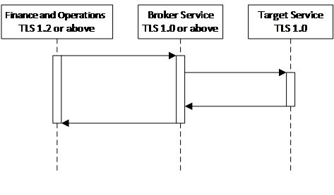

---
# required metadata

title: Integration patterns and practices
description: This topic is intended to help architects and developers make sound design decisions when implementing integration scenarios with Microsoft Dynamics 365 for Finance and Operations.
author: Sunil-Garg
manager: AnnBe
ms.date: 11/10/2017
ms.topic: article
ms.prod: 
ms.service: dynamics-ax-platform
ms.technology: 

# optional metadata

# ms.search.form: 
# ROBOTS: 
audience: Developer
# ms.devlang: 
ms.reviewer: margoc
ms.search.scope: Operations
# ms.tgt_pltfrm: 
# ms.custom: 
# ms.assetid: 
ms.search.region: Global
# ms.search.industry: 
ms.author: sunilg
ms.search.validFrom: 2016-02-28
ms.dyn365.ops.version: AX 7.0.0

---

# Integration patterns and practices

[!include[banner](../includes/banner.md)]

This topic is intended to help architects and developers make sound design decisions when implementing integration scenarios with Microsoft Dynamics 365 for Finance and Operations, Enterprise edition.

The topic describes Finance and Operations integration patterns, integration scenarios, and integration solutions and best practices. It does not include technical details on how to use or set up each Finance and Operations integration pattern, nor sample integration code.

The following table lists the integration patterns available for Finance and Operations.

| Pattern                       | Documentation                                       |
|-------------------------------|-----------------------------------------------------|
| OData                         | [Odata](odata.md)                                               |
| Batch data API                | [Recurring integrations](recurring-integrations.md)                              |
|                               | [Data management API](data-management-api.md)                                 |
| Custom service                | [Services home page, Custom services](custom-services.md)                 |
| Consume external web services | [Services home page, Consuming external web services](consume-external-web-service.md) |

### Synchronous vs asynchronous integration patterns

Deciding which integration pattern to use is often based on whether you need to use synchronous or asynchronous processing. 
  
A *synchronous* pattern is a blocking request and response pattern, in which the caller is blocked until the callee is done executing and gives a response.
An *asynchronous* pattern is a non-blocking pattern, in which the caller submits the request and continues without waiting for a response.

The following table lists the inbound integration patterns that are available. 

| Pattern        | Timing       | Batch |
|----------------|--------------|-------|
| OData          | Synchronous  | No    |
| Batch data API | Asynchronous | Yes   |

Before comparing synchronous vs asynchronous, you should be aware that all REST and SOAP integration APIs provided by Finance
and Operations can be invoked either synchronously or asynchronously.

The following examples illustrate this point. One can’t draw the conclusion that when OData is used for integration, the caller will be blocked. That is not true, because it really depends on how a call is made.

| Pattern        | Synchronous programming paradigm    | Asynchronous programming paradigm        |
|----------------|---------------------------------------|--------------------------------------------|
| OData          | DbResourceContext.SaveChanges         | DbResourceContext.SaveChangesAsync        |
| Custom Service | httpRequest.GetResponse               | httpRequest.BeginGetResponse               |
| SOAP           | UserSessionService.GetUserSessionInfo | UserSessionService.GetUserSessionInfoAsync |
| Batch data API | ImportFromPackage                     | [BeginInvoke](../dotnet/standard/asynchronous-programming-patterns/calling-synchronous-methods-asynchronously)                                |

OData and custom service are both synchronous integration patterns because calling these APIs results in the immediate execution of business logic in Finance and Operations. For example: 
- If OData is used to insert product records, the records are inserted immediately as part of the OData call. 
- If a custom service is used to look up on-hand inventory, then business logic is executed immediately as part of the JSON\\SOAP call and an inventory sum number is immediately returned.

Batch data APIs are considered asynchronous integration patterns because calling these APIs results in data being imported or exported in batch mode. Consider the ImportFromPackage API: calls to ImportFromPackage can be synchronous, however, the API only schedules a batch job to import a specific data package. The scheduling job quickly returns, and the work is done later in a batch job. Therefore, we categorize batch data APIs as asynchronous.

Batch data APIs are designed to deal with large volume data import and export. Depending on the entity, and how much business logic is being executed during import or export, it is very hard to define a generic amount to determine what a large volume is. A rule of thumb is that if volume is more than a few hundred thousand, you should use the batch data API for integrations.

#### Error handling 

When using a synchronous pattern, success or failure responses are returned to the caller. For example, if an OData call is used to insert sales orders, if a sales order line has a bad reference to a product that does not exist, the caller will get a response containing an error. It is caller’s responsibility to handle potential errors in the response.

When using an asynchronous pattern, the caller will get an immediate response about whether the scheduling call was successful. It is the caller’s responsibility to handle potential errors in the response. After scheduling is done, the data import or export status won’t be pushed to the caller. The caller must poll for the result of the corresponding import or export process and handle errors accordingly.

## Integration patterns
In general, when selecting an integration pattern, we recommend that you consider the following: 

-   Is there a business requirement for the integration to be real time?
-   What is the peak data volume requirement?
-   What is the frequency?

### OData scenarios
The following are common scenarios that use OData integrations. 

#### Create and update product information

A manufacturer runs Finance and Operations but defines and configures their product with a third-party application hosted on-premise. They want to move their production information from their on-premise application into Finance and Operations. When a product is defined, or changed in the on-premise application, the end user would like to see the same change made in Finance and Operations, and they want it real time.

| Decision  | Information       |
|--------------------------|-----------|
| Real-time data required? | Yes       |
| Peak data volume         | 1000/hour\* |
| Frequency                | ad hoc    |

\*Occasionally, there will be many new or modified production configurations made in a short period of time.

**Recommended solution**

This scenario is best implemented using the OData service endpoints to create and update product information in Finance and Operations.

In Finance and Operations:
-   Determine all of the entities needed for the integration.
-   Make sure the OData service endpoints are available for the same set of entities.

In the third-party application:
- When product information is created or modified in the third-party application, a corresponding OData call is made to Finance and
Operations to make the same change.

#### Read order status

A company runs Finance and Operations but has a self-hosted customer portal where customers can check status of their orders. Order status is maintained in Finance and Operations.

| Decision  | Information       |
|--------------------------|-----------|
| Real-time data required? | Yes       |
| Peak data volume         | 5000/hour |
| Frequency                | ad hoc    |

**Recommended solution**

This scenario is best implemented using the OData service endpoints to read order status from Finance and Operations.

In Finance and Operations:
-   Determine the entity needed for checking order status.
-   Make sure the OData service endpoint is available for the entity.

From the customer portal site:
-   When the customer checks the order status, make a real-time OData call into Finance and Operations to read the corresponding order and retrieve status for that order.

#### BOM approval

A company runs Finance and Operations but hosts a product lifecycle management (PLM) system on-premises. The PLM system has a workflow that sends the finished BOM information to Finance and Operations for approval.

| Decision  | Information       |
|--------------------------|-----------|
| Real-time data required? | Yes       |
| Peak data volume         | 1000/hour |
| Frequency                | ad hoc    |

**Recommended solution**

This scenario could be implemented with an OData action.

In Finance and Operations:
-   Determine the entity needed for the integration.
-   Make sure the OData service endpoints are available for the entity.
-   Create an action on the entity to execute the required business logic. 

In the PLM solution:
-   Have the PLM system invoke the OData action to approve the BOM.

> [!NOTE]
> An example of this type of OData action can be found in the BOMBillOfMaterialsHeaderEntity::approve.

### Custom service scenarios
The following are common scenarios that use a custom service. 

#### On-hand inventory lookup

An energy company has field workers scheduling installation jobs for heaters. This company uses Finance and Operations for back office and a third-party SaaS for scheduling appointments. When scheduling appointments, they need to look up inventory availability to
make sure installation parts are available for the job.

| Decision  | Information       |
|--------------------------|-----------|
| Real-time data required? | Yes       |
| Peak data volume         | 1000/hour |
| Frequency                | ad hoc    |

**Recommended solution**

This scenario could be implemented using a custom service.

In Finance and Operations:
-   Create a custom service to calculate the physical inventory on hand for a given item.

In the scheduling application:
-   Make a real time call to a custom service endpoint, either thru SOAP or REST to retrieve inventory information for the selected item.

> [!NOTE]
> An example of this type of custom service can be seen in the Retail Real Time Services implementation:  RetailTransactionServiceInventory::inventoryLookup

You can also use the inventorySiteOnHand entity to achieve the same result. Sometimes, there is more than one possible way to expose the same data and business logic inside of Finance and Operations, and there is no "better" way. In this case, the decision comes down to which way works best for a given scenario and which method a developer is most comfortable with.

### Batch data integration scenarios
The following are common scenarios that use the batch data APIs.

#### Import sales orders in large volumes

A company receives large volume of sales orders from a front-end system that runs on-premise. These orders need to be sent to Finance and
Operations periodically for processing and management.

| Decision  | Information       |
|--------------------------|-----------|
| Real-time data required? | No       |
| Peak data volume         | 200,000/hour |
| Frequency                | Once every 5 minutes    |

**Recommended solution**

This scenario is best implemented with batch data APIs.

In Finance and Operations:
-   Determine the entities needed for the integration.
-   Make sure that data management is enabled for the entities.

In the on-premises system:
-   Use the REST batch data API to import files into Finance and Operations.

#### Export large volumes of purchase orders

A company generates large amounts of purchase orders in Finance and Operations and uses an on-premise inventory management system to receive products. Purchase orders need to be moved from Finance and Operations to the on-premise inventory system.

| Decision  | Information       |
|--------------------------|-----------|
| Real-time data required? | No       |
| Peak data volume         | 300,000/hour |
| Frequency                | Once an hour    |

**Recommended solution**

This scenario is best implemented with batch data APIs.

In Finance and Operations:
-   Determine the entities needed for the integration.
-   Make sure that data management is enabled for the entities.
-   If incremental push is required, make sure that change tracking can be enabled on the entities.

In the on-premises inventory system:

-   Use the REST batch data API to export the file out of Finance and Operations, and import it into the inventory system.

### Call external web services

It’s quite common for Finance and Operations to call out to an external web service, hosted on-premises or by another SaaS provider. In this case Finance and Operations acts as the integration client, which is similar to writing an integration client for any other applications. The same set of best practices and guidelines applies. For a simple example, see [Consuming external web services](consume-external-web-service.md).

> [!IMPORTANT]
> Due to security requirements, Finance and Operations production and sandbox environments support only secured communication using TLS 1.2 or above. This means the target web service endpoint Finance and Operations is making a call out to has to support TLS1.2 or above. If the target service endpoint doesn’t fulfill this requirement, calls from Finance and Operations will fail with an exception error message similar to the following:
> “Unable to read data from the transport connection: An existing connection was forcibly closed by the remote host.” 
> If there is no way to modify the target service to be TLS 1.2  or above, one can work around this by introducing a broker service and making a two-hop call, as illustrated by the following diagram.

