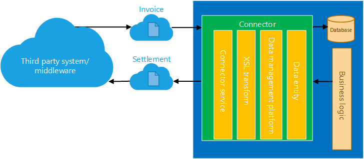
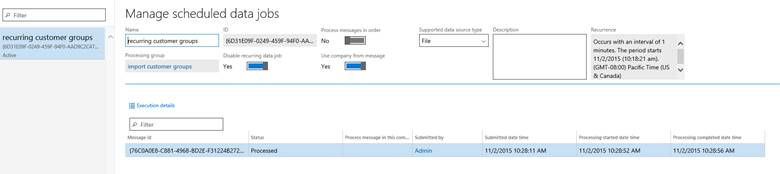
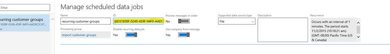
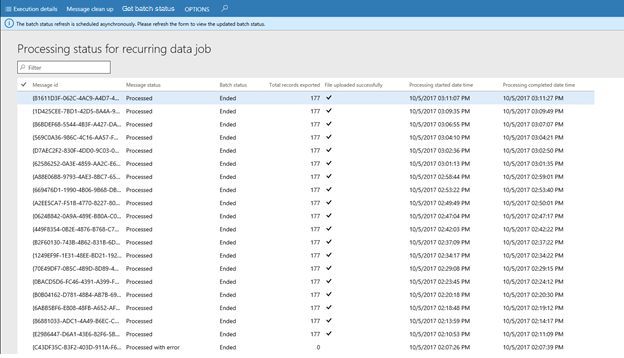
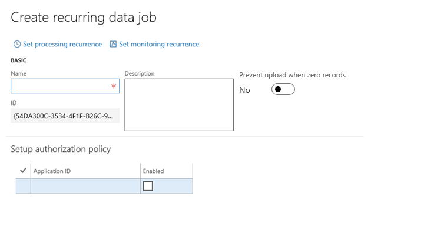

---
# required metadata

title: Recurring integrations
description: This topic provides information about recurring integrations. The process of data migration, and movement into and out of any enterprise system, are critical pieces that any platform must support. 
author: Sunil-Garg
manager: AnnBe
ms.date: 10/04/2017
ms.topic: article
ms.prod: 
ms.service: dynamics-ax-platform
ms.technology: 

# optional metadata

# ms.search.form: 
# ROBOTS: 
audience: Developer
# ms.devlang: 
ms.reviewer: robinr
ms.search.scope: Operations
# ms.tgt_pltfrm: 
ms.custom: 24821
ms.assetid: 70a4f748-b0bd-44b1-a118-56aacb91481c
ms.search.region: Global
# ms.search.industry: 
ms.author: sunilg
ms.search.validFrom: 2016-02-28
ms.dyn365.ops.version: AX 7.0.0

---

# Recurring integrations

[!include[banner](../includes/banner.md)]

The process of data migration, and movement into and out of any enterprise system, are critical pieces that any platform must support. Lots of effort and planning go into building third-party integrations between an enterprise line of business (LOB) system, such as Microsoft Dynamics 365 for Finance and Operations, Enterprise edition, and various source systems. Microsoft Dynamics AX 2012 enables these scenarios through Application Integration Framework (AIF). For Finance and Operations, we have tried to simplify this process for all parties who are involved, from integration solution builders to customer users.

## Architecture
Integration does the following things:

- It builds on data entities and the Data management framework.
- It enables the exchange of documents or files between Finance and Operations and any third-party application or service.
- It supports several document formats, source mapping, Extensible Stylesheet Language Transformations (XSLT), and filters. 

    

- It uses secure REST application programming interfaces (APIs) and authorization mechanisms to receive data from, and send data back to, integration systems. 

    

## Authorization for the integration REST API
The integration REST API uses the same OAuth 2.0 authentication model as the other service endpoints. Before the integrating client application can consume this endpoint, you must create an application ID in Microsoft Azure Active Directory (Azure AD) and give it appropriate permission to Finance and Operations. When you create and enable a recurring job, you're prompted to enter the Azure AD application ID that will interact with that recurring job. Therefore, be sure to make a note of the application ID.

## Set up a data project and recurring data jobs
### Create a data project

1. On the main dashboard, select the **Data management** tile to open the **Data management** workspace.
2. Select the **Import or Export** tile to create a new data project. 

    > [!NOTE]
    > If you have an existing data project, select **Load project** on the card for any data project on the **Data projects** tab.

3. Enter a valid job name, data source, and entity name.
4. Upload a data file for one or more entities. Make sure that each entity is added, and that no errors occur. 

    > [!NOTE]
    > You can select each entity data card to set up, review, or modify field maps, and to set up XSLT-based transforms that must be applied to inbound data. For export data projects, the entity card also shows a filter link, so that you can set up filters to filter data. Currently, all recurring data jobs in a data project use the same filter.

5. Select **Save**.

### Create a recurring data job

1. On the **Data project** page, select **Create recurring data job**.
2. Enter a valid name and a description for the recurring data job.
3. On the **Set up authorization policy** tab, enter the application ID that was generated for your application, and mark it as enabled.
4. Expand **Advanced options** tab, and specify either **File** or **Data package**.

    - **File** – Your external integration will push individual files so that they can be processed via this recurring data job. In this case, the format of the file that is expected is the same as the format that was specified when the entity was added to the data project.
    - **Data package** – You can push only data package files for processing. A data package is a new format that lets you submit multiple data files as a single unit that can be used in integration jobs.

5. Select **Set processing recurrence**, and then, in the **Define recurrence** dialog box, set up a valid recurrence for your data job. 
6. Optional: Select **Set monitoring recurrence**, and set up a monitoring recurrence. 

    > [!NOTE]
    > Currently, monitoring recurrence enables load monitoring only on the queue for your recurring data job. No additional policies are supported via this service. You can use this feature to fine-tune the processing recurrence as the load demand requires.

7. Select **OK**, and then select **Yes** in the confirmation message box.

## Manage recurring data jobs
1. In the **System administration** workspace (not the **System administration** module), select the **Data Management IT** workspace. 

2. In the workspace, on the **Recurring data job** tab, select the recurring job to view the details. The **Manage scheduled data jobs** page contains a grid that lists any messages that are waiting in the queue. Therefore, you can monitor messages and the processing status. 

    

## Submitting data to recurring data jobs
You can use integration REST endpoints to integrate with the client, submit documents (import), or poll available documents for download (export). These endpoints support OAuth.

## Integration REST APIs
The following set of APIs is used to exchange data between the integration client and Finance and Operations.

### API for import (enqueue)
Make an HTTP POST call against the following URL.

    https://<base URL>/api/connector/enqueue/<activity ID>?entity=<entity name>

In the message body, you can the pass the data as a memory stream.

**Example**

    POST https://usncax1aos.cloud.onebox.dynamics.com/en/api/connector/enqueue/%7B6D31E09F-0249-459F-94F0-AAD9C2C47B64%7D?entity=Customer%20Groups

To get the activity ID, on the **Manage scheduled data jobs** page, in the **ID** field, copy the globally unique identifier (GUID).

### API for export (dequeue)
To return a data package that contains all the data entities that were defined in the data project, and that the client application can unzip and consume, use the following structure.

    https://<base URL>/api/connector/dequeue/<activity ID>

**Example**

    GET https://usncax1aos.cloud.onebox.dynamics.com/en/api/connector/dequeue/%7BC03BB937-09ED-46DE-86EE-4520D7D7E373%7D

After the client downloads the data, an acknowledgment must be sent back to Finance and Operations, so that you can mark the data as received.

### API for acknowledgment
Use the following API.

> [!NOTE]
> The body of the response of **/enqueue** must be sent in the body of the **/ack** POST request.

    https://<base URL>/api/connector/ack/<activity ID>

**Example**

    POST https://usncax1aos.cloud.onebox.dynamics.com/en/api/connector/ack/%7BC03BB937-09ED-46DE-86EE-4520D7D7E373%7D
    
### API for getting the message status
Use the following API to get the status of a message. This will be particularly useful in import scenarios to know if the message was successfully processed or not. The message is created when enqueue was completed. If the message returns a failed status, the external integration app can choose to re-try or take other actions to recover from the error.

POST /data/DataManagementDefinitionGroups/Microsoft.Dynamics.DataEntities.GetMessageStatus
BODY
{
    "messageId":"<string>"
}

Following are the status values returned for a message.

Enqueued                - the file has been successfully enqueued to blob storage
Dequeued                - the file has been successfully dequeued from the blob storage
Acked                   - the exported file has been acknowledged to be downloaded by the external application
Preprocessing           - the import/export operation is pre-processing the request
Processing              - the import/export operation is in process
Processed               - the import/export operation is completed successfully
PreProcessingError      - the import/export operation failed in the pre-processing stage
ProcessedWithErrors     - the import/export operation completed with errors
PostProcessingFailed    - the import/export operation failed during post processing

## Tips and tricks
### Viewing the batch job status for recurring integrations from the Data management workspace
Recurring integration data jobs run in batch mode. If a recurring job fails, you must investigate the instance of the batch job as part of the troubleshooting process. To make this investigation easier, click **Manage messages** to get to the **Process status for recurring data job** page, which now shows the status of the batch job.

The batch job status is retrieved asynchronously from the batch framework for the specified recurring data job. To see the most up-to-date batch job status, select **Get batch status**, and then refresh the page. 

> [!NOTE]
> If the record for the batch history is deleted, the status for the batch job on the **Processing status for recurring data job** page will be blank.

### Preventing uploads when there are no records
When you use recurring exports in Finance and Operations, you can choose not to upload a generated file or package if the total record count in that file or package is 0 (zero).

You can set the **Prevent upload when zero records** option either when you configure a recurring export job or after a job has been created. This option is available only when you use files or packages as data sources.

Your implementation might include runs of recurring jobs where files or packages were uploaded. Your implementation might also include runs where no files or packages were uploaded, because there was nothing to upload. If you suspect that a file that should have been uploaded wasn't uploaded, or that a file that should not have been uploaded was uploaded, you can use the **Manage messages** page for the recurring export job to help with the debugging process.

> [!NOTE]
> These features were added in Microsoft Dynamics 365 for Finance and Operations, Enterprise edition platform update 12. Jobs that were run before you upgraded to Platform update 12 won't have values in the following columns.

The **Total records exported** column shows the total count of records that were exported. A value of **0** (zero) indicates that no records were exported to the file or included in the package. 

The **File uploaded successfully** column contains a check mark if the file or the package was uploaded successfully. If the file wasn't uploaded because of an error, or because there were no records, the column will be blank.

### Http vs Https
The dequeue API returns HTTP instead of HTTPS. This behavior can be seen in Finance and Operations environments that use a load balancer, such as production environments. (You cannot see the behavior in one box environments). We recommend that you change the URI scheme to HTTPS in the middleware application that is trying to dequeue from Finance and Operations.

