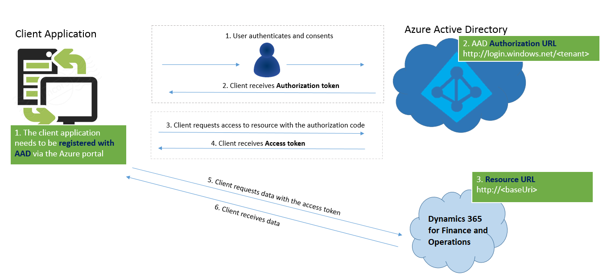
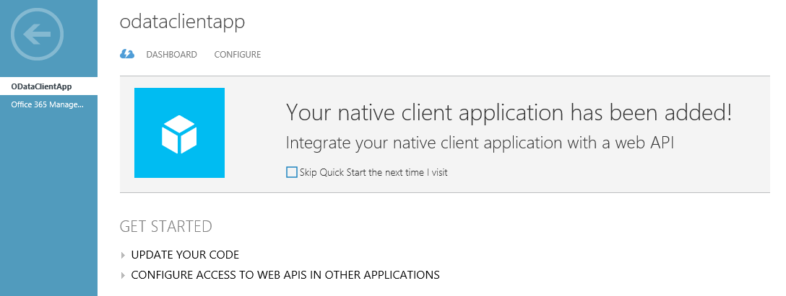
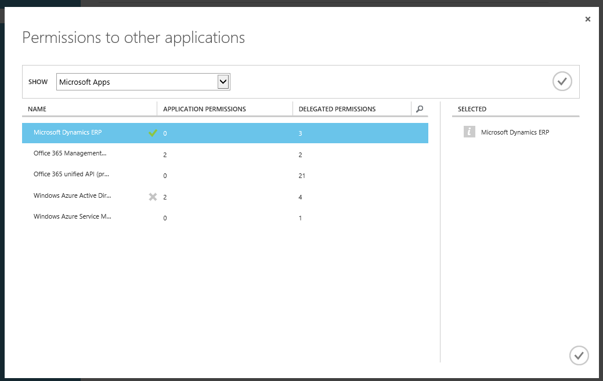

---
# required metadata

title: Service endpoints
description: This topic describes the service endpoints that are available.
author: Sunil-Garg
manager: AnnBe
ms.date: 11/10/2017
ms.topic: article
ms.prod: 
ms.service: dynamics-ax-platform
ms.technology: 

# optional metadata

# ms.search.form: 
# ROBOTS: 
audience: Developer
# ms.devlang: 
ms.reviewer: robinr
ms.search.scope: Operations
# ms.tgt_pltfrm: 
ms.custom: 21311
ms.assetid: 5ff7fd93-1bb8-4883-9cca-c8c42ddc1746
ms.search.region: Global
# ms.search.industry: 
ms.author: sunilg
ms.search.validFrom: 2016-02-28
ms.dyn365.ops.version: AX 7.0.0

---

# Service endpoints

[!include[banner](../includes/banner.md)]

This topic describes the service endpoints that are available in Microsoft Dynamics 365 for Finance and Operations, Enterprise edition. It also provides a comparison to the endpoints that are available in Microsoft Dynamics AX 2012. 

## List of services
The following table lists all the service endpoints, and compares the endpoints available for Finance and Operations, and AX 2012.

| Service endpoint            | AX 2012 | Finance and Operations     |
|-----------------------------|------------------|--------------------------------|
| Document services (AXDs)    | Yes              | No – Replaced by data entities |
| SOAP-based metadata service | Yes              | No – Replaced by REST metadata |
| SOAP-based query service    | Yes              | No – Replaced by OData         |
| OData query service         | Yes              | No – Replaced by OData         |
| SOAP-based custom service   | Yes              | Yes                            |
| JSON-based custom service   | No               | Yes                   |
| OData Service               | No               | Yes                   |
| REST Metadata Service       | No               | Yes                   |

This topic describes authentication for services, and the REST Metadata service. The following links provide detailed documentation for: 
- [Custom services](custom-services.md)
- [OData service](odata.md)

## Authentication
OData services, JSON-based custom services, and the REST metadata service support standard OAuth 2.0 authentication. 

We currently support both [Authorization Code Grant flow](https://msdn.microsoft.com/en-us/library/azure/dn645542.aspx) and [Service to service calls using client credentials (shared secret or certificate)](https://docs.microsoft.com/en-us/azure/active-directory/develop/active-directory-protocols-oauth-service-to-service). 

Two kinds of application are supported in Microsoft Azure Active Directory (AAD):

-   **Native client application** – This flow uses a user name and password for authentication and authorization.
-   **Web application (Confidential client)** – A confidential client is an application that can keep a client password confidential to the world. The authorization server assigned this client password to the client application. 

For more information, see: 
- [Authorize access to web applications using OAuth 2.0 and Azure Active Directory](https://msdn.microsoft.com/en-us/library/azure/dn645545.aspx)
- [Troubleshoot service authentication](troubleshoot-service-authentication.md)

The following illustration describes how authorization must be configured for Authorization code grant flow. 



And below is the illustration describes how authorization works for Service to service calls using client credentials (shared secret or certificate).


### Register a native application with AAD

Before any clients can communicate with the services, they must be registered in AAD. These steps will help you register an application with AAD. 

> [!NOTE]
> Only one Azure Service Administrator user should add the application and share the client ID with the developers. You must have an Azure subscription and administrator access to Active Directory to perform this procedure.

1.  In a web browser, go to <http://manage.windowsazure.com/>.
2.  Enter the user name and password of the user who has access to the Azure subscription. After the credentials are authenticated, Azure Portal opens.
3.  In Azure Portal, in the left navigation pane, click **Active Directory**. 
4.  In the grid, select the Active Directory instance that is being used.
5.  On the top toolbar, click **Applications**. 
6.  In the bottom pane, click **Add**. The **Add application** wizard starts.
7.  Add a new native client application: 
 - Click **Add an application my organization is developing**. 
 - Give it a name, and then click **Native client application**.
 - Click the check mark button to complete the wizard. 
  After you complete the wizard, the new application page opens. 
   
9.  On the top toolbar, click **Configure**.
10. Scroll down until you see the **Permissions to other applications** section. Click **Add Application** in this section. 
11. Select **Microsoft Dynamics ERP** in the list.
12. Click the **Complete check** button in the right corner of the page.
13. In the **Delegate Permissions** list, select all check boxes.
14. Make a note of the following two pieces of information:
    -   **Client ID**
    -   **Redirect URI**

After you have these two pieces of information, you're ready to write your client code.

### Client sample code

The following is the sample code for getting a token from AAD. In this flow, the user will be presented with the consent form (for cross-tenant application) and a sign-in form.

```
 UriBuilder uri = new UriBuilder ("https://login.windows.net/contoso2ax.onmicrosoft.com");
               
    AuthenticationContext authenticationContext = new AuthenticationContext(uri.ToString());

    //request token for the resource - which is the URI for your organization. NOTE: Important do not add a trailing slash at the end of the URI
    AuthenticationResult authenticationResult = authenticationContext.AcquireToken("https://axdynamics1001aos.cloud.dynamics.com", clientId, redirectURI);
                
    //this gets the authorization token, which needs to be passed in the Header of the HTTP Requests
    string authenticationHeader = authenticationResult.CreateAuthorizationHeader();
```

To pass the user name and password without showing a pop-up, you can use the following overload of **AcquireToken**.

```
    UserCredential userCred = new UserCredential (username, password);
    authenticationContext.AcquireToken("https://axdynamics1001aos.cloud.dynamics.com", clientId, userCred);
```

## REST Metadata Service
The REST metadata service is a read-only service. In other words, users can make only GET requests. The main purpose of this endpoint is to provide metadata information for elements. It is an OData implementation. 

This endpoint is hosted at `http://\[baseURI\]/Metadata`.

Currently, this endpoint provides metadata for the following elements:

-   **Labels** – Returns labels from the system. Labels have a dual pair key of language and ID, so that you can retrieve the value of the label. 

    **Example:** `https://[baseURI\]/metadata/Labels(Id='@SVC\_ODataLabelFile:Label1',Language='en-us')`

-   **Data entities** – Returns a JSON-formatted list of all the data entities in the system. 

    **Example:** `https://[baseURI\]/Metadata/DataEntities`
