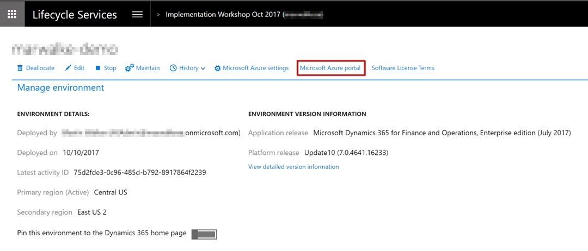
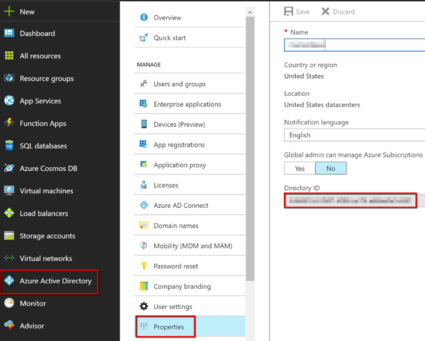
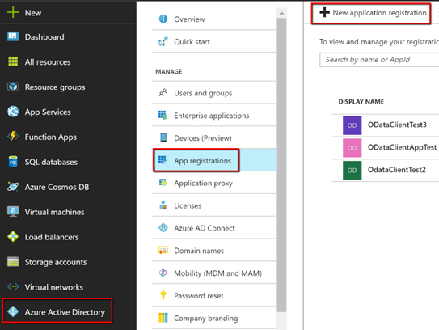
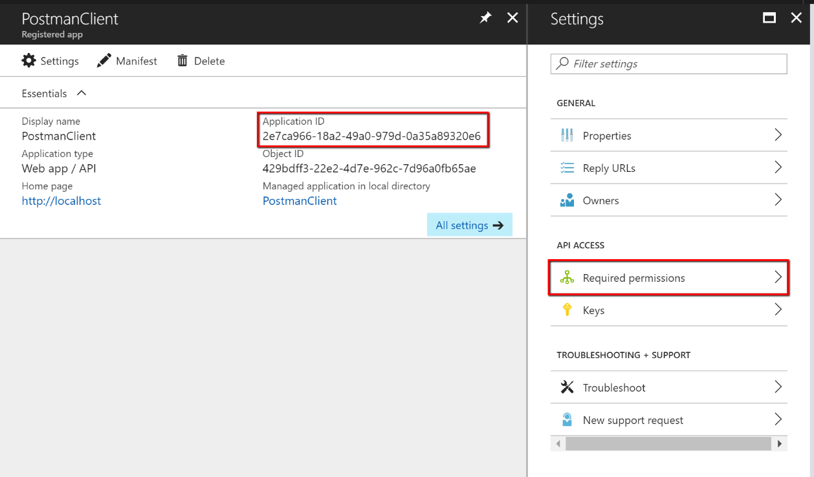
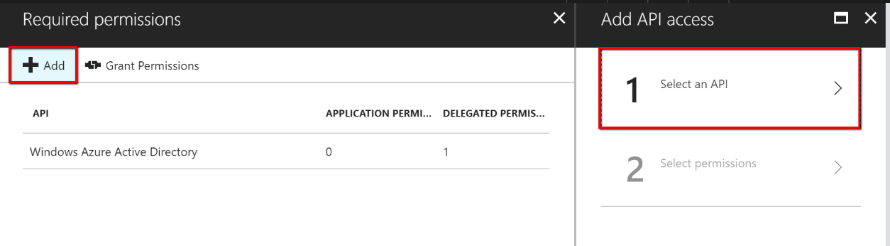
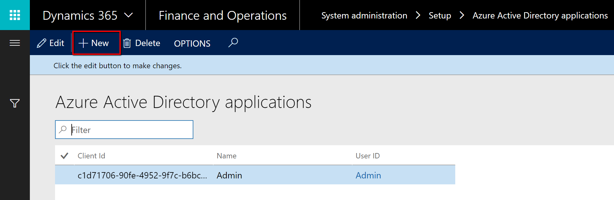
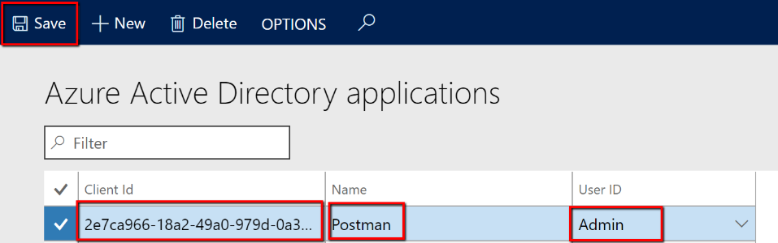
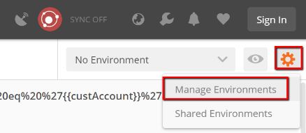

---
# required metadata

title: Using third party service testing utilities with Finance and Operations
description: This article describes how to set up third party utilities to test services for Microsoft Dynamics 365 for Finance and Operations, Enterprise edition.
author: Sunil-Garg
manager: AnnBe
ms.date: 10/20/2017
ms.topic: article
ms.prod: 
ms.service: dynamics-ax-platform
ms.technology: 

# optional metadata

# ms.search.form: 
# ROBOTS: 
audience: Developer
# ms.devlang: 
ms.reviewer: margoc
ms.search.scope: AX 7.0.0, Operations, UnifiedOperations
# ms.tgt_pltfrm: 
ms.custom: 24841
ms.assetid: 7137b0a0-1473-4134-b769-ede5e07fd6f5
ms.search.region: Global
# ms.search.industry: 
ms.author: sunilg
ms.search.validFrom: 2016-02-28
ms.dyn365.ops.version: AX 7.0.0

---

# Using third party service testing utilities with Microsoft Dynamics 365 for Finance and Operations

[!include[banner](../includes/banner.md)]

Although Microsoft provides sample code for consuming Microsoft Dynamics 365 for Finance and Operations, Enterprise edition, services at
<https://github.com/Microsoft/Dynamics-AX-Integration>, there are many scenarios in which the other endpoint in an integration may not be using a Microsoft stack. Even when the other end-point is, for example, using the OData client code Microsoft makes available, it can still be useful to:

-   Explore and analyze how an interaction’s messages are constructed
-   Test the response of a service to a well-known request
-   Determine what exceptions will look like to the other end-point

There are many commonly used tools available which help meet the goals listed above. This article is not an endorsement of any tool. We provide examples using some common software utilities, but the principles should be broadly applicable to similar tools.

## Prerequisites

Before you can test a service using an external application, you must register the application in Microsoft Azure, and in Finance and Operations.

### Register your external application in Azure

1.  Navigate to the Azure Portal. You can navigate there from the appropriate project in Lifecycle Services (LCS):

    

1.  On the **Azure Active Directory** (AAD) properties tab, note the tenant ID, listed in the **Directory ID** field. You will need it   later for retrieving an AAD authentication token.

    
    
1.  Click the **App registrations** tab, then click **New application registration**.

    

1.  Provide a name that identifies the external application that you are registering. Select **Web app / API** for an application that will authenticate with a shared secret. In this context, the Sign-on URL does not matter, so use localhost.

    

1.  Select the new application. Copy the Application ID, which you will need later to request an AAD authentication token. Click **Required permissions**.
    
    

1.  Click **Add**, and then click **Select an API**.

    

1.  Select **Microsoft Dynamics ERP**.

1.  For permissions, at a minimum you must select the following options
    under Delegated Permissions:

     - Access Dynamics AX Custom Service
     - Access Dynamics AX data
     - Access Dynamics AX online as organization users

    

1.  Click **Done**.

1.  Click **Keys**. In the blade that opens, provide a description, set the **Expires** value to **Never expires**, and then click **Save**.

    

1.  When you have saved the new key, a value will be displayed in the  **Value** column.

    > [!IMPORTANT]
    > Make sure you copy this value, because this is the only time that you will see it, and you need this secret key to complete your OAuth authentication and receive an AAD token.

    

 

### Register your external application in Finance and Operations

1.  Open Finance and Operations and navigate to System
    administration-&gt;Setup-&gt;Azure Active Directory applications.

2.  Click **New**.
    

3. Populate the fields for the new record. Use the Application ID you registered in AAD as the Client ID. Identify the application with a name and select an appropriate service account User ID, and then click **Save**.

    In this example we have selected the Admin user, but it is a better practice to provision a dedicated service account with the correct permissions for the operations to be conducted.

   
 
We are now done with the prerequisite setup. After our external application retrieves an AAD authentication token, it should now be able
to use the token in an authorization HTTP header to make subsequent service calls, for example, via OData or SOAP.

## Query Finance and Operations OData by using Postman

Postman (<https://www.getpostman.com/postman>) is a commonly used tool for interacting with RESTful services (such as OData) in API development and testing scenarios. This procedure is not an endorsement of Postman, since other such tools are available, however we are using it to illustrate the concepts and messages involved in authenticating with AAD using OAuth, and then making OData requests to and receiving responses from Finance and Operations.

1.  Start Postman.
2.  Click the gear icon and then **Manage environments** to create or
    update an environment.
   
   
1.  Provide a name for your environment and then click **Bulk Edit**.

{width="3.6875in"
height="1.6812740594925635in"}

1.  Enter key-value pairs as follows, one pair per line, with key and
    value separated by a colon (:).

  **Key**          **Value**
  ---------------- ----------------------------------------------------------------------------------------
  tenant\_id       The Azure tenant ID, as looked up during the prerequisite setup
  client\_id       The AAD Application ID registered during the prerequisite setup
  client\_secret   The secret key generated during application registration during the prerequisite setup
  grant\_type      client\_credentials
  resource         The base URL of the Finance and Operations instance

1.  Verify that the key-value pairs can be parsed correctly by clicking
    the **Key-Value Edit** button and reviewing the results.

{width="3.6803193350831145in"
height="3.266949912510936in"}

1.  Close the environment window.

{width="3.726989282589676in"
height="3.3202876202974627in"}

 

1.  Select the new or updated environment from the field next to the
    gear and inspection icons.

{width="1.96in" height="0.52in"}

 

1.  To retrieve an AAD token, create a POST request with a URL
    conforming to the format
    \`https://login.microsoftonline.com/\[tenant ID\]/oauth2/token\`.
    You can use a URL parameter referring to the tenant\_id environment
    variable, such as
    \`https://login.microsoftonline.com/:tenant\_id/oauth2/token\`.

{width="7.43in" height="2.45in"}

 

 

1.  Click the **Body** tab and add body elements as request parameters,
    referring to the environment variables you created earlier. You can
    do this by clicking **Bulk edit** and then entering the same keys in
    the table above, followed by a colon (:), and then repeating the key
    name enclosed in double braces. For example,
    \`grant\_type:{{grant\_type}}\`.

{width="5.241491688538932in"
height="2.2608694225721786in"}

 

![Machine generated alternative text: D365fFOEE OData
https://login.microsof POST v Key tenant id Key New key Authorization O
form-data https://login.microsoftonline.com/:tenant\_id/oauth2/token
Params Send Description Description Description Save Bulk Edit Bulk Edit
Headers Body Pre-request Script Value {{tenant\_id}} Value Tests Cookies
Code O O x-www-form-urlencoded raw O binary Key-Value Edit grant type: {
{grant type}} client id: { {client id}} client secret: { {client
secret}} resource: { {resource}}
](media/image21.png){width="5.21928915135608in"
height="2.1565212160979876in"}

 

1.  Click the **Tests** tab and create a Test that will validate that
    the response is reasonable and store the returned authorization
    token in an environment variable. The following code snippet will
    accomplish this:

\`\`\`

var json = JSON.parse(responseBody);

tests\["Get AAD Token"\] = !json.error && responseBody !== '' &&
responseBody !== '{}' && json.access\_token !== '';

postman.setEnvironmentVariable("bearerToken", json.access\_token);

\`\`\`

1.  Click **Save**, provide a name and collection for the request, and
    then click Save again.

![Machine generated alternative text: D365fFOEE OData
https://login.microsof POST v Key tenant id Key New key Authorization
https://login.microsoftonline.com/:tenant\_id/oauth2/token Value
{{tenant\_id}} Value Params Send Description Description Description
Headers Body Pre-request Script Tests Save Bulk Edit Bulk Edit Cookies
Code 1 2 3 var json = JSON.parse(responseBody); tests \["Get AAD
Token"\] - !json .error && responseBody && responseBody ostman .
setEnvironmentVariab1e( " bearerToken " , j son . access\_token); j son.
access token Test scripts are written in JavaScript, and are run after
the response is received. Learn more about tests SNIPPETS Clear a global
variable Clear an environment variable Get a global variable Get a
variable Get an environment variable Response body: Contains string
Response body: Convert XML body to a JSON Object Response
](media/image22.png){width="6.25in" height="3.27in"}

 

![Machine generated alternative text: SAVE REQUEST Requests in Postman
are saved in collections (a group of requests). Learn more about
creating collections Request Name Get AAD token Request description
(Optional) Adding a description makes your docs better Descriptions
support Markdown Select a collection or folder to save to: Q Search for
a collection or folder &lt; D365fFOEE POST Get D365fFOEE AAD Token +
Create Folder GET https://marwalke-dem0570fa4fb1 28f41
a8aos.cloudax.dynamics.. Cancel Save to D365fFOEE
](media/image23.png){width="2.2434787839020123in"
height="3.071431539807524in"}

1.  Click **Send** to make the authorization request. The response pane
    **Body** tab should now contain an AAD token, along with other
    response details.

{width="6.504348206474191in"
height="4.4897878390201225in"}

Because of the Test code, the token is now in an environment variable.
You can see this by clicking on the **Environment quick look** button
(the eye icon).

{width="3.121738845144357in"
height="3.518149606299213in"}

 

1.  Now create a request to perform a create, read, update or delete
    operations on the desired data entity via the OData service. Craft
    the URL for what you need. See
    [*https://docs.microsoft.com/en-us/dynamics365/unified-operations/dev-itpro/data-entities/odata*](https://docs.microsoft.com/en-us/dynamics365/unified-operations/dev-itpro/data-entities/odata).
    You may find it useful to parameterize the request, using a variable
    stored in the environment, as shown above. We use a Customer Account
    parameter in the GET query example below, which returns name and
    address details for the customer account specified in the
    environment variable. Note also that special characters must be
    correctly URL encoded:

\`https://\[D356fFOEE instance URL\]/data/Customers?\$format=json&\$filter=CustomerAccount%20eq%20%27{{custAccount}}%27&\$select=CustomerAccount,Name,AddressDescription,FullPrimaryAddress\`

Add an 'Authorization' header referring to the authorization token
retrieved earlier and stored in the bearerToken environment variable.
The token must be prefixed by 'Bearer ' in the header.

{width="6.165217629046369in"
height="2.6119313210848643in"}

 

{width="2.6838057742782153in"
height="2.3826082677165354in"}

 

1.  Provide a test to help validate the response. The following code
    snippet will test that non-empty, JSON-formatted data is returned in
    the response body:

\`var json = JSON.parse(responseBody);

tests\["Get customer info"\] = !json.error && responseBody !== '' &&
responseBody !== '{}';\`

1.  Save and send the request, and then verify the result.

{width="6.5in" height="2.873611111111111in"}

 

{width="6.5in" height="3.6479166666666667in"}

 

In our example we have now successfully authenticated then used the
OData service to read a customer record!

Query the Finance and Operations SOAP custom service with SoapUI

SoapUI (<https://www.soapui.org/>) is a commonly used tool for
interacting with SOAP and REST web services in API development and
testing scenarios. This How-To is not an endorsement of SoapUI, since
other such tools are available, however we are using it to illustrate
the concepts and messages involved in authenticating with Azure Active
Directory using OAuth, and then making SOAP requests to and receiving
responses from Finance and Operations.

 

1.  Launch SoapUI, and click the SOAP button to create a project.

{width="3.1043482064741905in"
height="1.71752624671916in"}

 

1.  Complete the information for the project.

-   The Initial WSDL URL will be the service address (conforming to the
    format \[Finance and Operations instance base
    URL\]/soap/services/\[service group name\]) suffixed by "?wsdl".

-   For more information, see
    <https://docs.microsoft.com/en-us/dynamics365/unified-operations/dev-itpro/data-entities/services-home-page>.
    As an example, we are querying the user session service at URL
    \`https://\[Finance and
    Operations base URL/soap/services/UserSessionService?wsdl\`.

-   Provide a Project Name.

-   Select the checkbox to Create sample requests for all operations.

{width="3.720145450568679in"
height="2.173912948381452in"}

 

1.  Since we chose to create sample requests, we see that one is created
    for each available service operation.

{width="3.5826082677165356in"
height="2.191423884514436in"}

 

1.  Right-click on the newly create project and click **New TestSuite**
    to create a TestSuite, which will generate a POST request for an AAD
    authorization token.

 

1.  Right-click on the test suite and click **New TestCase**.

 

1.  Expand the test case, right-click on **Test Steps**, click **Add
    Step** and then **HTTP Request**.

 

1.  Give the request a name and then click OK.

 

1.  Enter a name for the test step. The Endpoint to use for the POST
    request is
    \`[https://login.microsoftonline.com/\[tenant\_id\]/oauth2/token](https://login.microsoftonline.com/%5btenant_id%5d/oauth2/token)\`.
    Use the plus button next to Parameters to add the following values:

  Parameter        value
  ---------------- ----------------------------------------------------
  grant\_type      client\_credentials
  client\_id       Application ID from AAD application registration
  client\_secret   Secret key value from AAD application registration
  resource         Finance and Operations instance URL

{width="3.5269728783902012in"
height="3.093601268591426in"}

1.  Ensure the parameters are in the POST body, by selecting **Post
    QueryString**, and clicking **Play**. An access token should be
    returned in the response pane. The values will be most readable if
    you select the JSON response tab. Copy the access token for use in
    the authorization header of subsequent requests.

{width="4.368055555555555in"
height="2.457030839895013in"}

 

1.  Now navigate back to the first request node under the
    GetUserSessionInfo SOAP sample request. Click the plus button under
    the left-hand request pane to add a Header named ‘Authorization’.
    Paste the access token, prefixed by **Bearer**, into the **Value**
    field.

2.  The sample requests SoapUI creates will not work unaltered. You need
    to edit the call context and Body to be consistent with the schema
    for what you are trying to do. For our simple scenario, we can
    merely edit the (optional) call context elements to be null-valued.
    We can do this by inserting a forward slash ‘/’ before the greater
    than ‘&gt;’ in the opening tag, then commenting out the question
    mark "?" characters (which are not valid content for the XML schema)
    and the closing tags, with the standard ‘&lt;!—‘ ‘--&gt;’ syntax
    delimiting the beginning and end of the comments. Alternatively, the
    result would be the same if you just deleted the ‘?’ characters,
    thus leaving the context elements empty.

3.  Now that the SOAP request is ready, click **Play** and validate the
    result on the right:

{width="5.467538276465442in"
height="2.861111111111111in"}

 

In our example we have now successfully authenticated then queried the
UserSessionService via SOAP!
