---
# required metadata

title: Using third party service testing utilities with Finance and Operations
description: This article describes how to set up third party utilities to test services for Microsoft Dynamics 365 for Finance and Operations, Enterprise edition.
author: Sunil-Garg
manager: AnnBe
ms.date: 10/20/2017
ms.topic: article
ms.prod: 
ms.service: dynamics-ax-platform
ms.technology: 

# optional metadata

# ms.search.form: 
# ROBOTS: 
audience: Developer
# ms.devlang: 
ms.reviewer: margoc
ms.search.scope: AX 7.0.0, Operations, UnifiedOperations
# ms.tgt_pltfrm: 
ms.custom: 24841
ms.assetid: 7137b0a0-1473-4134-b769-ede5e07fd6f5
ms.search.region: Global
# ms.search.industry: 
ms.author: sunilg
ms.search.validFrom: 2016-02-28
ms.dyn365.ops.version: AX 7.0.0

---

# Using third party service testing utilities with Microsoft Dynamics 365 for Finance and Operations

[!include[banner](../includes/banner.md)]

Although Microsoft provides sample code for consuming Microsoft Dynamics 365 for Finance and Operations, Enterprise edition, services at
<https://github.com/Microsoft/Dynamics-AX-Integration>, there are many scenarios in which the other endpoint in an integration may not be using a Microsoft stack. Even when the other end-point is, for example, using the OData client code Microsoft makes available, it can still be useful to:

-   Explore and analyze how an interaction’s messages are constructed
-   Test the response of a service to a well-known request
-   Determine what exceptions will look like to the other end-point

There are many commonly used tools available which help meet the goals listed above. This article is not an endorsement of any tool. We provide examples using some common software utilities, but the principles should be broadly applicable to similar tools.

## Prerequisites

Before you can test a service using an external application, you must register the application in Microsoft Azure, and in Finance and Operations.

### Register your external application in Azure

1.  Navigate to the Azure Portal. You can navigate there from the appropriate project in Lifecycle Services (LCS):

    

1.  On the **Azure Active Directory** (AAD) properties tab, note the tenant ID, listed in the **Directory ID** field. You will need it   later for retrieving an AAD authentication token.

    
    
1.  Click the **App registrations** tab, then click **New application registration**.

    

1.  Provide a name that identifies the external application that you are registering. Select **Web app / API** for an application that will authenticate with a shared secret. In this context, the Sign-on URL does not matter, so use localhost.

    

1.  Select the new application. Copy the Application ID, which you will need later to request an AAD authentication token. Click **Required permissions**.
    
    

1.  Click **Add**, and then click **Select an API**.

    

1.  Select **Microsoft Dynamics ERP**.

1.  For permissions, at a minimum you must select the following options
    under Delegated Permissions:

     - Access Dynamics AX Custom Service
     - Access Dynamics AX data
     - Access Dynamics AX online as organization users

    

1.  Click **Done**.

1.  Click **Keys**. In the blade that opens, provide a description, set the **Expires** value to **Never expires**, and then click **Save**.

    

1.  When you have saved the new key, a value will be displayed in the  **Value** column.

    > [!IMPORTANT]
    > Make sure you copy this value, because this is the only time that you will see it, and you need this secret key to complete your OAuth authentication and receive an AAD token.

    

 

### Register your external application in Finance and Operations

1.  Open Finance and Operations and navigate to System
    administration-&gt;Setup-&gt;Azure Active Directory applications.

2.  Click **New**.
    

3. Populate the fields for the new record. Use the Application ID you registered in AAD as the Client ID. Identify the application with a name and select an appropriate service account User ID, and then click **Save**.

    In this example we have selected the Admin user, but it is a better practice to provision a dedicated service account with the correct permissions for the operations to be conducted.

   
 
We are now done with the prerequisite setup. After our external application retrieves an AAD authentication token, it should now be able
to use the token in an authorization HTTP header to make subsequent service calls, for example, via OData or SOAP.

## Query Finance and Operations OData by using Postman

Postman (<https://www.getpostman.com/postman>) is a commonly used tool for interacting with RESTful services (such as OData) in API development and testing scenarios. This procedure is not an endorsement of Postman, since other such tools are available, however we are using it to illustrate the concepts and messages involved in authenticating with AAD using OAuth, and then making OData requests to and receiving responses from Finance and Operations.

1.  Start Postman.
2.  Click the gear icon and then **Manage environments** to create or update an environment.
   
   
1.  Provide a name for your environment and then click **Bulk Edit**.
   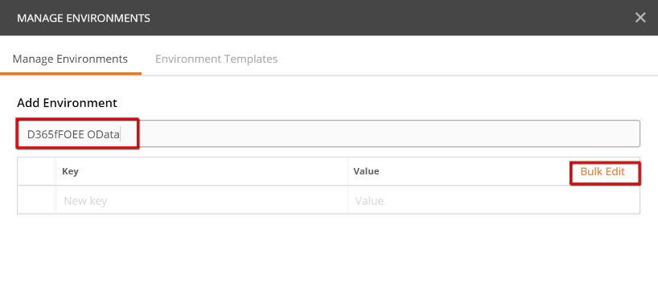

1.  Enter key-value pairs as follows, one pair per line, with key and value separated by a colon, ":".

    | Key           | Value                                                                                  |
    |---------------|----------------------------------------------------------------------------------------|
    | tenant_id     | The Azure tenant ID, as looked up during the prerequisite setup                        |
    | client_id     | The AAD Application ID registered during the prerequisite setup                        |
    | client_secret | The secret key generated during application registration during the prerequisite setup |
    | grant_type    | client_credentials                                                                     |
    | resource      | The base URL of the Finance and Operations instance                                    |

1.  Verify that the key-value pairs can be parsed correctly by clicking the **Key-Value Edit** button and reviewing the results.

   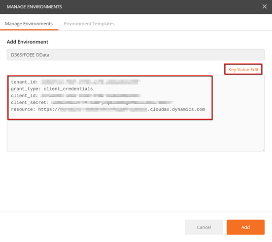

1.  Close the environment window.

1.  Select the new or updated environment from the field next to the gear and inspection icons.

   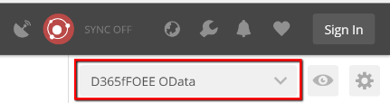

1.  To retrieve an AAD token, create a POST request with a URL conforming to the format
    `https://login.microsoftonline.com/\[tenant ID\]/oauth2/token\`.
    You can use a URL parameter referring to the tenant\_id environment variable, such as
    `https://login.microsoftonline.com/:tenant\_id/oauth2/token\`.

   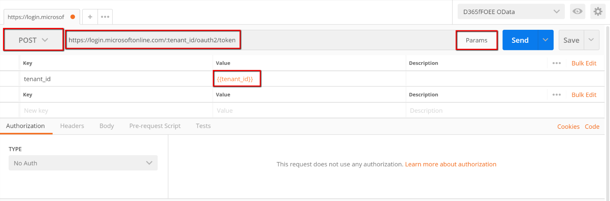

1.  Click the **Body** tab and add body elements as request parameters, referring to the environment variables you created earlier. You can do this by clicking **Bulk edit** and then entering the same keys in the table above, followed by a colon, ":", and then repeating the key name enclosed in double braces. For example,
    `grant\_type:{{grant\_type}}\`.

   
 

   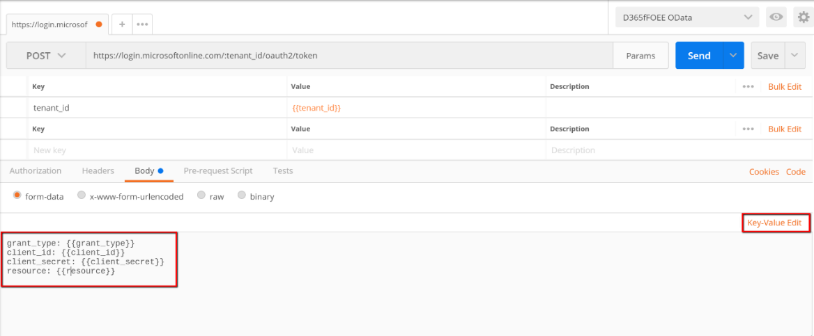
 
1.  Click the **Tests** tab and create a test that will validate that the response is reasonable and store the returned authorization
    token in an environment variable. The following code snippet will accomplish this:
    ```
    var json = JSON.parse(responseBody);

    tests\["Get AAD Token"\] = !json.error && responseBody !== '' &&
    responseBody !== '{}' && json.access\_token !== '';

    postman.setEnvironmentVariable("bearerToken", json.access\_token);
    ```

   
 

1.  Click **Save**, provide a name and collection for the request, and  then click **Save** again.

1.  Click **Send** to make the authorization request. The **Body** tab should now contain an AAD token, along with other response details.

   

1. Because of the test code, the token is now in an environment variable. You can see this by clicking on the **Environment quick look** button (the eye icon).

   

1.  Now create a request to perform a create, read, update or delete operations on the desired data entity via the OData service. Craft the URL for what you need. See [Odata](odata.md) for more information. You may find it useful to parameterize the request, using a variable stored in the environment, as shown above. We use a Customer Account parameter in the GET query example below, which returns name and address details for the customer account specified in the environment variable. Note also that special characters must be correctly URL encoded:

`https://\[D356fFOEE instance URL\]/data/Customers?\$format=json&\$filter=CustomerAccount%20eq%20%27{{custAccount}}%27&\$select=CustomerAccount,Name,AddressDescription,FullPrimaryAddress\`

1. Add an 'Authorization' header referring to the authorization token retrieved earlier and stored in the bearerToken environment variable. The token must be prefixed by 'Bearer ' in the header.

   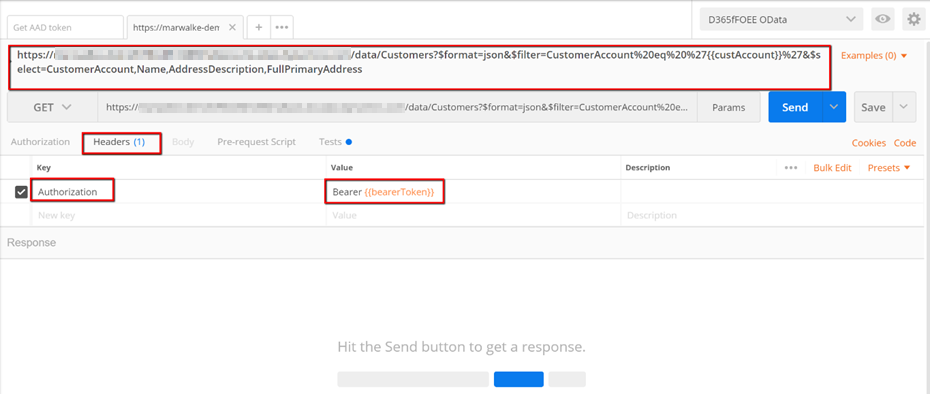

1.  Provide a test to help validate the response. The following code
    snippet will test that non-empty, JSON-formatted data is returned in
    the response body:

    ```
    var json = JSON.parse(responseBody);

    tests\["Get customer info"\] = !json.error && responseBody !== '' &&
    responseBody !== '{}';\
    ```

1.  Save and send the request, and then verify the result.

   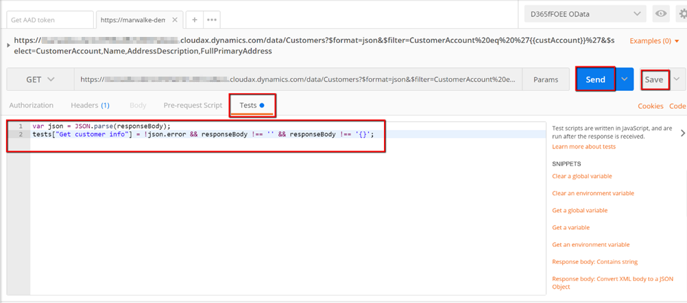

   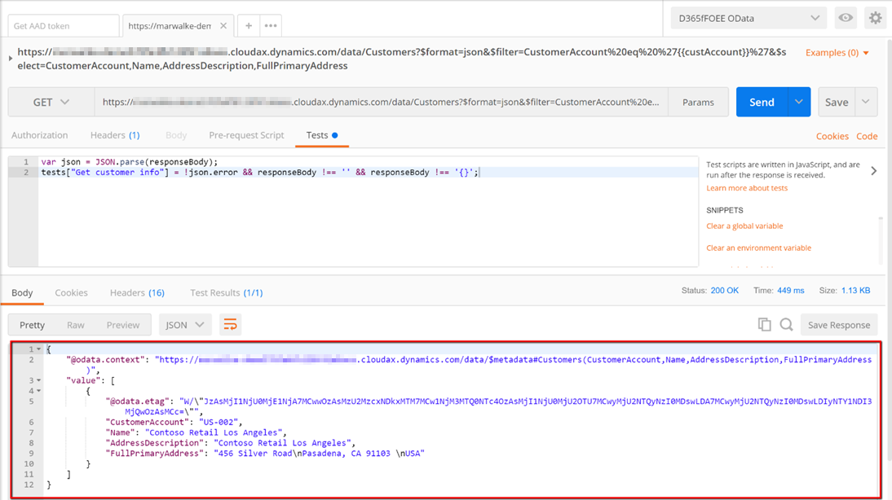

In our example we have now successfully authenticated then used the OData service to read a customer record!

## Query the Finance and Operations SOAP custom service with SoapUI

SoapUI (<https://www.soapui.org/>) is a commonly used tool for interacting with SOAP and REST web services in API development and
testing scenarios. This procedure is not an endorsement of SoapUI, since other such tools are available, however we are using it to illustrate the concepts and messages involved in authenticating with Azure Active Directory using OAuth, and then making SOAP requests to and receiving responses from Finance and Operations.

1.  Launch SoapUI, and click the SOAP button to create a project.

   

 1.  Complete the information for the project.

    -   The Initial WSDL URL will be the service address (conforming to the format \[Finance and Operations instance base
    URL\]/soap/services/\[service group name\]) suffixed by "?wsdl".
    -   For more information, see the [Services home page](services-home-page).

        For example, we are querying the user session service at the URL:
    `https://\[Finance and Operations base URL/soap/services/UserSessionService?wsdl\`

    -   Provide a Project Name.
    -   Select the **Create sample requests for all operations** checkbox.

   
 

1.  Since we chose to create sample requests, we see that one is created
    for each available service operation.

   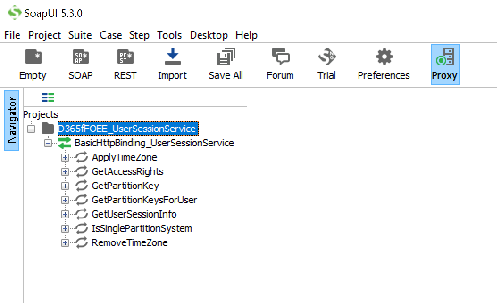
 

1.  Right-click the newly create project and click **New TestSuite** to create a TestSuite, which will generate a POST request for an AAD authorization token.

1.  Right-click on the test suite and click **New TestCase**.

1.  Expand the test case, right-click on **Test Steps**, click **Add Step** and then **HTTP Request**.
 
1.  Give the request a name and then click **OK**.
 
1.  Enter a name for the test step. The endpoint to use for the POST request is:
    `[https://login.microsoftonline.com/\[tenant\_id\]/oauth2/token](https://login.microsoftonline.com/%5btenant_id%5d/oauth2/token)\`

1. Use the plus button next to Parameters to add the following values:

    | Parameter     | Value                                              |
    |---------------|----------------------------------------------------|
    | grant_type    | client_credentials                                 |
    | client_id     | Application ID from AAD application registration   |
    | client_secret | Secret key value from AAD application registration |
    | resource      | Finance and Operations instance URL                |

   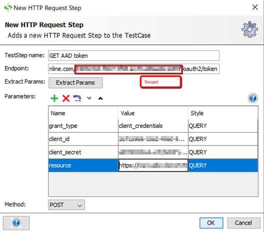

1.  Ensure the parameters are in the POST body, by selecting **Post QueryString**, and clicking **Play**. An access token should be returned in the response pane. The values will be most readable if you select the JSON response tab. Copy the access token for use in the authorization header of subsequent requests.

    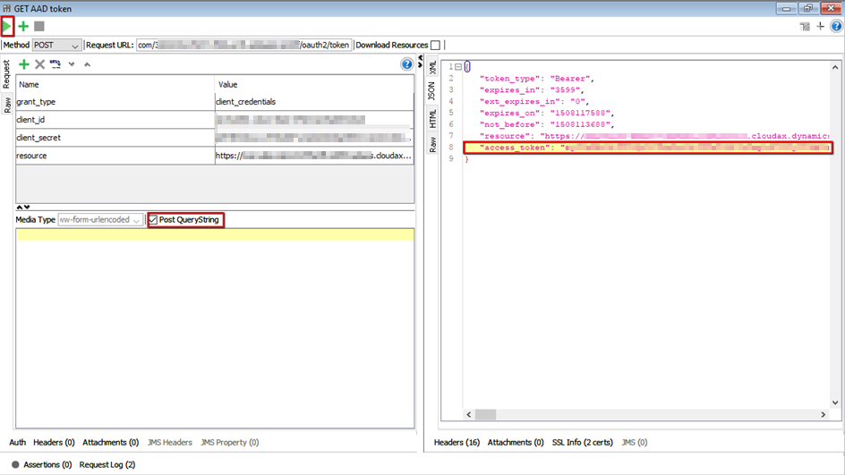

1.  Now navigate back to the first request node under the GetUserSessionInfo SOAP sample request. Click the plus button under the left-hand request pane to add a Header named ‘Authorization’. Paste the access token, prefixed by **Bearer**, into the **Value** field.

2.  The sample requests SoapUI creates will not work unaltered. You need
    to edit the call context and Body to be consistent with the schema
    for what you are trying to do. For our simple scenario, we can
    merely edit the (optional) call context elements to be null-valued.
    We can do this by inserting a forward slash ‘/’ before the greater
    than ‘&gt;’ in the opening tag, then commenting out the question
    mark "?" characters (which are not valid content for the XML schema)
    and the closing tags, with the standard ‘&lt;!—‘ ‘--&gt;’ syntax
    delimiting the beginning and end of the comments. Alternatively, the
    result would be the same if you just deleted the ‘?’ characters,
    thus leaving the context elements empty.

3.  Now that the SOAP request is ready, click **Play** and validate the
    result on the right:

     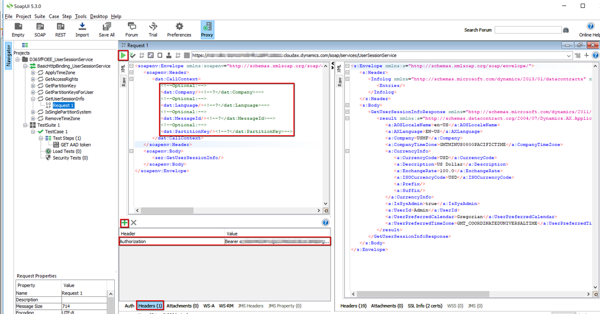

In our example we have now successfully authenticated then queried the UserSessionService via SOAP!
