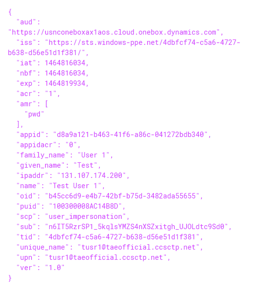

---
# required metadata

title: Service authentication troubleshooting
description: This topic provides some tips for troubleshooting issues that involve service authentication.  
author: nimakms
manager: AnnBe
ms.date: 06/20/2017
ms.topic: article
ms.prod: 
ms.service: dynamics-ax-platform
ms.technology: 

# optional metadata

# ms.search.form: 
# ROBOTS: 
audience: Developer
# ms.devlang: 
ms.reviewer: robinr
ms.search.scope: AX 7.0.0, Operations, UnifiedOperations
# ms.tgt_pltfrm: 
ms.custom: 195943
ms.assetid: 0c22fad3-be0a-4111-97c0-2f3fadfd5f6b
ms.search.region: Global
# ms.search.industry: 
ms.author: nimak
ms.search.validFrom: 2016-02-28
ms.dyn365.ops.version: AX 7.0.0

---

# Service authentication troubleshooting

[!include[banner](../includes/banner.md)]

This topic provides some tips for troubleshooting issues that involve service authentication.  

When you troubleshoot service authentication issues, there are a few basic and common procedures that can help resolve the issues that are most often encountered. These procedures also provide a hands-on demonstration of how the authentication mechanism works. This topic includes instructions and also lists a few common issues that users have encountered so far.

## Inspect the JWT
### Capture the JWT from an HTTP request

1.  Download Fiddler from <http://www.telerik.com/fiddler>.
2.  Set up HTTPS capture to watch the HTTPS traffic from the client.
3.  Find the Open Authorization (OAuth) JSON Web Token (JWT). It's the value of the HTTP "Authorization" header without the "bearer" segment.

### Use a deserializer tool to look at the token contents

1.  Go to <http://jwt.io>, and paste the JWT into the input panel.
2.  View the contents in the form of name-value pairs. See the example that follows.
3.  Verify that the following information is correct:
    -   **"aud"** – The value corresponds to the Microsoft Azure Active Directory (Azure AD) resource concept. Here are some typical issues that involve "aud":
        -   The **"aud"** segment of the JWT contains a URI that has a trailing slash.
        -   The **"aud"** segment of the JWT contains a URI that uses an incorrect capitalization style. The URI must be all lowercase.
    -   **"appid"** – The value corresponds to the Azure AD Native Client App ID (or Service App ID).
    -   **"upn"** – The value corresponds to the user who is being authenticated through a Native Client App.

The following illustration shows an example of the contents of the JWT. 

## Review the event logs
You can also look at the event logs of the instance machine, if you have access to the virtual machine (VM).

1.  Start Event Viewer by running the **eventvwr** command from the **Run** window.
2.  Go to the following channels:
    -   Application and Services Logs &gt; Microsoft &gt; Dynamics &gt; AX-IntegrationServices &gt; Channel:Operational (Microsoft-Dynamics-AX-IntegrationServices/Operational)
    -   Application and Services Logs &gt; Microsoft &gt; Dynamics &gt; AX-SystemRuntime &gt; Channel:Operational (Microsoft-Dynamics-AX-SystemRuntime/Operational)

## Other approaches
-   For more information about how OAuth is configured, see [Service endpoints](services-home-page.md).
-   You can also try to call the service in parallel by using your own client code. The sample code that we published is available at <https://github.com/Microsoft/Dynamics-AX-Integration>.
-   If the second method works, you can compare the JWTs from each method.

## Known issues
### AADSTS65001: The user or administrator hasn't consented to use the application

-   The **"aud"** segment of the JWT might contain a URI that has a trailing slash. The slash must be removed.
-   The **"aud"** segment of the JWT might contain a URI that uses an incorrect capitalization style. The URI must be all lowercase.

