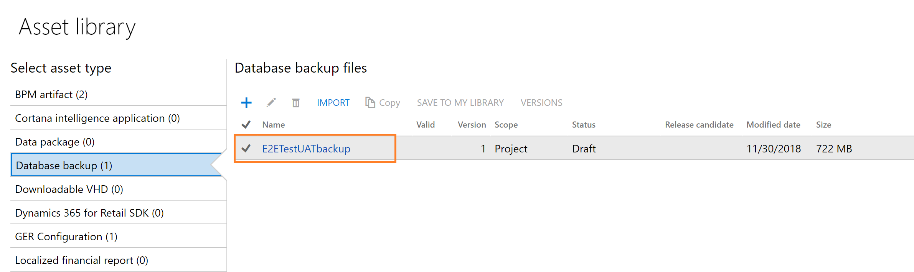

---
# required metadata

title: Copy Finance and Operations databases from Azure SQL Database to SQL Server environments
description: This topic explains how to move a Microsoft Dynamics 365 for Finance and Operations database from an Azure-based environment to a SQL Server–based environment.
author: laneswenka
manager: AnnBe
ms.date: 12/10/2018
ms.topic: article
ms.prod: 
ms.service: dynamics-ax-platform
ms.technology: 

# optional metadata

# ms.search.form: 
# ROBOTS: 
audience: Developer, IT Pro
# ms.devlang: 
ms.reviewer: sericks
ms.search.scope: Operations
# ms.tgt_pltfrm: 
ms.custom: 203764
ms.assetid: 45efdabf-1714-4ba4-9a9d-217143a6c6e0
ms.search.region: Global
# ms.search.industry: 
ms.author: laswenka
ms.search.validFrom: 2016-05-31
ms.dyn365.ops.version: AX 7.0.1

---

# Copy Finance and Operations databases from Azure SQL Database to SQL Server environments

[!include [banner](../includes/banner.md)]

This topic explains how to export a Microsoft Dynamics 365 for Finance and Operations database from an environment that is based on Microsoft Azure and import it into an environment that is based on Microsoft SQL Server.

## Overview

To move a database, use the self-service action to export the database from Azure SQL Database and then import it into Microsoft SQL Server. Because the file name extension for the exported data is .bacpac, this process is often referred to as the *bacpac process*.

The high-level process for a database move includes the following phases:

1. Export your source environment to the LCS Asset Library
2. Import the database into SQL Server.
3. Run a SQL script to update the database.

## Prerequisites

The following prerequisites must be met before you can move a database:

- The source environment (that is, the environment that is connected to the source database) must run a version of the Finance and Operations platform that is earlier than or the same as the version of the platform that the destination environment runs.
- Only a sandbox environment database can be exported. If you must copy the production environment, you must first refresh that environment to the sandbox environment. 

    > [!NOTE]
    > In this article, we use the term *sandbox* to refer to a Standard or Premier Acceptance Testing (Tier 2+) or higher environment connected to a SQL Azure database.

- The destination SQL Server environment must run SQL Server 2016 Release to Manufacturing (RTM) (13.00.1601.5) or later. The Community Technology Preview (CTP) versions of SQL Server 2016 might cause errors during the import process.

## Before you begin

Encrypted and environment-specific values can't be imported into a new environment. After you've completed the import, you must re-enter some data from your source environment in your target environment.

### Document the values of encrypted fields

Because of a technical limitation that is related to the certificate that is used for data encryption, values that are stored in encrypted fields in a database will be unreadable after that database is imported into a new environment. Therefore, after an import, you must manually delete and re-enter values that are stored in encrypted fields. New values that are entered in encrypted fields after an import will be readable. The following fields are affected. The field names are given in Table.Field format.

| Field name                                               | Where to set the value |
|----------------------------------------------------------|------------------------|
| CreditCardAccountSetup.SecureMerchantProperties          | Select **Accounts receivable** &gt; **Payments setup** &gt; **Payment services**. |
| ExchangeRateProviderConfigurationDetails.Value           | Select **General ledger** &gt; **Currencies** &gt; **Configure exchange rate providers**. |
| FiscalEstablishment\_BR.ConsumerEFDocCsc                 | Select **Organization administration** &gt; **Fiscal establishments** &gt; **Fiscal establishments**. |
| FiscalEstablishmentStaging.CSC                           | This field is used by the Data Import/Export Framework (DIXF). |
| HcmPersonIdentificationNumber.PersonIdentificationNumber | Select **Human resources** &gt; **Workers** &gt; **Workers**. On the **Worker** tab, in the **Personal information** group, select **Identification numbers**. |
| HcmWorkerActionHire.PersonIdentificationNumber           | This field has been obsolete since Microsoft Dynamics AX 7.0 (February 2016). It was previously in the **All worker actions** form (**Human resources** &gt; **Workers** &gt; **Actions** &gt; **All worker actions**). |
| SysEmailSMTPPassword.Password                            | Select **System administration** &gt; **Email** &gt; **Email parameters**. |
| SysOAuthUserTokens.EncryptedAccessToken                  | This field is used internally by AOS. It can be ignored. |
| SysOAuthUserTokens.EncryptedRefreshToken                 | This field is used internally by AOS. It can be ignored. |

### If you're running Retail components, document encrypted and environment-specific values

The values on the following pages are either environment-specific or encrypted in the database. Therefore, all the imported values will be incorrect.

- Payments services (**Accounts receivable** &gt; **Payments setup** &gt; **Payments services**)
- Hardware profiles (**Retail and commerce** &gt; **Channel setup** &gt; **POS setup** &gt; **POS profiles** &gt; **Hardware profiles**)

## Self-service database export

From your sanbox environment details page, click on the **Maintain** menu and then select the **Move database** option.  


A slider will open on the page, use the **Export database** action:
<br/>


The environment will be unavailable for other servicing operations such as Sandbo Refresh or Package Deployment during this time.  The source environment will be usable from a Dynamics user perspective.  

Once the export operation completes successfully, signoff on the servicing operation on your environment details page.  You can then see the asset in your Asset Library under the *Database backups* section:


The .bacpac files are stored here and can be manually downloaded to your Tier1 Developer environments for import.  In the future, Microsoft will provide APIs to trigger Export action, as well as list the avaialble backup files in your asset library.  This includes the secured URL for automatically downloading a backup asset file or copying it directly to your own secure blob storage using Microsoft Azure Storage SDKs.

## Import the database

When you have downloaded a .bacpac file you can begin the manual Import operation on your Tier1 environment.  When you import the database, we recommend that you follow these guidelines:

- Retain a copy of the existing AxDB database, so that you can revert to it later if you must.
- Import the new database under a new name, such as **AxDB\_fromProd**.

To help guarantee the best performance, copy the \*.bacpac file to the local computer that you're importing from. Open a **Command Prompt** window and run the following commands.

```
cd C:\Program Files (x86)\Microsoft SQL Server\140\DAC\bin

SqlPackage.exe /a:import /sf:D:\Exportedbacpac\my.bacpac /tsn:localhost /tdn:<target database name> /p:CommandTimeout=1200
```

Here is an explanation of the parameters:

- **tsn (target server name)** – The name of the SQL Server to import into.
- **tdn (target database name)** – The name of the database to import into. The database should **not** already exist.
- **sf (source file)** – The path and name of the file to import from.

> [!NOTE]
> During import, the user name and password aren't required. By default, SQL Server uses Microsoft Windows authentication for the user who is currently signed in.

## Update the database

Run the following SQL script against the imported database. This script adds back the users that you deleted from the source database and correctly links them to the SQL logins for this SQL instance. The script also turns change tracking back on. Remember to edit the final **ALTER DATABASE** statement so that it uses the name of your database.

```
CREATE USER axdeployuser FROM LOGIN axdeployuser
EXEC sp_addrolemember 'db_owner', 'axdeployuser'

CREATE USER axdbadmin FROM LOGIN axdbadmin
EXEC sp_addrolemember 'db_owner', 'axdbadmin'

CREATE USER axmrruntimeuser FROM LOGIN axmrruntimeuser
EXEC sp_addrolemember 'db_datareader', 'axmrruntimeuser'
EXEC sp_addrolemember 'db_datawriter', 'axmrruntimeuser'

CREATE USER axretaildatasyncuser FROM LOGIN axretaildatasyncuser
EXEC sp_addrolemember 'DataSyncUsersRole', 'axretaildatasyncuser'

CREATE USER axretailruntimeuser FROM LOGIN axretailruntimeuser
EXEC sp_addrolemember 'UsersRole', 'axretailruntimeuser'
EXEC sp_addrolemember 'ReportUsersRole', 'axretailruntimeuser'

CREATE USER axdeployextuser FROM LOGIN axdeployextuser
EXEC sp_addrolemember 'DeployExtensibilityRole', 'axdeployextuser'

CREATE USER [NT AUTHORITY\NETWORK SERVICE] FROM LOGIN [NT AUTHORITY\NETWORK SERVICE]
EXEC sp_addrolemember 'db_owner', 'NT AUTHORITY\NETWORK SERVICE'

UPDATE T1
SET T1.storageproviderid = 0
    , T1.accessinformation = ''
    , T1.modifiedby = 'Admin'
    , T1.modifieddatetime = getdate()
FROM docuvalue T1
WHERE T1.storageproviderid = 1 --Azure storage

ALTER DATABASE [<your AX database name>] SET CHANGE_TRACKING = ON (CHANGE_RETENTION = 6 DAYS, AUTO_CLEANUP = ON)
GO
DROP PROCEDURE IF EXISTS SP_ConfigureTablesForChangeTracking
DROP PROCEDURE IF EXISTS SP_ConfigureTablesForChangeTracking_V2
GO
-- Begin Refresh Retail FullText Catalogs
DECLARE @RFTXNAME NVARCHAR(MAX);
DECLARE @RFTXSQL NVARCHAR(MAX);
DECLARE retail_ftx CURSOR FOR
SELECT OBJECT_SCHEMA_NAME(object_id) + '.' + OBJECT_NAME(object_id) fullname FROM SYS.FULLTEXT_INDEXES
	WHERE FULLTEXT_CATALOG_ID = (SELECT TOP 1 FULLTEXT_CATALOG_ID FROM SYS.FULLTEXT_CATALOGS WHERE NAME = 'COMMERCEFULLTEXTCATALOG');
OPEN retail_ftx;
FETCH NEXT FROM retail_ftx INTO @RFTXNAME;

BEGIN TRY
	WHILE @@FETCH_STATUS = 0  
	BEGIN  
		PRINT 'Refreshing Full Text Index ' + @RFTXNAME;
		EXEC SP_FULLTEXT_TABLE @RFTXNAME, 'activate';
		SET @RFTXSQL = 'ALTER FULLTEXT INDEX ON ' + @RFTXNAME + ' START FULL POPULATION';
		EXEC SP_EXECUTESQL @RFTXSQL;
		FETCH NEXT FROM retail_ftx INTO @RFTXNAME;
	END
END TRY
BEGIN CATCH
	PRINT error_message()
END CATCH

CLOSE retail_ftx;  
DEALLOCATE retail_ftx; 
-- End Refresh Retail FullText Catalogs
```

### Enable change tracking
If change tracking was enabled in the source database, ensure to enable change tracking again in the newly provisioned database in the target environment using the ALTER DATABASE command.

```
ALTER DATABASE [your database name] SET CHANGE_TRACKING = ON (CHANGE_RETENTION = 6 DAYS, AUTO_CLEANUP = ON);
```

To ensure current version of the store procedure (related to change tracking) is used in the new database, you must enable/disable change tracking for a data entity in data management. This can be done on any entity as this is needed to trigger the refresh of store procedure.

## Start to use the new database

To switch the environment and use the new database, first stop the following services:

- World Wide Web Publishing Service
- Microsoft Dynamics 365 Unified Operations: Batch Management Service
- Management Reporter 2012 Process Service

After the services have been stopped, rename the AxDB database **AxDB\_orig**, rename your newly imported database **AxDB**, and then restart the three services.

To switch back to the original database, reverse this process. In other words, stop the services, rename the databases, and then restart the services.

### Re-provision the target environment

[!include [environment-reprovision](../includes/environment-reprovision.md)]

### Reset the Financial Reporting database

If you're using Financial Reporting, which was previously named Management Reporter, you must reset the Financial Reporting database by following the steps in [Resetting the financial reporting data mart after restoring a database](../analytics/reset-financial-reporting-datamart-after-restore.md).

## Re-enter data from encrypted and environment-specific fields in the target database

In the Finance and Operations client, enter the values that you documented for the encrypted and environment-specific fields. The following fields are affected. The field names are given in Table.Field format.

| Field name                                               | Where to set the value |
|----------------------------------------------------------|------------------------|
| CreditCardAccountSetup.SecureMerchantProperties          | Select **Accounts receivable** &gt; **Payments setup** &gt; **Payment services**. |
| ExchangeRateProviderConfigurationDetails.Value           | Select **General ledger** &gt; **Currencies** &gt; **Configure exchange rate providers**. |
| FiscalEstablishment\_BR.ConsumerEFDocCsc                 | Select **Organization administration** &gt; **Fiscal establishments** &gt; **Fiscal establishments**. |
| FiscalEstablishmentStaging.CSC                           | This field is used by DIXF. |
| HcmPersonIdentificationNumber.PersonIdentificationNumber | Select **Human resources** &gt; **Workers** &gt; **Workers**. On the **Worker** tab, in the **Personal information** group, select **Identification numbers**. |
| HcmWorkerActionHire.PersonIdentificationNumber           | This field has been obsolete since AX 7.0 (February 2016). It was previously in the **All worker actions** form (**Human resources** &gt; **Workers** &gt; **Actions** &gt; **All worker actions**). |
| SysEmailSMTPPassword.Password                            | Select **System administration** &gt; **Email** &gt; **Email parameters**. |
| SysOAuthUserTokens.EncryptedAccessToken                  | This field is used internally by AOS. It can be ignored. |
| SysOAuthUserTokens.EncryptedRefreshToken                 | This field is used internally by AOS. It can be ignored. |

## Known issues

### I can't download Management Studio installation files

When you try to download the Management Studio installer, you might receive the following error message:

> Your current security settings do not allow this file to be downloaded.

To work around this issue, follow these steps to enable file downloads.

1. In your web browser, open **Internet options**.
2. On the **Security** tab, select the **Internet** zone, and then select **Custom level**.
3. Scroll to **Downloads**, and then, under **File download**, select the **Enable** option.

### Database synchronization fails

When you synchronize the database against the newly imported database from Microsoft Visual Studio, the synchronization might fail, and you might receive the following error message:

> Failed to open SQL connection syncengine.exe exited with code -1.

In this case, the following message is also logged under event ID 140 in the Windows application log:

> Object Server Database Synchronizer: The internal system table version number stored in the database is higher than the version supported by the kernel (141/138). Use a newer Microsoft Dynamics kernel, or start Microsoft Dynamics using the -REPAIR command line parameter to enforce synchronization.

This issue can occur when the platform build number of the current environment is lower than the platform build number of the source environment. Depending on your circumstances, either use the **Updates** tiles on the LCS **Environment** page to upgrade the platform in the current environment so that it matches the platform in the source environment, or run the following query to adjust the expected version in the database.

```
UPDATE SQLSYSTEMVARIABLES

SET VALUE = 138

WHERE PARM = 'SYSTABVERSION'
```

> [!NOTE]
> The value **138** in the preceding query is taken from the event log message, where version 138 was expected in this particular environment.

### Performance

The following guidelines can help you achieve optimal performance:

- Always export a database from a virtual machine (VM) that is in the same Azure datacenter as the Azure SQL database. If you're exporting a copy of your sandbox database, export it from the sandbox AOS computer.
- Always import the .bacpac file locally on the computer that runs the SQL Server instance. Don't import it from Management Studio on a remote machine.
- In a Finance and Operations one-box environment that is hosted in Azure, put the .bacpac file on drive D when you import it. (A one-box environment is also known as a Tier 1 environment.) For more information about the temporary drive on Azure VMs, see the [Understanding the temporary drive on Windows Azure Virtual Machines](https://blogs.msdn.microsoft.com/mast/2013/12/06/understanding-the-temporary-drive-on-windows-azure-virtual-machines/) blog post.
- Grant the account that runs the SQL Server Windows service [Instance File Initialization](https://msdn.microsoft.com/en-us/library/ms175935.aspx) rights. In this way, you can help improve the speed of the import process and the speed of a restore from a \*.bak file. For a developer environment, you can easily make sure that the account that runs the SQL Server service has these rights by setting SQL Server to run as the axlocaladmin account.
- From Azure SQL Database, don't select **Export data tier application in Management Studio**, because there can be a memory limitation for larger databases.
