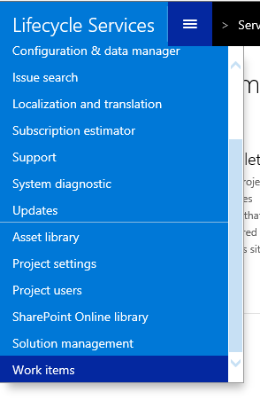

---
# required metadata

title: Copy a Finance and Operations database – SQL Server to production Azure SQL
description: This topic explains how to move a Microsoft Dynamics 365 for Finance and Operations, Enterprise edition database from a SQL Server–based development, build, or demo environment (Tier 1 or one-box) to an Azure SQL database–based sandbox UAT environment (Tier 2 or higher).
author: tariqbell
manager: AnnBe
ms.date: 11/20/2017

ms.topic: article
ms.prod: 
ms.service: dynamics-ax-platform
ms.technology: 

# optional metadata

# ms.search.form: 
# ROBOTS: 
audience: IT Pro
# ms.devlang: 
ms.reviewer: margoc
ms.search.scope: Operations
# ms.tgt_pltfrm: 
ms.custom: 256464
ms.assetid: 4cc5f2aa-dd4e-4981-9607-e75fd1d57941
ms.search.region: Global
# ms.search.industry: 
ms.author: tabell
ms.search.validFrom: 2016-11-30
ms.dyn365.ops.version: Version 1611

---

# Copy a Finance and Operations database from SQL Server to a production Azure SQL Database environment

[!include[banner](../includes/banner.md)]

This topic explains how to move a Microsoft Dynamics 365 for Finance and Operations database from an environment that is based on Microsoft SQL Server (a development, build or demo environment, which is also known as a Tier 1 or one-box environment) to an environment that is based on a Microsoft Azure SQL database (a sandbox user acceptance testing \[UAT\] environment, Tier 2 or higher).

Typically, this process is completed before go-live, to bring a golden (or seed) database that contains only system configuration data into a production environment. This process isn't suitable for all situations. For example, you should not use this process to import data for a new legal entity for an existing live deployment. In situations of this type, we recommend that you use [process data packages](../lcs-solutions/process-data-packages-lcs-solutions.md) or [data entity data packages](../data-entities/data-entities-data-packages.md).

Here is the supported procedure for bringing a golden database into a production environment.

1. A customer or partner exports the database from SQL Server.
2. The customer or partner imports the database into a sandbox environment that runs on an Azure SQL database. 
3. In Microsoft Dynamics Lifecycle Services (LCS), the customer or partner submits a service request of the **Other request** type to ask that the Microsoft Dynamics Support Engineering (DSE) team move the sandbox database to the production environment.
4. The DSE team copies the database from the sandbox environment to the production environment. 

> [!NOTE]
> Microsoft accepts requests to copy a database into a production environment only before go-live. 

During the process for moving a database, the sqlpackage.exe command-line tool is used to export the database from SQL Server and import it into an Azure SQL database. Because the file name extension for the exported data file is .bacpac, the process is often referred to as the *bacpac process*.

Here is the high-level process for a database move.

1. Create a copy of the source database.
2. Run a script to prepare the database.
3. Export the database from SQL Server.
4. Import the database into an Azure SQL database.
5. Run a script to update the database.

If you encounter issues, see the "Known issues and limitations" section at the end of this topic. It explains how to troubleshoot, gives performance tips, and explains limitations of the copy process.

## Prerequisites

- The source environment (the environment where the source database was created) must run a version of the Finance and Operations platform that is earlier than or the same as the version of the platform that the destination environment runs.
- To import a database into an Azure SQL Database environment, you must install the [latest version of Microsoft SQL Server Management Studio](https://msdn.microsoft.com/en-us/library/mt238290.aspx) on the computer that runs Application Object Server (AOS) in that environment. You then do the bacpac import on the AOS computer. There are two reasons for this requirement:

    - Because of an Internet Protocol (IP) access restriction on all instances of Finance and Operations that run on Azure SQL Database, connections are allowed only from a computer in that environment.
    - The version of Management Studio that is installed by default is for a previous version of SQL Server and can't perform the required tasks.

> [!IMPORTANT]
> If your environment includes Microsoft Dynamics 365 for Retail components, you must manually store some environment-specific values before you begin. For more information, see the "Additional steps for Retail environments" section.

## Before you begin

Encrypted and environment-specific values can't be imported into a new environment. After you've completed the import, you must re-enter some data from your source environment in your target environment.

### Document the values of encrypted fields

Because of a technical limitation that is related to the certificate that is used for data encryption, values that are stored in encrypted fields in a database will be unreadable after that database is imported into a new environment. Therefore, after an import, you must manually delete and re-enter values that are stored in encrypted fields. New values that are entered in encrypted fields after an import will be readable. The following fields are affected. The field names are given in Table.Field format.

| Field name                                               | Where to set the value |
|----------------------------------------------------------|------------------------|
| CreditCardAccountSetup.SecureMerchantProperties          | Select **Accounts receivable** &gt; **Payments setup** &gt; **Payment services**. |
| ExchangeRateProviderConfigurationDetails.Value           | Select **General ledger** &gt; **Currencies** &gt; **Configure exchange rate providers**. |
| FiscalEstablishment\_BR.ConsumerEFDocCsc                 | Select **Organization administration** &gt; **Fiscal establishments** &gt; **Fiscal establishments**. |
| FiscalEstablishmentStaging.CSC                           | This field is used by the Data Import/Export Framework (DIXF). |
| HcmPersonIdentificationNumber.PersonIdentificationNumber | Select **Human resources** &gt; **Workers** &gt; **Workers**. On the **Worker** tab, in the **Personal information** group, select **Identification numbers**. |
| HcmWorkerActionHire.PersonIdentificationNumber           | This field has been obsolete since Microsoft Dynamics AX 7.0 (February 2016). It previously appeared in the **All worker actions** form (**Human resources** &gt; **Workers** &gt; **Actions** &gt; **All worker actions**). |
| SysEmailSMPTPassword.Password                            | Select **System administration** &gt; **Email** &gt; **Email parameters**. |
| SysOAuthUserTokens.EncryptedAccessToken                  | This field is used internally by AOS. It can be ignored. |
| SysOAuthUserTokens.EncryptedRefreshToken                 | This field is used internally by AOS. It can be ignored. |

### If you're running Retail components, document encrypted and environment-specific values

The values on the following pages are either environment-specific or encrypted in the database. Therefore, all the imported values will be incorrect.

- Payments services (**Accounts receivable** &gt; **Payments setup** &gt; **Payments services**)
- Hardware profiles (**Retail and commerce** &gt; **Channel setup** &gt; **POS setup** &gt; **POS profiles** &gt; **Hardware profiles**)

## Create a copy of the source database

Because you must delete database users before you can export the source SQL Server database, you should create a copy of that database. You can then work with the copy instead of modifying the original database. The following script backs up the default AxDB database and then restores it to the same instance under a new name. To use this script, first verify that the path D:\\backups exists.

```
BACKUP DATABASE [AxDB] TO DISK = N'D:\Backups\axdb_golden.bak' WITH NOFORMAT, NOINIT,
NAME = N'AxDB_golden-Full Database Backup', SKIP, NOREWIND, NOUNLOAD, COMPRESSION, STATS = 10
GO
RESTORE DATABASE [AxDB_CopyForExport] FROM DISK = N'D:\Backups\axdb_golden.bak' WITH FILE = 1,
MOVE N'AXDBBuild_Data' TO N'F:\MSSQL_DATA\AxDB_CopyForExport.mdf',
MOVE N'AXDBBuild_Log' TO N'G:\MSSQL_LOGS\AxDB_CopyForExport_Log.ldf',
NOUNLOAD, STATS = 5
```

## Prepare the database

Run the following script against the AxDB\_CopyForExport database that you created in the previous section. This script makes the following changes:

- Set the **SysGlobalConfiguration** flag to inform Finance and Operations that the database is Azure-based.
- Remove a reference to tempDB in the XU\_DisableEnableNonClusteredIndexes procedure. References to tempDB aren't allowed in an Azure SQL database. The database synchronization process will re-create the reference later.
- Drop users, because Microsoft Windows users are forbidden in Azure SQL databases. Other users must be re-created later, so that they're correctly linked to the appropriate sign-in on the target server.

A successful export and import of the database requires all these changes.

```
update sysglobalconfiguration
set value = 'SQLAZURE'
where name = 'BACKENDDB'

update sysglobalconfiguration
set value = 1
where name = 'TEMPTABLEINAXDB'

drop procedure XU_DisableEnableNonClusteredIndexes
drop schema [NT AUTHORITY\NETWORK SERVICE]
drop user [NT AUTHORITY\NETWORK SERVICE]
drop user axdbadmin
drop user axdeployuser
drop user axmrruntimeuser
drop user axretaildatasyncuser
drop user axretailruntimeuser
drop user axdeployextuser
```

## Export the database from SQL Server

Open a **Command Prompt** window as an administrator, and run the following commands.

> [!IMPORTANT]
> If the **140** folder doesn't exist, you must install the [latest version of Management Studio](https://msdn.microsoft.com/en-us/library/mt238290.aspx).

```
cd C:\Program Files (x86)\Microsoft SQL Server\140\DAC\bin\
SqlPackage.exe /a:export /ssn:localhost /sdn:<database to export> /tf:D:\Exportedbacpac\my.bacpac /p:CommandTimeout=1200 /p:VerifyFullTextDocumentTypesSupported=false
```

Here is an explanation of the parameters:

- **ssn (source server name)** – The name of the SQL Server to export from. For the purposes of this topic, the name should always be **localhost**.
- **sdn (source database name)** – The name of the database to export.
- **tf (target file)** – The path and name of the file to export to. The folder should already exist, but the export process will create the file.

## Import the database into an Azure SQL database

Copy the .bacpac file that was generated in the previous section to the AOS computer in the target environment. A typical .bacpac file for a golden database will be smaller than 100 MB. Therefore, you can copy and paste the file through a Remote Desktop Protocol (RDP) window. If the .bacpac file is much larger than 100 MB, [upload it to an Azure storage account](https://azure.microsoft.com/en-gb/documentation/articles/storage-use-azcopy/), and then download it to the target AOS computer.

> [!NOTE]
> Microsoft doesn't provide a storage account as part of your Finance and Operations agreement. You must either purchase a storage account or use a storage account from a separate Azure subscription. For performance reasons, we recommend that you put the .bacpac file on drive D on the AOS computer. (For more information, see the "Known issues and limitations" section.)

Open a **Command Prompt** window as an administrator, and run the following commands.

> [!IMPORTANT]
> If the **140** folder doesn't exist, you must install the [latest version of Management Studio](https://msdn.microsoft.com/en-us/library/mt238290.aspx).

```
cd C:\Program Files (x86)\Microsoft SQL Server\140\DAC\bin\

SqlPackage.exe /a:import /sf:D:\Exportedbacpac\my.bacpac /tsn:<Azure SQL database server name>.database.windows.net /tu:sqladmin /tp:<password from LCS> /tdn:<new database name> /p:CommandTimeout=1200 /p:DatabaseEdition=Premium /p:DatabaseServiceObjective=P2
```

Here is an explanation of the parameters:

- **tsn (target server name)** – The name of the Azure SQL Database server to import to. You can find the name in LCS. Add the suffix **database.windows.net** to it.
- **tdn (target database name)** – The name of the database to import into. The database should **not** already exist. The import process will create it.
- **sf (source file)** – The path and name of the file to import from.
- **tu (target user)** – The SQL user name for the target Azure SQL database instance. We recommend that you use the standard **sqladmin** user. You can retrieve the password for this user from your LCS project.
- **tp (target password)** – The password for the target Azure SQL database user.
- **DatabaseServiceObjective** – The pricing tier of the database. Default sandbox UAT environments for Finance and Operations use P2.

You will receive the following warning message. You can safely ignore it.

> \*\*\* A project which specifies SQL Server 2016 as the target platform may experience compatibility issues with Microsoft Azure SQL Database v12.

## Update the database

Run the following script against the imported database. The script performs the following actions:

- Re-create database users.
- Set the correct performance parameters.
- Enable the SQL Query Store feature.

> [!NOTE]
> You must add the tenant ID to the last three queries. You can find this value by querying the SysServiceConfigurationSetting table in an existing database in the target environment.

```
CREATE USER axdeployuser FROM LOGIN axdeployuser
EXEC sp_addrolemember 'db_owner', 'axdeployuser'

CREATE USER axdeployextuser WITH PASSWORD = '<password from LCS>'
IF EXISTS (select * from sys.database_principals where type = 'R' and name = 'DeployExtensibilityRole')
BEGIN
    EXEC sp_addrolemember 'DeployExtensibilityRole', 'axdeployextuser'
END

CREATE USER axdbadmin WITH PASSWORD = '<password from LCS>'
EXEC sp_addrolemember 'db_owner', 'axdbadmin'

CREATE USER axruntimeuser WITH PASSWORD = '<password from LCS>'
EXEC sp_addrolemember 'db_datareader', 'axruntimeuser'
EXEC sp_addrolemember 'db_datawriter', 'axruntimeuser'

CREATE USER axmrruntimeuser WITH PASSWORD = '<password from LCS>'
EXEC sp_addrolemember 'ReportingIntegrationUser', 'axmrruntimeuser'
EXEC sp_addrolemember 'db_datareader', 'axmrruntimeuser'
EXEC sp_addrolemember 'db_datawriter', 'axmrruntimeuser'

CREATE USER axretailruntimeuser WITH PASSWORD = '<password from LCS>'
EXEC sp_addrolemember 'UsersRole', 'axretailruntimeuser'
EXEC sp_addrolemember 'ReportUsersRole', 'axretailruntimeuser'

CREATE USER axretaildatasyncuser WITH PASSWORD = '<password from LCS>'
EXEC sp_addrolemember 'DataSyncUsersRole', 'axretaildatasyncuser'

ALTER DATABASE SCOPED CONFIGURATION  SET MAXDOP=2
ALTER DATABASE SCOPED CONFIGURATION  SET LEGACY_CARDINALITY_ESTIMATION=ON
ALTER DATABASE SCOPED CONFIGURATION  SET PARAMETER_SNIFFING= ON
ALTER DATABASE SCOPED CONFIGURATION  SET QUERY_OPTIMIZER_HOTFIXES=OFF
ALTER DATABASE <imported database name> SET COMPATIBILITY_LEVEL = 130;
ALTER DATABASE <imported database name> SET QUERY_STORE = ON;

update [dbo].[SYSSERVICECONFIGURATIONSETTING]
set value ='<tenant ID from existing database>'
where name = 'TENANTID'

update dbo.POWERBICONFIG
set TENANTID = '<tenant ID from existing database>'

update dbo.PROVISIONINGMESSAGETABLE
set TENANTID = '<tenant ID from existing database>'
```

## Synchronize the database

1. Use Remote Desktop to connect to all the computers in the target environment, and stop the following Windows services by using services.msc. These services will have open connections to the Finance and Operations database. After you stop the services, you can replace the existing Finance and Operations database with the newly imported database.

    - World wide web publishing service (on all AOS computers)
    - Microsoft Dynamics 365 for Finance and Operations Batch Management Service (on non-private AOS computers only)
    - Management Reporter 2012 Process Service (on business intelligence \[BI\] computers only)

2. On the AOS computer where the bacpac import was done, run the following script in Management Studio. This script renames the original database and then renames the newly imported database so that it uses the original database name. In this example, the original database was named axdb\_123456789, and the newly imported database was named importeddb.

    > [!NOTE]
    > Make sure that the you're using the SQL Server 2016 version of Management Studio.

    ```
    ALTER DATABASE [axdb_123456789] MODIFY NAME = [axdb_123456789_original]
    ALTER DATABASE [importeddb] MODIFY NAME = [axdb_123456789]
    ```

3. Synchronize the database. Open a **Command Prompt** window as an administrator, and run the following commands.

    ```
    cd F:\AosService\WebRoot\bin

    Microsoft.Dynamics.AX.Deployment.Setup.exe -bindir "F:\AosService\PackagesLocalDirectory" -metadatadir F:\AosService\PackagesLocalDirectory -sqluser axdbadmin -sqlserver <Azure SQL database server name>.database.windows.net -sqldatabase <database name> -setupmode sync -syncmode fullall -isazuresql true -sqlpwd <SQL password> >log.txt 2>&1
    ```

4. Use services.msc to restart the services that you stopped earlier:

    - World wide web publishing service (on all AOS computers)
    - Microsoft Dynamics 365 for Finance and Operations Batch Management Service (on non-private AOS computers only)
    - Management Reporter 2012 Process Service (on BI computers only)

5. At this point, you can open the Finance and Operations application URL and sign in. Verify that the application works as you expect. Then drop the original database by running the following script in Management Studio on the AOS computer where you did the bacpac import.

    ```
    DROP DATABASE [axdb_123456789_original]
    ```

### Re-provision the target environment

[!include[environment-reprovision](../includes/environment-reprovision.md)]

### Reset the Financial Reporting database

If you're using Financial Reporting, which was previously named Management Reporter, you must reset the Financial Reporting database by following the steps in [Resetting the financial reporting data mart after restoring a database](../analytics/reset-financial-reporting-datamart-after-restore.md).

## Submit a service request to copy the database

To copy the golden database to a production environment, you must submit a service request of the **Other request** type in LCS. In this request, you ask that Microsoft run the copy action.

> [!NOTE]
> You can't use a request of the **Database refresh request** type, because the request involves copying to a production environment.

1. In LCS, select the hamburger icon, and then select **Work items**.

    [](./media/lcsworkitemsmenu.png)

2. On the **Work items** page, select **Add**, and then select **Other request**.
3. In the **Other requests** dialog box, follow these steps:

    1. In the **Environment name** field, select the production environment.
    2. Set the **Preferred downtime start date** and **Preferred downtime end date** fields. The end date must be at least one hour after the start date. To help guarantee that resources are available to run the request, submit your request at least 24 hours before your preferred downtime window.
    3. In the **Request** field, enter the following details: **This is a request for a golden database copy from the sandbox environment &lt;source sandbox environment name&gt; to production. I acknowledge that this will overwrite the database currently in production.**
    4. Select the check boxes at the bottom to agree to the terms.

## Additional steps for Retail environments

If your environment includes Retail components, you must perform additional steps to help guarantee that the environment will work after the database import.

### Re-enter encrypted and environment-specific values in the target database

The values on the following pages are encrypted in the database. Therefore, all the imported values will be incorrect.

- Payments services (**Accounts receivable** &gt; **Payments setup** &gt; **Payments services**)
- Hardware profiles (**Retail and commerce** &gt; **Channel setup** &gt; **POS setup** &gt; **POS profiles** &gt; **Hardware profiles**)

In the target system, open these pages, and enter the values that you documented earlier.

## Re-enter data from encrypted and environment-specific fields in the target database

In the Finance and Operations client, enter the values that you documented for the encrypted and environment-specific fields. The following fields are affected. The field names are given in Table.Field format.

| Field name                                               | Where to set the value |
|----------------------------------------------------------|------------------------|
| CreditCardAccountSetup.SecureMerchantProperties          | Select **Accounts receivable** &gt; **Payments setup** &gt; **Payment services**. |
| ExchangeRateProviderConfigurationDetails.Value           | Select **General ledger** &gt; **Currencies** &gt; **Configure exchange rate providers**. |
| FiscalEstablishment\_BR.ConsumerEFDocCsc                 | Select **Organization administration** &gt; **Fiscal establishments** &gt; **Fiscal establishments**. |
| FiscalEstablishmentStaging.CSC                           | This field is used by DIXF. |
| HcmPersonIdentificationNumber.PersonIdentificationNumber | Select **Human resources** &gt; **Workers** &gt; **Workers**. On the **Worker** tab, in the **Personal information** group, select **Identification numbers**. |
| HcmWorkerActionHire.PersonIdentificationNumber           | This field has been obsolete since AX 7.0 (February 2016). It previously appeared in the **All worker actions** form (**Human resources** &gt; **Workers** &gt; **Actions** &gt; **All worker actions**). |
| SysEmailSMPTPassword.Password                            | Select **System administration** &gt; **Email** &gt; **Email parameters**. |
| SysOAuthUserTokens.EncryptedAccessToken                  | This field is used internally by AOS. It can be ignored. |
| SysOAuthUserTokens.EncryptedRefreshToken                 | This field is used internally by AOS. It can be ignored. |

## Known issues and limitations

### I can't download the Management Studio installer

When you try to download the Management Studio installer, you might receive the following message:

> Your current security settings do not allow this file to be downloaded.

To work around this issue, follow these steps to enable file downloads.

1. In your web browser, open **Internet options**.
2. On the **Security** tab, select the **Internet** zone, and then select **Custom level**.
3. Scroll to **Downloads**, and then, under **File download**, select the **Enable** option.

### Performance

The following guidelines can help you achieve optimal performance:

- Always export from a computer that is in the same Azure datacenter as the Azure SQL database instance. In practice, this guideline means that when you export a copy of your sandbox database, you should export it from the sandbox AOS computer.
- Always import the .bacpac file locally on the computer that runs the SQL Server instance. Don't import it from Management Studio on a remote computer.
- In a one-box environment that is hosted in Azure, put the .bacpac file on drive D when you export it. (A one-box environment is also known as a Tier 1 environment.) For more information about the temporary drive on Azure computers, see the [Understanding the temporary drive on Windows Azure Virtual Machines](https://blogs.msdn.microsoft.com/mast/2013/12/06/understanding-the-temporary-drive-on-windows-azure-virtual-machines/) post on the Azure Support Team blog.
- Grant the account that runs the SQL Server Windows service [Instance File Initialization](https://msdn.microsoft.com/en-us/library/ms175935.aspx) rights. In this way, you can help improve the speed of the import process and the speed of a restore from a \*.bak file. For a developer environment, you can easily make sure that the account that runs the SQL Server service has these rights by setting SQL Server to run as the axlocaladmin account.
- We recommend that you not use the option to export and import from Azure SQL Database in Management Studio. (This option is also known as **Export data tier application**.) You should not use this option because there can be memory limitations for larger databases.
