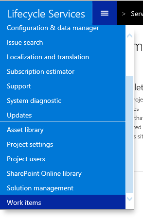

---
# required metadata

title: Request a database refresh
description:
author: Robadawy
manager: AnnBe
ms.date: 10/31/2017
ms.topic: article
ms.prod: 
ms.service: dynamics-ax-platform
ms.technology: 

# optional metadata

# ms.search.form: 
# ROBOTS: 
audience: IT Pro, Developer
# ms.devlang: 
ms.reviewer: margoc
ms.search.scope: AX 7.0.0, Operations, UnifiedOperations
# ms.tgt_pltfrm: 
ms.custom: 257614
ms.assetid: 558598db-937e-4bfe-80c7-a861be021db1
ms.search.region: Global
# ms.search.industry: 
ms.author: robadawy
ms.search.validFrom: 2016-02-28
ms.dyn365.ops.version: AX 7.0.0

---

# Restore a database on a non-production environment

[!include[banner](../includes/banner.md)]

Microsoft Dynamics 365 for Finance and Operations lets you request that a database be refreshed. This topic describes how to request a database refresh.

## Database refresh process
The Microsoft Service Engineering team will take your environment offline, complete the refresh, and then bring the environment back online. You can expect the downtime period to be less than two hours. The period after you enter your request and before our Service Engineers take action will be longer than your environment downtime. In the future, we will provide a self-service method that you can use to perform your database refreshes.

1.  Click the hamburger icon in the upper left of the Microsoft Dynamics Lifecycle Services (LCS) window, and then select **Work items** in the list. 
2.  On the **Work items** page, click **Add** on the toolbar, and then click **Database refresh**. 
3.  In the **Request for database refresh** dialog box, follow these steps:
    1.  In the **Environment name** field, select the environment to refresh. 
    2.  In the **Database** field, the database to refresh is always Microsoft Dynamics AX or Microsoft Dynamics 365 for Finance and Operations. Other databases, such as Entity store or Financial reporting, aren't currently supported for point-in-time restores.
    3.  Carefully read and acknowledge the statements that have check boxes next to them.
4.  After you submit your request, you will be redirected to the list of work items. Here, you can view the status of the request, or reschedule or cancel the request.
5.  When the Microsoft Service Engineering team has acknowledged that it can complete your request, the status of the request changes to **Request accepted**. At this point, you can follow any of these steps:
    -   Wait for the Service Engineering team to complete the refresh. When restore is completed, the status changes to **Succeeded**.
    -   Reschedule the request by clicking the ID, or by selecting the request and then clicking **Reschedule** on the toolbar. You can then change the downtime windows dates and times, and the point in time to restore to.
    -   Cancel the request by selecting the request and then clicking **Cancel** on the toolbar.

## Conditions of a database refresh
Here is the list of requirements and conditions of operation for a point-in-time restore:

-   Requests must be submitted 24 hours before the desired downtime window, to help guarantee that resources will be available to complete the request.
-   A refresh erases the existing database in the target environment. The existing database can't be recovered after the refresh is completed.
-   The target environment will be unavailable until the refresh process is completed.
-   The point-in-time restore will affect only the Dynamics 365 for Finance and Operations database.
    -   Document handling documents that are stored in Azure blob storage won't be changed and will remain in their current state. The same rule applies to any documents that are stored in Azure blob storage through X++ customization.
    -   The Financial reporting database will also remain in the current state and must be reset after the refresh is completed.

## Steps to complete after a database refresh for environments using retail functionality

