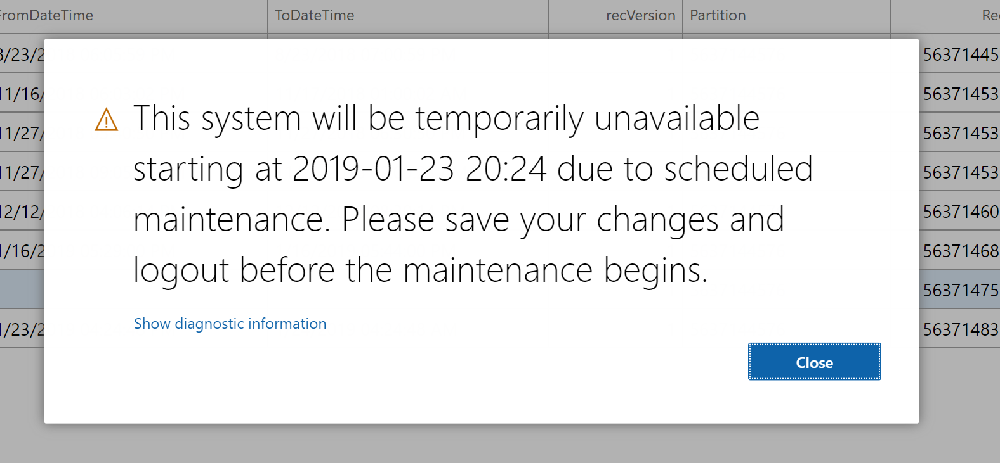

---
# required metadata

title: Database Movement Operations - General Refresh Scenario
description: This topic explains a general purpose database refresh scenario for Microsoft Dynamics 365 for Finance and Operations.
author: LaneSwenka
manager: AnnBe
ms.date: 1/22/2019
ms.topic: article
ms.prod: 
ms.service: dynamics-ax-platform
ms.technology: 

# optional metadata

# ms.search.form: 
# ROBOTS: 
audience: IT Pro, Developer
# ms.devlang: 
ms.reviewer: margoc
ms.search.scope: Operations
# ms.tgt_pltfrm: 
ms.search.region: Global
# ms.search.industry: 
ms.author: laneswenka
ms.search.validFrom: 2019-01-22
ms.dyn365.ops.version: AX 7.0.0

---

# Tutorial: Refresh for training purposes

[!include [banner](../includes/banner.md)]

Database Movement operations are a suite of self-service actions that can be used as part of Data Application Lifecycle Management ( also referred to as 'DataALM' ).  This tutorial shows how to use the Refresh database operation in a training scenario.

In this tutorial, you will learn how to:
>[!div class="checklist"]
> * Prepare the target environment
> * Execute the refresh
> * Reconfigure the target environment
> * Enable select users

An example of this scenario is a customer who has already gone live with Microsoft Dynamics365 for Finance and Operations, and would like to get a recent copy of Production transactions loaded in to their UAT environment.  This will support training of new employees, and evaluating configuration changes without impacting the live environment.

## Prerequisites
To perform a refresh operation you must have your Production environment deployed, or you must have at minimum 2 standard user acceptance test (UAT) environments.

## Notify the users of the pending downtime
Before starting the bulk of the work, you can give the users in the target environment a heads up that the environment will be offline for a period of time.  This can be done both manually via Lifecycle Services as well as programmatically using RESTful API calls.

To perform this manually in LCS:
* Visit the target **Environment details** page in LCS
* Select on the **Maintain** -> **Message online users** menu item
* Click the **Broadcast a new message for downtime** button
* Choose the valid from / valid to times in your local timezone
* Click the **Post** button

### Send a broadcast message programmatically
The below sample code can be used in a Console App as shown, or modified to work with other services like Azure Functions which can be called on demand.  Before the sample below will work, please read [How to authenticate custom services](../data-entities/services-home-page.md) to setup your application registration.

```csharp
[Serializable]
    public class SysAddBroadcastMessageDataContract
    {
        public SysAddBroadcastMessageRequest request { get; set; }

    }
    [Serializable]
    public class SysAddBroadcastMessageRequest
    {
        public DateTime FromDateTime { get; set; }
        public DateTime ToDateTime { get; set; }
    }

    public class Program
    {
    
        public static AuthenticationResult getResult(AuthenticationContext ctx, string url)
        {
            return ctx.AcquireTokenAsync(url, "YOUR_APP_REGISTRATION_ID", new Uri("YOUR_REPLY_URL"), new PlatformParameters(PromptBehavior.Always)).Result;
        }

        static void Main(string[] args)
        {
            SysAddBroadcastMessageRequest request = new SysAddBroadcastMessageRequest();
            request.FromDateTime = DateTime.UtcNow;
            request.ToDateTime = DateTime.UtcNow.AddHours(12);

            SysAddBroadcastMessageDataContract dc = new SysAddBroadcastMessageDataContract();
            dc.request = request;


            AuthenticationContext ctx = new AuthenticationContext("https://login.microsoftonline.com/YOUR_TENANT.COM");
            AuthenticationResult res = getResult(ctx, "https://YOUR_SANDBOX_UAT.sandbox.operations.dynamics.com");

            HttpClient restfulCli = new HttpClient();
            restfulCli.DefaultRequestHeaders.Clear();
            restfulCli.BaseAddress = new Uri("https://YOUR_SANDBOX_UAT.sandbox.operations.dynamics.com/");
            restfulCli.DefaultRequestHeaders.Add("Authorization", res.CreateAuthorizationHeader());
            restfulCli.DefaultRequestHeaders.Accept.Add(new MediaTypeWithQualityHeaderValue("application/json"));

            HttpRequestMessage requestMsg = new HttpRequestMessage(HttpMethod.Post, string.Format("api/services/SysBroadcastMessageServices/SysBroadcastMessageService/AddMessage"));
            requestMsg.Content = new StringContent(JsonConvert.SerializeObject(dc));

            HttpResponseMessage responseMsg = restfulCli.SendAsync(requestMsg).Result;
            if(responseMsg.IsSuccessStatusCode)
            {
                Console.WriteLine("Wow I just notified the users programmatically!");
            }

        }
```
Both approaches either via LCS manually or via RESTful API will show the users a pending downtime is soon to occur:


## Begin the refresh
Depending on the size of your source environment, it may make sense to begin the refresh process immediately.  The larger the source database, the longer time it will take to copy to your target Azure SQL instance.  While the copy is in progress the target environment is still online.  Once the copy is complete the downtime will start.

This process can be done manually via LCS, see [Refresh database quickstart](database-refresh.md) for the latest steps.  In a future release of LCS this will also be available for triggering via RESTful API.

## Reconfigure environment specific settings
After the refresh is complete, use the **Sign off** button in LCS to close out of the operation.  We then can begin the process to configure the environment specific settings.

Start by logging in to the environment using the adminsitrator's account which can be found on the **Environment details** page in LCS.  Some common areas of reconfiguration are below, you may require additional based on your setup and ISV solutions that are installed:
* System administration -> Setup -> **Batch groups**. Add the various AOS to the batch server groups you require.
* System administration -> Setup -> **Entity Store**. Refresh the various entities that you require for PowerBI reporting.
* System administration -> Setup -> **System parameters**. Reconnect the environment to the LCS Help Configuration for Task Guides.
* System administration -> Setup -> Email -> **Email parameters**. Enter the SMTP settings if you use email in your UAT environment.  
* System administration -> Inquiries -> **Batch jobs**. Highlight the jobs you wish to run in your UAT environment and update the status to *Waiting*.

To perform these actions in a more expedient manner, it is recommended to build a custom webservice endpoint which can be called on-demand after refresh.  An example of such a webservice will be added in a future update of this article.

## Open the environment to users
When the system is configured as you see fit, you can enable select users to access the environment.  By default all users except for the Admin and Microsoft Service Accounts are disabled.

To enable users visit:
* System administration -> Users -> **Users**. Enable the users you wish to have access to the UAT environment.  If there are many to enable this can be done quicker via the [Excel Add-In](../office-integration/use-excel-add-in.md).


