---
# required metadata

title: Apply updates to cloud environments
description: This topic explains how to use Lifecycle Services (LCS) to apply a binary update or an application (AOT) deployable package to a cloud environment.
author: manalidongre
manager: AnnBe
ms.date: 03/04/2019
ms.topic: article
ms.prod: 
ms.service: dynamics-ax-platform
ms.technology: 

# optional metadata

# ms.search.form: 
# ROBOTS: 
audience: Developer, IT Pro
# ms.devlang: 
ms.reviewer: kfend
ms.search.scope: Operations, Retail
# ms.tgt_pltfrm: ms.custom: 107013
ms.assetid: 341a229f-d9c3-4678-b353-d08d5b2c1caf
ms.search.region: Global
# ms.search.industry: 
ms.author: manado
ms.search.validFrom: 2016-05-31
ms.dyn365.ops.version: Platform update 1

---

# Apply updates to cloud environments

[!include [banner](../includes/banner.md)]

This topic describes how you can use Microsoft Dynamics Lifecycle Services (LCS) to automatically apply updates to either a Microsoft Dynamics 365 for Finance and Operations environment or a Microsoft Dynamics 365 for Retail environment. Updates are applied using deployable packages.

> [!IMPORTANT]
> Applying packages causes system downtime. All relevant services will be stopped, and you won't be able to use your environments while the package is being applied. You should plan accordingly.

## Supported environments

The following topologies support package deployment that uses automated flows in LCS:
- **LCS Implementation Project** – All environment types are supported. Automated package application is a self-service operation in all environments except production environments. For production environments, customers must use LCS to submit a request to apply packages.
- **LCS Partner and Trial Projects** – All environment types are supported, except multi-box dev/test topologies.

> [!NOTE]
> Regardless of the project type, if you have a build environment, you can only use LCS to apply Binary updates and Data upgrade packages. You can't use LCS to apply an Application Deployable package.

For other topologies (below), you must use Remote Desktop Protocol (RDP) to connect to the environment and install from the command line. For information about manual package deployment, see [Install deployable packages from the command line](install-deployable-package.md).

- Local development environments (Downloadable virtual hard disk [VHD])
- Multi-box dev/test environments in Microsoft Azure (Partner and trial projects)

## Key concepts

Before you begin, you should understand *deployable packages*, *runbooks*, and the *AXInstaller*. A deployable package is a unit of deployment that can be applied in any environment. A deployable package can be a binary update to the platform or other runtime components, an updated application (AOT) package, or a new application (AOT) package. The AXInstaller creates a runbook that enables installing a package. For more details, see [Packages, runbooks, and the AXUpdateInstaller in depth](apply-deployable-package-system.md#packages-runbooks-and-the-axupdateinstaller-in-depth) at the end of this topic.

## Supported package types

- **AOT deployable package** – A deployable package that is generated from application metadata and source code. This deployable package is created in a development or build environment.
- **Application and Platform Binary update package** – A deployable package that contains dynamic-link libraries (DLLs) and other binaries and metadata that the platform and application depend on. This is a package released by Microsoft. This is available from the **All binary updates** tile from LCS.
- **Platform update package** – A deployable package that contains dynamic-link libraries (DLLs) and other binaries and metadata that the platform depend on. This is a package released by Microsoft. This is available from the **Platform binary updates** tile from LCS.
- **Retail deployable package** – A combination of various Retail packages that are generated after the Retail code is combined.
- **Merged package** – A package that is created by combining one package of each type. For example, you can merge one binary update package and one AOT package, or one AOT package and one Retail deployable package. The packages are merged in the Asset library for the project in LCS.
> [!NOTE] 
> A binary package and a Retail deployable package can't be included in the same merged package.

> [!NOTE]
> For information about how to download an update from LCS and what you see in the tiles based on your environment version, see [Download updates from Lifecycle Services](../migration-upgrade/download-hotfix-lcs.md).

> [!NOTE] 
> If your environment is on an Application version 8.1 and above then the **Platform Update package does not apply** to your environment. Starting with 8.1 and above release, Application and Platform binary update package is the one that applies since application and platform will be combined into a single cumulative package and will be released by Microsoft. Also note that you will no longer be applying granular X++ hotfixes and will get all application and platform updates together. This means that on the environment details page clicking on **View detailed version information** will not have details on the granular hotfixes or KBs applied as there is no way to apply them. 

## Prerequisite steps

- **Make sure that the package that should be applied is valid.** When a package is uploaded to the Asset library, it isn't analyzed. If you select the package, the package status appears in the right pane as **Not Validated**. A package must pass validation before it can be applied in an environment by using the following procedures. The status of the package will be updated in the Asset library to indicate whether the package is valid. We require validation to help guarantee that production environments aren't affected by packages that don't meet the guidelines.

    There are three types of validations:

    - Basic package format validations
    - Platform version checks
    - Types of packages

- **Make sure that the package is applied in a sandbox environment before it's applied in the production environment.** To help guarantee that the production environment is always in a good state, we want to make sure that the package is tested in a sandbox environment before it's applied in the production environment. Therefore, before you request that the package be applied in your production environment, make sure that it has been applied in your sandbox environment by using the automated flows.
- **If you want to apply multiple packages, create a merged package that can be applied first in a sandbox environment and then in the production environment.** Application of a single package in an average environment requires about 5 hours of downtime. To avoid additional hours of downtime when you must apply multiple packages, you can create a single combined package that contains one package of each type. If you select a binary package and an application deployable package in the Asset library, a **Merge** button becomes available on the toolbar. By clicking this button, you can merge the two packages into a single package and therefore reduce the total downtime by half.
- **Make sure that the Application binary update package is applied to your dev/build environment before it is applied to your sandbox and production environment** - If the application binary package is applied directly to your Tier 2+ sandbox environment but is not applied on your dev/build environment, the next time you move an AOT package from dev/build box (which does not have the same application binaries as your sandbox environment) to sandbox, some of the application binaries will be overwritten with what is in your dev/build environment. This could result in a regression of the version of your sandbox environment. 

## Apply a package to a non-production environment by using LCS

> [!IMPORTANT]
> Applying packages causes system downtime. All relevant services will be stopped, and you won't be able to use your environments while the package is being applied.

Before you begin, verify that the deployable package has been uploaded to the Asset library in LCS.

1. For a binary update, upload the package directly to the Asset library. For information about how to download an update from LCS, see [Download updates from Lifecycle Services](../migration-upgrade/download-hotfix-lcs.md).

    For an application (AOT) deployable package that results from an X++ hotfix, or from application customizations and extensions, create the deployable package in your development or build environment, and then upload it to the Asset library.
2. Open the **Environment details** view for the environment where you want to apply the package.
3. Click **Maintain** &gt; **Apply updates** to apply an update.
4. Select the package to apply. Use the filter at the top to find your package.
5. Click **Apply**. Notice that the status in the upper-right corner of the **Environment details** view changes to **Queued**, and that an **Environment updates** section now shows the progress of the package.

    [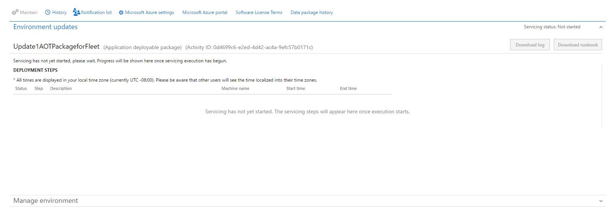](./media/parallelexecutionsandbox_queuedstate.jpg)
    
6. Refresh the page to see the progress of the package application. Notice that the servicing status is **In Progress**, and that the environment status is **Servicing**.

    [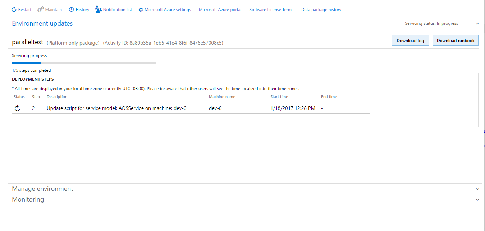](./media/parallelexecutionsandbox_servicingstate.png)
    
7. Continue to refresh the page to see the status updates for the package application request. When the package has been applied, the environment status changes to **Deployed**, and the servicing status changes to **Completed**.

    [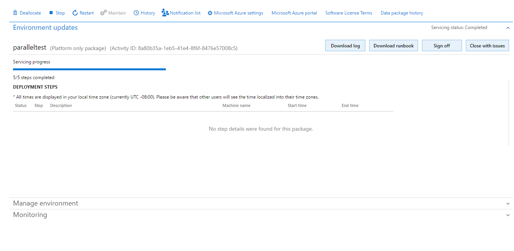](./media/parallelexecutionsandbox_signedoffstate.png)
    
8. To sign off on package application, click **Sign off** if there are no issues. If issues occurred when you applied the package, click **Sign off with issues**.

### Troubleshooting

#### General troubleshooting/diagnostics

If package application isn't successful, you can download either the logs or the runbook to see the detailed logs. You can also use RDP to connect to an environment so that you can fix issues. If you must report the issue to Microsoft, be sure to include the activity ID that is reported in the **Environment updates** section.

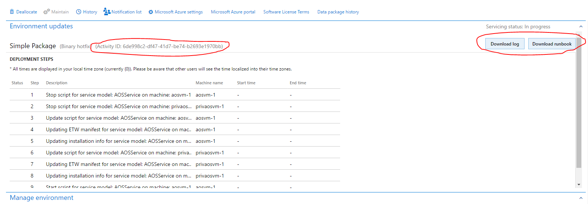

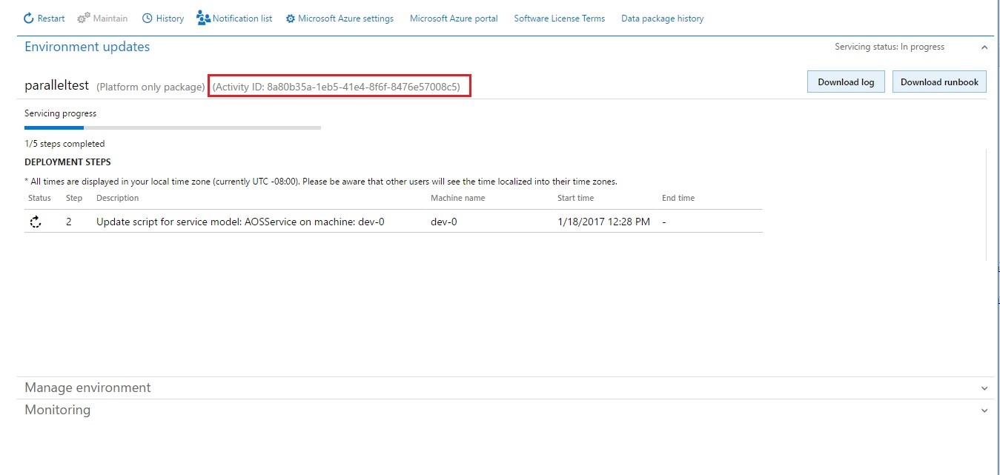

#### Using the logs

1. Download the logs.
2. Unzip the log files.
3. Select the role that a step failed for, such as **AOS** or **BI**.
4. Select the VM where the step failed. This information appears in the **Machine name** column in the **Environment updates** section.
5. In the logs for the VM, select the folder that corresponds to the step where the issue occurred. The folder name identifies the step that each folder corresponds to. For example, if the issue occurred in the executing of a step, select the **ExecuteRunbook** folder.

    For example, if the folder name is ExecuteRunbook-b0c5c413-dae3-4a7a-a0c4-d558614f7e98-1\_I0\_R0, the step number is highlighted and is the number after the globally unique identifier (GUID).

#### Package failure

If package application isn't successful, you have two options:

- Click **Resume** to retry the operation that failed.

    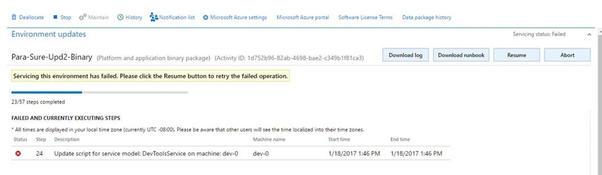
    
- Click **Abort** to stop package application.

    > [!Note]
    > If you click **Abort**, you don't roll back the changes that have already been made to your environment. To proceed, you must fix the issue.
    
    [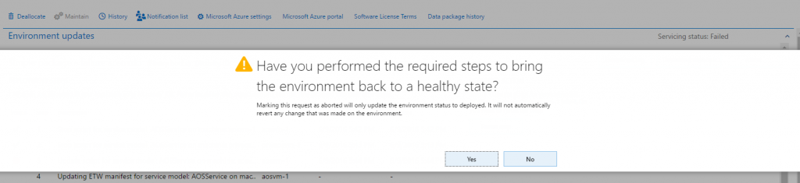](./media/applypackage_sandbox_13.png)

## Apply a package to a production environment by using LCS

In a production environment, unlike in a sandbox environment or other types of environments, package application through LCS isn't self-serve. Customers and partners must submit a request to Microsoft to apply a package when the customer is ready for the downtime. 

1. Download an update from LCS. For information about how to download an update from LCS, see [Download updates from Lifecycle Services](../migration-upgrade/download-hotfix-lcs.md).

    - For a binary update, upload the update deployable package directly to the Asset library.
    - For an application/X++ update, apply the package in a development environment. After you resolve any conflicts, generate a deployable package from Visual Studio, and upload the package to the Asset library. For information about how to upload to the Asset library and create a deployable package, see [Create deployable packages of models](create-apply-deployable-package.md).

2. On the **Asset library** page in LCS, on the tab that corresponds to the asset type (**Software deployable package**), select a package, and then click **Release candidate**.
3. Apply the package in a sandbox environment by using the instructions earlier in this topic.
4. After the package is successfully applied and signed off in the sandbox environment, open the Asset Library, and mark the package as **Release Candidate**.
5. Open the **Environment details** view for the production environment where you want to apply the package.
6. Click **Maintain** &gt; **Apply updates** to apply the package.
7. Select the type of package to apply.
8. Select the package to apply in your production environment, and then click **Schedule** to submit a request to apply it.

    > [!NOTE]
    > The list of packages includes only the packages that have been successfully signed off in the sandbox environment, and that have been marked as release candidates.

9. Specify the date and time to schedule package application for, click **Submit**, and then click **OK** to confirm. Note that your environments will be down and unavailable to perform business while the package is being applied.
10. Refresh the page. Two fields on the page indicate the status of the request.

    - **Request status** – This field indicates the status of the request that you submitted to Microsoft.
    - **Actionable by** – This field indicates who must take action.

    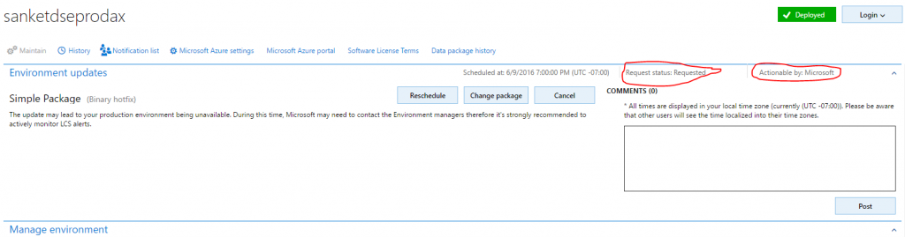
    
11. Microsoft either accepts or denies the request.

    - If the request is accepted, Microsoft begins to update the environment.
    
    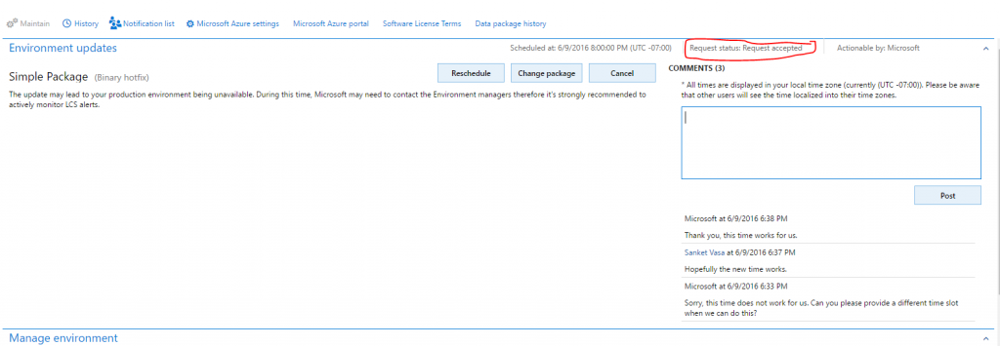
    
    - If the request is denied, Microsoft informs the customer about the reason for denial and the action that the customer must take. The customer can then reschedule the request, change the package, or cancel the request.
    
    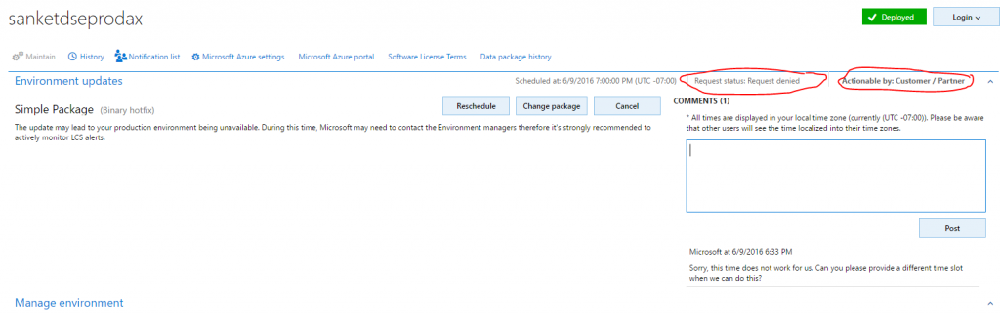

    At any time, the customer can use the **Comments** field to post comments to the request.
    
    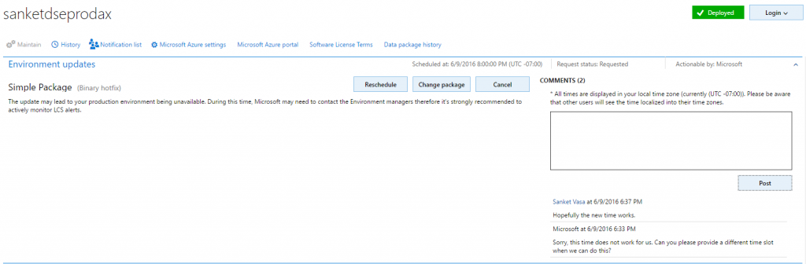
    
12. After the environment is serviced, you can monitor the status. The **Servicing status** field indicates the status of package application.

    [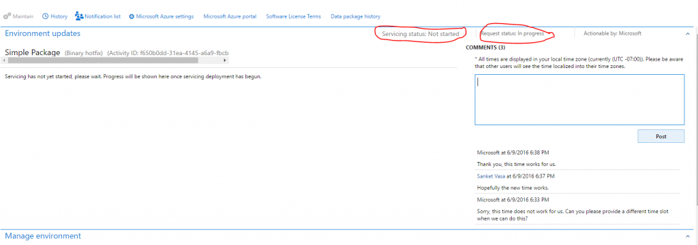](./media/applypackage_prod_11.png)
    
    Additionally, a progress indicator shows the number of steps that have been run, out of the total number of steps that are available.
    
    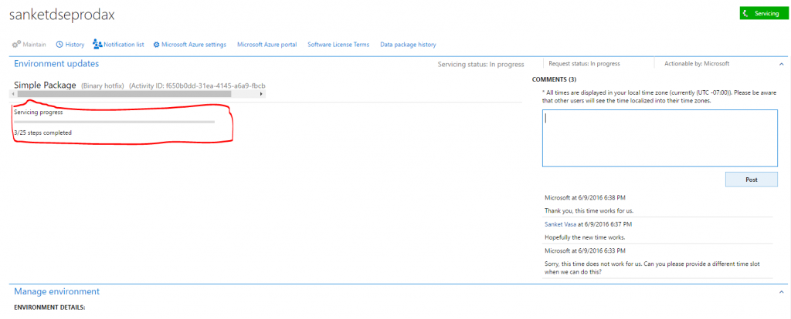

### Successful package application

- After the deployment is successfully completed, the **Servicing status** field is set to **Completed**, but the **Request status** field is still set to **In progress** because the request hasn't yet been closed.

    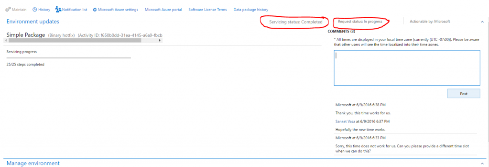
    
- After Microsoft has finished applying the request, you must close the request by clicking **Close servicing request**.
- When you close a successful request, in the **Edit work item details** dialog box, set the **Service request status** field to **Succeeded**, and then click **Submit**.

### Unsuccessful package application

- If package application isn't successfully completed, Microsoft will investigate the issue. The **Servicing status** field will indicate that package application has failed.

    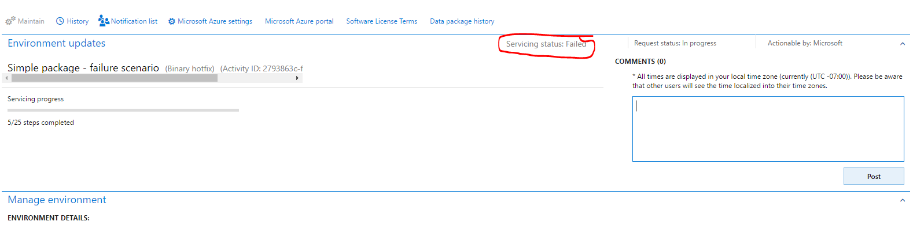
    
- When deployment fails, Microsoft can abort the package, revert the environment to a good state, and send the request back to the customer, so that the customer can validate the environment and close the request. If there is an issue in the package, the customer must submit a new request that includes the new package.

    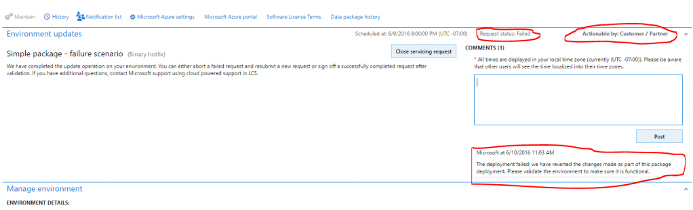
    
- When you close a failed request, in the **Edit work item details** dialog box, set the **Service request status** field to **Aborted**.

## Applying retail updates and extensions

If you are updating a Tier-2 Sandbox or Production environment on application version 8.1.2.x or newer and have enabled reduced downtime updates for Retail channel components in the cloud, you will also need to update Retail channel components. For more information, see [Apply updates and extensions to cloud hosted retail channel components](Update-retail-channel.md).

If you're using retail components (such as Retail Modern POS), after you've applied updates and extensions in your environment, you must also update your in-store components. For more information, see [Configure, install, and activate Retail Modern POS (MPOS)](../../retail/retail-modern-pos-device-activation.md).

## Packages, runbooks, and the AXUpdateInstaller in depth

Deployable packages, runbooks, and the AXUpdateInstaller are the tools you use to apply updates. 

**Deployable package** – A deployable package is a unit of deployment that can be applied in any Finance and Operations or Retail environment. A deployable package can be a binary update to the platform or other runtime components, an updated application (AOT) package, or a new application (AOT) package. Deployable packages downloaded from LCS or created in a development environment cannot be applied across product types. That is, a Finance and Operations deployable package cannot be applied in a Retail environment, and vice versa. If you have an existing customization for Finance and Operations that is compatible with Retail, and would like to apply it to a  Retail environment, you will need to re-package your source code in a Retail development environment, and conversely if moving in the other direction.   

[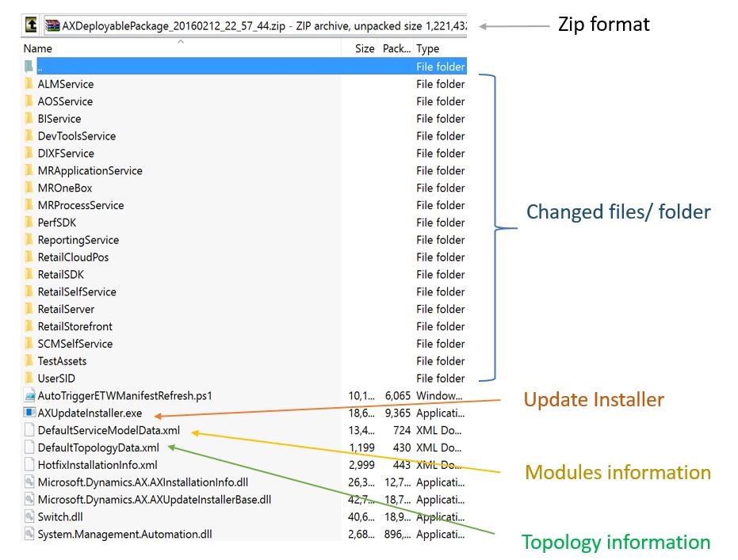](./media/applypackage_deployablepackage.jpg)

**Runbook** – The deployment runbook is a series of steps that are generated in order to apply the deployable package to the target environment. Some steps are automated, and some steps are manual. AXUpdateInstaller lets you run these steps one at a time and in the correct order.

[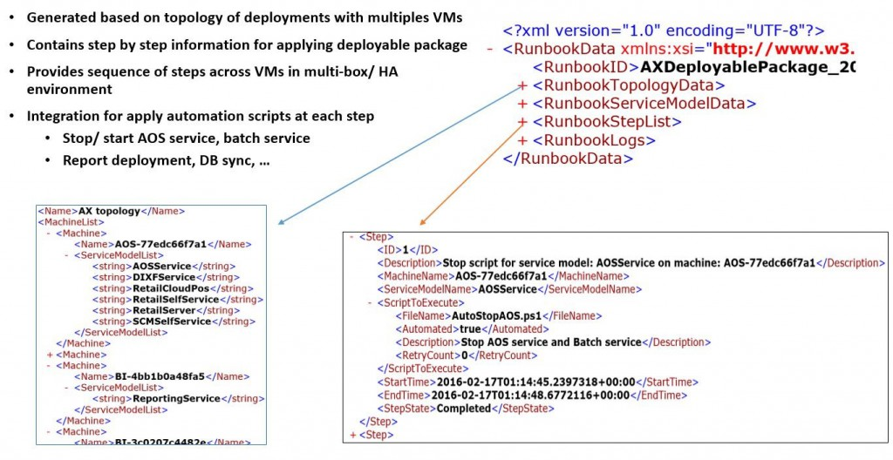](./media/applypackage_runbook.jpg)

**AXUpdateInstaller** – When you create a customization package from Microsoft Visual Studio or a Microsoft binary update, the installer executable is bundled together with the deployable package. The installer generates the runbook for the specified topology. The installer can also run steps in order, according to the runbook for a specific topology.

## Additional resources

[Install deployable packages from the command line](install-deployable-package.md)
