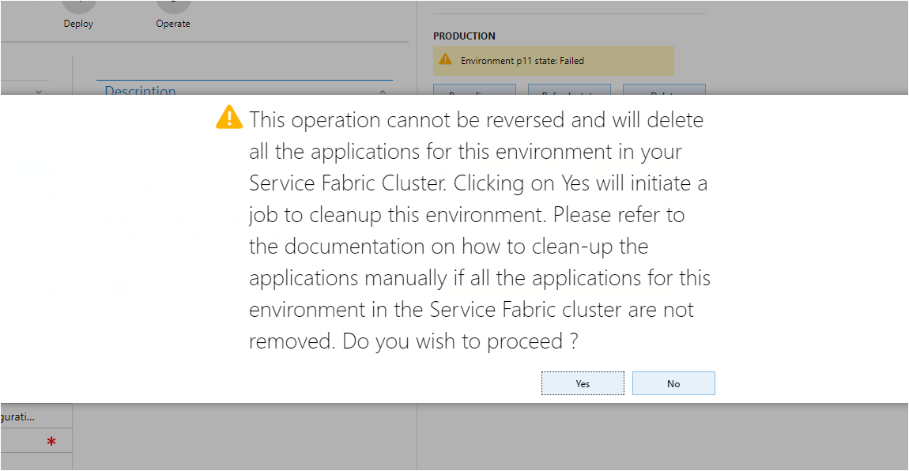

---
# required metadata

title: Apply updates to an on-premises deployment
description: This topic provides information about how to apply updates to an on-premises deployment for Microsoft Dynamics 365 for Finance and Operations, Enterprise edition.
author: manado
manager: AnnBe
ms.date: 10/30/2017
ms.topic: article
ms.prod: 
ms.service: dynamics-ax-platform
ms.technology: 

# optional metadata

# ms.search.form: 
# ROBOTS: 
audience: Developer, IT Pro
# ms.devlang: 
ms.reviewer: kfend
ms.search.scope: Operations, Unified Operations
# ms.tgt_pltfrm: 
ms.custom: 
ms.assetid: 
ms.search.region: Global
# ms.search.industry: 
ms.author: sarvanis
ms.search.validFrom: 2017-06-30
ms.dyn365.ops.version: Platform update 12

---
# Apply updates to an on-premises deployment

[!include[banner](../includes/banner.md)]

This topic provides information about how to apply supported updates to an on-premises environment of Dynamics 365 for Finance and Operations, Enterprise edition. Any updates that are made to an on-premises environment are done through Lifecycle Services (LCS). 

## Update types
There are four kinds of updates that can be applied to an on-premises deployment of Dynamics 365 for Finance and Operations: 
- Customizations 
- Application hotfixes released by Microsoft  
- Latest platform update  
- Application binary updates  
Currently, only the application of customizations and hotfixes to an on-premises environment are supported. 

## Code customizations
To apply customizations at the same time that you deploy a new on-premises environment, follow the steps in the topic, [Develop and deploy custom models to on-premises environments](develop-deploy-custom-models-on-premises.md). To apply new customizations on an already deployed environment, complete the following steps: 

1. In Lifecycle Services, navigate to the on-premises implementation project.  
2. Under **Environments**, click **Delete** to delete the application. This will clean up and remove any code that is deployed. When you click **Delete**, you do not impact the infrastructure. 

3. After the environment is deleted, click **Configure** to re-deploy with a new application and custom code.  
4. In the **Advanced settings** of the deployment configuration flow, select the application deployable package to apply, and then click **Done** to continue with the environment deployment process.  

## Find and apply application hotfixes
There are two ways to find available application hotfixes: 
- Issue Search in Lifecycle Services - To learn more about issue search, see [Issue search](../lifecycle-services/issue-search-lcs.md.  
- **Application hotfix** tiles - For cloud-hosted environments, the **Environment details** page shows all of the hotfixes that are applicable to that environment based on the version that is currently deployed. The tile functionality is not available for on-premises environments, so if a customer wants to see the list of applicable hotfixes, a cloud-hosted development environment should be maintained on the same version as the on-premises sandbox or production environment.   

Complete the following steps to apply the hotfix.

1. Download the required hotfix to your development environment, and then follow the steps in the article, Create a deployable package (create-apply-deployable-package.md).  
2. After you have the deployable package, upload the package to the Lifecycle Services Asset library on the **Software deployable packages** tab.  
Similar to applying code customizations, you can include the deployable package as an asset during environment deployment flow. 
3. In the **Advanced settings** of the **Configure deployment flow**, click **Configure**, select the application deployable package to apply, and then click **Done** to continue with the environment deployment process. 

To apply hotfixes to an already deployed environment, complete steps 1 and 2 listed above. Next, navigate to the project dashboard and click **Delete** to delete the deployed application. Then follow step 3 to deploy the hotfix.  

## Apply the latest platform update 
At this time, there is no support to apply platform updates. 

## Apply application binary updates
At this time, there is no support to apply application binary updates. 

