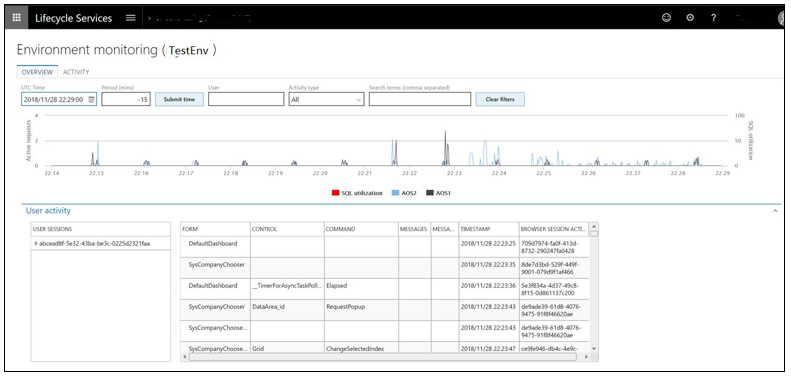

---
# required metadata

title: Self-Service Deployment for Dynamics 365 for Finance and Operations
description: This topic provides an overview of the modern infrastructure stack for Dynamics 365 Finance and Operations.
author: sarvanisathish
manager: AnnBe
ms.date: 12/13/2018
ms.topic: article
ms.prod: 
ms.service: dynamics-ax-applications
ms.technology: 

# optional metadata

# ms.search.form:  [Operations AOT form name to tie this topic to]
audience: IT Pro
# ms.devlang: 
ms.reviewer: sericks
ms.search.scope: Operations
# ms.custom: [used by loc for topics migrated from the wiki]
ms.search.region: Global 
# ms.search.industry: 
ms.author: sarvanis
ms.search.validFrom: 2018-12-31
ms.dyn365.ops.version: 8.1.1

---

# Self-Service Deployment for Dynamics 365 for Finance and Operations

[!include[banner](../includes/banner.md)]
[!include [banner](../includes/limited-availability.md)]

We are excited to announce the availability of self-service deployment for Dynamics 365 for Finance and Operations cloud environments. While most changes will be transparent to you, in the coming weeks you will see some changes in the Lifecycle Services (LCS) experience for new customers . For now, the experience for existing customers will remain unchanged.  

## What’s new or changed

Customers with the self-service capabilities will see the following changes in their LCS experience. 

- Deployment is self-service and can be completed within an average time of 30 minutes. There are no longer lead times and wait times for deployment. You can control when you deploy and verify that the environment is deployed. This experience is the same as the current experience. 

   

- You will no longer have Remote desktop access to the Tier 2+ Sandbox environments. All operations that need Remote desktop access are now available as self-service actions. The following image shows some of the operations in the environment’s **Maintain** \> **Move database menu option**. 

   

- The diagnostics capabilities will remain the same, which enables troubleshooting without remote desktop access.

   

- You will not have SQL Server access on Tier 2+. You will continue to have SQL database access using just-in-time access.

- You will need to provide a combined deployable package for customizations. Delta packages will not be supported. This was always a recommended best practice and is now enforced.
