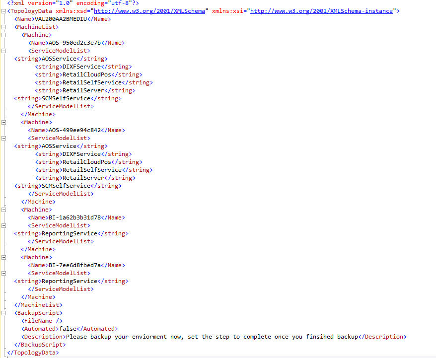
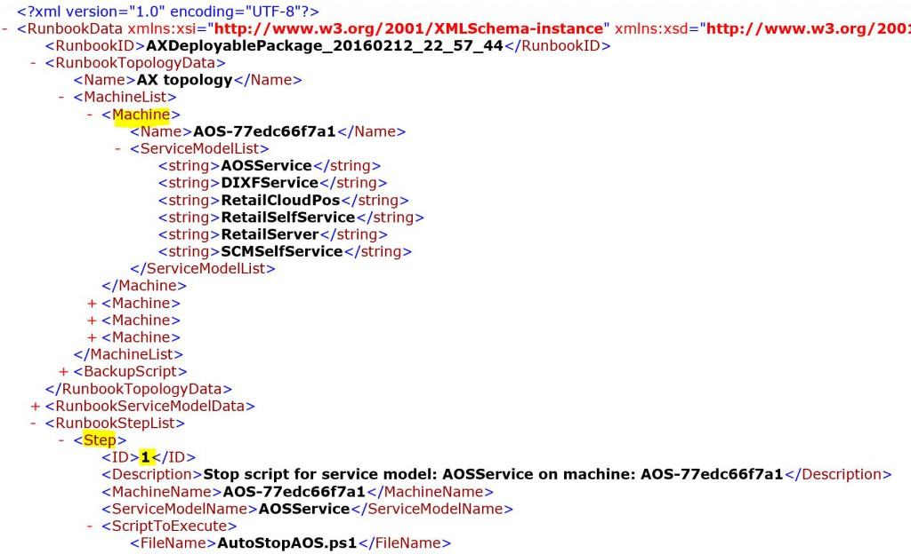
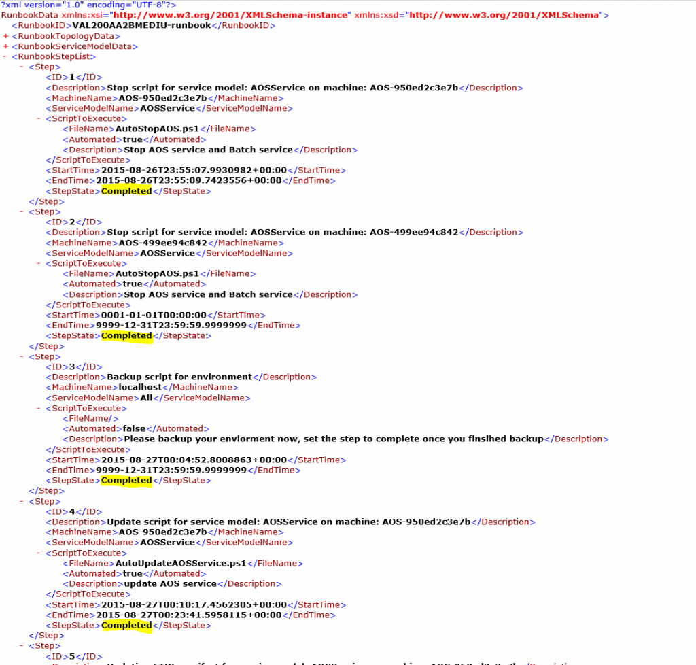

---
# required metadata

title: Install a deployable package
description: This topic walks you through the steps for using the command line to apply either a binary update or an application (AOT) deployable package that was created in your development/build environment.
author: manalidongre
manager: AnnBe
ms.date: 06/23/2017
ms.topic: article
ms.prod: 
ms.service: dynamics-ax-platform
ms.technology: 

# optional metadata

# ms.search.form: 
# ROBOTS: 
audience: Developer, IT Pro
# ms.devlang: 
ms.reviewer: robinr
ms.search.scope: AX 7.0.0, Operations, UnifiedOperations
# ms.tgt_pltfrm: 
ms.custom: 24191
ms.assetid: 42d238d6-ff03-41b6-b2d5-c94bcdc37576
ms.search.region: Global
# ms.search.industry: 
ms.author: manado
ms.search.validFrom: 2016-02-28
ms.dyn365.ops.version: AX 7.0.0

---

# Install a deployable package

[!include[banner](../includes/banner.md)]

This topic walks you through the steps for using the command line to apply either a binary update or an application (AOT) deployable package that was created in your development/build environment.

This command line process requires remote access (RDP) to the environments. In most cases, you can apply a deployable package to an environment directly from Dynamics Lifecycle Services (LCS) as described in [Apply a deployable package on a system](apply-deployable-package-system.md), without the need to understand the process described on this page.

## Key concepts
-   **Deployable package**– A deployable package is a unit of deployment that can be applied in any environment. It can consist of a binary hotfix to the AOS runtime components, an updated application package, or a new application package.
-   **AXUpdateInstaller**– A deployable package has the installer executable bundled in it. When the package is downloaded to a computer, the installer is available.
-   **Runbook**– The deployment runbook is a series of steps that is generated for applying the deployable package to the target environment. Some of the steps are automated, and some are manual. AXUpdateInstaller provides the capability to run these steps one by one and in the correct sequence.

## Collect topology configuration data
1.  In Microsoft Dynamics Lifecycle Services (LCS), open the **Environment** page.
2.  Click the name of a virtual machine (VM), and establish a Remote Desktop connection to the VM by using the user name and password that are provided on the **Environment** page.
3.  On the VM, download the zip file for the deployable package from LCS. **Note:** After you download the zip file, right-click it, and then select **Properties**. Then, in the **Properties** dialog box, on the **General** tab, click **Unblock** to unlock the files. Finally, extract the files, and continue with the next step. Also, make sure that the **zip** file is stored in a non-user folder
4.  In the folder where the deployable package was extracted, find and open the file that is named DefaultTopologyData.xml. You must populate this file with the VM name and installed components.
    -   To populate the VM name, follow these steps:
        1.  Open Windows Explorer, right-click **This PC**, and then select **Properties**.
        2.  In the system properties, find and make a note of the machine name (for example, AOS-950ed2c3e7b).
        3.  In the DefaultTopologyData.xml file, replace the machine name with the name that you found in the previous step.
    -   To populate the installed components, follow these steps:
        1.  Open a Command Prompt window as an administrator.
        2.  Navigate to the extracted folder, and run the following command to see a list of all the installed components on the computer.

                AXUpdateInstaller.exe list

        3.  Update the DefaultTopologyData.xml with the list of components.

    When you've finished populating the VM name and installed components, the DefaultTopologyData.xml file should resemble the following illustration. 
5.  Repeat steps 2 through 4 for each VM that is listed on the **Environment** page.

## Generate a runbook from the topology
Based on the topology information in the DefaultTopologyData.xml file, you must generate the runbook file that will provide step-by-step instructions for updating each VM.

-   On any VM, run the following command to generate the runbook.

        AXUpdateInstaller.exe generate -runbookid=[runbookID] -topologyfile=[topologyFile] -servicemodelfile=[serviceModelFile] -runbookfile=[runbookFile]

    Here is an explanation of the parameters that are used in this command:

    -   **\[runbookID\]**– A parameter that is specified by the developer who applies the deployable package
    -   **\[topologyFile\]**– The path of the DefaultTopologyData.xml file
    -   **\[serviceModelFile\]**– The path of the DefaultServiceModelData.xml file
    -   **\[runbookFile\]**– The name of the runbook file to generate (for example, AOSRunbook.xml)

### Example

        AXUpdateInstaller.exe generate -runbookid="VAL200AA2BMEDIU-runbook" -topologyfile="DefaultTopologyData.xml" -servicemodelfile="DefaultServiceModelData.xml" -runbookfile="VAL200AA2BMEDIU-runbook.xml"

The runbook provides the sequence of steps that must be run to update the environment. The following illustration shows an example of a runbook file. Each step in a runbook is associated with an ID, a machine name, and step execution details. 

## Install a deployable package
1.  Based on the sequence of steps that is specified in the runbook, start with the first machine (VM) that is listed.
2.  Follow these steps on each VM. For one-box environments like Development, Build, and Demo environments, there is only one VM.
    1.  Import the runbook by running the following command.

            AXUpdateInstaller.exe import -runbookfile=[runbookFile]

        **Example**

            AXUpdateInstaller.exe import -runbookfile="VAL200AA2BMEDIU-runbook.xml"

    2.  Verify the runbook.

            AXUpdateInstaller.exe list

    3.  Execute the runbook.

            AXUpdateInstaller.exe execute -runbookid=[runbookID]

        **Example**

            AXUpdateInstaller.exe execute -runbookid="VAL200AA2BMEDIU-runbook"

    4.  Export the runbook.

            AXUpdateInstaller.exe export -runbookid=[runbookID] -runbookfile=[runbookFile]

        **Example**

            AXUpdateInstaller.exe export -runbookid="VAL200AA2BMEDIU-runbook" -runbookfile="VAL200AA2BMEDIU-runbook.xml"

3.  AXUpdateInstaller updates the runbook file after each step is run on a VM.
4.  The runbook also logs information about each step.
5.  For manual steps, follow the instructions, and then mark the step as completed in the runbook by using the AXUpdateInstaller.

        AXUpdateInstaller.exe execute -runbookID=[runbookID] -setstepcomplete=[stepID]

    **Example**

        AXUpdateInstaller.exe execute -runbookid="VAL200AA2BMEDIU-runbook" -setstepcomplete=2

8.  If errors occur during any step, debug the script/instructions in the step, and update accordingly.

## Verify installation
1.  Run the following command to verify that the new updates are installed.

        AXUpdateInstaller.exe list

2.  View the runbook to see the completed steps. 

## Troubleshooting
-   After all the steps are completed, export the runbook, and save it outside the computer for future reference. For example, you might have to use the runbook file in these situations:
    -   You must analyze the downtime requirements for production, and so on.
    -   You must send the file to Microsoft in the event of failure to install a deployable package.
-   If any step fails, you can rerun it by running the following command.

        AXUpdateInstaller.exe execute -runbookid=[runbookID] -rerunstep=[stepID]

-   To prevent version mismatch or downgrade, or installation of the same deployable package, run the following command.

        AXUpdateInstaller.exe execute -runbookid=[runbook ID] -versioncheck=true

-   To verify database synchronization, navigate to the aosservce\\scripts\\ folder and find the dbsync.error.txt file. Find the file, and look for any errors.

