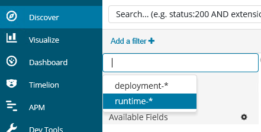
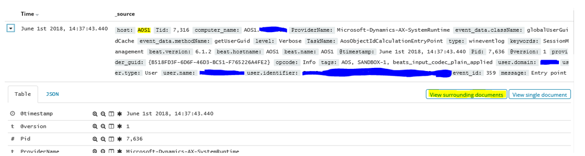

---
# required metadata

title: On-premises diagnostics
description: This topic provides information about exposing the telemetry data for on-premises deployments of Microsoft Dynamics 365 for Finance and Operations. 
author: sarvanisathish
manager: AnnBe
ms.date: 06/20/2018
ms.topic: article
ms.prod: 
ms.service: dynamics-ax-platform
ms.technology: 

# optional metadata

# ms.search.form: 
# ROBOTS: 
audience: Developer, IT Pro
# ms.devlang: 
ms.reviewer: kfend
ms.search.scope: Operations
# ms.tgt_pltfrm: 
ms.custom: 60373
ms.assetid: 
ms.search.region: Global
# ms.search.industry: 
ms.author: sarvanis
ms.search.validFrom: 2018-04-20
ms.dyn365.ops.version: Platform Update 12

---
# On-premises diagnostics

[!include [banner](../includes/banner.md)]

## Telemetry guidelines
To diagnose Microsoft Dynamics 365 for Finance and Operations deployment and execution, you must have access to telemetry. In a cloud deployment, Microsoft stores and monitors the telemetry from services to keep the environment healthy. For an on-premises deployment, the customer is responsible for this task. 

You can select the telemetry data store and query tool that you prefer to use. However, at a minimum it should at least perform the following tasks:

- The telemetry store should be able to store 30 days worth of telemetry data.
- The telemetry events should be stored in a centralized location, so that support engineers don't have to switch between multiple machines to find events that are relevant to an issue.
- The telemetry events should be discoverable based on event type and event data.
- The telemetry event data (xml) should be deserialized so that the event data can be queried on and is traversable.

## Elastic Stack example
To fulfill the telemetry guidelines listed in the previous section, we have tested the Elastic Stack set up which includes:

- Elasticsearch: For storage, event indexing, and event querying
- Logstash: For load distribution and event data mutation
- Winlogbeat: For telemetry collection
- Kibana: An interface for querying the data stored in Elasticsearch

You can read more about Elasticsearch at the [Elastic website](https://www.elastic.co/products/elasticsearch).

  > [!NOTE]
  > Communication in an Elastic Stack cluster is not sent over HTTPS. This is a default behavior. Do not set up Elastic Stack without considering the risks and preparing or implementing mitigations for those risks. Encrypting communication in Elastic Stack can be performed by the [paid version](https://www.elastic.co/subscriptions) of X-Pack. Set it up by following the guide, [Setting up TLS on a cluster](https://www.elastic.co/guide/en/x-pack/current/ssl-tls.html) There is also an open source [Elasticsearch plug-in](https://github.com/floragunncom/search-guard-ssl), which we have not tested, that states it can enable HTTPS.

If you deploy the Elastic Stack, note that your experience may vary if you follow the steps in this document. We used version 6.2.3 of the Elastic Stack components and Dynamics 365 for Finance and Operations 7.3 Platform Update 12 in our tests.
This document will describe how we handled the setup and configuration steps required to get Elastic Stack working for a on-premises deployment of Finance and Operations. For guidance not releated to Finance and Operations, we refer to the Elastic.co documentation.

## Install and Configure Elastic Stack
All hosted components of the Elastic Stack run on Java, except for Winlogbeat. In our scenario, we started by downloading and installing the latest version of Java 8 JRE (64-bit) on each node that would be running Elasticsearch, Logstash or Kibana (all of the orchestrator nodes). You can get Java 8 from [http://www.oracle.com/technetwork/java/javase/downloads/index.html](http://www.oracle.com/technetwork/java/javase/downloads/index.html).
As of June 2018, the Elastic Stack runs on Java 8. Any attempts to run it on a newer version of Java may not work.

  > [!NOTE}
  > The entire Elastic Stack (except for Winlogbeat) can be hosted on Linux. In our tests, the stack was hosted on Windows Server 2016 VMs.
  
Remeber to open ports in the firewall for the different components on each node.
If you get stuck during setup, Elastic.co has extensive and well-written documentation for installing and configuring the Elastic Stack. For help with specific types of errors, web searches yield reliable results from both the Elastic.co forum and StackOverflow.

### Component matrix
In our testing, we used the following setup for a small to medium sized Finance and Operations deployment:

 

Because the orchestrator nodes are already being used for deployment and as primary Service Fabric nodes, they are good candidates for split utilization.
 
### Elasticsearch
Elasticsearch installation is fairly straight forward. During our testing, we downloaded the [MSI installer](https://www.elastic.co/downloads/elasticsearch) onto Orchestrator nodes #1 and #2. Most of the default settings in the installer can be left as is. The settings we changed are described below.
To ensure that Elasticsearch will start running again in the case of OS restart, install Elasticsearch as a service on Windows. The service can be set up by using the MSI.

On the **Configuration** page of the installer, we used the same cluster name when installing each Elasticsearch node in the cluster.
We set each Elasticsearch node to perform all three roles, Data, Master, and Ingest.
Depending on the amount of usage expected of Kibana and Elasticsearch, consider bumping up the memory usage. This decision can be changed later, by modifying the -Xm options in "C:\ProgramData\Elastic\Elasticsearch\config\jvm.options" and restarting Elasticsearch.
Depending on how many Elasticsearch nodes you choose to set up, you can set the Discovery minimum master nodes appropriately. If you are unsure, you can keep the master nodes empty. For more information about discovery and nodes, see [Node](https://www.elastic.co/guide/en/elasticsearch/reference/current/modules-node.html).
For discoverability, in **Network settings**, we put each nodes’ IP address as their respective Network host and added all Elasticsearch node IP addresses to the Unicast Hosts list for each node. For example, on Orchestrator #1 (with IP 10.0.0.12), we set the Network host to 10.0.0.12, and added the following to the Unicast Hosts list: 10.0.0.12, 10.0.0.13, where 10.0.0.13 is Orchestrator #2.

**If you’re installing Elasticsearch version 6.3 or higher, you can disregard this paragraph** - You can select to install X-Pack now, or later. For more information on setting up, and whether you should install X-Pack, see the X-Pack section in this document. For now, unless you know what it is for, don't install it.

  > [!IMPORTANT}
  > Open the HTTP port (default: 9200) and node communication port (default: 9300) in your firewall.

To verify that the installation was successful, open a browser and navigate to the application address where you should see some JSON output.
 
### Logstash
In our test setup, we found that some of the events from Winlogbeat needed some adjustments, and Logstash provides that functionality.
We downloaded Logstash into C:\ELK\Logstash on Orchestrator nodes #2 and #3.
To ensure that Logstash runs on startup, we used NSSM to set up a service for the Logstash batch script.

1. Copy nssm.exe to the Logstash bin folder (e.g. C:\ELK\Logstash\6.2.4\bin\).
2. Open PowerShell from the bin folder and run the following: 

        .\nssm.exe install Logstash
      
3. Set the following fields on the **Application** tab, and then click **Save**:

      Path: C:\ELK\Logstash\6.2.4\bin\logstash.bat
      Startup directory: C:\ELK\Logstash\6.2.4
      Arguments: -f C:\ELK\Logstash\config\logstash-dyn365finops.conf
      (There are more settings to set if you want, but for now, this will do)

4. Next, run the following:

        .\nssm.exe start Logstash
        
In our tests, NSSM had trouble restarting the installed services. We considered the service as an OS startup service, and not much else as NSSM was not 100% reliable for Logstash and Kibana.

We created the following configuration file for Logstash, which performs useful mutations on Finance and Operations telemetry ([placed in C:\ELK\Logstash\6.2.4\config](https://aka.ms/ConfigFilesOnPremises)): 

To make the configuration work for your set up, you will have to change the hosts fields in the output section to point to the Elasticsearch nodes in your cluster. For example, hosts => ["ORCH1:9200", "ORCH2:9200"].
The configuration was tested with the Winlogbeat configuration from the section below.
Remember to open the Winlogbeat port in your firewall on the machine that is hosting Logstash, to allow Beats sending data to Logstash (default: 5044).
 
### Winlogbeat
We downloaded Winlogbeat to each of the AOS and Orchestrator nodes at C:\ELK\Winlogbeat, and configured the [winlogbeat.yml file](https://aka.ms/ConfigFilesOnPremises).

To make the configuration work for your set up, you will have to change the **output.logstash.hosts** fields to point to all your Logstash nodes. Winlogbeat will handle the load balancing.
When Winlogbeat is running on an Orchestrator node, the **Tags** field can be changed from AOS to ORCH, or something similar. We also used the **fields.env** field to set the environment of the deployment (sandbox, sandbox-n, production). By doing this, there is a cleaner separation when querying data from multiple environments and node types.
Winlogbeat comes with a service installer which we used to set up Winlogbeat as a service on each of the nodes. From the Run tool (Win+R), we ran the following:

     powershell.exe -ExecutionPolicy Bypass -File C:\ELK\Winlogbeat\install-service-winlogbeat.ps1
 
### Kibana
Kibana provides the interface to query the telemetry data in Elasticsearch.
We downloaded Kibana to C:\ELK\Kibana, and configured the kibana.yml file as follows:
        
    server.host: "10.0.0.14"
    server.name: "Dyn365FinOps On-Premises Diagnostics"
    elasticsearch.url: "http://ORCH1:9200"

From Kibana, we had to define index patterns on the **Management** tab. Because the index pattern groups index by name, we needed an indext patter for the two indexes we made: “deployment-\*” and “runtime-\*”. The index names are case sensitive.
We set the runtime-* index pattern as the default. Click the asterisk when looking at the index patterns on the **Management** tab. This index pattern will then show up on the **Discovery** tab:

 

We ran Kibana as a service in the same manner as Logstash, for the benefit of Kibana starting up on OS start. Unlike Logstash, kibana.bat does not need to know the path of the configuration files, so simply install a NSSM service that points to C:\ELK\Kibana\6.2.4\bin\kibana.bat.
If you want users to browse it on your network, remember to open the port for Kibana. The default port is 5601.
 
#### Example queries in Kibanas Discover tab
The following sample queries can help you get started with probing the telemetry data. If you need something more than the examples show, you can:

  - **Find slow database queries:** You can type **slow** into the search field, which will find events that have the word ‘slow’ somewhere in the event data. If you’re looking to be more precise, you can find events with a task name of **"AosDatabaseSlowQuery”** and then type **TaskName:AosDatabaseSlowQuery** into the search field.
  - **Find recent exceptions:** Type **exception** into the search field to find events that have thrown an exception or handled one and logged it. From the upper right corner of Kibana you can choose the time-frame that you want the search to be limited to. The time set there will persist between tabs, so the data on the **Visualize** tab will reflect the selected time range.

   
  
  - **Find events from an AOS node:** Searching for **host:AOS1** will yield all events from that node.
  - **Find events with proximity, in time, to another:** When you have found an event of interest, click **View surrounding documents** next to the header of that event. That will find events that happened at the same time. If you’re seeing events that happened around the same time, but from different AOS nodes, you can add additional filtering to only show events from the node you want.

  

#### 30-day data retention
To keep our hard disks free from stale data, we used Curator v5.5 to clean up indexes older than 30 days.
We downloaded Curator to one of the orchestrator nodes at C:\ELK\Curator, and used the following configuration file to connect it to our Elasticsearch cluster ([put in C:\ELK\Curator](https://aka.ms/ConfigFilesOnPremises)).

The Curator runs actions, and we created an action to clean up 30-day old indexes ([put in C:\ELK\Curator](https://aka.ms/ConfigFilesOnPremises)).

We created a basic task in Windows Task Scheduler with a weekly trigger on Saturday and Sunday that contains the following settings to start a program:
  - Program/script:
     
        C:\ELK\Curator\curator.exe
  
  - Add arguments:

        --config curator.yml .\30day_data_retention_actions.yml
  - Start in:

        C:\ELK\Curator
 
## X-Pack
  > [!IMPORTANT]
  > As of June 2018, Elastic Stack components have been released starting with version 6.3. This updated version handles X-Pack in a more graceful manner, by enabling the free features of X-Pack by default, without having to update the license yearly, and allowing you to opt-in to the paid features afterwards. If you install an Elastic Stack version that was released prior to 6.3, the content in this section will only partially apply to the setup.

When you install Elasticsearch, you can select to install X-Pack or you can choose to [install it at a later time](https://www.elastic.co/guide/en/x-pack/current/installing-xpack.html).
X-Pack has a free Basic license that must be refreshed once a year.
We installed the free version to enable CSV exports of query data from Kibana. There are other useful features in X-Pack, and some are locked behind a paid subscription.
To enable only the free features, and avoid using other X-Pack trial features, we added the following our elasticsearch.yml and kibana.yml configuration files:

    xpack.graph.enabled: false
    xpack.ml.enabled: false
    xpack.security.enabled: false
    xpack.watcher.enabled: false

Adding these settings also stops Kibana and Elasticsearch from asking for credentials as the security module is no longer enabled.

The logstash.yml configuration file must also be configured for X-Pack to function: 

    xpack.monitoring.elasticsearch.url: "http://orch1:9200"

The paid version of X-Pack includes https encryption for connections throughout the cluster, password protected data access, and more. See [Elastic.co](https://www.elastic.co/products/x-pack) for more information on X-Pack.

### Export a query to a CSV file
In Kibana, on the **Discover** tab, write a query and save it. After you save the query, click the **Reporting** tab at the top of the **Discover** page, and then click **Generate CSV**.
 
## Troubleshooting
### I’m not receiving any data in Kibana
If you are not receiving any data in Kibana, review the logs from Winlogbeat to Logstash, Elasticsearch, and Kibana. Note that the Winlogbeat installation will put its logs in C:\ProgramData\winlogbeat\Logs, while the other components of the Elastic Stack will put their logs close to the installation path (f.x.: C:\ELK\Elasticsearch\logs).

