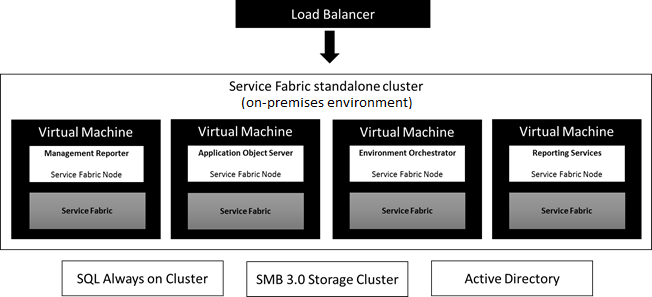
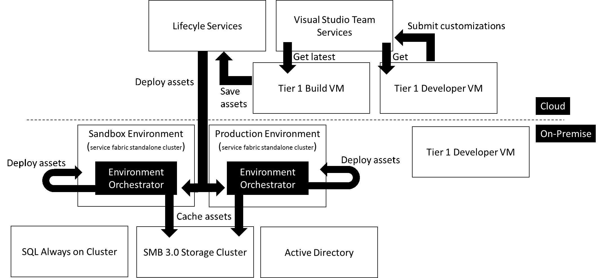

---
# required metadata

title: Dynamics 365 for Finance and Operations, Enterprise edition on-premises overview 
description: Dynamics 365 for Finance and Operations, Enterprise edition now supports running business processes in customer data centers with the on-premises or Local Business Data (LBD) deployment option. 
author: kfend
manager: AnnBe
ms.date: 06/13/2017
ms.topic: article
ms.prod: 
ms.service: dynamics-ax-platform
ms.technology: 

# optional metadata

# ms.search.form: 
# ROBOTS: 
audience: Developer, IT Pro
# ms.devlang: 
ms.reviewer: robinr
ms.search.scope: Operations
# ms.tgt_pltfrm: 
ms.custom: 60373
ms.assetid: 
ms.search.region: Global
# ms.search.industry: 
ms.author: arifk
ms.search.validFrom: 2016-02-28
ms.dyn365.ops.version: Platform Update 8

---
# Dynamics 365 for Finance and Operations, (Enterprise edition on-premises) overview 

[!include[banner](../includes/banner.md)]

Microsoft Dynamics 365 for Finance and Operations, Enterprise edition, now supports running business processes in customer data centers with the on-premises deployment option. With this deployment option, application servers and the Microsoft SQL Server database will run in the customer’s data center. Customers and partners will utilize Microsoft Dynamics Lifecycle Services (LCS) to manage their on-premises deployments. LCS is an application management portal that provides tools and services for managing the application lifecycle of your Microsoft Dynamics 365 for Finance and Operations implementations in the cloud and on-premises. LCS features, such as business process modeling, software deployment and patching, and monitoring and diagnostics, are used to help support on-premises deployments. 

## Architecture 

The on-premises deployment option uses Finance and Operations cloud components running on-premises using Microsoft Azure Server Service Fabric standalone clusters. Service Fabric is the next-generation Microsoft middleware platform for building and managing enterprise-class high-scale applications. Service Fabric standalone clusters can be deployed on any computer that is running Windows Server. 

On-premises deployment defines two types of Service Fabric standalone clusters: clusters for production environments and clusters for sandbox environments. The following roles or node types are deployed into both types of clusters: 

- Application Object Servers (AOS) – Provides the ability to run the Finance and Operations application functionality in client, batch, and import/export scenarios. 
- Management Reporter (MR) – Provides financial reporting functionality. 
- SQL Server Reporting Services (SSRS) – Provides document reporting functionality. 
- Environment Orchestrator – Enables on-premises environment management from LCS. 
Note: Retail Server is not supported in on-premises deployments at this time. 

Figure 1 shows a logical diagram of the node types deployed in a Service Fabric standalone cluster. 

Application lifecycle management for on-premises deployments is orchestrated through LCS. Customers can use the proven tools and methodologies in LCS to help manage their on-premises deployments (Figure 2). The development experience continues to be the same as in cloud deployments through 1-box VHDs. 

## Data storage 
The on-premises deployment option stores core customer data on-premises. Core customer data is a subset of the customer data definition provided in the [Microsoft Trust Center](https://www.microsoft.com/en-us/trustcenter/privacy/how-microsoft-defines-customer-data). Table 1 outlines the categories of customer data that are stored in Microsoft Azure data centers located in the United States by services such as LCS, Azure Active Directory, and Microsoft Office signup portal. All other customer data, referred to as core customer data, is stored on-premises.  

Table 1: Customer data stored in Microsoft Azure data centers located in the United States by services supporting on-premises environments. These services enable initial onboarding, initiation, and tracking of support incidents, and service updates and upgrades.  

| Supporting services                   | Customer data definition                                                                                                                                                                                                                                                            |
|---------------------------------------|----------------------------------------------------------------------------------------------------------------------------------------------------------------------------------------------------------------------------------------------------------------------------------------------|
| Microsoft Dynamics Lifecycle Services | Project content and files are stored in a project. This includes application configuration data, code, metadata, and data assets that comprise the application and business process models. Also included is anonymized user activity logs and information that is collected during the onboarding process. |
| Microsoft Office signup portal        | Customer information that is collected during the onboarding process.                                                                                                                                                                                                                                 |
| Microsoft Azure Active Directory      | Authentication for LCS and Visual Studio Team Services.                                                                                                                                                                                                               |
  

Additional services or components can be configured to extend an on-premises deployment as needed; however, configuration choices may cause core customer data to be transferred outside of the customer’s data center. For example, configuring data management features that are used to integrate external services with an on-premises deployment may result in the transfer of core customer data outside the on-premises deployment. 
