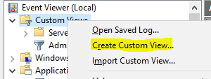
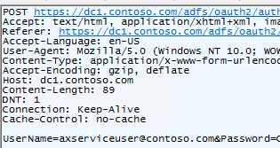
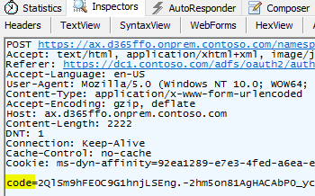

---
# required metadata

title: Troubleshoot on-premises deployments
description: This topic provides troubleshooting information for on-premises deployments of Microsoft Dynamics 365 for Finance and Operations.
author: sarvanisathish
manager: AnnBe
ms.date: 09/17/2018
ms.topic: article
ms.prod:
ms.service: dynamics-ax-platform
ms.technology:

# optional metadata

# ms.search.form:
# ROBOTS:
audience: Developer, IT Pro
# ms.devlang:
ms.reviewer: kfend
ms.search.scope: Operations
# ms.tgt_pltfrm:
ms.custom: 60373
ms.assetid:
ms.search.region: Global
# ms.search.industry:
ms.author: sarvanis
ms.search.validFrom: 2016-02-28
ms.dyn365.ops.version: Platform Update 8

---
# Troubleshoot on-premises deployments

[!include [banner](../includes/banner.md)]

This topic provides troubleshooting information for on-premises deployments of Microsoft Dynamics 365 for Finance and Operations.

## Access Service Fabric Explorer
You can access Service Fabric Explorer in a web browser by using the default address, `https://sf.d365ffo.onprem.contoso.com:19080`.

To verify the address, note the value that was used in the "Create DNS zones and add A records" section of the appropriate setup and deployment topic for your environment:

- [Platform update 12](setup-deploy-on-premises-pu12.md#createdns)
- [Platform update 8 and Platform update 11](setup-deploy-on-premises-pu8-pu11.md#createdns)

You can access the site only if the client certificate is in cert:\\CurrentUser\\My on the machine that you're accessing the site on. (In Certificate Manger, go to **Certificates - Current User** \> **Personal** \> **Certificates**.) When you access the site, select the client certificate when you're prompted.

## Monitor the deployment

### Identify the primary orchestrator
To determine the machine that is the primary instance for stateful services such as a local agent, in Service Fabric Explorer, expand **Cluster** \> **Applications** \> **\<*intended application example*\> LocalAgentType** \> **fabric:/LocalAgent/OrchestrationService** \> **(GUID)**.

The primary node is shown. For stateless services or the remaining applications, you must check all the nodes.

Note the following points:

- OrchestrationService orchestrates the deployment and servicing actions for Finance and Operations.
- ArtifactsManager downloads files from Microsoft Azure cloud storage to the local agent file share. It also unzips the files into the required format.

### Review the orchestrator event logs
From the primary OrchestrationService orchestrator machine, in Event Viewer, review **Applications and Services Logs** \> **Microsoft** \> **Dynamics** \> **AX-LocalAgent**.

Note that you must select the **Details** tab to view the full error message.

The following modules must be installed:

- Common
- ReportingServices
- AOS
- FinancialReporting

The following commands must be run:

- Setup
- Dvt (deployment verification test)
- Cleanup (used to service and delete an environment)

The following folders contain additional information:

- AX-SetupModuleEvents 
- AX-SetupInfrastructureEvents 
- AX-BridgeService 

Event viewer tip for reviewing Dynamics entries:
In Event viewer, right-click on **Custom Views** and select **Create Custom View**.



Select the Event logs drop down list, and select **Dynamics**, as shown.


Note, also look at **Administrative Events** in **Custom Views**.

### Service Fabric Explorer
Note the state of the cluster, application, and nodes. For information about how to access Service Fabric Explorer, see [Access Service Fabric Explorer](troubleshoot-on-prem.md#access-service-fabric-explorer).

#### Error: "Partition is below target replica or instance count"
This error isn't a root error. It indicates that the status of each node isn't ready. For AXSFType (AOS), the status might still be **InBuild**.

Use Event Viewer on the machines related to the error message to view the latest activity.

#### AXSFType 
For AXSFType (AOS), if a status of **InBuild** is shown, review the DB Sync status and other events from Application Object Server (AOS) machines.

To diagnose errors, use Event Viewer to review the following event logs:

- **Applications and Services Logs** \> **Microsoft** \> **Dynamics** \> **AX-DatabaseSynchronize**
- **Custom Views** \> **Administrative Events**

#### Error: "ExtractInstallerService failed to extract" C:\Users\dynuser.CONTOSO\AppData\Local\Temp\1blssblh.w0n\FabricInstallerService.Code\FabricClient.dll.
If you receive this error, download the latest version of [Service Fabric](http://go.microsoft.com/fwlink/?LinkId=730690). Note that the the username and path in the error will change according to your environment.

#### Service Fabric logs
You can find additional details about Azure Service Fabric applications in the log files at C:\\ProgramData\\SF\\\<OrchestratorMachineName\>\\Fabric\\work\\Applications\\LocalAgentType\_App\<N\>\\log.

### Lifecycle Services
Note the current deployment status for the environment in Microsoft Dynamics Lifecycle Services (LCS).

## Time-out error occurs when a Service Fabric cluster is created
Run Test-D365FOConfiguration.ps1 as noted in the "Set up a standalone Service Fabric cluster" section of the appropriate setup and deployment topic for your environment, and note any errors:

- [Platform update 12](setup-deploy-on-premises-pu12.md#setupsfcluster)
- [Platform update 8 and Platform update 11](setup-deploy-on-premises-pu8-pu11.md#setupsfcluster)

Be sure to complete these steps:

- Verify that the Service Fabric Server client certificate exists in the LocalMachine store on all Service Fabric nodes.
- Verify that the Service Fabric Server certificate has the access control list (ACL) for Network Service on all Service Fabric nodes.
- Review the antivirus exclusions that are noted in [Environment setup](https://docs.microsoft.com/en-us/azure/service-fabric/service-fabric-cluster-standalone-deployment-preparation#environment-setup).

## Time-out error occurs while you're waiting for Installer Service to be completed for machine x.x.x.x
Only one node type is supported for each Internet Protocol (IP) address (that is, for each machine). Check whether the nodes are being reused on the same machine. For example, AOS and ORCH must not be on the same machine, and ConfigTemplate.xml must be correctly defined.

## Remove a specific application
We recommend that you use LCS to remove or clean up deployments. However, you can also use Service Fabric Explorer to remove an application as you require.

In Service Fabric Explorer, go to **Application node** \> **Applications** \> **MonitoringAgentAppType-Agent**. Select the ellipsis button [**...**] next to **fabric:/Agent-Monitoring**, and delete the application. Enter the full name of the application to confirm.

You can also remove MonitoringAgentAppType-Agent by selecting the ellipsis button and then selecting **Unprovision Type**. Enter the full name to confirm the removal of the application.

## Remove all applications from Service Fabric
The following script removes and unprovisions all Service Fabric applications except the LocalAgent and Monitoring agent for the LocalAgent. You must run this script on an orchestrator virtual machine (VM).

```powershell
$applicationNamesToIgnore = @('fabric:/LocalAgent', 'fabric:/Agent-Monitoring')
$applicationTypeNamesToIgnore = @('MonitoringAgentAppType-Agent', 'LocalAgentType')

Get-ServiceFabricApplication | `
    Where-Object { $_.ApplicationName -notin $applicationNamesToIgnore } | `
    Remove-ServiceFabricApplication -Force

Get-ServiceFabricApplicationType | `
    Where-Object { $_.ApplicationTypeName -notin $applicationTypeNamesToIgnore } | `
    Unregister-ServiceFabricApplicationType -Force
```

## Remove Service Fabric
To completely remove the Service Fabric cluster, follow these steps.

1. Run the following command.

    ```powershell
    .\RemoveServiceFabricCluster.ps1 -ClusterConfigFilePath .\ClusterConfig.json
    ```

2. If an error occurs, remove a specific node on the cluster by using the **CleanFabric.ps1** command. You can find this command in C:\\Program Files\\Microsoft Service Fabric\\bin\\fabric\\fabric.code.
3. Remove the **C:\\ProgramData\\SF** folder, if you're using the default location. Otherwise, remove the specified folder.

    If you receive an "access denied" error, restart Microsoft Windows PowerShell or the machine.

## Clean up an existing environment and redeploy

Follow these steps:

1. In LCS, open the project, and then, in the **Environments** section, delete the deployment.
    
    The applications should start to disappear from Service Fabric Explorer in the environment. This process will take one to two minutes.

2. Access the orchestrator machine that contains LocalAgentCLI.exe, and follow these steps:

    1. Run local agent cleanup.

        ```powershell
        .\LocalAgentCLI.exe Cleanup '<path of localagent-config.json>'
        ```

    2. Remove Service Fabric.

        ```powershell
        .\RemoveServiceFabricCluster.ps1 -ClusterConfigFilePath '<path of ClusterConfig.json>'
        ```

    3. If any nodes fail, run the **CleanFabric.ps1** command. You can find this command in C:\\Program Files\\Microsoft Service Fabric\\bin\\fabric\\fabric.code. 
    4. Remove the **C:\\ProgramData\\SF\\** folder on all Service Fabric nodes.

        If access is denied, restart the machine, and try again.

3. Remove or update certificates as required.

    Remove old certificates from all AOS, BI, ORCH, and DC nodes.

    - The certificates exist in the following certificate stores: Cert:\\CurrentUser\\My\\, Cert:\\LocalMachine\\My, and Cert:\\LocalMachine\\Root.
    - If the Microsoft SQL Server setup will be modified, remove the SQL Server certificates.
    - If the Active Directory Federation Services (AD FS) settings will be modified, remove the AD FS certificate.

4. Update the following configuration files as required:

    - ConfigTemplate.xml
    - ClusterConfig.json

    For information about how to correctly fill in the fields in the templates, see the appropriate setup and deployment topic for your environment:
    
    - [Platform update 12](setup-deploy-on-premises-pu12.md)
    - [Platform update 8 and Platform update 11](setup-deploy-on-premises-pu8-pu11.md)

5. In LCS, open the project, and update the LCS on-premises connector as required.

    1. Re-create the LCS on-premises connector for the environment, or edit the settings of an existing connector.

        To obtain easy-to-copy values for LCS, use the .\\Get-AgentConfiguration.ps1 script.

    2. Download the latest local agent configuration, localagent-config.json.

Deploy again by following the deployment documentation for [Platform update 12](setup-deploy-on-premises-pu12.md) or for [Platform update 8 and Platform update 11](setup-deploy-on-premises-pu8-pu11.md).

## Find the local agent values that are used
You can find local agent values in Service Fabric Explorer, under **Cluster** \> **Applications** \> **LocalAgentType** \> **fabric:/LocalAgent** > and then select **Details**.

Alternatively, run the following Windows PowerShell command.

```powershell
.\Get-AgentConfiguration.ps1 -ConfigurationFilePath .\ConfigTemplate.xml 
```

## Install, upgrade, or uninstall a local agent
For information about local agent installation, see the appropriate setup and deployment topic for your environment:

- [Platform update 12](setup-deploy-on-premises-pu12.md) 
- [Platform update 8 or Platform update 11](setup-deploy-on-premises-pu8-pu11.md)

You can also use the following upgrade and uninstall commands:

```powershell
LocalAgentCLI.exe Install <path of localagent-config.json>
LocalAgentCLI.exe Cleanup <path of localagent-config.json>
```

> [!NOTE]
> The **cleanup** command doesn't remove any files that were put in the file share. The file share can be reused.

## An error occurs when local agent services are started
When local agent services are started, you might receive the following error:

> Could not load file or assembly 'Lcs.DeploymentAgent.Proxy.Contract, Version=1.0.0.0, Culture=neutral, PublicKeyToken=31bf3856ad364e35' or one of its dependencies.

This error means that the **Strong name** verification is turned on. You can turn off this verification by using Configure-PreReqs.ps1. To validate that the verification is no longer turned on, run Test-D365FOConfiguration.ps1.

## A "Validation in progress" message is shown for several minutes in LCS
Follow these steps to troubleshoot general issues with local agent validation.

1. Run **Configure-PreReqs.ps1** on all orchestrator machines to configure the machines correctly.
2. Verify that the Test-D365FOConfiguration.ps1 script passes on all the orchestrator machines.
3. Verify that the installation of LocalAgentCLI.exe is successfully completed.
4. In Service Fabric Explorer, verify that all the applications are healthy.
5. If the applications aren't healthy, find the primary node for the service that is failing. In Event Viewer, look for events in the following locations:

    - **Custom Views** \> **Administrative Events**
    - **Applications and Services Log** \> **Microsoft** \> **Dynamics** \> **AX-LocalAgent**

## Local agent errors

### Issue
**Error:**

You might receive the following errors:

> Unable to process commands

> Unable to get the channel information

> RunAsync failed due to an unhandled exception causing the host process to crash: System.ArgumentNullException: Value cannot be null. Parameter name: certificate

**Reason:** These errors can occur because the certificate that is specified for the OnPremLocalAgent certificate either isn't valid or isn't configured correctly for the tenant.

**Steps:** Follow these steps to resolve the error.

1. Run **Test-D365FOConfiguration.ps1** on all orchestrator nodes to make sure that all checks pass.
2. Verify that the certificate that is specified in the local agent configuration is correct.

    - Make sure that the thumbprint that you specify in LCS and in the ConfigTemplate.xml file has no special characters.
    - The certificate should be the same certificate that is specified in the following section in infrastructure\\ConfigTemplate.xml.

        ```xml
        <Certificate type="Orchestrator" exportable="true" generateSelfSignedCert="true">
            <Name>OnPremLocalAgent</Name>
            <Thumbprint></Thumbprint>
            <ProtectTo></ProtectTo>
        </Certificate>
        ```

3. Make sure that the same certificate that is specified in the local agent configuration in LCS was used to complete the steps in the "Configure LCS connectivity for the tenant" section of the appropriate setup and deployment topic for your environment:

    - [Platform update 12](setup-deploy-on-premises-pu12.md#configurelcs)
    - [Platform update 8 and Platform update 11](setup-deploy-on-premises-pu8-pu11.md#configurelcs)

4. Uninstall the local agent.
5. Specify the correct certificate in the local agent configuration, and download the configuration file again.
6. Install the local agent again by using the new configuration file.

### Error

**Error:** The credentials supplied to the package were not recognized.

**Reason:** ACL not properly defined on certificates.

**Steps:** During servicing if receive “Unable to download asset…” error and the details shows "The credentials supplied to the package were not recognized", check to see if ACL was removed from client certificate on orchestrator machines. 

To verify, run the following script on orchestrator machines and verify the ACL:
- .\Test-D365FOConfiguration.ps1

To resolve, run the following script to reset:
- .\Set-CertificateAcls.ps1

### Error
**Error:**

> Access to the path '\\...\\agent\\assets\\StandAloneSetup-76308-1.zip' is denied.

**Reason:** The file share that is specified in the local agent configuration isn't valid.

**Steps:** Follow these steps to resolve the error.

1. Verify that the specified share exists.
2. Verify that the local agent user has full permission on the share. The local agent user is the Domain Name System (DNS) name that is specified in the following section in ConfigTemplate.xml.

    ```xml
    <ADServiceAccount type="gMSA" name="svc-LocalAgent$" refName="gmsaLocalAgent">
        <DNSHostName>svc-LocalAgent.d365ffo.onprem.contoso.com</DNSHostName>
    </ADServiceAccount>
    ```

3. Make sure that the "Set up file storage" section of the appropriate setup and deployment topic for your environment is completed:

    - [Platform update 12](setup-deploy-on-premises-pu12.md#setupfile)
    - [Platform update 8 and Platform update 11](setup-deploy-on-premises-pu8-pu11.md#setupfile)

4. Uninstall the local agent.
5. Specify the correct file share in the local agent configuration, and download the configuration file again.
6. Install the local agent again by using the new configuration file.

### Error
**Error:** Unable to get extract setup folder for command

**Reason:** File share has been removed or changed. When doing a servicing operation, will run into the "Unable to get extract setup folder for command" error. 

**Steps:** To see what the file share is set to, go to SQL Server Management Studio and query on orchestrator database: select * from OrchestratorCommandArtifact where CommandId = ‘xxx’

### Error
**Error:**

> Login failed for user 'D365\\svc-LocalAgent$'. Reason: Could not find a login matching the name provided. \[CLIENT: 10.0.2.23\]

**Reason:** The local agent user can't connect to the orchestrator database. This issue can occur because users have been deleted and then re-created in Active Directory Domain Services (AD DS). Therefore, the security identifier (SID) of the user has changed, and any access that was given to the user for the SQL Server or database no longer works.

**Steps:** Follow these steps to resolve the error.

1. Run the following script on the SQL Server instance.

    ```powershell
    .\Initialize-Database.ps1 -ConfigurationFilePath .\ConfigTemplate.xml -ComponentName Orchestrator
    ```

    This script creates an empty orchestrator database, if an empty database doesn't already exist. It then adds the local agent user to the database and gives it db\_owner permission.

    After the correct permissions are provided, the application should automatically go to a healthy state.

2. If any settings, such as the fully qualified domain name (FQDN) of the SQL Server instance, the database name, or the local agent user, were provided incorrectly in LCS, change the settings, and then reinstall the local agent.

If the preceding steps don't resolve the issue, manually remove the local agent user from the SQL Server instance and the database, and then rerun the Initialize-Database script.

If you re-create a user in AD DS, remember that the SID will change. In this case, remove the previous SID for the user, and add a new SID.

### Error

**Error:** Unable to migrate database

**Steps:**  
- Verify that you have access to the SQL Server listener.
- If testing, you can start over with blank orchestrator database.

### Issue
When performing the [Configure the databases](https://docs.microsoft.com/en-us/dynamics365/unified-operations/dev-itpro/deployment/setup-deploy-on-premises-pu12#configuredb) procedure, if the SQL Server is a named instance, use parameter -DatabaseServer [FQDN/Instancename].

### Issue
The local agent user can't connect to the SQL Server instance or the database.

**Steps:** Follow these steps to resolve the error.

1. Delete the svc-LocalAgent user from the SQL Server primary node databases, and then remove the login from both servers.
2. Run the following scripts.

    ```powershell
    .\Initialize-Database.ps1 -ConfigurationFilePath .\ConfigTemplate.xml -ComponentName Orchestrator
    .\Configure-Database.ps1 -ConfigurationFilePath .\ConfigTemplate.xml -ComponentName Orchestrator
    ```

   These scripts don't work when an **always-on** setup is used. The database must be created in the primary node first and then replicated.

### Error
**Error:**

> RunAsync failed due to an unhandled exception causing the host process to crash: System.Net.Http.HttpRequestException: An error occurred while sending the request. ---\> System.Net.WebException: The remote name could not be resolved: 'lcsapi.lcs.dynamics.com'


**Reason:** The local agent machines can't connect to lcsapi.lcs.dynamics.com. Review the AX-BridgeService event log for "The remote name could not be resolved: 'lcsapi.lcs.dynamics.com'."

**Steps:** Follow these steps to resolve the error.

1. Run **psping lcsapi.lcs.dynamics.com:80**.
2. If you don't receive a response from the above command, contact the IT department at your organization. The firewall is blocking access to lcsapi, or proxy issues are occurring.

    ```
    lcsapi.lcs.dynamics.com:443
    login.windows.net:443
    uswelcs1lcm.queue.core.windows.net:443
    www.office.com:443
    login.microsoftonline.com:443
    dc.services.visualstudio.com:443
    uswelcs1lcm.blob.core.windows.net:443
    uswedpl1catalog.blob.core.windows.net:443
    ```

## Restart applications (such as AOS)
In Service Fabric, expand **Nodes** \> **AOSx** \> **fabric:/AXSF** \> **AXSF** \> **Code Packages** \> **Code**. Select the ellipsis button (**...**), and then select **Restart**. Enter the code when you're prompted.

## Upgrade Service Fabric
Service Fabric Explorer will display a message simillar to the following:

> Unhealthy event: SourceId='System.UpgradeOrchestrationService', Property='ClusterVersionSupport', HealthState='Warning', ConsiderWarningAsError=false.
The current cluster version 6.1.467.9494 support ends 5/30/2018 12:00:00 AM. Please view available upgrades using Get-ServiceFabricRegisteredClusterCodeVersion and upgrade using Start-ServiceFabricClusterUpgrade.

Because the minimum requirement is one SQL Server Reporting Services (SSRS) node and one Management Reporter (MR) node, you must pass in a parameter to skip PreUpgradeSafetyCheck.

Here are the steps that are used to upgrade Service Fabric in Windows PowerShell.

```powershell
#Connect to Service Fabric Cluster. Replace 123 with server/star thumbprint and use appropriate IP address
Connect-ServiceFabricCluster -connectionEndpoint 10.0.0.12:19000 -X509Credential -FindType FindByThumbprint -FindValue 123 -ServerCertThumbprint 123

#Get latest version that was downloaded
Get-ServiceFabricRegisteredClusterCodeVersion

#Enter latest version from above for CodePackageVersion.
#Note UpgradeReplicaSetCheckTimeout is to skip over PreUpgradeSafetyCheck for SSRS and MR, see <https://github.com/Azure/service-fabric-issues/issues/595>
#May also want to use -UpgradeDomainTimeoutSec 600 -UpgradeTimeoutSec 1800, <https://docs.microsoft.com/en-us/azure/service-fabric/service-fabric-application-upgrade-parameters>
Start-ServiceFabricClusterUpgrade -Code -CodePackageVersion 6.1.472.9494 -Monitored -FailureAction Rollback -UpgradeReplicaSetCheckTimeout 30

#Get upgrade status
Get-ServiceFabricClusterUpgrade
```

For more information, see [Troubleshoot application upgrades](https://docs.microsoft.com/en-us/azure/service-fabric/service-fabric-application-upgrade-troubleshooting).

To learn when a new Service Fabric release comes out, see the [Azure Service Fabric team blog](https://blogs.msdn.microsoft.com/azureservicefabric/).

If you receive a warning in Service Fabric Explorer after you upgrade, make a note of the node, and then restart via expanding nodes, application, and code restart.
 
## Error: "Unable to load DLL 'FabricClient.dll'"
If you receive this error, close and restart Windows PowerShell. If the error persists, restart the machine.

## What cluster ID should be used in the agent configuration?
The cluster ID can be any globally unique identifier (GUID). This GUID is used for tracking purposes.

## Encryption errors
Some encryption error examples include AXBootstrapperAppType, Bootstrapper, AXDiagnostics, RTGatewayAppType, Gateway potential failure related, and Microsoft.D365.Gateways.ClusterGateway.exe.

You might receive one of these errors if the data encipherment certificate that was used to encrypt the AOS AccountPassword wasn't installed on the machine. This certificate might be in the certificates (local computer), or the provider type might be incorrect.

To resolve the error, validate the credentials.json file. Verify that the text is decrypted correctly by entering the following command (on AOS1).

```powershell
Invoke-ServiceFabricDecryptText -CipherText 'longstring' -StoreLocation LocalMachine | Set-Clipboard
```

This error can also occur if the **''** parameter isn't defined in the ApplicationManifest file. To determine whether this parameter is defined, in Event Viewer, go to **Custom Views** \> **Administrative Events**, and verify the following information:

- The encrypt credentials for the credentials.json file have the correct layout/structure. For more information, see the "Encrypt credentials" section of the appropriate setup and deployment topic for your environment:

    - [Platform update 12](setup-deploy-on-premises-pu12.md#encryptcred)
    - [Platform update 8 and Platform update 11](setup-deploy-on-premises-pu8-pu11.md#encryptcred)

- A closing quotation mark appears at the end of the line or on the next line.
- In Event Viewer, under **Custom Views** > **Administrative Events**, note any errors in the **Microsoft-Service Fabric** source category.

## Properties to create a DataEncryption certificate
Use the following properties to create the DataEncryption certificate:

- **Is self-signed certificate** – Enable this parameter only when you're using self-signed certificates.
- **Certificate purposes** – Enable all purposes for this certificate.
- **Signature algorithm** – Specify **sha256RSA**.
- **Signature hash algorithm** – Specify **sha256**.
- **Issuer** – Specify **CN = DataEncryptionCertificate**.
- **Public Key** – Specify **RSA (2048 bits)**.
- **Thumbprint algorithm** – Specify **sha1**.

> [!WARNING]
> Don't use self-signed certificates in production environments. Instead, use certificates that are issued by certificate authorities.

## The certificate and private key to use for decryption can't be found (0x8009200C)
If you're missing a certificate and ACL, or if you have the wrong thumbprint entry, check for special characters, and look for thumbprints in C:\\ProgramData\\SF\\\<AOSMachineName\>\\Fabric\\work\\Applications\\AXBootstrapperAppType\_App\<N\>\\log\\ConfigureCertificates-\<timestamp\>.txt.

You can also validate the encrypted text by using the following command.

```
Invoke-ServiceFabricDecryptText -CipherText 'longstring' -StoreLocation LocalMachine | Set-Clipboard
```

If you receive the message, "Cannot find the certificate and private key to use for decryption," verify the axdataenciphermentcert and svc-AXSF$ AXServiceUser ACLs.

If the credentials.json file has changed, delete and redeploy the environment from LCS.

If none of the preceding solutions work, follow these steps.

1. Verify that the domain name and Active Directory account names that are specified in the ConfigTemplate.xml file are correct.
2. Verify that the thumbprints that are specified in the ConfigTemplate.xml file are correct if the certificate wasn't generated by using the scripts that are provided.
3. Make sure that the certificate thumbprints that are specified in LCS are correct, and that they match the thumbprints that are specified in ConfigTemplate.xml. Make sure that there are no special characters. You can run **.\\Get-DeploymentSettings.ps1** to obtain the thumbprints in an easy-to-copy manner.
4. If the certificates aren't self-generated, make sure that the provider names match for the following certificate types:

    - **ServiceFabricEncryption type:** Microsoft Enhanced Cryptographic Provider v1.0
    - **All other certificate types:** Microsoft Enhanced RSA and AES Cryptographic Provider

5. Make sure that the Set-CertificateAcls.ps1 and Test-D365FOConfiguration.ps1 scripts were successfully run on all Service Fabric machines.
6. Make sure that the credentials.json file exists, and that the entries are decrypted to correct values.

    On one of the AOS machines, run the following command to verify that the data encryption certificate is correct.

    ```powershell
    Invoke-ServiceFabricDecryptText '<encrypted string>' -StoreLocation LocalMachine
    ```

7. If any of the certificates must be changed, or if the configuration was wrong, follow these steps:

    1. Edit the **ConfigTemplate.xml** file so that it has the correct values.
    2. Run all the setup scripts and the **Test-D365FOConfiguration** script.

8. Go back to LCS, and reconfigure the environment.

## MR
Additional logging can be done by registering providers. Download [ETWManifest.zip](https://go.microsoft.com/fwlink/?linkid=864672) to the **primary** orchestrator machine, and then run the following commands. To determine which machine is the primary instance, in Service Fabric Explorer, expand **Cluster** \> **Applications** \> **LocalAgentType** \> **fabric:/LocalAgent/OrchestrationService** \> **(GUID)**.

> [!NOTE]
> If results in Event Viewer don't appear correct (for example, if words are truncated), get the latest manifest and .dll file. To get the latest manifest and .dll file, go to the WP folder in the agent file share. This share was created in the "Set up file storage" section of the appropriate setup and deployment topic for your environment:
> 
> - [Platform update 12](setup-deploy-on-premises-pu12.md#setupfile)
> - [Platform update 8 and Platform update 11](setup-deploy-on-premises-pu8-pu11.md#setupfile)
> 
> **Example:** \[*Agent Share*\]\\wp\\\[*Deployment name*\]\\StandaloneSetup-...\\Apps\\ETWManifests

```powershell
.\RegisterETW.ps1 -ManifestsAndDll @{"C:\Files\ETWManifest\Microsoft.Dynamics.Reporting.Instrumentation.man" = "C:\Files\ETWManifest\Microsoft.Dynamics.Reporting.Instrumentation.dll"}
```

If you must unregister providers, use the following command.

```powershell
.\RegisterETW.ps1 -ManifestsAndDll @{"C:\Files\ETWManifest\Microsoft.Dynamics.Reporting.Instrumentation.man" = "C:\Files\ETWManifest\Microsoft.Dynamics.Reporting.Instrumentation.dll"} -Unregister
```

After providers are registered, additional details about the new deployment are logged in Event Viewer, at **Applications and Services Logs** \> **Microsoft** \> **Dynamics**. The following folders will be displayed:

- MR-Logger
- MR-Sql

To see the new folders, you must close and reopen Event Viewer. To see additional details, you must deploy an environment again.

### Error occurs while AddAXDatabaseChangeTracking is running
If you encounter an error while you run AddAXDatabaseChangeTracking at Microsoft.Dynamics.Performance.Deployment.FinancialReportingDeployer.Utility.InvokeCmdletAndValidateSuccess(DeploymentCmdlet cmdlet), verify that the full path is correct. An example of a full path is ax.d365ffo.onprem.contoso.com.

The error might also occur because of an issue with the asterisk (\*) certificate. For example, the remote certificate CN=\*.d365ffo.onprem.contoso.com has a name that isn't valid or that doesn't match the host, ax.d365ffo.onprem.contoso.com.

### Run the initialize database script, and validate that databases have correct users
If you receive only the AddAXDatabaseChangeTracking event, try to reach the MetadataService service of Finance and Operations by going to
`https://ax.d365ffo.contoso.com/namespaces/AXSF/services/MetadataService`.

Next, check the certificates of the service in the wif.config file. To find the file, sign in to one of the AOS machines, and then, in Task Manager, find **AxService.exe**, right-click, and select **Open file location**. In the wif.config file, you should see three thumbprints. Note the following requirements for these thumbprints:

- They must be different.
- They must be in this order:

    1. Financialreporting Thumbprint
    2. ReportingService Thumbprint
    3. SessionAuthentication Thumbprint

If the thumbprints don't meet both of these requirements, you must redeploy from LCS by using correct thumbprints.

### The remote name can't be resolved
**Error:**

> The remote name could not be resolved: 'x.d365fo.onprem.contoso.com' / There was no endpoint listening at `https://x.d365fo.onprem.contoso.com/namespaces/AXSF/services/MetadataService` that could accept the message.

**Reason:** This issue is often caused by an incorrect address or SOAP action.

**Steps:** Verify that the address can be reached by manually opening the URL. For more details, see InnerException text in the Event Viewer, if it's present.

### Error on ImportDefaultReports 
If MR reports are checked out during deployment, the deployment will fail. To see whether reports are checked out, run the following **select** statements on the FinancialReporting database.

```
select checkedoutto, * from Reporting.ControlReport where checkedoutto is not null
select checkedoutto, * from Reporting.ControlRowMaster where checkedoutto is not null
select checkedoutto, * from Reporting.ControlColumnMaster where checkedoutto is not null
```

To learn which user has objects checked out, you can run the following **select** statement.

```
select * from Reporting.SecurityUser where UserID = ''
```

To resolve this issue manually, update the following tables and set **checkedoutto** to **null** by using the following commands.

```
update Reporting.ControlReport set checkedoutto = null where checkedoutto is not null
update Reporting.ControlRowMaster set checkedoutto = null where checkedoutto is not null
update Reporting.ControlColumnMaster set checkedoutto = null where checkedoutto is not null
```

## axdbadmin can't connect to the database server SQL-LS.contoso.com

**Reason:** The user doesn't have permission to connect to the AXDB database.

**Steps:**

1. Remove the axdbadmin user from the database, if it already exists.
2. In the **ConfigTemplate.xml** file, specify the user name that must be added to the AXDB database.

    ```xml
    <Security>
        <User refName="axdbadmin" type="SqlUser" userName="axdbadmin" />
    </Security>
    ```

3. Run the initialize database script again to add the axdbadmin user.

## Unable to resolve the xPath value
In the expected behavior, the following **xPath** value can't be resolved: 

\[TopologyInstance/CustomizationGroup\[@name='ServiceConfiguration'\]/Group\[@name='AOSServicePrincipalUser'\]/Customizations/Customization\[@fieldName='PrincipalUserAccountPassword'\]/@selectedValue

Therefore, the inability to resolve the **xPath** value isn't an issue. The **xPath** value looks for AOS runtime user information. However, because of integrated security, that information isn't required. The inability to resolve the **xPath** value is communicated in case the failure must be investigated for another reason.

## AD FS
### The sign-in page doesn't redirect you
The sign-in page might not redirect you but continues to prompt for credentials. Alternatively, you might be redirected but receive the following message:

> An error occurred. Contact your administrator for more information.

In these cases, you can follow these steps to resolve the issue:

- Add the AD FS link to the list of trusted sites.
- Add the Dynamics 365 link to the list of trusted sites.
- Add a trailing slash (/), and see whether the behavior changes.

Verify the AD FS Manager by going to **ADFS** \> **Application groups**. Double-click **Microsoft Dynamics 365 for Operations on-premises**. Then, under **Native application**, double-click **Microsoft Dynamics 365 for Operations on-premises - Native application**.

Note the **Redirect URI** value. It should match the DNS forward lookup zone for Finance and Operations.

### Error: "Could not establish trust relationship for the SSL/TLS secure channel"
If you receive this error, follow these steps.

1. In Service Fabric, go to **Cluster** \> **Applications** \> **AXSFType** \> **fabric:/AXSF**, and then, on the **Details** tab, scroll down and note the URLs for **Aad\_AADMetadataLocationFormat** and **Aad\_FederationMetadataLocation**. Next, browse to those URLs from AOS.
2. On the AOS machine, in Event Viewer, go to **Applications and Services Logs** \> **Microsoft** \> **Dynamics** \> **AX-SystemRuntime** for details.
3. Verify that the AD FS certificate is trusted:

    1. Verify the AD FS certificate. On the AD FS machine, in Server Manager, go to **Tools** \> **AD FS Management**.
    2. Expand **AD FS** \> **Service** \> **Certificates**, and make a note of the certificates. For example, one certificate might be dc1.contoso.com.
    3. On the AOS machine, in the Microsoft Management Console Certificates snap-in, go to **Certificates (Local Computer)** \> **Trusted Root Certification Authorities** \> **Certificates**, and verify that the AD FS certificate is listed.

If you receive a message that states that the site isn't secure, you haven't added your Secure Sockets Layer (SSL) certificate for AD FS to the Trusted Root Certification Authorities store.

### You can't connect to the remote server in some locations
You might not be able to connect to the remote server at the following places:

- System.Net.HttpWebRequest.GetResponse()
- System.Xml.XmlDownloadManager.GetNonFileStream(Uri uri, ICredentials credentials, IWebProxy proxy, RequestCachePolicy cachePolicy)
- System.Xml.XmlUrlResolver.GetEntity(Uri absoluteUri, String role, Type ofObjectToReturn)

In this case, go to the C:\\ProgramData\\SF\\AOS\_1\\Fabric\\work\\Applications\\AXSFType\_App35\\log folder where you receive the error and note the out file. The out file contains the following information:

> System.Net.WebException: Unable to connect to the remote server ---\>

> System.Net.Sockets.SocketException: A connection attempt failed because the connected party did not properly respond after a period of time, or established connection failed because connected host has failed to respond x.x.x.x:443

You can also use Psping to try to reach the remote server. For information about Psping, see [Psping](/sysinternals/downloads/psping).

### Redirect sign-in questions and issues
If you're having issues when you sign-in, in Service Fabric Explorer, verify that the **Provisioning\_AdminPrincipalName** and **Provisioning\_AdminIdentityProvider** values are valid. Here is an example:

- **Provisioning\_AdminPrincipalName**: `AXServiceUser@contoso.com`
- **Provisioning\_AdminIdentityProvider**: `https://DC1.contoso.com/adfs`

If the values aren't valid, you won't be able to proceed, and you must redeploy from LCS.

If you used Reset-DatabaseUsers.ps1, you must restart the Dynamics Service before your changes take effect. If you still have sign-in issues, in the USERINFO table, note the **NETWORKDOMAIN** and **NETWORKALIAS** values. Here is an example:

- **NETWORKDOMAIN:** `https://DC1.contoso.com/adfs`
- **NETWORKALIAS:** `AXServiceUser@contoso.com`
- **IDENTITYPROVIDER:** This should match the **NETWORKDOMAIN**.

On the AD FS machine, in Server Manager, go to **Tools** \> **AD FS Management** \> **Service**. Right-click **Service and Edit Federation Service Properties**. The **Federation Service identifier** should match the **USERINFO.NETWORKDOMAIN** value and have HTTPS in the URL. (For example: `https://DC1.contoso.com/adfs`). 

On the AD FS machine, in Event Viewer, go to **Applications and Services Logs** \> **AD FS** \> **Admin**, and make a note of any errors.

### Fiddler
Fiddler can be used for additional debugging. For in-dept information about Fiddler, see [AD FS 2.0: How to Use Fiddler Web Debugger to Analyze a WS-Federation Passive Sign-In](https://social.technet.microsoft.com/wiki/contents/articles/3286.ad-fs-2-0-how-to-use-fiddler-web-debugger-to-analyze-a-ws-federation-passive-sign-in.aspx) and [Cracking the AD FS Token from another AD FS Claims Provider](https://blogs.technet.microsoft.com/tangent_thoughts/2014/06/04/cracking-the-ad-fs-token-from-another-ad-fs-claims-provider/). 

The following sections provide focused, debugging steps on claims being returned to Dynamics.

#### Repo/capture
1. Open Fiddler, select **Decrypt HTTPS traffic** in **Tools > Options > HTTPS**.
2. Start capturing traffic (shortcut key is F12). You can verify that that traffic is being captured by looking at the bottom-left of the tool.
3. Open Internet Explorer in an InPrivate instance, or Chrome using an Incognito instance.
4. Log in to Finance and Operations. (Example: `https://ax.d365ffo.onprem.contoso.com/namespaces/AXSF/`)
5. Log in using the USERINFO.NETWORKALIAS account and password.
6. After logging in, stop Fiddler from capturing traffic.

#### Analyze 
Note that the right pane of Fiddler is split by a horizontal divider, which separates the request from the response. Unlike a network trace where you typically get a frame for a request and another frame for a response, Fiddler provides one frame that contains both the request and the response.

1. In Fiddler, in the top-right corner, select **Inspectors > Raw**.
2. In the bottom-right corner, select **Cookies**.
3. Do a search for **MSISAuth**. 
4. Select the row with a result of 200 for ADFS host.
5. Looking above the row that you just selected, now select a row with a result of 302.

    You should see the AD FS URL, host, username, and password.
    > [!IMPORTANT]
    > For privacy, you may need to scrub personaly identifiable information.

    

6. Highlight the next row that has a result of 302, which should be URL of .../namespaces/AXSF/.

    Note the code value that is displayed in that row.
    
     

7. Copy the value of code line after the = (equals) sign.
8. Go to https://www.base64decode.org/ and paste in the results from step 7.
9. Click the **Source charset** drop-down list and select **ASCII**.
10. Click **Decode**.
11. Copy out the results. Do the following:

    - Note the **upn** value. This should match the user name.
    - Note **unique_name** value. This should be the AD user being tested.
    - Verify in **Active Directory Users and Computers > domain > Users** that this is the user being tested.

## Sign-in issues
If you or other users experience sign-in issues, in Service Fabric Explorer, verify that the **Provisioning\_AdminPrincipalName** and **Provisioning\_AdminIdentityProvider** values are valid. If the values are valid, run the following command on the primary SQL Server machine.

```powershell
.\Reset-DatabaseUsers.ps1
```

On each AOS machine, in Task Manager, select **AXService.exe**, and then select **End task**.

To verify that a user has been reset, run the following select query in the SQL AXDB.

```sql
select SID, NETWORKDOMAIN, NETWORKALIAS, * from AXDB.dbo.USERINFO where id = 'admin'
```

> [!NOTE]
> In an Azure Active Directory (Azure AD) environment (an online environment), the SID is a hash of a network alias and a network domain. In an AD DS environment (an on-premises environment), the SID is a hash of a network alias and an identify provider.

In some cases, you still might not be able to sign in and receive the following error:

> You are not authorized to login with your current credentials. You will be redirected to the login page in a few seconds.

If this error occurs: 
1. On the AD FS machine go to **Server Manager > Tools > AD FS Management**. Right-click **AD FS** and select **Edit Federation Service Properties**. Note the **Federation Service Identifier** value. This should match the **Userinfo.NetworkDomain** and **UserInfo.IdentityProvider** values. 
2. On the AD FS machine open PowerShell and run **Get-AdfsProperties**. Note the **IdTokenIssuer** value. This should match **Federation Service Identifier** from step 1, as well as the **Provisioning_AdminIdentityProvider** value from **Service Fabric Explorer > Cluster > Applications > AXSFType > fabric:/AXSF Details** tab.
3. Verify in Service Fabric Explorer that the **Provisioning_AdminPrincipalName** and **Provisioning_AdminIdentityProvider** values are valid.

If the above steps didn't resolve the issue, see the [AD FS](troubleshoot-on-prem.md#ad-fs) section of this topic.

## System.Data.SqlClient.SqlException (0x80131904) and System.ComponentModel.Win32Exception (0x80004005)
You might receive one of the following errors:

> System.Data.SqlClient.SqlException (0x80131904): A connection was successfully established with the server, but then an error occurred during the sign-in process. (provider: SSL Provider, error: 0 - The certificate chain was issued by an authority that is not trusted.)

> System.ComponentModel.Win32Exception (0x80004005): The certificate chain was issued by an authority that is not trusted

In this case, the certificates haven't been installed or given access to the correct users. To resolve this error, add the public key SQL Server certificate to all the Service Fabric nodes.

## Keyset doesn't exist
If you find that the keyset doesn't exist, scripts were not run on all machines. Review and complete the "Set up VMs" section of the appropriate setup and deployment topic for your environment:

- [Platform update 12](setup-deploy-on-premises-pu12.md#setupvms)
- [Platform update 8 and Platform update 11](setup-deploy-on-premises-pu8-pu11.md#setupvms)

Copy the scripts in each folder to the VMs that correspond to the folder name.

Additionally, check the .csv file to verify that the correct domain is used.

## Error: "RunAsync failed due to an unhandled FabricException causing replica to fault"
You might receive the following error:

> RunAsync failed due to an unhandled FabricException causing replica to fault: System.Fabric.FabricException: The first Fabric upgrade must specify both the code and config versions. Requested value: 0.0.0.0:

In this case, change the ClusterConfig.json diagnosticsStore from a network share to a local path. For example, change **\\\\server\\path** to a default value of **C:\\ProgramData\\SF\\DiagnosticsStore**.

## Service Fabric AOS node error during build: The execution time-out expired
**Error:**

> The timeout period elapsed prior to completion of the operation or the server is not responding.  
> The statement has been terminated.

Only one AOS machine can run DB Sync at a time. You can safely ignore this error, because it means that one of the AOS VMs is running DB Sync, and therefore the other VMs produce a warning that they can't run it. To verify that DB Sync is running, on the AOS VM that isn't producing warnings, in Event Viewer, go to **Applications and Services Log** \> **Microsoft** \> **Dynamics** \> **AX-DatabaseSynchronize/Operational**.

## Error: "RequireNonce is 'true' (default) but validationContext.Nonce is null"
This error also appears as an HTTP error 500 in Internet Explorer after you sign in to the client. The nonce that is issued can't be validated if Internet Explorer is in Enhanced Security Configuration.

To sign in to the client, disable Enhanced Security Configuration for Internet Explorer via Server Manager.

## Error: "Invalid algorithm specified / Cryptography"
If you receive this error, you must use the Microsoft Enhanced RSA and AES Cryptographic Provider. For more information, see the certificate requirements. Additionally, verify that the structure of the credentials.json file is correct.

If you must re-create the certificate by using the correct provider, follow these steps.

1. Create the certificate again by using the correct provider.
2. Change the **ConfigTemplate.xml** file.
3. Run the infrastructure scripts on all machines in the cluster, and make sure that the **Test-D365FOConfiguration.ps1** script passes.
4. Reconfigure the environment from LCS.

## An "Unable to find certificate" error occurs when you run Test-D365FOConfiguration.ps1
If you receive this error, check whether certificates or thumbprints are being combined for multiple purposes. For example, if the client and SessionAuthentication are combined, you will receive this error. We recommend that you not combine certificates. For more information, see the certificate requirements, and check the acl.csv file for domain.com\\user versus domain\\user (for example, NETBIOS structure).

## The client and server can't communicate because they don't have a common algorithm
If this issue occurs, verify that the certificates that are created use the specified provider, as explained in the "Plan and acquire your certificates" section of the appropriate setup and deployment topic for your environment:

- [Platform update 12](setup-deploy-on-premises-pu12.md#plancert)
- [Platform update 8 and Platform update 11](setup-deploy-on-premises-pu8-pu11.md#plancert)

## Find a list of group managed service accounts
To find a list of all groups and hosts, run the following command.

```
Get-ADServiceAccount -Identity svc-LocalAgent$ -Properties PrincipalsAllowedToRetrieveManagedPassword
```

## AddCertToServicePrincipal script fails on Import-Module
**Error:**

> AddCertToServicePrincipal script failing on Import-Module : Could not load file or assembly 'Commands.Common.Graph.RBAC, Version=1.0.0.0, Culture=neutral, PublicKeyToken=31bf3856ad364e35' or one of its dependencies. Strong name validation failed. (Exception from HRESULT: 0x8013141A) may have multiple versions of the same module installed.

**Steps:** To resolve this issue, follow these steps.

1. Run the following command in Windows PowerShell.

```powershell
Uninstall-Module -Name AzureRM
Install-Module AzureRM
```

2. Close the Windows PowerShell window, and try to run the script again.

## ReportingServicesSetup.exe error
**Error:**
> ReportingServicesSetup.exe Error: 0 : Application fabric:/ReportingService is not OK after 10 minutes  
> Application: ReportingServicesBootstrapper.exe  
> Framework Version: v4.0.30319  
> Description: The process was terminated due to an unhandled exception.

**Reason:** If you receive this error, strong name validation is enabled in the Reporting server, but it should not be enabled.

**Steps:** To resolve this issue, run the **config-PreReq** script on the Reporting server machine.

## The requested operation requires elevation
This issue occurs because AOS users aren't in the local administrator group, and User Account Control (UAC) hasn't been disabled correctly. To resolve the issue, follow these steps.

1. Add AOS users as local admins, as described in the "Join VMs to the domain" section of the appropriate setup and deployment topic for your environment:

    - [Platform update 12](setup-deploy-on-premises-pu12.md#joindomain)
    - [Platform update 8 and Platform update 11](setup-deploy-on-premises-pu8-pu11.md#joindomain)

2. Run the **Config-PreReq** script on all the AOS machines.
3. Make sure that the **Test-Configuration** script passes.
4. If UAC was changed, you must restart the machine before the changes take effect.

## Files in use errors
If these errors occur, set up the exclusion rules that are advised by Service Fabric. For information, see [Environment setup](https://docs.microsoft.com/en-us/azure/service-fabric/service-fabric-cluster-standalone-deployment-preparation#environment-setup).

## Apply deployable packages during deployment
### Package deployment fails because of a "path too long" exception
Because of a 260-character limit in Microsoft Windows, deployment will fail if a package has a longer name, or if the on-premises share has the full FQDN path. If the character limit is exceeded, you receive the following error:

> System.IO.PathTooLongException: The specified path, file name, or both are too long. The fully qualified file name must be less than 260 characters, and the directory name must be less than 248 characters. at System.IO.PathHelper.GetFullPathName

To work around this issue, shorten the package name, and then apply the package again. Alternatively, shorten the overall length of the share path for the on-premises assets.

### Package deployment fails because of a serialization error
During package deployment, you might receive the following error:

> Serialization version mismatch detect, make sure the runtime DLLs are in sync with the deployed metadata. Version of file 'XXX'. Version of DLL 'XXX'

In this case, the version of the environment where the package was developed may differ from the version of the environment that the package is being deployed in.

To work around this issue, keep the development or build environments on the same version as the deployed on-premises environment. You can confirm the package version by looking in the **Additional details** section in the Asset library where the package is uploaded. To fix the error, generate the package on a version that is the same as or earlier than the version that is deployed on the on-premises environment.

### Package deployment fails because of dependencies on missing modules
If you try to apply a package that is missing dependent modules, package application will fail, and you will receive a message that resembles the following:

> Package \[dynamicsax-My\_commonextension.7.0.4679.35176.nupkg has missing dependencies: \[dynamicsax-demodatasuite;dynamicsax-financialreportingadaptors;dynamicsax-fleetmanagement;dynamicsax-fleetmanagementextension;dynamicsax-publicsectorformadaptor\]\]
>
> Package \[dynamicsax-My\_coreextension.7.0.4679.35176.nupkg has missing dependencies: \[dynamicsax-demodatasuite;dynamicsax-financialreportingadaptors;dynamicsax-fiscalbooksformadaptor;dynamicsax-fleetmanagement;dynamicsax-fleetmanagementextension;dynamicsax-fleetmanagementunittests;dynamicsax-generalledgerformadaptor;dynamicsax-publicsectorformadaptor;dynamicsax-retailformadaptor\]\]
>
> Package \[dynamicsax-My\_uiextension.7.0.4679.35176.nupkg has missing dependencies: \[dynamicsax-demodatasuite;dynamicsax-financialreportingadaptors;dynamicsax-fiscalbooksformadaptor;dynamicsax-fleetmanagement;dynamicsax-fleetmanagementextension;dynamicsax-fleetmanagementunittests\]\]

To confirm the issue and find the missing dependencies, in Event Viewer, open **Application and Services**, and then go to **Microsoft** \> **Dynamics** \> **AX-SetupModuleEvents** to view events that have missing modules. For example, one of the modules that is typically missing is ApplicationFoundationFormAdaptor.

To fix this issue and successfully apply the package, either add dependent modules, or remove modules that require dependent modules. To add dependent modules, you must include the dependencies when you build the package. To remove modules, you can use ModelUtil.exe to delete a module. For more information, see [Export and import a model](../dev-tools/models-export-import.md).

### Package deployment works in a one-box environment but not in the sandbox environment
A one-box environment might have all the modules installed, whereas the sandbox environment might have only the modules that are required in order to run your production environment. If the package that was built in the dev environment has a dependency on the modules that are present in the one-box environment but not in the sandbox environment, the package won't work in the sandbox environment.

To resolve this issue, look at all the modules that you're dependent on, and make sure that you don't pull any farm adapter or any other modules that aren't required in the production environment. The best practice is to take the package from the build box.

## An error occurs when you sign in to on-premises environments

**Platform update 12:** Turn off the Skype integration by going to **System administration** \> **Setup** \> **Client performance options**. When you go to the app, append **?debug=true** to the URL, as shown in the following example: `https://ax.d365ffo.onprem.contoso.com/namespaces/AXSF/?debug=true`

**Platform update 8 and Platform update 11:** A known Skype application programming interface (API) issue affects the ability to sign in to on-premises environments. We are investigating a resolution for this issue. To work around this issue, you can add **?debug=true** to the end of the URL, as shown in the following example: `https://ax.d365ffo.onprem.contoso.com/namespaces/AXSF/?debug=true`

## The local agent stops working after the tenant for the project from LCS is changed
Follow these steps to configure the local agent with the updated tenant.

1. Uninstall the local agent.

    ```powershell
    .\LocalAgentCLI.exe Cleanup <path of localagent-config.json>
    ```

2. Follow the steps in the "Configure LCS connectivity for the tenant" section of the appropriate setup and deployment topic for your environment:

    - [Platform update 12](setup-deploy-on-premises-pu12.md#configurelcs)
    - [Platform update 8 and Platform update 11](setup-deploy-on-premises-pu8-pu11.md#configurelcs)

3. Create a new LCS connector in the new tenant.
4. Download the **local-agent.config** file.
5. Install the local agent.

    ```powershell
    .\LocalAgentCLI.exe Install <path of localagent-config.json>
    ```

## Additional deployments (for example, two sandbox deployments, or a sandbox and production deployment)

You will receive the following error when you deploy an additional environment:

> .\\Publish-ADFSApplicationGroup.ps1 -HostUrl `https://ax.d365ffo.onprem.contoso.com` New-AdfsApplicationGroup : MSIS9908: The application group identifier must be unique in AD FS configuration.

You can skip or modify the following sections in the deployment instructions.

### Plan and acquire your certificates (as documented for [Platform update 12](setup-deploy-on-premises-pu12.md#plancert) or [Platform update 8 and Platform update 11](setup-deploy-on-premises-pu8-pu11.md#plancert))
- You must use the same on-premises local agent certificate.
- You can use same star certificates (AOS SSL and Service Fabric).
- The remaining certificates should probably differ from the certificates for the existing environment.

### Download setup scripts from LCS (as documented for [Platform update 12](setup-deploy-on-premises-pu12.md#downloadscripts) or [Platform update 8 and Platform update 11](setup-deploy-on-premises-pu8-pu11.md#downloadscripts))
- The scripts that are downloaded should be copied into a new folder.

### Set up a standalone Service Fabric cluster (as documented for [Platform update 12](setup-deploy-on-premises-pu12.md#setupsfcluster) or [Platform update 8 and Platform update 11](setup-deploy-on-premises-pu8-pu11.md#setupsfcluster))
- The scripts that are downloaded should be copied into a new folder.

### Configure LCS connectivity for the tenant (as documented for [Platform update 12](setup-deploy-on-premises-pu12.md#configurelcs) or [Platform update 8 and Platform update 11](setup-deploy-on-premises-pu8-pu11.md#configurelcs))
- You must complete this task only one time for the tenant.

### Configure AD FS (as documented for [Platform update 12](setup-deploy-on-premises-pu12.md#configureadfs) or [Platform update 8 and Platform update 11](setup-deploy-on-premises-pu8-pu11.md#configureadfs))
- You can skip scripts 1, 2, and 3, because they have already been done.
- The .\\Publish-ADFSApplicationGroup.ps1 script will fail even when the new **hosturl** value is used. Therefore, you must manually complete these steps.
- In AD FS Manager, go to **AD FS** \> **Application groups**, and open **Microsoft Dynamics 365 for Operations On-premises**. Then follow these steps:

    1. Open the native application **Microsoft Dynamics 365 for Operations On-premises - Native application**. Add the redirect URI of the new environment (DNS).
    2. Open the native application **Microsoft Dynamics 365 for Operations On-premises - Financial Reporting - Native application**. Add the redirect URI of the new environment (DNS).
    3. Open the Web API **Microsoft Dynamics 365 for Operations On-premises - Web API**. Add the two entries of the redirect URI of the new environment (DNS).
    4. Open the Web API **Microsoft Dynamics 365 for Operations On-premises - Financial Reporting Web API**. Add the redirect URI of the new environment (DNS).

## Redeploy SSRS reports
Delete the entry in SF.SyncLog, and then restart one of the AOS machines. The AOS machine will rerun DB Sync and then deploy reports.

## Add axdbadmin to tempdb after a SQL Server restart via a stored procedure
When SQL Server is restarted, the tempdb database is re-created. As a result, there will be missing permissions. Run the following script to create a stored procedure on the master database.

```
\-----
USE [master]
GO
CREATE procedure [dbo].[CREATETEMPDBPERMISSIONS] as begin exec ('USE tempdb; declare @dbaccesscount int; select @dbaccesscount = COUNT(*) from master..syslogins where name = ''axdbadmin''; if (@dbaccesscount <> 0) exec sp_grantdbaccess ''axdbadmin''; ALTER USER [axdbadmin] WITH DEFAULT_SCHEMA=dbo; EXEC sp_addrolemember N''db_datareader'', N''axdbadmin''; EXEC sp_addrolemember N''db_datawriter'', N''axdbadmin''; EXEC sp_addrolemember N''db_ddladmin'', N''axdbadmin''; exec sp_grantdbaccess ''contoso\svc-AXSF$''; ALTER USER [contoso\svc-AXSF$] WITH DEFAULT_SCHEMA=dbo; EXEC sp_addrolemember N''db_datareader'', N''contoso\svc-AXSF$''; EXEC sp_addrolemember N''db_datawriter'', N''contoso\svc-AXSF$''; EXEC sp_addrolemember N''db_ddladmin'', N''contoso\svc-AXSF$'';') end
GO
EXEC sp_procoption N'[dbo].[CREATETEMPDBPERMISSIONS]', 'startup', '1'
\-----
```

## Error: "Updates to existing credential with KeyId '\<key\>' is not allowed"
> Update to existing credential with KeyId '\<key\>' is not allowed.
> 
> New-AzureRmADSpCredential : Update to existing credential with KeyId '\<key\>' is not allowed.  
> At C:\\InfrastructureScripts\\Add-CertToServicePrincipal.ps1:62 char:1  
>  New-AzureRmADSpCredential -ObjectId $servicePrincipal.Id -CertValue $ ...  
>  CategoryInfo : InvalidOperation: (:) \[New-AzureRmADSpCredential\], Exception  
>  FullyQualifiedErrorId : Microsoft.Azure.Commands.ActiveDirectory.NewAzureADSpCredentialCommand

```powershell
Remove-AzureRmADSpCredential -ServicePrincipalName "00000015-0000-0000-c000-000000000000" -KeyId <key>
```
## ODBC driver 17 required for platform updates
The latest platform binary update uses ODBC driver 17. This upgrade takes care of stability issues linked to older ODBC drivers. The [Setup perquisites](https://docs.microsoft.com/en-us/dynamics365/unified-operations/dev-itpro/deployment/setup-deploy-on-premises-pu12#prerequisites) documentation has been updated to reflect the change in which ODBC driver 17 needs to be installed on each AOS server. If you don't install ODBC driver 17, you will see DB sync errors during servicing of the environment.

Examples of errors:
- In Service Fabric:
    
    Unhealthy event: SourceId='System.RA', Property='ReplicaOpenStatus', HealthState='Warning', ConsiderWarningAsError=false.
    Replica had multiple failures during open on AOS3. API call: IStatelessServiceInstance.Open(); Error = System.Exception (-2146233088)
    **DB sync failed.**
- On AOS machines:
    - Event Viewer > Custom Views > Administrative Events:
        
        Application: Microsoft.Dynamics.AX.Deployment.Setup.exe Framework Version: v4.0.30319 Description: The process was terminated due to an unhandled exception. Exception Info: System.IO.FileNotFoundException at Microsoft.Dynamics.AX.Deployment.Setup.Program.Main(System.String[])
        
    - C:\ProgramData\SF\AOSx\Fabric\work\Applications\AXSFType_Appxx\log:
    Microsoft.Dynamics.AX.Deployment.Setup.exe -bindir      "C:\ProgramData\SF\AOS1\Fabric\work\Applications\AXSFType_App18\AXSF.Code.1.0.20180831174152\Packages" -metadatadir "C:\ProgramData\SF\AOS1\Fabric\work\Applications\AXSFType_App18\AXSF.Code.1.0.20180831174152\Packages" -sqluser "axdbadmin" -sqlserver "SQL-LS.contoso.com" -sqldatabase "AXDB" -setupmode servicesync -syncmode fullall -onprem 

        Unhandled Exception: System.IO.FileNotFoundException: **Could not load file or assembly 'aoskernel.dll' or one of its dependencies. The specified module could not be found.**
   at Microsoft.Dynamics.AX.Deployment.Setup.Program.Main(String[] args)

        **DB sync failed.**

## Running Add-CertToServicePrincipal results in “No subscription found in the context”
Recent PowerShell versions may result in "No subscription found in the context" error. Resolution is to install and load an older version of PowerShell. For example, version 5.7.0. 

```powershell
# Install version 5.7.0 of Azure PowerShell
Install-Module -Name AzureRM -RequiredVersion 5.7.0

# Load version 5.7.0 of Azure PowerShell
Import-Module -Name AzureRM -RequiredVersion 5.7.0
```
## Service Fabric Explorer warnings after restarting machine

**Error:**
Error event: SourceId='MonitoringAgentService', Property='ServiceState'.
System.Management.Automation.RuntimeException: Error: **The GUID passed was not recognized as valid by a WMI data provider.** (Exception from HRESULT: 0x80071068). Stack trace:

To resolve: Restart the application package that generated the warning message. For more information see, [Restart applications (such as AOS)](https://docs.microsoft.com/en-us/dynamics365/unified-operations/dev-itpro/deployment/troubleshoot-on-prem#restart-applications-such-as-aos).

## The internal time zone version number stored in the database is higher than the version supported by the kernel (13/12)
This database sync error can result in deploying old platform build (platform update 12) on top of a database that had a newer build (platform update 15).

To resolve this issue, note the SYSTIMEZONESVERSION value:

select * from SQLSYSTEMVARIABLES where parm = 'SYSTIMEZONESVERSION'

Update and set the value to what was returned in the error message:

update SQLSYSTEMVARIABLES set VALUE = 12 where parm = 'SYSTIMEZONESVERSION'

## Printing randomly stops
Ensure that all network printers that have been installed on the AOS server are running as the Windows service account that the AXService.EXE process is running as.

## Ax-DatabaseSynchronize is not being populated with events
Starting from PU20 and above, there is database synchronization log issue where the synchronization logs are not written in the event viewer under Ax-DatabaseSynchronize. 

To resolve this issue:
Go to <SF-dir>\AOS_<x>\ Fabric\work\Applications\AXSFType_App<X>\log - eg.:C:\ProgramData\SF\AOS_11\Fabric\work\Applications\AXSFType_App183\log
Here you can see the output from Datadabase-sync in the Code_AXSF_M_<X>.out files. And trouble shoot any issues regarding this component.

## Unable to access AX: AADSTS50058: A silent sign-in request was sent but no user is signed in
This error might happen during login to AX. After entering user credentials, browser will show application layout for a second, then it will try to redirect outside of LBD and fail with following error:
AADSTS50058: A silent sign-in request was sent but no user is signed in. The cookies used to represent the user's session were not sent in the request to Azure AD. This can happen if the user is using Internet Explorer or Edge, and the web app sending the silent sign-in request is in different IE security zone than the Azure AD endpoint (login.microsoftonline.com).
This happens because there was a change in Skype Presence API and OnPrem environments are connecting to it by default.

To resolve the issue:
Run this SQL query: update [AXDB].[dbo].[SYSCLIENTPERF] set SkypeEnabled = 0
OR 
Turn off Skype Presence option in the following page:
System administration -> Setup -> Client performance options -> Client internet connectivity -> Skype presence enabled
In order to do so, one must login to AX. Redirection should be blocked in browser so user can login and perform that action. After disabling Skype presence, redirection can be unblocked again.
Chrome browser blocks redirection by default.


