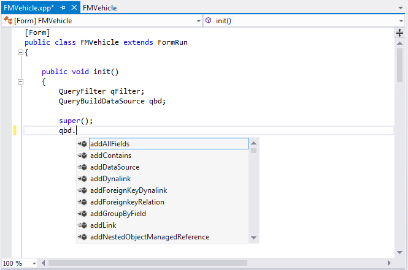
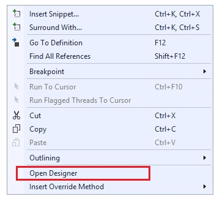

---
# required metadata

title: Code editor
description: This article reviews the code editor features for Microsoft Dynamics 'AX 7.'
author: RobinARH
manager: AnnBe
ms.date: 06/20/2017
ms.topic: article
ms.prod: 
ms.service: dynamics-ax-platform
ms.technology: 

# optional metadata

# ms.search.form: 
# ROBOTS: 
audience: Developer
# ms.devlang: 
ms.reviewer: robinr
ms.search.scope: AX 7.0.0, Operations, UnifiedOperations
# ms.tgt_pltfrm: 
ms.custom: 23941
ms.assetid: 87d75162-a9dd-43d2-a316-833e2c799f08
ms.search.region: Global
# ms.search.industry: 
ms.author: robadawy
ms.search.validFrom: 2016-02-28
ms.dyn365.ops.version: AX 7.0.0

---

# Code editor

[!include[banner](../includes/banner.md)]

This article reviews the code editor features for Microsoft Dynamics 'AX 7.'

Code editor
-----------

You use the code editor in Microsoft Visual Studio to write the X++ code for your applications. The X++ language is fully integrated into the Visual Studio environment. As you write your X++ code, you will see the familiar features of the Visual Studio code editor. For example, IntelliSense is displayed to help you write the code. You can also navigate to methods and classes in the code editor by using the navigation drop-down menus at the top of the code editor window. 

 

Other features, such as collapsible sections, are also available.

### Opening the element designer

You can open the element designer that corresponds to the current X++ source code by right-clicking in the code editor and then selecting **Open Designer**. 

# See also

[Developer home page](developer-home-page.md)

[Development tools overview](development-tools-overview.md)

