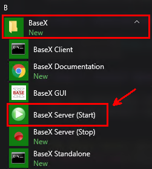
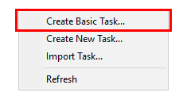
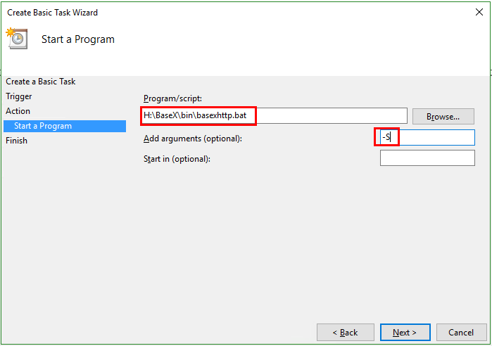

---
# required metadata

title: Installing BaseX for AppChecker
description: This topic describes how to install and set up BaseX in a developer environment.
author: AndreasHassing
manager: AnnBe
ms.date: 02/13/2019
ms.topic: article
ms.prod: 
ms.service: dynamics-ax-applications
ms.technology: 

# optional metadata

# ms.search.form:  
audience: Developer
# ms.devlang: 
ms.reviewer: kfend
ms.search.scope: Operations
# ms.tgt_pltfrm: 
# ms.custom: 
ms.search.region: Global
# ms.search.industry: 
ms.author: anniels
ms.search.validFrom: 2019-04-30
ms.dyn365.ops.version: Platform update 25

---

# Installing BaseX for AppChecker

[!include [banner](../includes/banner.md)]

[!include [banner](../includes/preview-banner.md)]

AppChecker depends on a running instance of BaseX for storage and querying of abstract syntax trees generated by the X++ compiler. This article describes how to install and set up BaseX in a developer environment.

The sections in this topic should be regarded as ordered steps and completed as such.

## Prerequisites

BaseX is a Java-based XML document database which requires a Java Runtime Environment of version 8 or higher. Before you install BaseX, verify that a [Java JRE is installed](https://aka.ms/getjava).

## Download BaseX

To download BaseX, go to [BaseX](http://basex.org/download/) and download the latest Windows Installer. At the time of this writing, the latest version is 9.1.2.

## Install BaseX

Run the executable on the developer machine where you'll be compiling your module and accept the default settings for each step.

> [!TIP]
> If the installation drive does not have enough space, the BaseX server data folder can be changed at a later time. For more information, see [BaseX configuration page](http://docs.basex.org/wiki/Configuration#Database_Directory).

## Configure BaseX to handle your model (optional)

Depending on the size of your model, the BaseX server can take up a lot of memory to store the abstract syntax trees.

BaseX is configured by default to use ~1.17GB of RAM at the most. If you have a large model, you should consider increasing this limitth by completing the following steps:

1. Edit the batch script at: *<BaseX Install Path>\bin\basexhttp.bat*.
2. Change the line containing **set BASEX_JVM=-Xmx1200m %BASEX_JVM%** and increase the value after **-Xmx**. 

  For more information, refer to this article about [Increasing the limits of the Java VM](https://docs.oracle.com/javase/8/docs/technotes/tools/windows/java.html#BABHDABI).

 Leave the remaining script unchanged.

> [!NOTE]
> If you make changes after starting the BaseX server, you will need to restart the BaseX server after you save the `basexhttp.bat` file.

## Start the BaseX server

1. From the Start Menu, click **BaseX** > **BaseX Server (Start)**.

  

2. If you chose not to create start menu shortcuts, start the server with the following command in the Run prompt:

    ```text
    <BaseX Install Path>\BaseX\bin\basexhttp.bat -S
    ```
    
    This will start a BaseX server listening on ports 1984/tcp (API), 8984/tcp (HTTP API), and 8985/tcp (Jetty HTTP stop port).

## Start the BaseX server on login (optional)

You can choose to start BaseX when it's needed as part of your development process, or you can set it up as a service so that it starts with Windows. 

Complete the following steps to set up BaseX as a service.

1. Open the **Task Scheduler** tool. 

  > [!NOTE]
  > You can use the following shortcut from a Run prompt: `control schedtasks`

2. In the **Tasks list** window, right-click and select **Create Basic Task** to start teh **Basic Task** Wizard.

  

3. Name the task and set the trigger to **When I log on**.
4. Set the **Action to **Start a program**.
5. In the **Start a program** sub-section, set the **Program/script** fiield to, **BaseX Install Path>\BaseX\bin\basexhttp.bat**.
6. In the **Add arguments** field, enter **-S**.

  

7. Finish the Wizard.

> [!NOTE]
> The BaseX Wiki explains how to use YAJSW to run BaseX as a service, but to make things more simple, we recommend scheduling a task on login.
