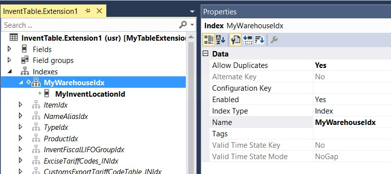

---

# required metadata

title: Add a new index to a table
description: This topic describes how to add an index to a table.
author: ivanv-microsoft
manager: AnnBe
ms.date: 07/10/2017
ms.topic: article
ms.prod: 
ms.service: dynamics-ax-platform
ms.technology: 

# optional metadata

# ms.search.form: 
# ROBOTS: 
audience: Developer
# ms.devlang: 
ms.reviewer: robinr
ms.search.scope: Operations, Platform
# ms.tgt_pltfrm: 
ms.custom: 268724
ms.assetid: 
ms.search.region: Global
# ms.search.industry: 
ms.author: ivanv
ms.search.validFrom: 2017-06-01
ms.dyn365.ops.version: Platform update 4

---

# Add a new index to a table

Often, you extend tables so that you can store additional data for later but also quickly access the data that is based on the new fields. Therefore, it's often beneficial to have a dedicated index that speeds up the database search. You can add a new index to an existing table through extension. To add an index to an existing table, you extend the selected table and then create an index just as you would create an index on a new table. You can add both new and existing fields so that they are part of the new index.

> [!NOTE]
> You can create new indexes. However, you can't modify existing indexes.

In the following illustration, an InventTable extension is used to define an index for a new field on the InventTable table.

 

> [!WARNING]
> You should not use this approach to create unique indexes. This change is an intrusive change that might break the solutions of other independent software vendors (ISVs) if those solutions are deployed in the same environment. This capability will be removed in future platform releases.
