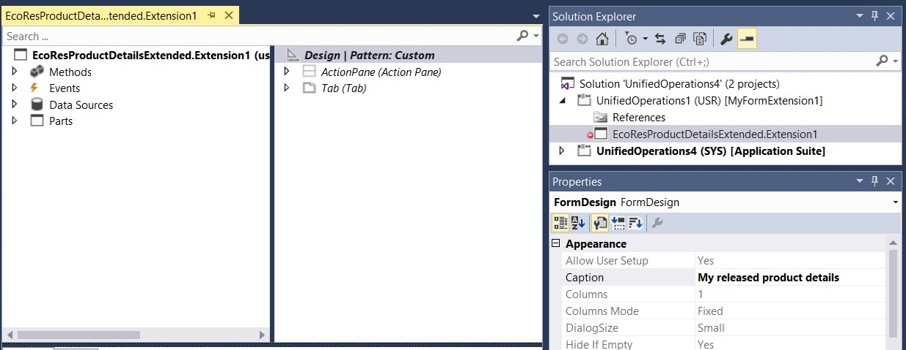
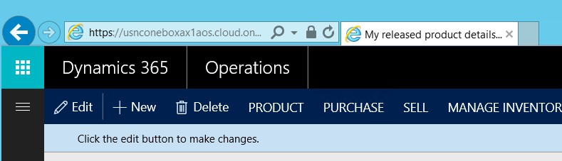

---

# required metadata

title: Change the caption of a form
description: This topic explains how to change the form caption that helps the user identify the current page in a web browser.
author: ivanv-microsoft
manager: AnnBe
ms.date: 07/10/2017
ms.topic: article
ms.prod: 
ms.service: dynamics-ax-platform
ms.technology: 

# optional metadata

# ms.search.form: 
# ROBOTS: 
audience: Developer
# ms.devlang: 
ms.reviewer: robinr
ms.search.scope: Operations
# ms.tgt_pltfrm: 
ms.custom: 268724
ms.assetid: 
ms.search.region: Global
# ms.search.industry: 
ms.author: ivanv
ms.search.validFrom: 2017-02-28
ms.dyn365.ops.version: Platform update 4

---

# Change the caption on a form

The form caption appears in the page tab next to the web browser's Address bar and helps the user identify the page that is currently open. In metadata, the form caption is represented by a property on the form design. Therefore, to change the caption, you must modify the **Caption** property on the form design. You can make this change through extension. Create an extension of the selected form in the extension model, and then change the **Caption** property as usual.

The following illustration shows what the form caption looks like in a browser.

> [!NOTE]
> None of the other properties on the form design can be changed.
