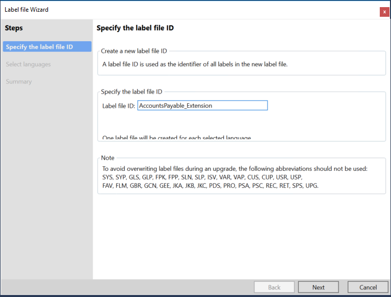
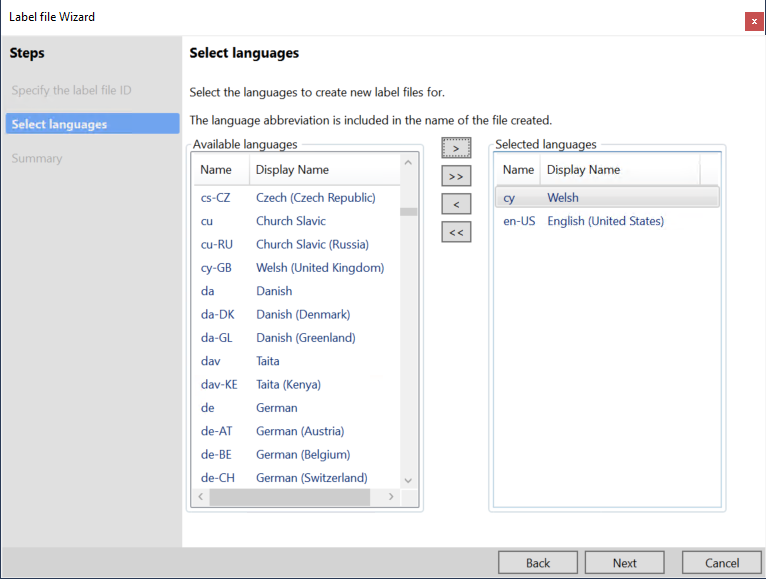
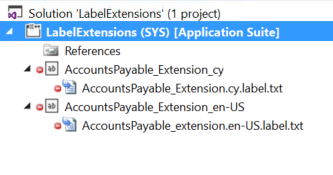

---

# required metadata

title: Change a label
description: This topic explains how you can create label extension files to modify the string value of a label, add new labels to the same label file, or add new languages.
author: smithanataraj
manager: AnnBe
ms.date: 06/20/2017
ms.topic: article
ms.prod: 
ms.service: dynamics-ax-platform
ms.technology: 

# optional metadata

# ms.search.form: 
# ROBOTS: 
audience: Developer
# ms.devlang: 
ms.reviewer: robinr
ms.search.scope: Operations, Platform
# ms.tgt_pltfrm: 
ms.custom: 268724
ms.assetid: 
ms.search.region: Global
# ms.search.industry: 
ms.author: smnatara
ms.search.validFrom: 2017-07-01
ms.dyn365.ops.version: Platform update 4

---

# Change a label

You can create label extension files to modify the string value of a label, add new labels to the same label file, or add new languages. The name of a label extension file must consist of the name of the label file plus the **\_extension** suffix. 

The following example shows how to extend the AccountsPayable label file to add Welsh as a new language.
 
1. Create a project that belongs to the model where you must add the new label extension. For this example, the project is named **ApplicationSuite**.
1. Add a new label file to the project, and name it **AccountsPayable_Extension**. After you add the label file, the **Label file** wizard starts.

    

2. On the next page of the wizard, select the languages that should be part of the extension. In this example, **English (United States)** (**en-US**) was already the base language, and we added **Welsh** (**cy**).

    

3. Complete the wizard. Two label extension files are created, as shown in the following illustration.

    

4. In the extension file in this example, you can create new labels or modify the value of labels that are defined in the **AccountsPayable** label file of the Application Suite model. Use the standard label editor to define new labels or redefine labels that already exist.
5. At any point, you can add more languages to a label file. In your project, right-click a label file that has a name that ends in **\_extension**, and then select **Add new languages**. Then follow the wizard to add the translation files.
